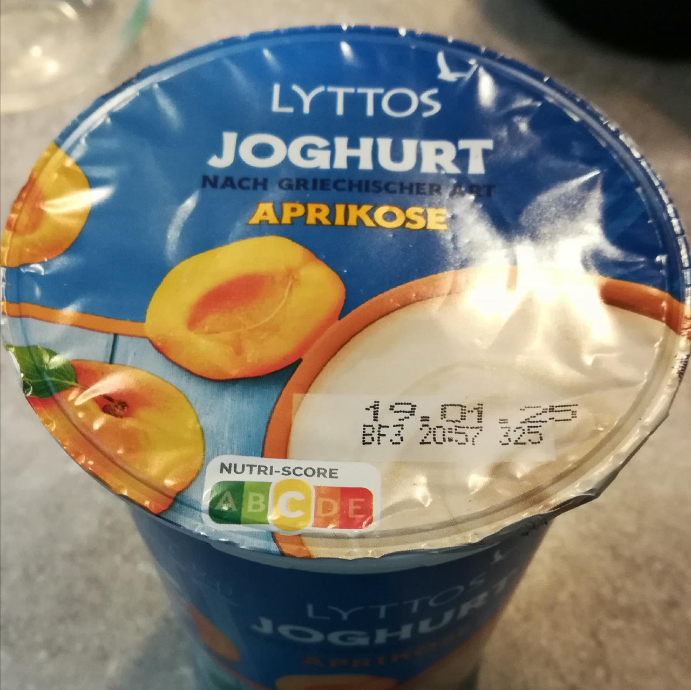
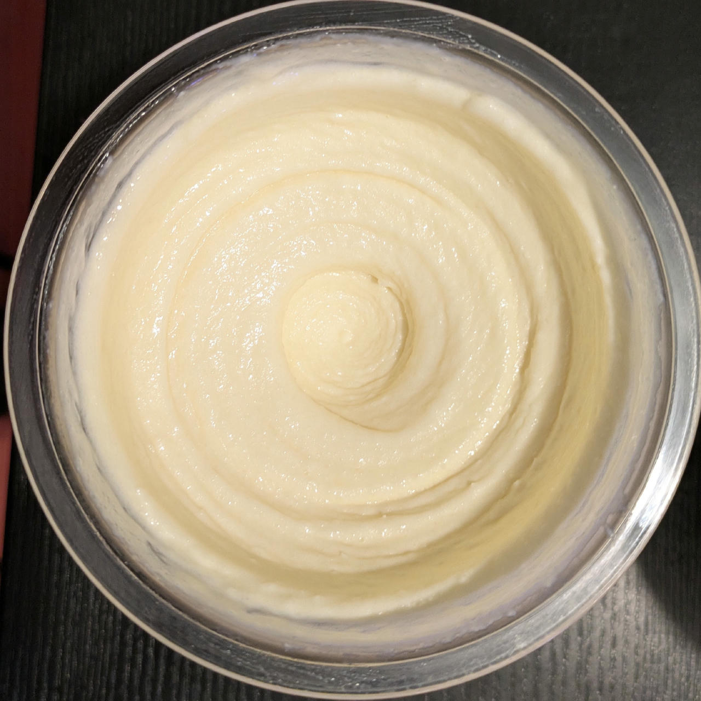

# Lazy Apricot FroYo (Deluxe)

“Lazily” using a container of pre-flavored yogurt,
just adding a few things for freezing point depression
and ice crystal inhibition.

> 

Spin on FroYo, scrape down, and re-mix.

> 

# INGREDIENTS

ℹ️ Brand names are in square brackets `[...]`.

**Wet**

  - _500g_ Yogurt 8% Apricot [Lyttos / Aldi]
  - _70ml_ [Soy milk 1.6% (sugar-free) \[Berief\]](/ice-creamery/info/ingredients/#soy-milk){target="_blank"}↗ • use any other preferred milk (~2% fat)
  - _50g_ [Cottage Cheese 4% \[REWE Bio\]](/ice-creamery/info/ingredients/#cottage-cheese){target="_blank"}↗
  - _16g_ [Glycerin (E422, VG) \[hd-line\]](/ice-creamery/info/ingredients/#vegetable-glycerin-glycerol-vg-e422){target="_blank"}↗
  - _10g_ [Brandy or Vodka 40 vol%](/ice-creamery/info/ingredients/#alcohol-ethanol){target="_blank"}↗ • *alternative:* 8g (additional) VG for a sober recipe

**Dry**

  - _20g_ [SweEX (Erythritol + Xylitol 3:2)](/ice-creamery/info/ingredients/#sweex-erythritol-xylitol-blend){target="_blank"}↗ • *alternative:* 27g allulose or dextrose
  - _10g_ [Salty Stability \[Inulin / GMS / CMC / Guar / XG / Salt\]](/ice-creamery/S/Salty%20Stability/){target="_blank"}↗ • *not-as-good substitute:* 1g guar, 0.3g xanthan, and 0.3g salt

# DIRECTIONS

 1. Add "wet" ingredients to empty Creami tub.
 1. Weigh and mix dry ingredients, easiest by adding to a jar with a secure lid and shaking vigorously.
 1. Pour into the tub and *QUICKLY* use an immersion blender on full speed to homogenize everything.
 1. Let blender run until thickeners are properly hydrated, up to 1-2 min. Or blend again after waiting that time.
 1. Put on the lid, freeze for 24h, then spin as usual. Flatten any humps before that.
 1. Process with RE-SPIN mode when not creamy enough after the first spin.

# NUTRITIONAL & OTHER INFO

- **Nutritional values per 100g/ml:** 100g; 127.5 kcal; fat 6.4g; carbs 15.8g; sugar 8.7g; protein 3.2g; salt 0.2g
- **Nutritional values per ½ Deluxe Tub:** 340g; 433.6 kcal; fat 21.9g; carbs 53.7g; sugar 29.5g; protein 10.8g; salt 0.6g
- **Nutritional values total:** 676g; 862.2 kcal; fat 43.5g; carbs 106.8g; sugar 58.6g; protein 21.5g; salt 1.2g
- **FPDF / [PAC](/ice-creamery/info/glossary/#potere-anti-congelante-pac){target="_blank"}↗ (target 20..30):** 30.42
- **Protein / Energy Ratio (ok=12%; hi=20%):** 9.97%
- **Milk Solids Non-Fat ([MSNF](/ice-creamery/info/glossary/#milk-solids-not-fat-msnf){target="_blank"}↗, 7-11%):** 93.4g • 13.8%
- **Net carbs:** 71.4g • *∝ 5 servings@135g:* 14.3g • *∝ 3 servings@225g:* 23.8g • *energy ratio (low <20%):* 33.1%
- **10g 'Salty Stability' is:** 7.3g Inulin • 1.2g Glycerol Monostearate (GMS / E471) • 0.6g Tylose powder (E466, Tylo, CMC) • 0.4g Guar gum (E412) • 0.33g Salt • 0.13g Xanthan gum (E415, XG).
