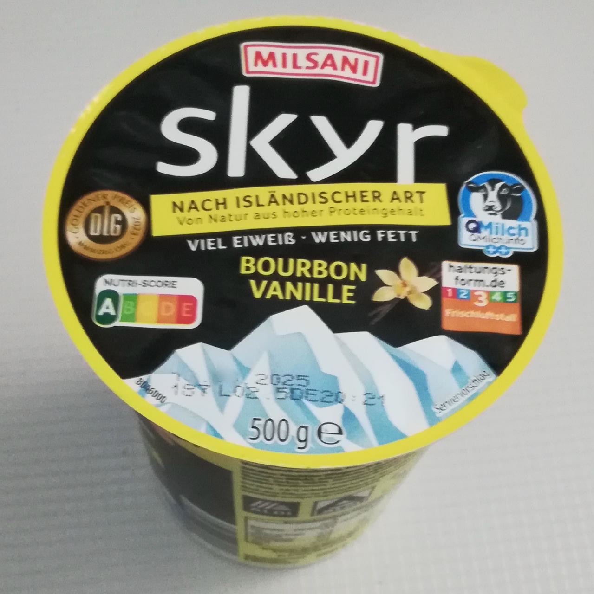

# Lazy Skyr (Deluxe)

“Lazily” using a container of pre-flavored skyr (flavors: vanilla / blueberry/ cherry / strawberry),
just adding a few things for freezing point depression and ice crystal inhibition.

> 

Spin on FroYo, scrape down, and respin or mix-in.

> 
> 
> 

Rating: 😋🥛 (untested)

# INGREDIENTS

ℹ️ Brand names are in square brackets `[...]`.

**Wet**

  - _500ml_ Skyr “Vanilla” [Milsani / Aldi] • 500g container; vanilla / blueberry/ cherry / strawberry flavors
  - _15g_ [Glycerin (E422, VG) \[hd-line\]](/ice-creamery/info/ingredients/#vegetable-glycerin-glycerol-vg-e422){target="_blank"}↗ • *alternative:* 53g lactose
  - _15g_ [Brandy or Vodka 40 vol%](/ice-creamery/info/ingredients/#alcohol-ethanol){target="_blank"}↗ • *alternative:* 12g (additional) VG for a sober recipe

**Dry**

  - _10g_ [Salty Stability \[Inulin / GMS / CMC / Guar / XG / Salt\]](/ice-creamery/S/Salty%20Stability/){target="_blank"}↗ • unsweetened “ICSv2”
  - _10g_ [Whey + Casein protein (grass-fed) \[Vilgain\]](/ice-creamery/info/ingredients/#whey-protein){target="_blank"}↗ • with stevia
  - _22g_ [SweEX (Erythritol + Xylitol 3:2)](/ice-creamery/info/ingredients/#sweex-erythritol-xylitol-blend){target="_blank"}↗ • *alternative:* 29g allulose or dextrose

**Fill to MAX**

  - _108ml_ [Soy milk 1.6% (sugar-free) \[Berief\]](/ice-creamery/info/ingredients/#soy-milk){target="_blank"}↗
  - _≈3 drops_ Flavor drops Vanilla (sucralose) [IronMaxx] • to taste

# DIRECTIONS

 1. Add "wet" ingredients to empty Creami tub.
 1. Weigh and mix dry ingredients, easiest by adding to a jar with a secure lid and shaking vigorously.
 1. Pour into the tub and *QUICKLY* use an immersion blender on full speed to homogenize everything.
 1. Let blender run until thickeners are properly hydrated, up to 1-2 min. Or blend again after waiting that time.
 1. Add remaining ingredients (to the MAX line) and stir with a spoon.
 1. Put on the lid, freeze for 24h, then spin as usual. Flatten any humps before that.
 1. Process with RE-SPIN mode when not creamy enough after the first spin.

# NUTRITIONAL & OTHER INFO

- **Nutritional values per 100g/ml:** 100g; 89.5 kcal; fat 0.5g; carbs 13.9g; sugar 6.5g; protein 8.1g; salt 0.2g
- **Nutritional values per ½ Deluxe Tub:** 340g; 304.3 kcal; fat 1.8g; carbs 47.4g; sugar 22.1g; protein 27.6g; salt 0.6g
- **Nutritional values total:** 680g; 608.7 kcal; fat 3.6g; carbs 94.7g; sugar 44.1g; protein 55.3g; salt 1.1g
- **FPDF / [PAC](/ice-creamery/info/glossary/#potere-anti-congelante-pac){target="_blank"}↗ (target 20..30):** 30.45
- **Protein / Energy Ratio (ok=12%; hi=20%):** 36.32% • LOW-FAT • Hi-Protein
- **Milk Solids Non-Fat ([MSNF](/ice-creamery/info/glossary/#milk-solids-not-fat-msnf){target="_blank"}↗, 7-11%):** 102.4g • 15.1%
- **Net carbs:** 57.9g • *∝ 5 servings@136g:* 11.6g • *∝ 3 servings@227g:* 19.3g • *energy ratio (low <20%):* 38%
- **10g 'Salty Stability' is:** 7.3g Inulin • 1.2g Glycerol Monostearate (GMS / E471) • 0.6g Tylose powder (E466, Tylo, CMC) • 0.4g Guar gum (E412) • 0.33g Salt • 0.13g Xanthan gum (E415, XG).
