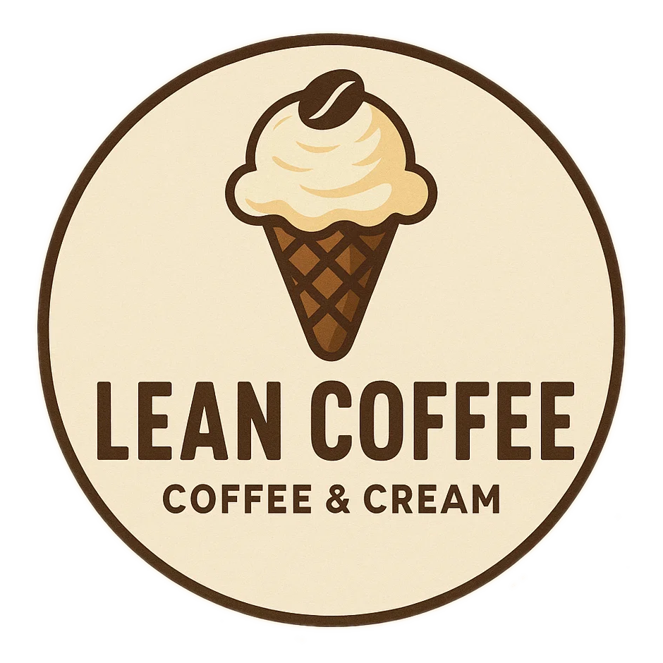
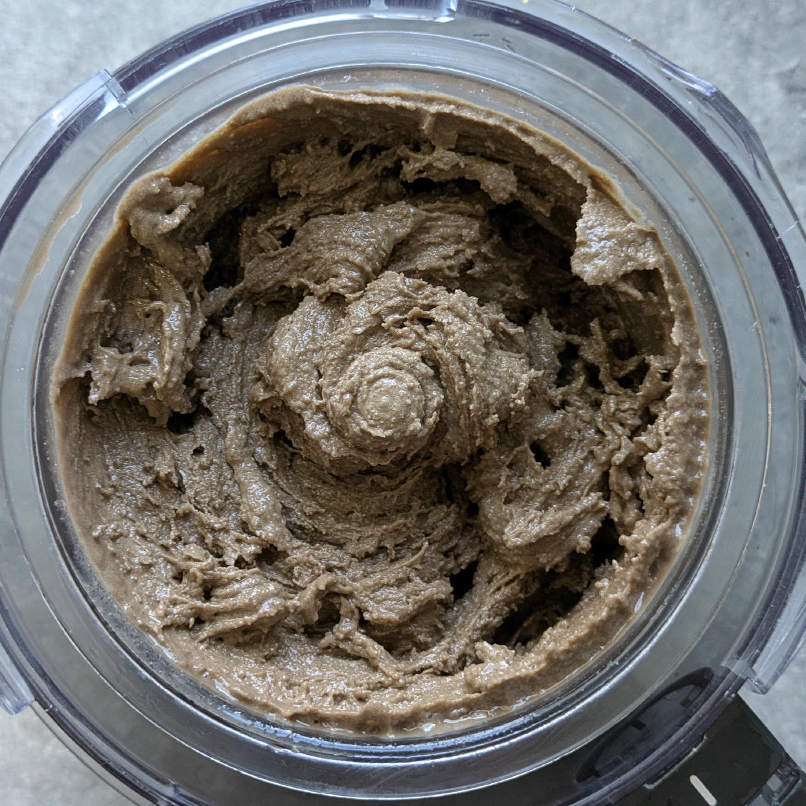
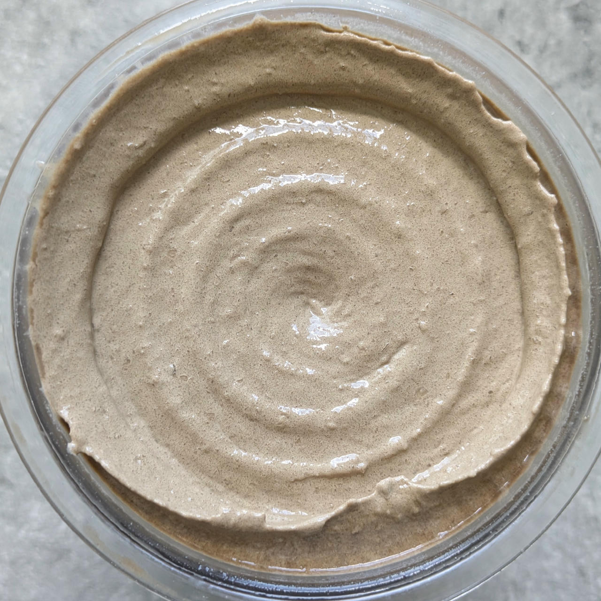
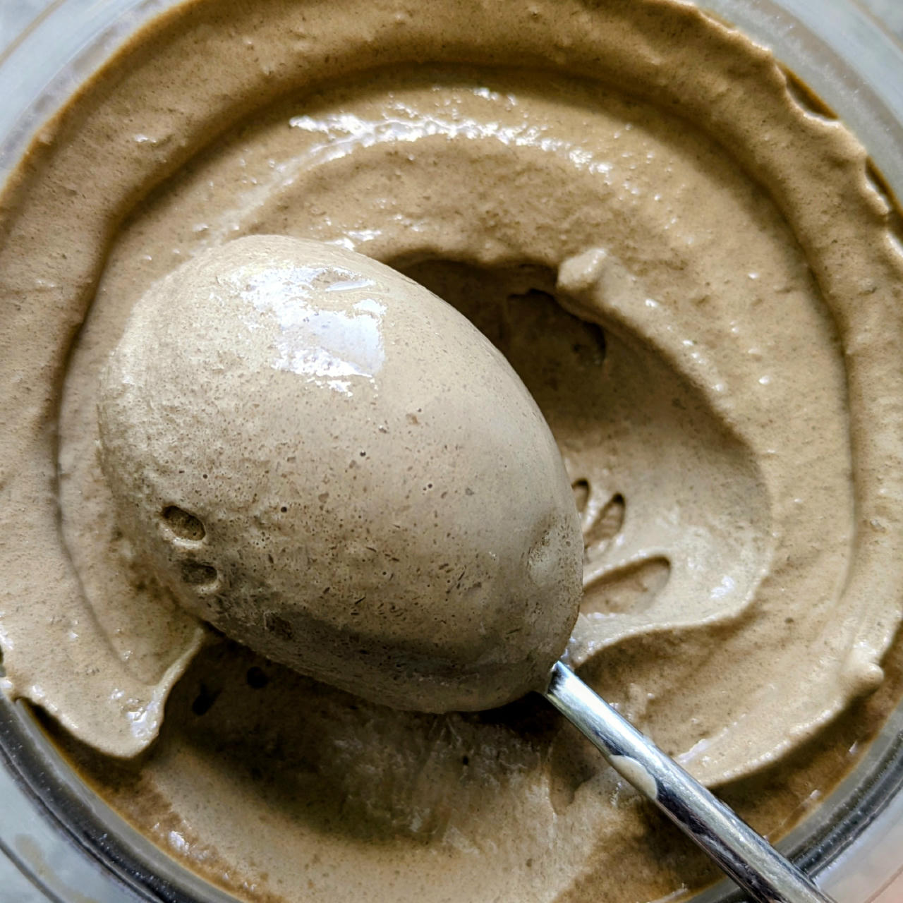

# Lean Coffee (Deluxe)

A version of “Coffee & Cream” with calories reduced by about 30%.

Spun on Sorbet, followed by a scrape-down and a re-spin.

> 
> 
> 

The coffee flavor is clearly noticable and harmonizes with the cocoa in the background,
the consistency is soft and will be firmer after several hours in the freezer.

Rating: 😋😋☕☕☕

# INGREDIENTS

ℹ️ Brand names are in square brackets `[...]`.

**Wet**

  - _350ml_ Extra strong coffee
  - _120ml_ [Soy milk 1.6% (sugar-free) \[Berief\]](/ice-creamery/info/ingredients/#soy-milk){target="_blank"}↗
  - _100g_ [Cottage Cheese 4% \[REWE Bio\]](/ice-creamery/info/ingredients/#cottage-cheese){target="_blank"}↗
  - _15g_ [Glycerin (E422, VG) \[hd-line\]](/ice-creamery/info/ingredients/#vegetable-glycerin-glycerol-vg-e422){target="_blank"}↗ • Sweetness = 60%; GI = 5; Density = 1.26 g/ml
  - _15g_ [Brandy or Vodka 40 vol%](/ice-creamery/info/ingredients/#alcohol-ethanol){target="_blank"}↗ • *alternative:* 12g (additional) VG for a sober recipe
  - _21g_ [❔Coffee Liqueur 25 vol% \[Caffè Borghetti\]](/ice-creamery/info/ingredients/#alcohol-ethanol){target="_blank"}↗ • if you have it, *instead of* the brandy/vodka

**Dry**

  - _35g_ [SweEX (Erythritol + Xylitol 3:2)](/ice-creamery/info/ingredients/#sweex-erythritol-xylitol-blend){target="_blank"}↗ • *alternative:* 47g allulose or dextrose
  - _15g_ [Salty Stability \[Inulin / GMS / CMC / Guar / XG / Salt\]](/ice-creamery/S/Salty%20Stability/){target="_blank"}↗ • unsweetened “ICSv2”
  - _10g_ [Whey + Casein protein (grass-fed) \[Vilgain\]](/ice-creamery/info/ingredients/#whey-protein){target="_blank"}↗ • with stevia
  - _20g_ [Skim milk powder 1:10 (SMP) \[Vita2You\]](/ice-creamery/info/ingredients/#skim-milk-powder-smp){target="_blank"}↗
  - _3g_ ❔Instant Coffee [Mount Hagen] • *optional*, for a stronger coffee taste; 1.5g per 125ml
  - _5g_ [❔Cocoa Noir Intense 11% \[Cacao Barry\]](/ice-creamery/info/ingredients/#cocoa-powder){target="_blank"}↗ • *optional*, for a darker color and a cocoa note

**Fill to MAX**

  - _≈7 drops_ Flavor drops Caramel (sucralose) [IronMaxx] • to taste

# DIRECTIONS

 1. Add "wet" ingredients to empty Creami tub.
 1. Weigh and mix dry ingredients, easiest by adding to a jar with a secure lid and shaking vigorously.
 1. Pour into the tub and *QUICKLY* use an immersion blender on full speed to homogenize everything.
 1. Let blender run until thickeners are properly hydrated, up to 1-2 min. Or blend again after waiting that time.
 1. Add remaining ingredients (to the MAX line) and stir with a spoon.
 1. Put on the lid, freeze for 24h, then spin as usual. Flatten any humps before that.
 1. Process with RE-SPIN mode when not creamy enough after the first spin.

# NUTRITIONAL & OTHER INFO

- **Nutritional values per 100g/ml:** 100g; 61.4 kcal; fat 1.0g; carbs 11.2g; sugar 1.8g; protein 4.6g; salt 0.2g
- **Nutritional values per ½ Deluxe Tub:** 340g; 208.7 kcal; fat 3.6g; carbs 37.9g; sugar 6.3g; protein 15.7g; salt 0.8g
- **Nutritional values total:** 680g; 417.5 kcal; fat 7.1g; carbs 75.9g; sugar 12.5g; protein 31.3g; salt 1.6g
- **FPDF / [PAC](/ice-creamery/info/glossary/#potere-anti-congelante-pac){target="_blank"}↗ (target 20..30):** 31.06
- **Protein / Energy Ratio (ok=12%; hi=20%):** 30.03% • LOW-FAT • Low-Sugar • Hi-Protein
- **Milk Solids Non-Fat ([MSNF](/ice-creamery/info/glossary/#milk-solids-not-fat-msnf){target="_blank"}↗, 7-11%):** 48.6g • 7.2%
- **Net carbs:** 22.3g • *∝ 5 servings@136g:* 4.5g • *∝ 3 servings@227g:* 7.4g • *energy ratio (low <20%):* 21.4%
- **15g 'Salty Stability' is:** 11.0g Inulin • 1.8g Glycerol Monostearate (GMS / E471) • 0.9g Tylose powder (E466, Tylo, CMC) • 0.6g Guar gum (E412) • 0.5g Salt • 0.2g Xanthan gum (E415, XG).
