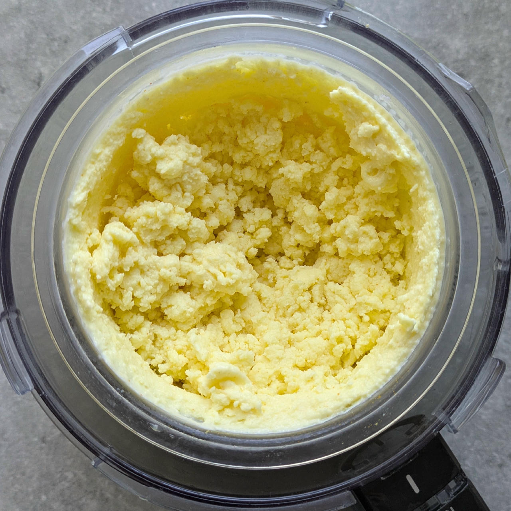
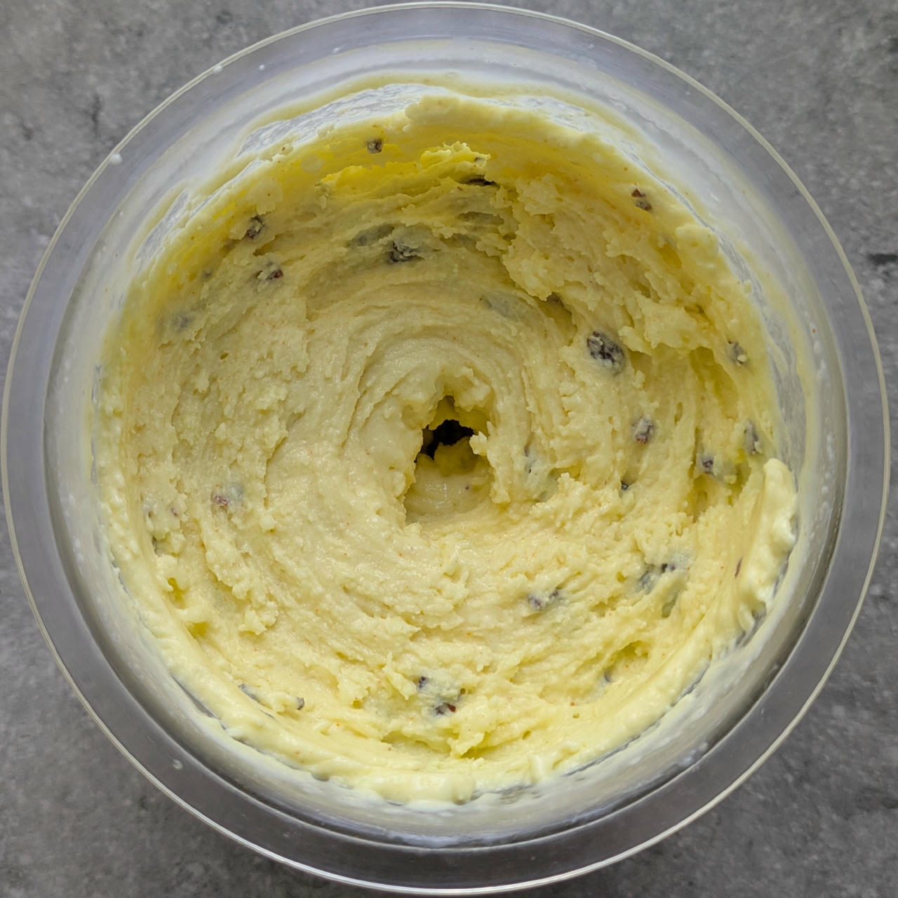
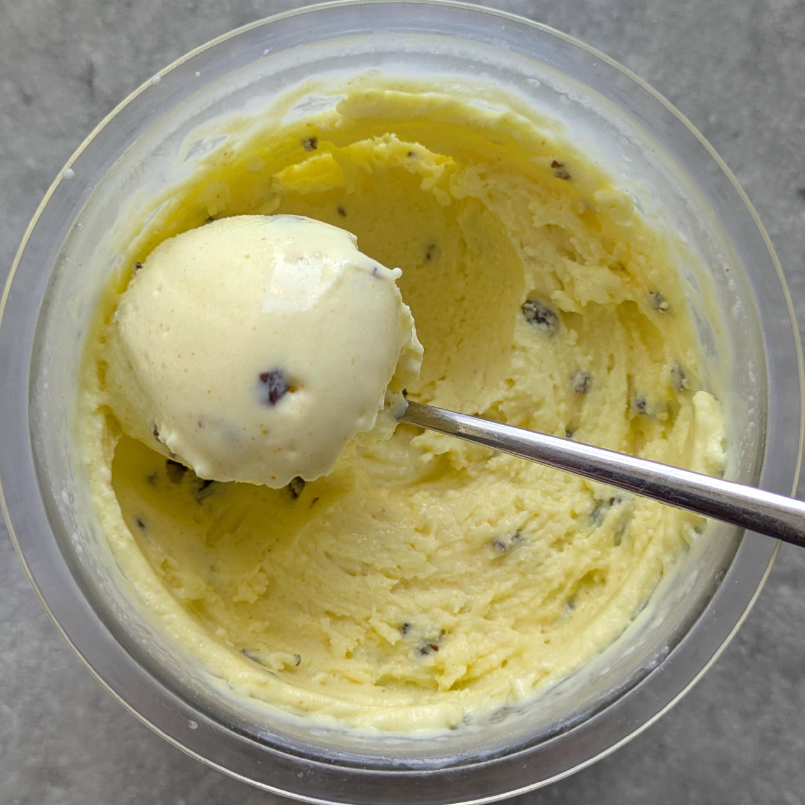
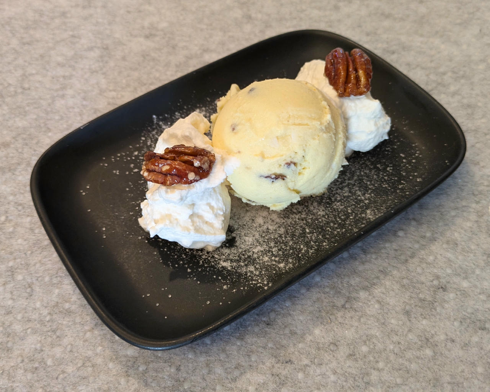

# Lemon Cake (Deluxe)

> *A slice of Italian sunshine, one scoop at a time.*

Inspired by Italian lemon ricotta cake, this captures the essence of the classic dessert in frozen form,
and adds a spirited Limoncello twist (see the ingredients for a non-alcoholic alternative).

Process on *Sorbet*, [hold it shortly under running water](https://jhermann.github.io/ice-creamery/info/tips%2Btricks/#handling-of-icy-sides-bottom)
*after* that.
Then a scrape-down and a respin or mix-in. 

> 
> 
> 

Rating: 😋🍋🍋🍰🍰 (lemony-cheesy as expected, not very sour, but refreshing)

> 

Processed using *Sorbet*, followed by a scrape-down, respin, and mix-in with a diced frozen slice of cake.

> 
> 
> 
> 

!!! info "Simple Recipe"

    Read [About 'Simple' Recipes](/ice-creamery/info/tips%2Btricks/#about-simple-recipes)    regarding 'exotic' ingredients and their alternatives.

# INGREDIENTS

ℹ️ Brand names are in square brackets `[...]`.

**Wet**

  - _330g_ [Soured milk 3.5% \[Schwälbchen\]](/ice-creamery/info/ingredients/#soured-milk){target="_blank"}↗ • *alternative:* Creamed cottage cheese 4%
  - _250g_ Ricotta 9% fat (33% DM) [REWE Marca Italia] • *alternative:* Topfen / Quark 11–14%
  - _40ml_ Limoncello di Calabria 28 vol% [REWE] • *alternative:* 20g glycerin (VG) and 15ml lemon juice
  - _20ml_ Lime juice + zest (organic) [REWE Bio] • 1 lime = 60..65g

**Dry**

  - _40g_ [SweEX (Erythritol + Xylitol 3:2)](/ice-creamery/info/ingredients/#sweex-erythritol-xylitol-blend){target="_blank"}↗ • *alternative:* 53g allulose or dextrose
  - _5g_ [Waxy Maize Starch (E1442) \[Ultratex\]](/ice-creamery/info/ingredients/#waxy-maize-starch-e1442){target="_blank"}↗ • *alternative:* [E1422](https://jhermann.github.io/ice-creamery/info/ingredients/#acetylated-distarch-adipate-e1422)
  - _0.25g_ Salt • 7 quick shakes (with my shaker)
  - _1–2 pinches_ ❔Turmeric • *optional*, for color

**Fill to MAX**

  - _≈4 drops_ Flavor drops Vanilla (sucralose) [IronMaxx] • to taste

# DIRECTIONS

 1. Zest the lime first, before juicing it.
 1. Add "wet" ingredients to empty Creami tub.
 1. Weigh and mix dry ingredients, easiest by adding to a jar with a secure lid and shaking vigorously.
 1. Pour into the tub and *QUICKLY* use an immersion blender on full speed to homogenize everything.
 1. Add remaining ingredients (to the MAX line) and stir with a spoon.
 1. Put on the lid, freeze for 24h, then spin as usual. Flatten any humps before that.
 1. Process with RE-SPIN mode when not creamy enough after the first spin.

# NUTRITIONAL & OTHER INFO

- **Nutritional values per 100g/ml:** 100g; 104.9 kcal; fat 5.0g; carbs 11.4g; sugar 4.7g; protein 5.3g; salt 0.2g
- **Nutritional values per ½ Deluxe Tub:** 340g; 356.7 kcal; fat 16.9g; carbs 38.9g; sugar 16.0g; protein 17.9g; salt 0.5g
- **Nutritional values total:** 685g; 719.0 kcal; fat 34.1g; carbs 78.4g; sugar 32.2g; protein 36.0g; salt 1.1g
- **FPDF / [PAC](/ice-creamery/info/glossary/#potere-anti-congelante-pac){target="_blank"}↗ (target 20..30):** 30.30
- **Protein / Energy Ratio (ok=12%; hi=20%):** 20.03% • Low-Sugar • Hi-Protein
- **Milk Solids Non-Fat ([MSNF](/ice-creamery/info/glossary/#milk-solids-not-fat-msnf){target="_blank"}↗, 7-11%):** 65.1g • 9.5%
- **Net carbs:** 38.4g • *∝ 5 servings@137g:* 7.7g • *∝ 3 servings@228g:* 12.8g • *energy ratio (low <20%):* 21.3%
