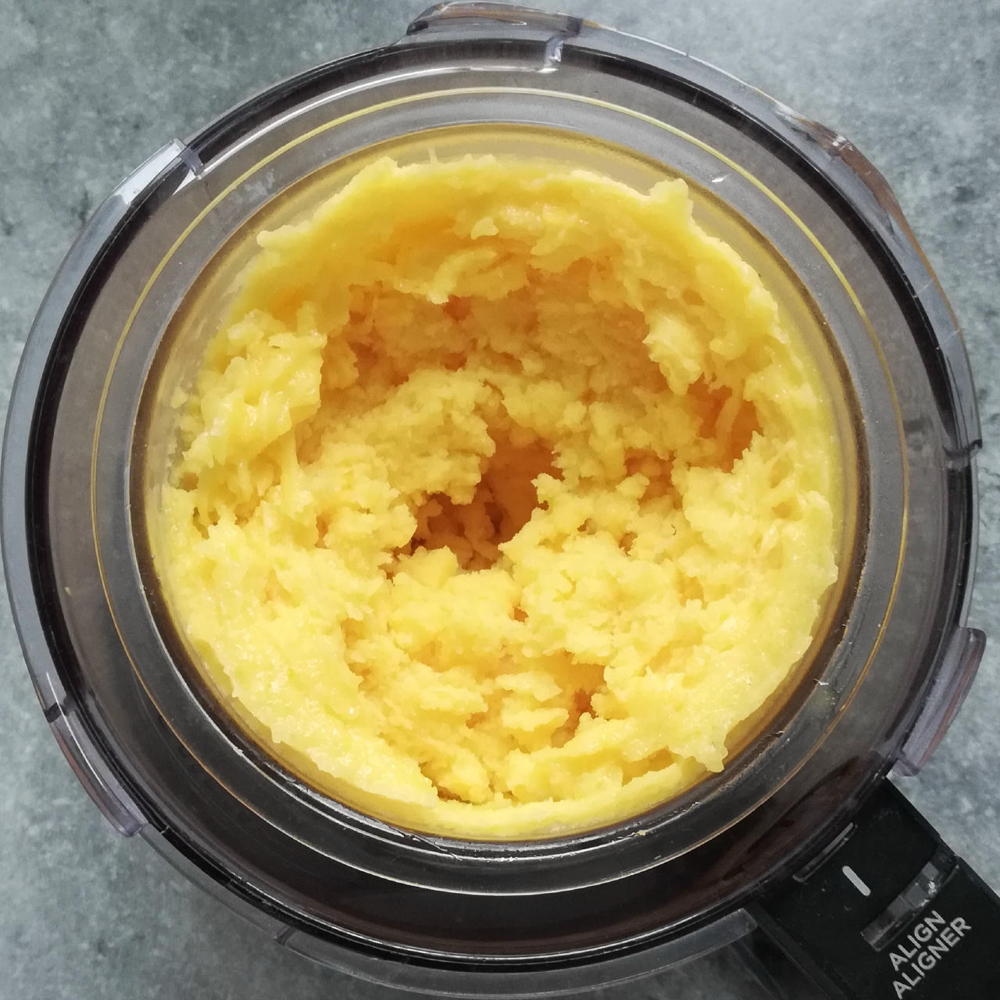
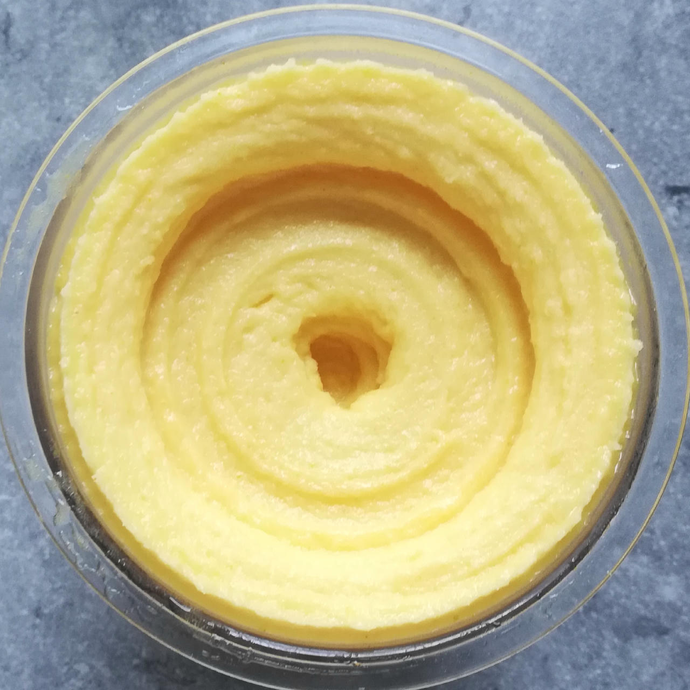
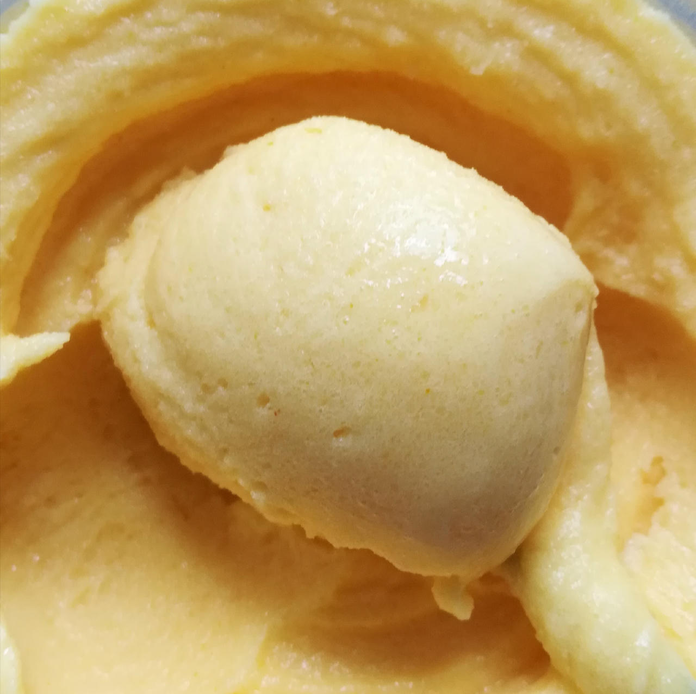

# Lemon Sorbet (Deluxe)

> 🌿 **Vegan & Dairy-free** Recipe is using only lemon juice and no dairy.

Lemon sorbet with canned mandarins to provide substance.

If you have fresh limes, you can zest and juice one of them; fill up with lemon juice then to the given amount.

Spin on “Sorbet”, scrape down, and respin.

> 
> 
> 

Rating: 😋🍋🍊 (experimental)

# INGREDIENTS

ℹ️ Brand names are in square brackets `[...]`.

**Wet**

  - _300g_ Mandarins in juice [REWE]
  - _125ml_ Lemon juice
  - _125ml_ Water (cold)
  - _15g_ [Glycerin (E422, VG) \[hd-line\]](/ice-creamery/info/ingredients/#vegetable-glycerin-glycerol-vg-e422){target="_blank"}↗ • Sweetness = 60%; GI = 5; Density = 1.26 g/ml
  - _10g_ [Brandy or Vodka 40 vol%](/ice-creamery/info/ingredients/#alcohol-ethanol){target="_blank"}↗
  - _1 tsp_ Lemon zest (½ peel or less), or lime zest • Zest the lemon / lime BEFORE juicing

**Dry**

  - _40g_ [SweEX (Erythritol + Xylitol 3:2)](/ice-creamery/info/ingredients/#sweex-erythritol-xylitol-blend){target="_blank"}↗ • POD ≈ 90%; GI < 7
  - _1.25g_ [Xanthan gum (E415, XG)](/ice-creamery/info/ingredients/#xanthan-gum-xg-e415){target="_blank"}↗ • 1tsp ≈ 2.8g
  - _1.25g_ [Carboxymethyl Cellulose (CMC / E466) \[GoodBake\]](/ice-creamery/info/ingredients/#carboxymethyl-cellulose-cmc-e466){target="_blank"}↗
  - _1.25g_ Salt
  - _1 pinch_ Tumeric • for color

**Fill to MAX**

  - _101.25ml_ Water to MAX line
  - _≈10 drops_ Flavor drops Peach / Maracuja (sucralose) [IronMaxx] • to taste

# DIRECTIONS

 1. Add "wet" ingredients to empty Creami tub.
 1. Weigh and mix dry ingredients, easiest by adding to a jar with a secure lid and shaking vigorously.
 1. Pour into the tub and *QUICKLY* use an immersion blender on full speed to homogenize everything.
 1. Let blender run until thickeners are properly hydrated, up to 1-2 min. Or blend again after waiting that time.
 1. Add remaining ingredients (to the MAX line) and stir with a spoon.
 1. Put on the lid, freeze for 24h, then spin as usual. Flatten any humps before that.
 1. Process with RE-SPIN mode when not creamy enough after the first spin.

# NUTRITIONAL & OTHER INFO
- **Nutritional values per 100g/ml:** 100g; 44.2 kcal; fat 0.0g; carbs 13.1g; sugar 4.0g; protein 0.3g; salt 0.2g
- **Nutritional values per ½ Deluxe Tub:** 360g; 159.3 kcal; fat 0.1g; carbs 47.0g; sugar 14.5g; protein 1.1g; salt 0.7g
- **Nutritional values total:** 720g; 318.6 kcal; fat 0.1g; carbs 94.0g; sugar 29.1g; protein 2.3g; salt 1.3g
- **FPDF / [PAC](/ice-creamery/info/glossary/#potere-anti-congelante-pac){target="_blank"}↗ (target 20..30):** 32.20
- **Protein / Energy Ratio (ok=12%; hi=20%):** 2.82% • LOW-FAT • Low-Sugar
- **Milk Solids Non-Fat ([MSNF](/ice-creamery/info/glossary/#milk-solids-not-fat-msnf){target="_blank"}↗, 7-11%):** 0.0g • 0.0%
- **Net carbs:** 46.5g • *∝ 5 servings@144g:* 9.3g • *∝ 3 servings@240g:* 15.5g • *energy ratio (low <20%):* 58.3%
