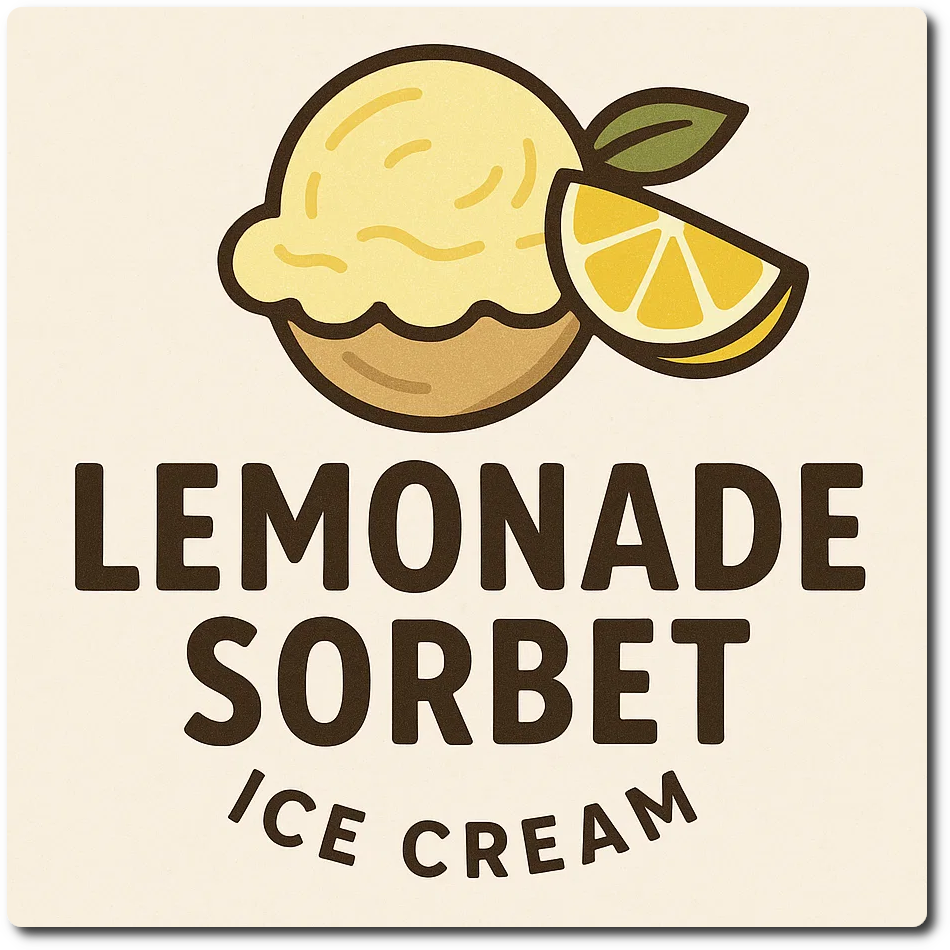

# Lemon Sorbet (Deluxe)

> 🌿 **Vegan & Dairy-free** Recipe is using only lemon juice and no dairy.

> ℹ️ This is keto, at 25 net carbs per tub, so 6-8 per serving.

Process on Sorbet.

> 

Rating: 😋 (experimental)

# INGREDIENTS

ℹ️ Brand names are in square brackets `[...]`.

**Wet**

  - _400ml_ Water (cold)
  - _125ml_ Lemon juice
  - _1 tsp_ Lemon zest (½ peel or less) • Zest the lemon BEFORE juicing
  - _10 drops_ Flavor drops Peach / Maracuja (sucralose) [IronMaxx]
  - _15g_ [Glycerin (E422, VG) \[hd-line\]](/ice-creamery/info/ingredients/#vegetable-glycerin-glycerol-vg-e422){target="_blank"}↗ • Sweetness = 60%; GI = 5; Density = 1.26 g/ml
  - _10g_ [Brandy “Williams Birne” 40 vol%](/ice-creamery/info/ingredients/#alcohol-ethanol){target="_blank"}↗

**Dry**

  - _15g_ [Erythritol (E968)](/ice-creamery/info/ingredients/#erythritol-e968){target="_blank"}↗ • POD = 75%
  - _15g_ [Xylitol](/ice-creamery/info/ingredients/#xylitol-e967){target="_blank"}↗ • Sweetness = 100%; GI = 7
  - _40g_ ICSv2 [Erythritol / CMC / Tara / XG / Inulin] • [http﹕//bit.ly/4frc4Vj](https://jhermann.github.io/ice-creamery/I/Ice%20Cream%20Stabilizer%20(ICS)/)
  - _1 pinch_ Tumeric • for color

**Fill to MAX**

  - _100ml_ Water to MAX line

# DIRECTIONS

 1. Add "wet" ingredients to empty Creami tub.
 1. Weigh and mix dry ingredients, easiest by adding to a jar with a secure lid and shaking vigorously.
 1. Pour into the tub and *QUICKLY* use an immersion blender on full speed to homogenize everything.
 1. Let blender run until thickeners are properly hydrated, up to 1-2 min. Or blend again after waiting that time.
 1. Add remaining ingredients (to the MAX line) and stir with a spoon.
 1. Put on the lid, freeze for 24h, then spin as usual. Flatten any humps before that.
 1. Process with RE-SPIN mode when not creamy enough after the first spin.

# NUTRITIONAL & OTHER INFO
- **Nutritional values per 100g/ml:** 100g; 28.0 kcal; fat 0.0g; carbs 9.9g; sugar 0.5g; protein 0.1g; salt 0.1g
- **Nutritional values per ½ Deluxe Tub:** 360g; 100.7 kcal; fat 0.1g; carbs 35.5g; sugar 1.8g; protein 0.2g; salt 0.3g
- **Nutritional values total:** 720g; 201.5 kcal; fat 0.1g; carbs 70.9g; sugar 3.5g; protein 0.4g; salt 0.7g
- **FPDF / [PAC](/ice-creamery/info/glossary/#potere-anti-congelante-pac){target="_blank"}↗ (target 20..30):** 30.42
- **Protein / Energy Ratio (ok=12%; hi=20%):** 0.82% • LOW-CAL • LOW-FAT • Low-Sugar • Low-Salt
- **Milk Solids Non-Fat ([MSNF](/ice-creamery/info/glossary/#milk-solids-not-fat-msnf){target="_blank"}↗, 7-11%):** 0.0g • 0.0%
- **30g Ice Cream Stabilizer (ICSv2) is:** 14.3g erythritol, 1.43g Tylose powder (CMC, E466), 
0.5g tara gum (E417), 0.15g xanthan (E415),
14.3g inulin, 0.5g salt.
