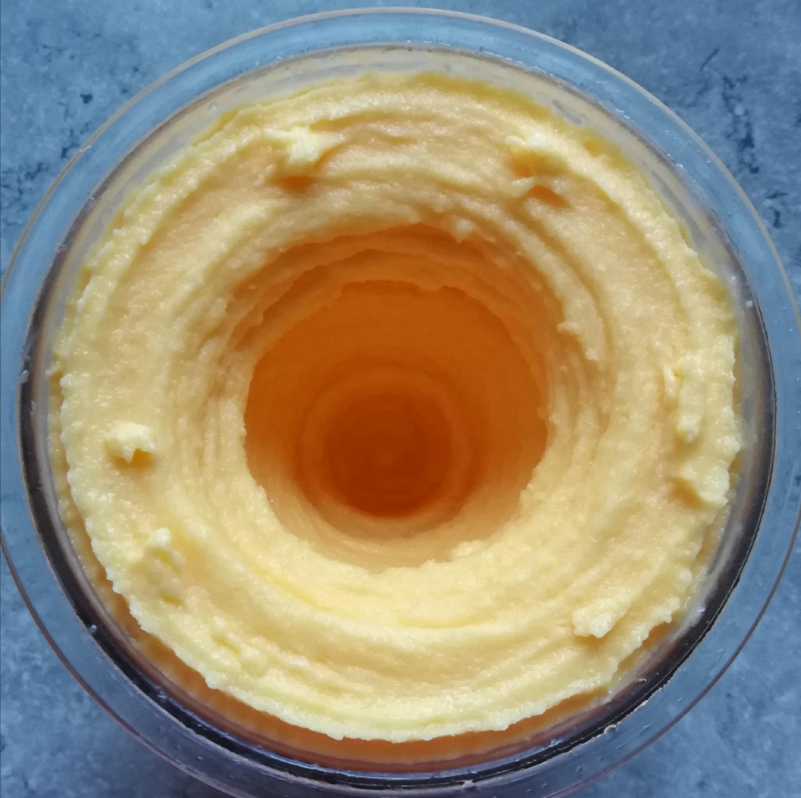

# Mandarin Sherbet (Deluxe)

Mostly mandarin slices and juice, which means a relatively high sugar content, but still reasonably lo-cal because it has only 2% fat.

> 

Small ice crystals (but then it is a sorbet / sherbet), and still immediately scoopable after 1 day in the freezer.

Rating: 😋😋😋😋❄️

# INGREDIENTS

ℹ️ Brand names are in square brackets `[...]`.

**Wet**

  - _300g_ Mandarins in juice [REWE]
  - _200ml_ [Soy milk 1.6% (sugar-free) \[Berief\]](/ice-creamery/info/ingredients/#soy-milk){target="_blank"}↗ • *alternative*: any other preferred milk (~2% fat)
  - _30g_ [Cream Cheese \[Exquisa\]](/ice-creamery/info/ingredients/#cream-cheese){target="_blank"}↗
  - _18g_ [Glycerin (E422, VG) \[hd-line\]](/ice-creamery/info/ingredients/#vegetable-glycerin-glycerol-vg-e422){target="_blank"}↗ • POD = 60%; GI = 5; Density = 1.26 g/ml
  - _10g_ [Brandy or Vodka 40 vol%](/ice-creamery/info/ingredients/#alcohol-ethanol){target="_blank"}↗ • *alternative:* 8g (additional) VG for a sober recipe

**Dry**

  - _30g_ [SweEX (Erythritol + Xylitol 3:2)](/ice-creamery/info/ingredients/#sweex-erythritol-xylitol-blend){target="_blank"}↗ • alternatives: 40g allulose or dextrose; POD ≈ 85%; GI < 7
  - _15g_ [Salty Stability \[Inulin / GMS / CMC / Guar / XG / Salt\]](/ice-creamery/S/Salty%20Stability/){target="_blank"}↗ • *not-as-good substitute:* 1.5g guar, 0.5g xanthan, and 0.5g salt
  - _15g_ [Whey + Casein protein (grass-fed) \[Vilgain\]](/ice-creamery/info/ingredients/#whey-protein){target="_blank"}↗ • with stevia

**Fill to MAX**

  - _62ml_ Water to MAX line
  - _≈3 drops_ Flavor drops Peach / Maracuja [IronMaxx] • to taste

# DIRECTIONS

 1. Add "wet" ingredients to empty Creami tub.
 1. Weigh and mix dry ingredients, easiest by adding to a jar with a secure lid and shaking vigorously.
 1. Pour into the tub and *QUICKLY* use an immersion blender on full speed to homogenize everything.
 1. Let blender run until thickeners are properly hydrated, up to 1-2 min. Or blend again after waiting that time.
 1. Add remaining ingredients (to the MAX line) and stir with a spoon.
 1. For better results, let the base age in the fridge (covered, lid on), for a few hours or over night. This helps flavor development and gum hydration, especially with unheated bases.
 1. Freeze for 24h with lid on, then spin as usual. Flatten any humps before that.
 1. Process with RE-SPIN mode when not creamy enough after the first spin.

# NUTRITIONAL & OTHER INFO

- **Nutritional values per 100g/ml:** 100g; 74.4 kcal; fat 1.6g; carbs 14.4g; sugar 4.4g; protein 3.2g; salt 0.2g
- **Nutritional values per ½ Deluxe Tub:** 340g; 253.0 kcal; fat 5.6g; carbs 48.8g; sugar 14.8g; protein 10.7g; salt 0.5g
- **Nutritional values total:** 680g; 506.0 kcal; fat 11.2g; carbs 97.6g; sugar 29.6g; protein 21.5g; salt 1.0g
- **FPDF / [PAC](/ice-creamery/info/glossary/#potere-anti-congelante-pac){target="_blank"}↗ (target 20..30):** 30.69
- **Protein / Energy Ratio (ok=12%; hi=20%):** 16.99% • LOW-FAT • Low-Sugar
- **Milk Solids Non-Fat ([MSNF](/ice-creamery/info/glossary/#milk-solids-not-fat-msnf){target="_blank"}↗, 7-11%):** 24.5g • 3.6%
- **Net carbs:** 47.6g • *∝ 5 servings@136g:* 9.5g • *∝ 3 servings@227g:* 15.9g • *energy ratio (low <20%):* 37.6%
- **Oct 14, 2024:** Dense, intensive, some small ice crystals
- **Oct 19, 2024:** Changed recipe
- **Nov 11, 2024:** Switched to ICSv2, added SMP
- **Dec 13, 2024:** Half the fruit, added milk + flavor drops
- **Jun 21, 2025:** Switched to soy milk
- **Aug 27, 2025:** Use new blends
- **15g 'Salty Stability' is:** 11.0g Inulin • 1.8g Glycerol Monostearate (GMS / E471) • 0.9g Tylose powder (E466, Tylo, CMC) • 0.6g Guar gum (E412) • 0.5g Salt • 0.2g Xanthan gum (E415, XG).
