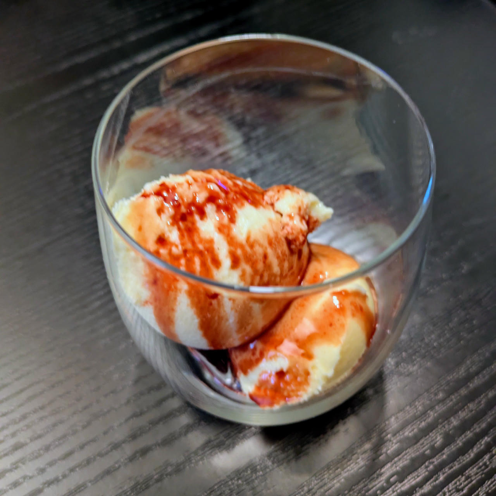

# Mango Kefir (Deluxe)

Process on *Frozen Yogurt*, [hold it shortly under running water](/ice-creamery/info/tips%2Btricks/#handling-of-icy-sides-bottom)
*after* that.Then a scrape-down and a respin.

> 

The base went from almost -18°C to -7°C after the respin.

> 

Served after 1h refreezing with pomegranate syrup.

> 

Rating: 😋😋😋😋

# INGREDIENTS

ℹ️ Brand names are in square brackets `[...]`.

**Wet**

  - _400g_ Kefir mild [Milsani / Aldi] • 500g container
  - _100g_ Cottage Cheese 4% [REWE Bio]
  - _15g_ Glycerin (E422, VG) [hd-line] • Sweetness = 60%; GI = 5; Density = 1.26 g/ml
  - _10g_ Brandy “Williams Birne” 40 vol%
  - _5 drops_ Flavor drops Peach / Maracuja [IronMaxx] • with sucralose
  - _125g_ Mango

**Dry**

  - _30g_ ICSv2 [Erythritol / CMC / Tara / XG / Inulin] • [http﹕//bit.ly/4frc4Vj](https://github.com/jhermann/ice-creamery/tree/main/recipes/Ice%20Cream%20Stabilizer%20%28ICS%29)
  - _20g_ Xylitol • Sweetness = 100%; GI = 7

**Fill to MAX**

  - _20ml_ Water to MAX line

# DIRECTIONS

 1. Add "wet" ingredients to empty Creami tub.
 1. Weigh and mix dry ingredients, easiest by adding to a jar with a secure lid and shaking vigorously.
 1. Pour into the tub and *QUICKLY* use an immersion blender on full speed to homogenize everything.
 1. Let blender run until thickeners are properly hydrated, up to 1-2 min. Or blend again after waiting that time.
 1. Add remaining ingredients (to the MAX line) and stir with a spoon.
 1. Put on the lid, freeze for 24h, then spin as usual. Flatten any humps before that.
 1. Process with RE-SPIN mode when not creamy enough after the first spin.

# NUTRITIONAL & OTHER INFO
- **Nutritional values per 100g/ml:** 100g; 72.8 kcal; fat 1.5g; carbs 11.8g; sugar 4.8g; protein 3.7g; salt 0.2g
- **Nutritional values per ½ Deluxe Tub:** 360g; 262.1 kcal; fat 5.3g; carbs 42.5g; sugar 17.4g; protein 13.1g; salt 0.8g
- **Nutritional values total:** 720g; 524.3 kcal; fat 10.6g; carbs 84.9g; sugar 34.8g; protein 26.3g; salt 1.7g
- **FPDF / PAC (target 20..30):** 29.48
- **Protein / Energy Ratio (ok=12%; hi=20%):** 20.05% • LOW-FAT • Low-Sugar • Hi-Protein
- **Milk Solids Non-Fat (MSNF, 7-11%):** 46.0g • 6.4%
- **30g Ice Cream Stabilizer (ICSv2) is:** 14.3g erythritol, 1.43g Tylose powder (CMC, E466), 
0.5g tara gum (E417), 0.15g xanthan (E415),
14.3g inulin, 0.5g salt.
