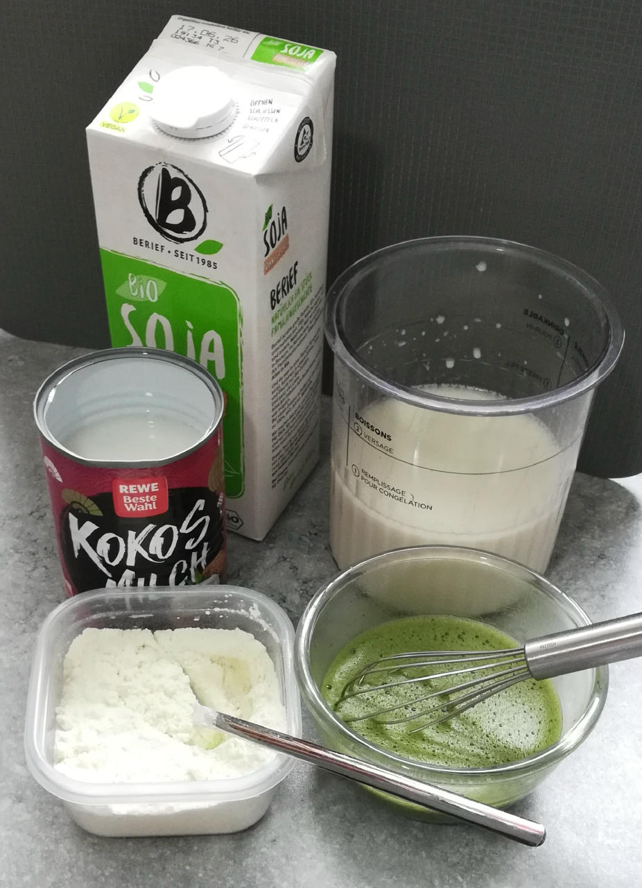
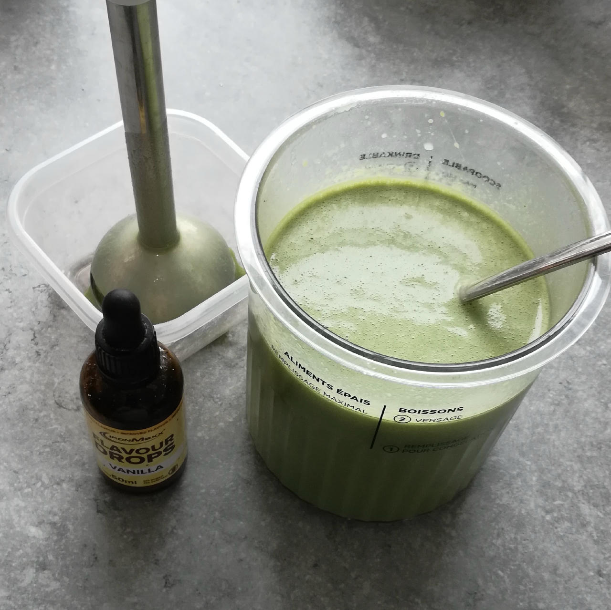
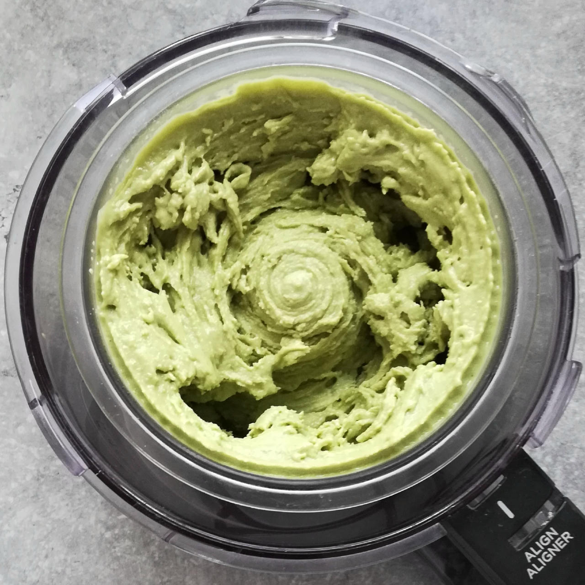
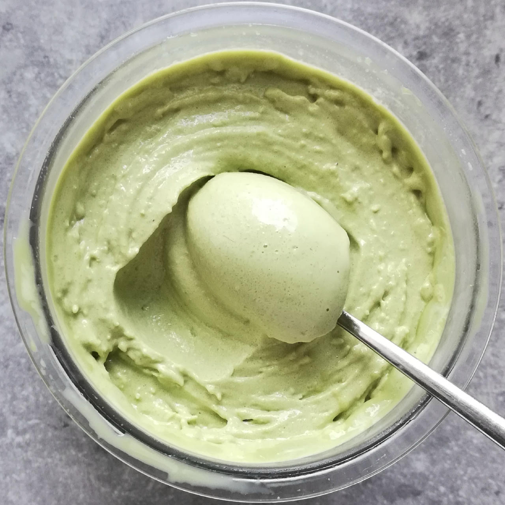

# Matcha Coconut (Deluxe)

🍵🥥 This matcha ice cream blends green tea's earthy flavor and subtle bitterness
with the light sweetness of coconut milk and the creamy texture of soy milk.
It's gently flavored and smooth without being heavy.

> 
> 

Process on SORBET and MIX-IN or RESPIN (choose depending on consistency you get after processing, and eventually want after the 2nd spin).
> 
> 
> 
> 
> Rating: 😋🥥🥥🍵🍵

# INGREDIENTS

ℹ️ Brand names are in square brackets `[...]`.

**Prep**

  - _100ml_ Water (hot, 80°C)
  - _8g_ Matcha green tea powder (organic) [Mandoi] • 1tbsp = 6g; 1tsp = 2g

**Wet**

  - _300ml_ [Soy milk 1.6% (sugar-free) \[Berief\]](/ice-creamery/info/ingredients/#soy-milk){target="_blank"}↗
  - _100ml_ [Coconut milk 22% \[REWE Bio\]](/ice-creamery/info/ingredients/#coconut-milk){target="_blank"}↗
  - _15g_ [Glycerin (E422, VG) \[hd-line\]](/ice-creamery/info/ingredients/#vegetable-glycerin-glycerol-vg-e422){target="_blank"}↗ • POD = 60%; GI = 5; Density = 1.26 g/ml
  - _15g_ [Brandy or Vodka 40 vol%](/ice-creamery/info/ingredients/#alcohol-ethanol){target="_blank"}↗

**Dry**

  - _40g_ [SweEX (Erythritol + Xylitol 3:2)](/ice-creamery/info/ingredients/#sweex-erythritol-xylitol-blend){target="_blank"}↗ • POD ≈ 90%; GI < 7
  - _10g_ [Salty Stability \[Inulin / GMS / CMC / Guar / XG / Salt\]](/ice-creamery/S/Salty%20Stability/){target="_blank"}↗ • unsweetened “ICSv2”
  - _25g_ [Whey + Casein protein (grass-fed) \[Vilgain\]](/ice-creamery/info/ingredients/#whey-protein){target="_blank"}↗ • with stevia
  - _25g_ [Skim milk powder 1:10 (SMP) \[Vita2You\]](/ice-creamery/info/ingredients/#skim-milk-powder-smp){target="_blank"}↗

**Fill to MAX**

  - _82ml_ [Soy milk 1.6% (sugar-free) \[Berief\]](/ice-creamery/info/ingredients/#soy-milk){target="_blank"}↗
  - _≈2 drops_ Flavor drops Vanilla (sucralose) [IronMaxx] • to taste

# DIRECTIONS

 1. Pour *hot* water (80°C) into empty tub.
 1. Add the matcha and blend until frothy.
 1. Add "wet" ingredients to the tea.
 1. Weigh and mix dry ingredients, easiest by adding to a jar with a secure lid and shaking vigorously.
 1. Pour into the tub and *QUICKLY* use an immersion blender on full speed to homogenize everything.
 1. Let blender run until thickeners are properly hydrated, up to 1-2 min. Or blend again after waiting that time.
 1. Add remaining ingredients (to the MAX line) and stir with a spoon.
 1. Put on the lid, freeze for 24h, then spin as usual. Flatten any humps before that.
 1. Process with RE-SPIN mode when not creamy enough after the first spin.

# NUTRITIONAL & OTHER INFO
- **Nutritional values per 100g/ml:** 100g; 100.7 kcal; fat 4.2g; carbs 12.6g; sugar 2.6g; protein 6.2g; salt 0.1g
- **Nutritional values per ½ Deluxe Tub:** 360g; 362.7 kcal; fat 15.1g; carbs 45.2g; sugar 9.3g; protein 22.3g; salt 0.5g
- **Nutritional values total:** 720g; 725.3 kcal; fat 30.2g; carbs 90.4g; sugar 18.6g; protein 44.6g; salt 1.1g
- **FPDF / [PAC](/ice-creamery/info/glossary/#potere-anti-congelante-pac){target="_blank"}↗ (target 20..30):** 31.56
- **Protein / Energy Ratio (ok=12%; hi=20%):** 24.59% • Low-Sugar • Hi-Protein
- **Milk Solids Non-Fat ([MSNF](/ice-creamery/info/glossary/#milk-solids-not-fat-msnf){target="_blank"}↗, 7-11%):** 61.4g • 8.5%
- **Net carbs:** 35.5g • *∝ 5 servings@144g:* 7.1g • *∝ 3 servings@240g:* 11.8g • *energy ratio (low <20%):* 19.6%
- **10g 'Salty Stability' is:** 7.3g Inulin • 1.2g Glycerol Monostearate (GMS / E471) • 0.6g Tylose powder (E466, Tylo, CMC) • 0.4g Guar gum (E412) • 0.33g Salt • 0.13g Xanthan gum (E415, XG).
