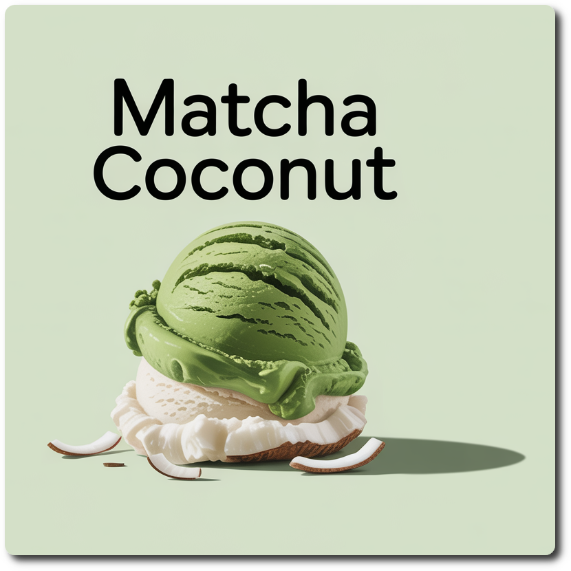

# Matcha Coconut (Deluxe)

Process on SORBET and MIX-IN or RE-SPIN (choose depending on consistency you get after processing, and eventually want after 2nd spin).

Rating: 😋🥥🍵 (untested)

> 

# INGREDIENTS

ℹ️ Brand names are in square brackets `[...]`.

**Prep**

  - _100ml_ Water (hot)
  - _6g_ Matcha green tea powder (organic) [Mandoi] • 1tbsp = 6g; 1tsp = 2g

**Wet**

  - _250ml_ [Skim Milk 1.5% \[Weihenstephan\]](/ice-creamery/info/ingredients/#skim-milk){target="_blank"}↗
  - _100ml_ [Coconut milk 22% \[REWE Bio\]](/ice-creamery/info/ingredients/#coconut-milk){target="_blank"}↗
  - _100g_ Cottage Cheese 4% [REWE Bio]
  - _20g_ [Glycerin (E422, VG) \[hd-line\]](/ice-creamery/info/ingredients/#vegetable-glycerin-glycerol-vg-e422){target="_blank"}↗ • POD = 60%; GI = 5; Density = 1.26 g/ml
  - _10g_ Brandy “Williams Birne” 40 vol%
  - _7 drops_ Flavor drops Vanilla [IronMaxx] • with sucralose

**Dry**

  - _30g_ [Xylitol](/ice-creamery/info/ingredients/#xylitol-e967){target="_blank"}↗ • POD = 100%; GI = 7
  - _20g_ ICSv2 [Erythritol / CMC / Tara / XG / Inulin] • [http﹕//bit.ly/4frc4Vj](https://jhermann.github.io/ice-creamery/I/Ice%20Cream%20Stabilizer%20(ICS)/)

**Fill to MAX**

  - _84ml_ Water to MAX line

# DIRECTIONS

 1. Mix the matcha with 1tbsp *cold* water to get a paste.
 1. Add *hot* water (75–80°C) and whisk until frothy.
 1. Add "wet" ingredients and the tea to empty Creami tub.
 1. Weigh and mix dry ingredients, easiest by adding to a jar with a secure lid and shaking vigorously.
 1. Pour into the tub and *QUICKLY* use an immersion blender on full speed to homogenize everything.
 1. Let blender run until thickeners are properly hydrated, up to 1-2 min. Or blend again after waiting that time.
 1. Add remaining ingredients (to the MAX line) and stir with a spoon.
 1. Put on the lid, freeze for 24h, then spin as usual. Flatten any humps before that.
 1. Process with RE-SPIN mode when not creamy enough after the first spin.

# NUTRITIONAL & OTHER INFO
- **Nutritional values per 100g/ml:** 100g; 90.9 kcal; fat 4.2g; carbs 11.4g; sugar 2.5g; protein 3.5g; salt 0.2g
- **Nutritional values per ½ Deluxe Tub:** 360g; 327.2 kcal; fat 15.0g; carbs 41.0g; sugar 9.0g; protein 12.6g; salt 0.7g
- **Nutritional values total:** 720g; 654.3 kcal; fat 30.0g; carbs 81.9g; sugar 18.0g; protein 25.2g; salt 1.3g
- **FPDF / PAC (target 20..30):** 30.72
- **Protein / Energy Ratio (ok=12%; hi=20%):** 15.42% • Low-Sugar
- **Milk Solids Non-Fat (MSNF, 7-11%):** 38.9g • 5.4%
- **30g Ice Cream Stabilizer (ICSv2) is:** 14.3g erythritol, 1.43g Tylose powder (CMC, E466), 
0.5g tara gum (E417), 0.15g xanthan (E415),
14.3g inulin, 0.5g salt.
