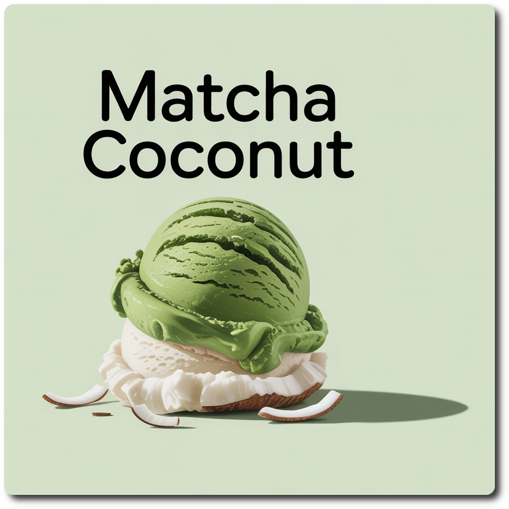
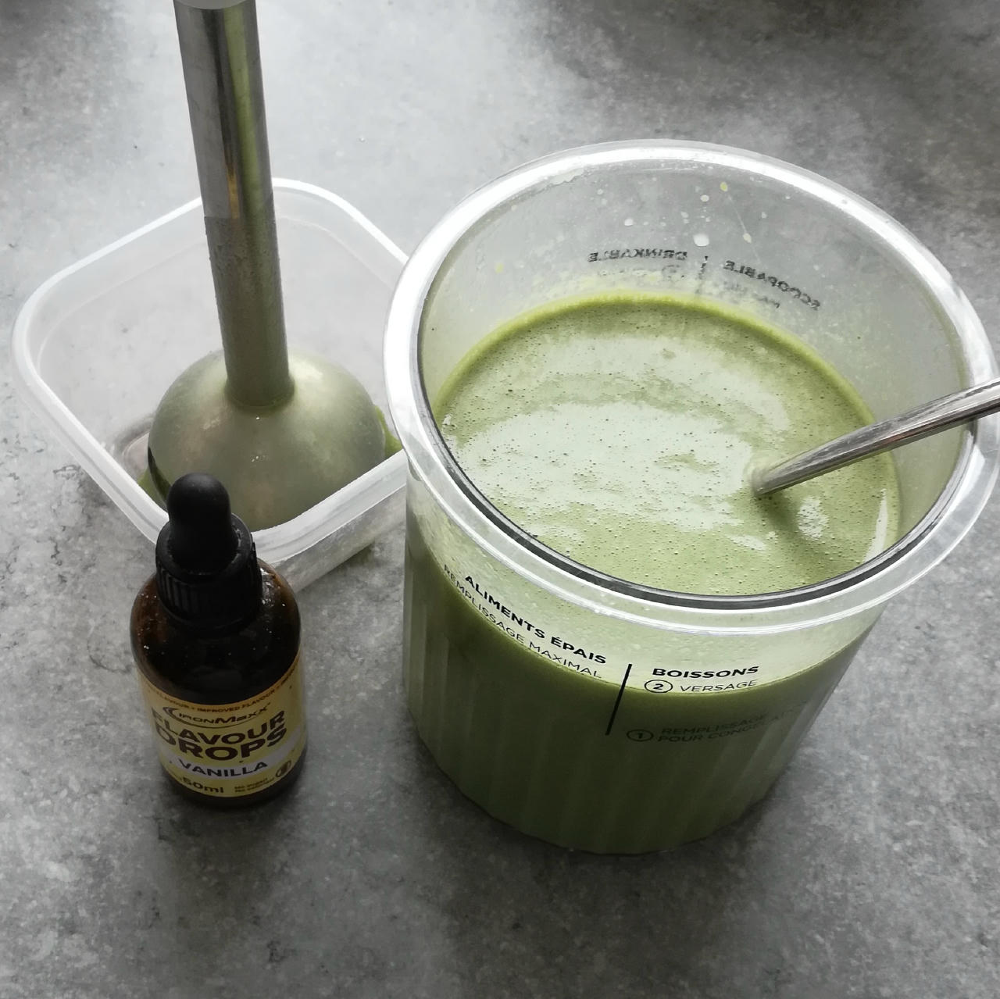
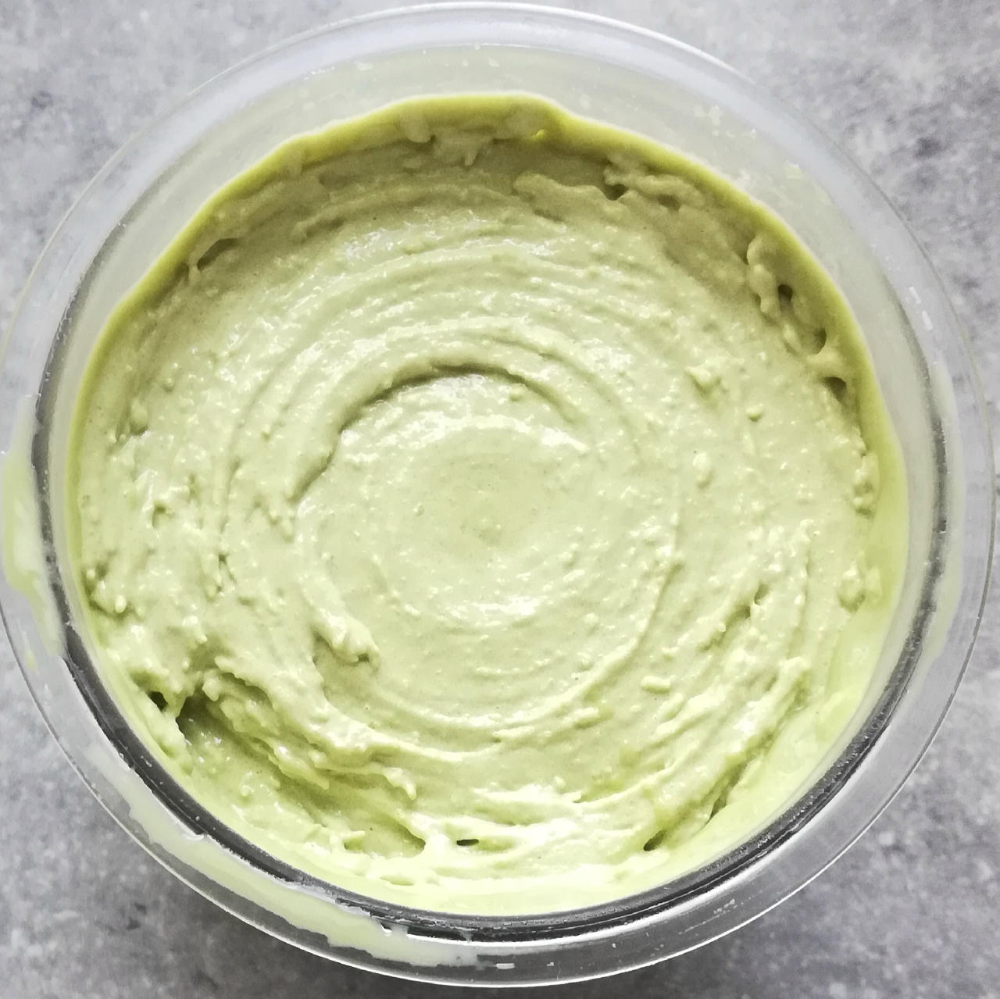
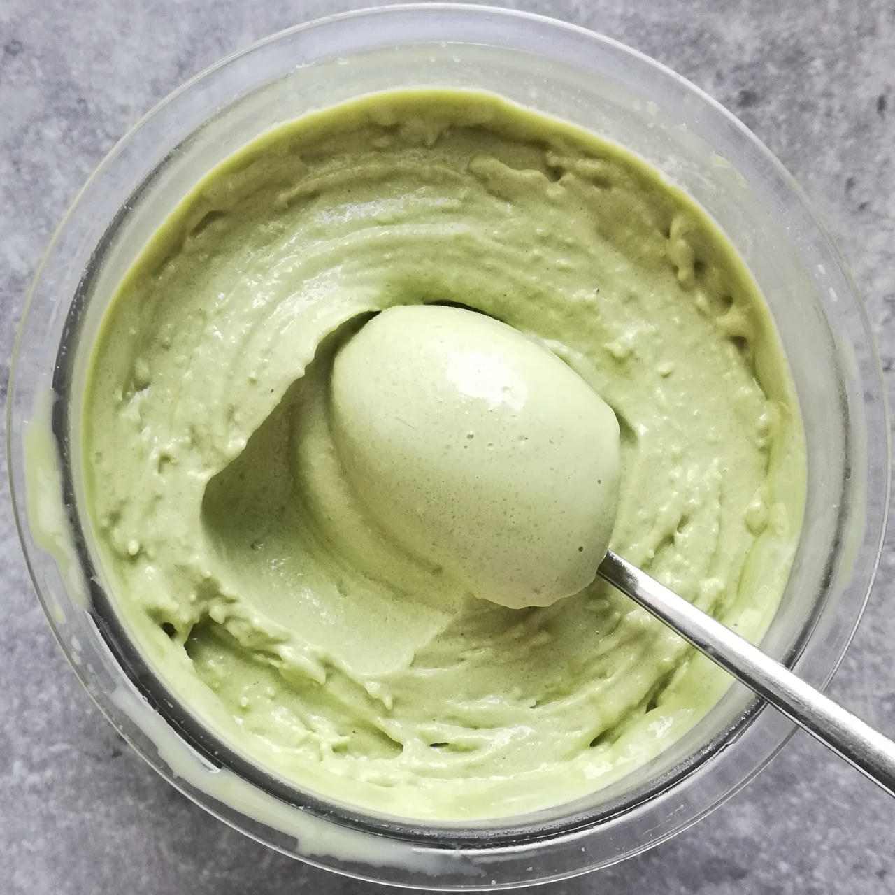
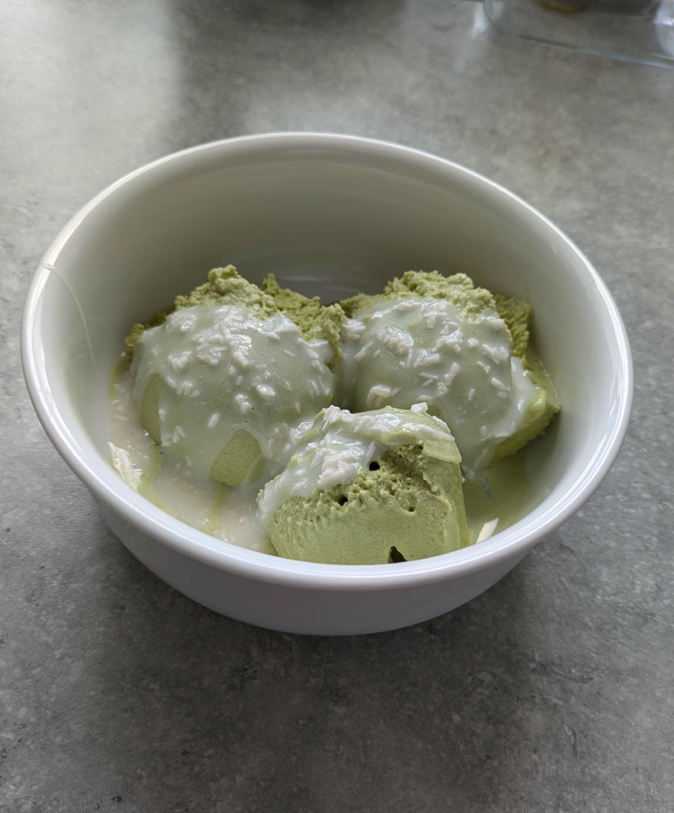
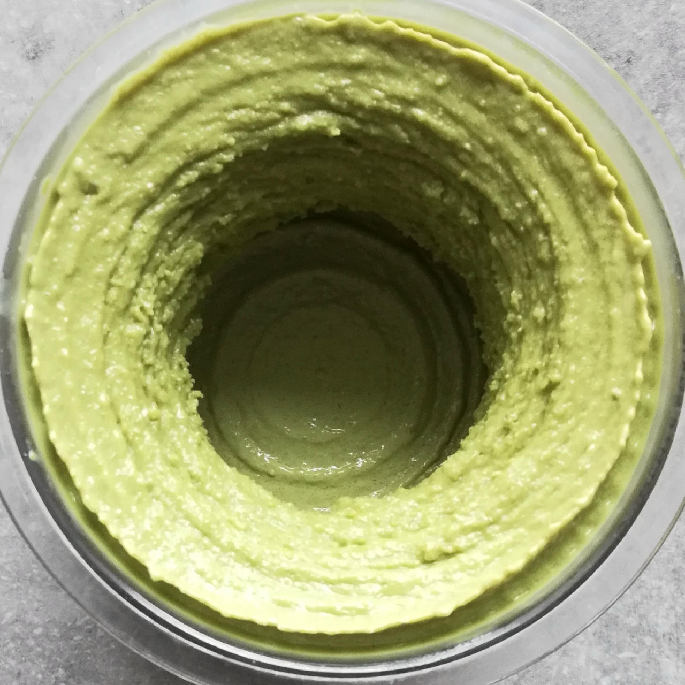
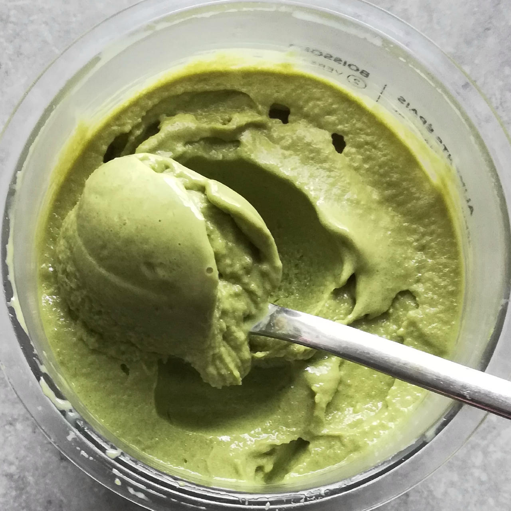

# Matcha Coconut (Deluxe)

🍵🥥 This matcha ice cream blends green tea's earthy flavor and subtle bitterness
with the light sweetness of coconut milk and the creamy texture of soy milk.
It's gently flavored and smooth without being heavy.

> 
> 

Process on SORBET and MIX-IN or RESPIN (choose depending on consistency you get after processing, and eventually want after the 2nd spin).

> 
> 
> 
> 
> Rating: 😋🥥🥥🍵🍵

> 

Heated base with 12g matcha, one spin on *Light Ice Cream*.

> 
> 

# INGREDIENTS

ℹ️ Brand names are in square brackets `[...]`.

**Wet**

  - _350ml_ [Soy milk 1.6% (sugar-free) \[Berief\]](/ice-creamery/info/ingredients/#soy-milk){target="_blank"}↗
  - _100ml_ [Coconut milk 22% \[REWE Bio\]](/ice-creamery/info/ingredients/#coconut-milk){target="_blank"}↗
  - _15g_ [Glycerin (E422, VG) \[hd-line\]](/ice-creamery/info/ingredients/#vegetable-glycerin-glycerol-vg-e422){target="_blank"}↗ • POD = 60%; GI = 5; Density = 1.26 g/ml
  - _15g_ [Brandy or Vodka 40 vol%](/ice-creamery/info/ingredients/#alcohol-ethanol){target="_blank"}↗

**Dry**

  - _12g_ Matcha green tea powder (organic) [Mandoi] • 1tbsp = 6g; 1tsp = 2g
  - _40g_ [SweEX (Erythritol + Xylitol 3:2)](/ice-creamery/info/ingredients/#sweex-erythritol-xylitol-blend){target="_blank"}↗ • POD ≈ 90%; GI < 7
  - _10g_ [Salty Stability \[Inulin / GMS / CMC / Guar / XG / Salt\]](/ice-creamery/S/Salty%20Stability/){target="_blank"}↗ • unsweetened “ICSv2”
  - _25g_ [Whey + Casein protein (grass-fed) \[Vilgain\]](/ice-creamery/info/ingredients/#whey-protein){target="_blank"}↗ • with stevia
  - _25g_ [Skim milk powder 1:10 (SMP) \[Vita2You\]](/ice-creamery/info/ingredients/#skim-milk-powder-smp){target="_blank"}↗

**Fill to MAX**

  - _88ml_ [Soy milk 1.6% (sugar-free) \[Berief\]](/ice-creamery/info/ingredients/#soy-milk){target="_blank"}↗
  - _≈2 drops_ Flavor drops Vanilla (sucralose) [IronMaxx] • to taste

# DIRECTIONS

 1. Heat soy and coconut milk in a small pot to 80°C, take it off the heat.
 1. Combine the matcha and other “dry” ingredients in a small bowl.
 1. Blend into the milk until frothy and smooth, let it steep and cool down a bit for 5 minutes.
 1. Add remaining "wet" ingredients and the tea preparation to an empty Creami tub.
 1. Fill to the MAX line, adapt the sweetness, and let fully cool down in the fridge.
 1. Put on the lid, freeze for 24h, then spin as usual. Flatten any humps before that.
 1. Process with RE-SPIN mode when not creamy enough after the first spin.

# NUTRITIONAL & OTHER INFO

- **Nutritional values per 100g/ml:** 100g; 111.4 kcal; fat 4.6g; carbs 13.8g; sugar 2.7g; protein 7.0g; salt 0.2g
- **Nutritional values per ½ Deluxe Tub:** 360g; 401.0 kcal; fat 16.5g; carbs 49.5g; sugar 9.9g; protein 25.1g; salt 0.6g
- **Nutritional values total:** 680g; 757.4 kcal; fat 31.2g; carbs 93.5g; sugar 18.6g; protein 47.4g; salt 1.1g
- **FPDF / [PAC](/ice-creamery/info/glossary/#potere-anti-congelante-pac){target="_blank"}↗ (target 20..30):** 33.45
- **Protein / Energy Ratio (ok=12%; hi=20%):** 25.05% • Low-Sugar • Hi-Protein
- **Milk Solids Non-Fat ([MSNF](/ice-creamery/info/glossary/#milk-solids-not-fat-msnf){target="_blank"}↗, 7-11%):** 63.6g • 9.4%
- **Net carbs:** 38.7g • *∝ 5 servings@136g:* 7.7g • *∝ 3 servings@227g:* 12.9g • *energy ratio (low <20%):* 20.4%
- **10g 'Salty Stability' is:** 7.3g Inulin • 1.2g Glycerol Monostearate (GMS / E471) • 0.6g Tylose powder (E466, Tylo, CMC) • 0.4g Guar gum (E412) • 0.33g Salt • 0.13g Xanthan gum (E415, XG).
