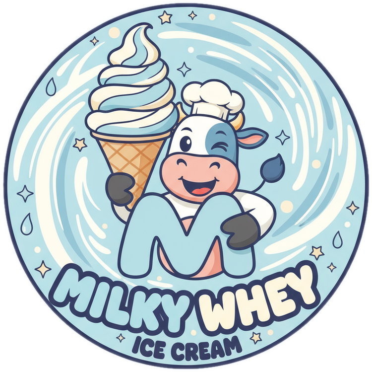
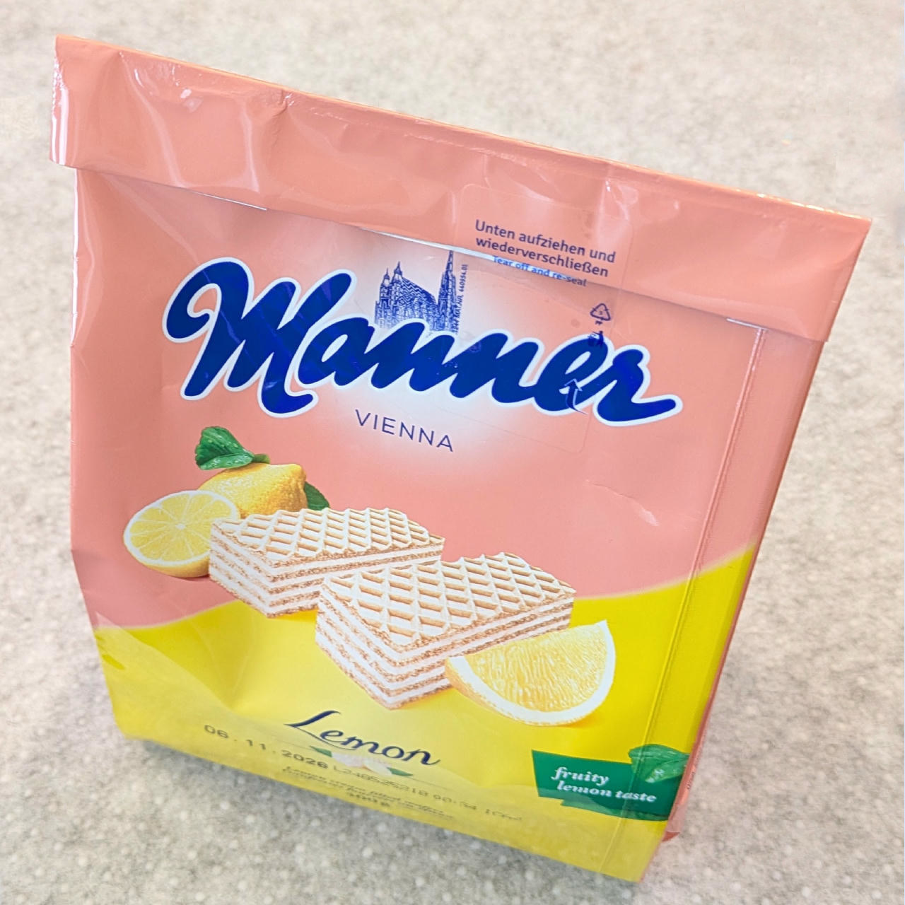
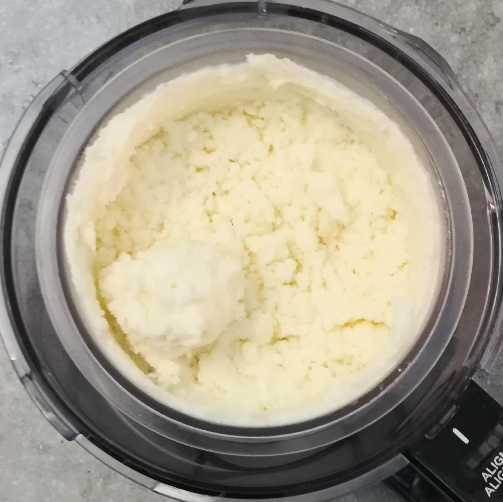
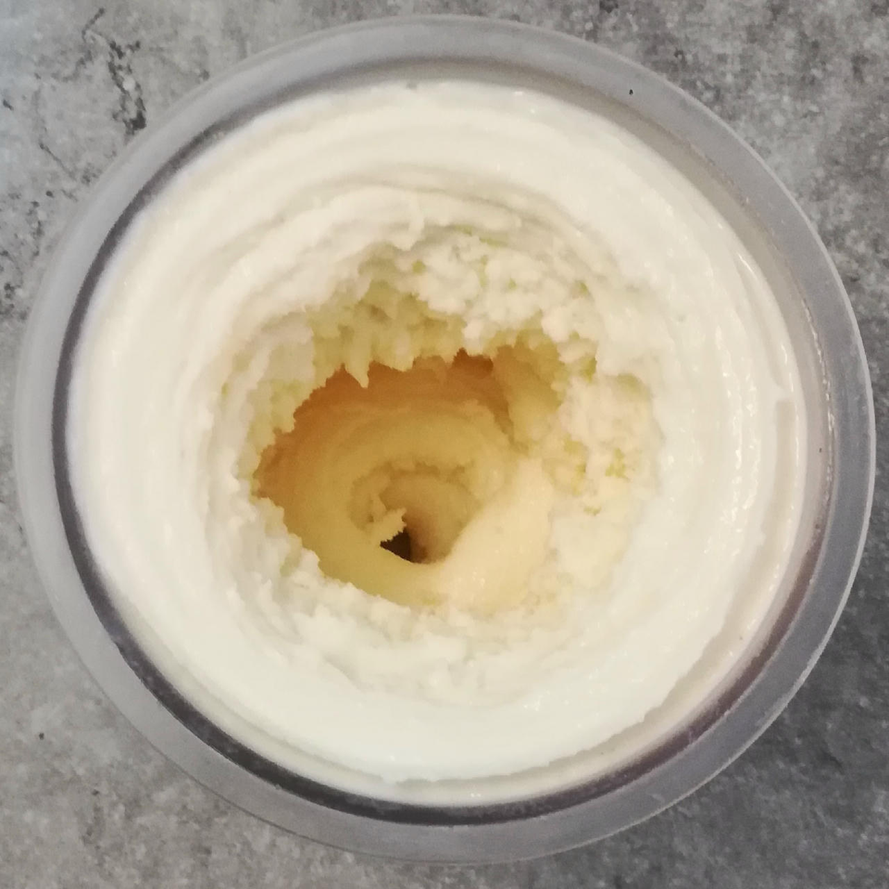
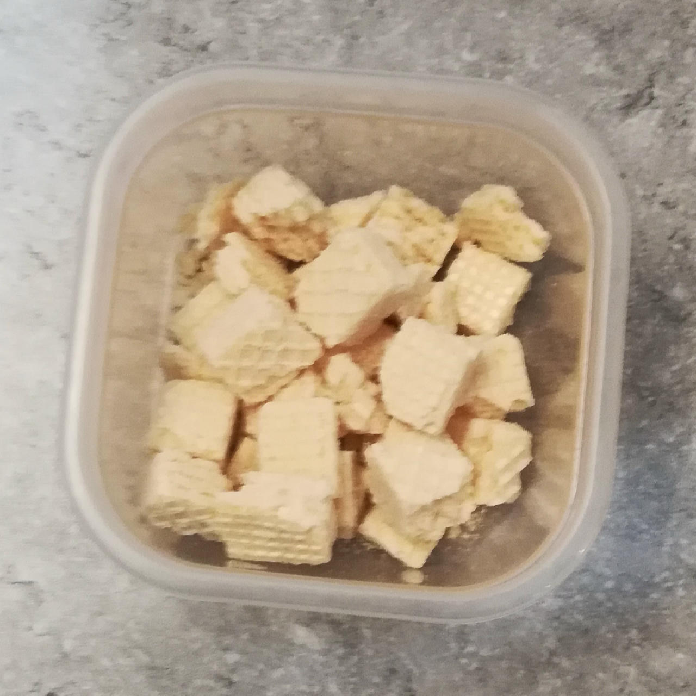
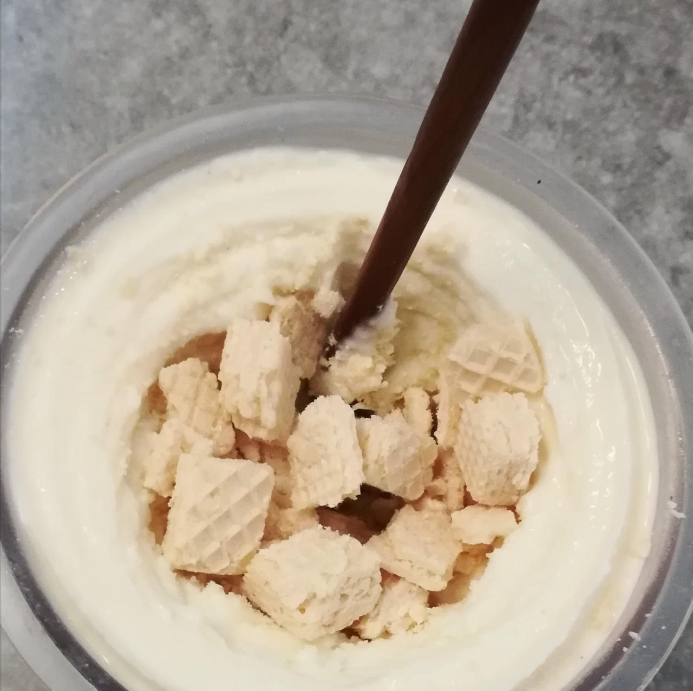
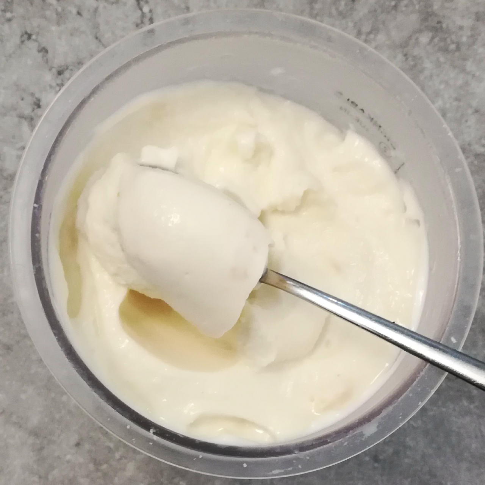
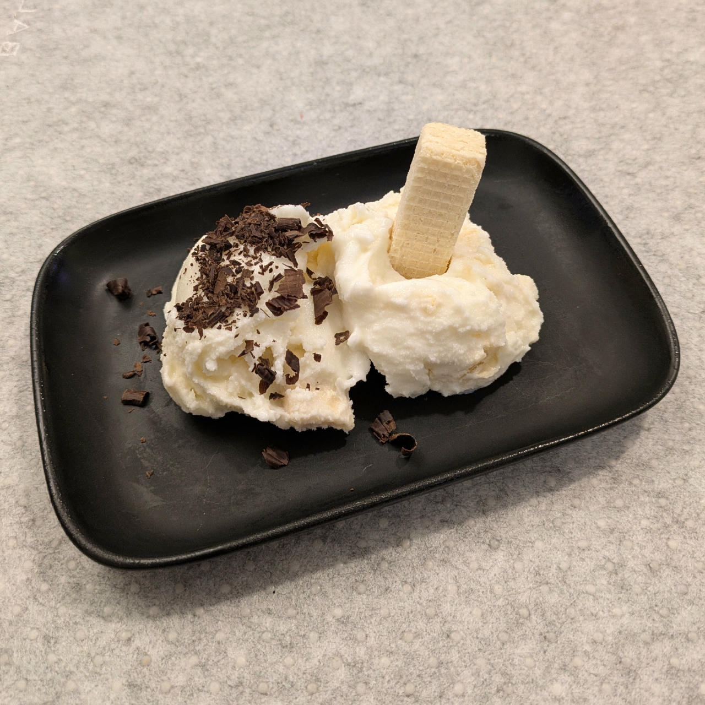
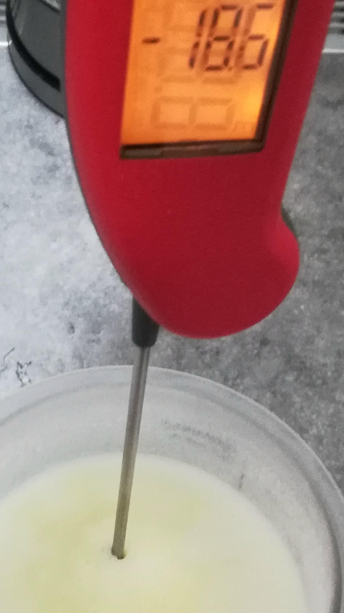
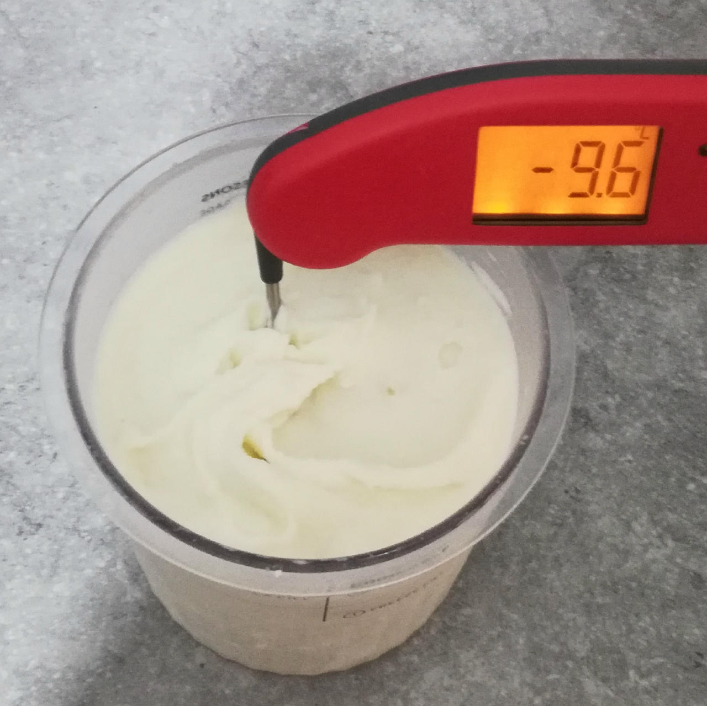

# Milky Whey (Deluxe)

"Milky Whey" is a playful nod to both dairy science and indulgence,
an ice cream crafted with whole milk, cream, skim milk powder, and a balanced whey–casein blend.

> 
> 
> *Wafers filled with lemon crème recommended as a mix-in.*

This recipe leans into the richness of real dairy while showcasing the smooth body and creamy texture
that milk proteins bring — making it both fun in name and seriously good in pure milk flavor. 

> 
> 

Spin on “Ice Cream”, scrape down, and respin.

> 
> 

*Manually* mix in broken down wafers using a chopstick.

> 
> 

Rating: 😋🥛🍦🍋🧇  (tastes like milk 😼)

> 
> 

Temperature of the base before and after processing.



# INGREDIENTS

ℹ️ Brand names are in square brackets `[...]`.

**Wet**

  - _550ml_ Milk 3.5% [Weihenstephan]
  - _15g_ [Glycerin (E422, VG) \[hd-line\]](/ice-creamery/info/ingredients/#vegetable-glycerin-glycerol-vg-e422){target="_blank"}↗
  - _10g_ [Brandy or Vodka 40 vol%](/ice-creamery/info/ingredients/#alcohol-ethanol){target="_blank"}↗ • *alternative:* 8g (additional) VG for a sober recipe

**Dry**

  - _30g_ [SweEX (Erythritol + Xylitol 3:2)](/ice-creamery/info/ingredients/#sweex-erythritol-xylitol-blend){target="_blank"}↗ • *alternative:* 40g allulose or dextrose
  - _20g_ [Waxy Maize Starch (E1442) \[Ultratex\]](/ice-creamery/info/ingredients/#waxy-maize-starch-e1442){target="_blank"}↗ • dissolves easily; use 1-5%
  - _20g_ [Whey + Casein protein (grass-fed) \[Vilgain\]](/ice-creamery/info/ingredients/#whey-protein){target="_blank"}↗ • with stevia
  - _15g_ [Skim milk powder 1:10 (SMP) \[Vita2You\]](/ice-creamery/info/ingredients/#skim-milk-powder-smp){target="_blank"}↗
  - _1.5g_ [Guar gum (E412)](/ice-creamery/info/ingredients/#guar-gum-e412){target="_blank"}↗
  - _1g_ Salt

**Fill to MAX**

  - _30ml_ Cream 32% [REWE Beste Wahl]
  - _≈5 drops_ Flavor drops “Natural” (stevia) [Nick’s] • to taste • unflavored

**Mix-ins**

  - _45g_ Wafers (filled w/ lemon crème) [Manner] • *manually* mix in; 400g bag; 1pc ~7.5g [226kcal, 21g sugar]

# DIRECTIONS

 1. Add "wet" ingredients to empty Creami tub.
 1. Weigh and mix dry ingredients, easiest by adding to a jar with a secure lid and shaking vigorously.
 1. Pour into the tub and *QUICKLY* use an immersion blender on full speed to homogenize everything.
 1. Let blender run until thickeners are properly hydrated, up to 1-2 min. Or blend again after waiting that time.
 1. Add remaining ingredients (to the MAX line) and stir with a spoon.
 1. Put on the lid, freeze for 24h, then spin as usual. Flatten any humps before that.
 1. Process with RE-SPIN mode when not creamy enough after the first spin.

# NUTRITIONAL & OTHER INFO

- **Nutritional values per 100g/ml:** 100g; 112.3 kcal; fat 4.3g; carbs 14.6g; sugar 5.1g; protein 6.0g; salt 0.3g
- **Nutritional values per ½ Deluxe Tub:** 340g; 381.8 kcal; fat 14.7g; carbs 49.6g; sugar 17.4g; protein 20.3g; salt 1.0g
- **Nutritional values total:** 693g; 777.6 kcal; fat 30.0g; carbs 101.0g; sugar 35.5g; protein 41.4g; salt 2.1g
- **FPDF / [PAC](/ice-creamery/info/glossary/#potere-anti-congelante-pac){target="_blank"}↗ (target 20..30):** 31.15
- **Protein / Energy Ratio (ok=12%; hi=20%):** 21.31% • Hi-Protein
- **Milk Solids Non-Fat ([MSNF](/ice-creamery/info/glossary/#milk-solids-not-fat-msnf){target="_blank"}↗, 7-11%):** 83.4g • 12.0%
- **Net carbs:** 63.5g • *∝ 5 servings@139g:* 12.7g • *∝ 3 servings@231g:* 21.2g • *energy ratio (low <20%):* 32.7%
