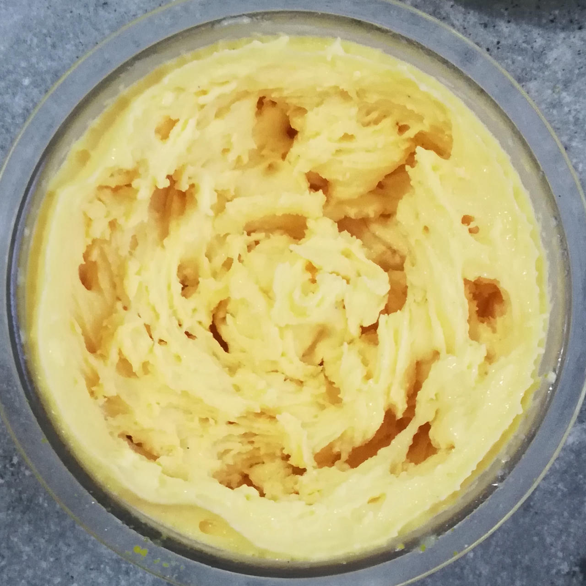

# Orange Julius (Deluxe)

Processed on Sorbet, followed by a scrape-down and re-mix.
Ends up with a creamy sorbet consistency.

> 
> 

Very intense flavor due to the orange zest, it might be better with half the orange peel.

Rating: 😋😋😋🍊🍊

# INGREDIENTS

ℹ️ Brand names are in square brackets `[...]`.

**Wet**

  - _1 peel_ Zest from an organic orange • Zest the orange before juicing!
  - _300g_ Mandarins in juice [REWE]
  - _150g_ Mango
  - _80ml_ Freshly pressed orange juice • 1 medium sized orange (~150g)
  - _75g_ Cottage Cheese 4% [REWE Bio]
  - _10g_ Glycerin (E422, VG) [hd-line] • Sweetness = 60%; GI = 5; Density = 1.26 g/ml
  - _10g_ Brandy “Williams Birne” 40 vol%

**Dry**

  - _30g_ ICSv2 [Erythritol / CMC / Tara / XG / Inulin] • [http﹕//bit.ly/4frc4Vj](https://github.com/jhermann/ice-creamery/tree/main/recipes/Ice%20Cream%20Stabilizer%20%28ICS%29)
  - _25g_ Whey protein Vanilla [MaxiNutrition]
  - _25g_ Xylitol • Sweetness = 100%; GI = 7

**Fill to MAX**

  - _15ml_ Water to MAX line

# DIRECTIONS

 1. Add "wet" ingredients to empty Creami tub.
 1. Weigh and mix dry ingredients, easiest by adding to a jar with a secure lid and shaking vigorously.
 1. Pour into the tub and *QUICKLY* use an immersion blender on full speed to homogenize everything.
 1. Let blender run until thickeners are properly hydrated, up to 1-2 min. Or blend again after waiting that time.
 1. Add remaining ingredients (to the MAX line) and stir with a spoon.
 1. Put on the lid, freeze for 24h, then spin as usual. Flatten any humps before that.
 1. Process with RE-SPIN mode when not creamy enough after the first spin.

# NUTRITIONAL & OTHER INFO
- **Nutritional values per 100g/ml:** 100g; 83.2 kcal; fat 0.7g; carbs 15.9g; sugar 7.8g; protein 4.5g; salt 0.2g
- **Nutritional values per ½ Deluxe Tub:** 360g; 299.5 kcal; fat 2.7g; carbs 57.2g; sugar 28.2g; protein 16.2g; salt 0.6g
- **Nutritional values total:** 720g; 598.9 kcal; fat 5.4g; carbs 114.4g; sugar 56.4g; protein 32.3g; salt 1.2g
- **FPDF / PAC (target 20..30):** 31.08
- **Protein / Energy Ratio (ok=12%; hi=20%):** 21.58% • LOW-FAT • Hi-Protein
- **Milk Solids Non-Fat (MSNF, 7-11%):** 34.3g • 4.8%
- **30g Ice Cream Stabilizer (ICSv2) is:** 14.3g erythritol, 1.43g Tylose powder (CMC, E466), 
0.5g tara gum (E417), 0.15g xanthan (E415),
14.3g inulin, 0.5g salt.
