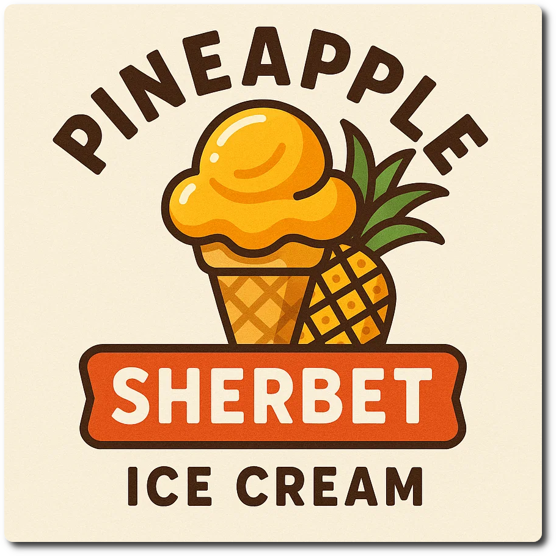

# Pineapple Sorbet (Deluxe)

Pineapple in its own juice with dairy, soy or coconut milk to make it more creamy.

If you like to put it into Piña Colada territory, use 75ml of Batida de Côco (16 vol%) in place of the rum and VG.

> 🌿 **Vegan Option** Replace the cottage cheese with 100ml coconut milk (adds 20kcal), or silken tofu.

Processed on “Sorbet”, with a scrape-down and re-spin.

> 

Rating: 😋😋😋🍍🍍

# INGREDIENTS

ℹ️ Brand names are in square brackets `[...]`.

**Wet**

  - _450g_ Pineapple in juice [Del Monte] • Can = 565g
  - _100g_ [Cottage Cheese 4% \[REWE Bio\]](/ice-creamery/info/ingredients/#cottage-cheese){target="_blank"}↗ • *alternative:* 30g cream cheese + 70ml milk, 100ml coconut milk, or (silken) tofu
  - _15g_ [Jamaica Rum 43 vol%](/ice-creamery/info/ingredients/#alcohol-ethanol){target="_blank"}↗ • *alternative:* 12g (additional) VG for a sober recipe
  - _10g_ [Glycerin (E422, VG) \[hd-line\]](/ice-creamery/info/ingredients/#vegetable-glycerin-glycerol-vg-e422){target="_blank"}↗ • POD = 60%; GI = 5; Density = 1.26 g/ml

**Dry**

  - _20g_ [SweEX (Erythritol + Xylitol 3:2)](/ice-creamery/info/ingredients/#sweex-erythritol-xylitol-blend){target="_blank"}↗ • *alternative:* 27g allulose or dextrose
  - _10g_ [Salty Stability \[Inulin / GMS / CMC / Guar / XG / Salt\]](/ice-creamery/S/Salty%20Stability/){target="_blank"}↗ • *not-as-good substitute:* 1g guar, 0.3g xanthan, and 0.3g salt

**Fill to MAX**

  - _75ml_ [Soy milk 1.6% (sugar-free) \[Berief\]](/ice-creamery/info/ingredients/#soy-milk){target="_blank"}↗ • *alternative*: any other preferred milk (~2% fat)
  - _≈1 drops_ Flavor drops Peach / Maracuja (sucralose) [IronMaxx] • to taste

**Optional / Choices**

  - _75ml_ [Batida de Côco 16 vol% \[Mangaroca\]](/ice-creamery/info/ingredients/#alcohol-ethanol){target="_blank"}↗ • swap in for VG and rum [179kcal, 12g sugar]

# DIRECTIONS

 1. Add "wet" ingredients to empty Creami tub.
 1. Weigh and mix dry ingredients, easiest by adding to a jar with a secure lid and shaking vigorously.
 1. Pour into the tub and *QUICKLY* use an immersion blender on full speed to homogenize everything.
 1. Let blender run until thickeners are properly hydrated, up to 1-2 min. Or blend again after waiting that time.
 1. Add remaining ingredients (to the MAX line) and stir with a spoon.
 1. For better results, let the base age in the fridge (covered, lid on), for a few hours or over night. This helps flavor development and gum hydration, especially with unheated bases.
 1. Freeze for 24h with lid on, then spin as usual. Flatten any humps before that.
 1. Process with RE-SPIN mode when not creamy enough after the first spin.

# NUTRITIONAL & OTHER INFO

- **Nutritional values per 100g/ml:** 100g; 81.3 kcal; fat 0.8g; carbs 15.9g; sugar 10.2g; protein 2.5g; salt 0.2g
- **Nutritional values per ½ Deluxe Tub:** 340g; 276.6 kcal; fat 2.8g; carbs 54.0g; sugar 34.5g; protein 8.4g; salt 0.6g
- **Nutritional values total:** 680g; 553.2 kcal; fat 5.6g; carbs 107.9g; sugar 69.1g; protein 16.8g; salt 1.2g
- **FPDF / [PAC](/ice-creamery/info/glossary/#potere-anti-congelante-pac){target="_blank"}↗ (target 20..30):** 31.18
- **Protein / Energy Ratio (ok=12%; hi=20%):** 12.13% • LOW-FAT
- **Milk Solids Non-Fat ([MSNF](/ice-creamery/info/glossary/#milk-solids-not-fat-msnf){target="_blank"}↗, 7-11%):** 19.0g • 2.8%
- **Net carbs:** 75.5g • *∝ 5 servings@136g:* 15.1g • *∝ 3 servings@227g:* 25.2g • *energy ratio (low <20%):* 54.6%
- **10g 'Salty Stability' is:** 7.3g Inulin • 1.2g Glycerol Monostearate (GMS / E471) • 0.6g Tylose powder (E466, Tylo, CMC) • 0.4g Guar gum (E412) • 0.33g Salt • 0.13g Xanthan gum (E415, XG).
