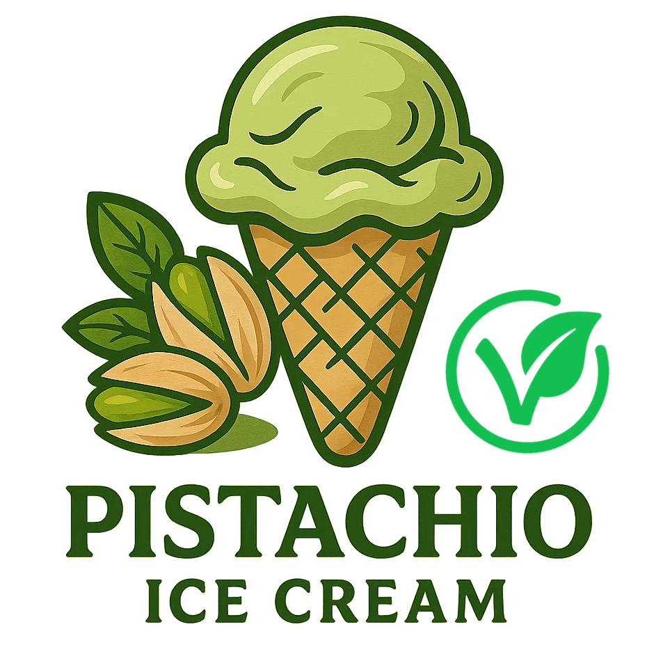

# Pisoyachio (Deluxe)

The nut butters take their toll, so this is nowhere near low-cal.
Also using almond butter is a cheat code regarding price, use just pistachios for premium taste and price.

> 🌿 **Vegan & Dairy-free** Recipe is using only soy milk and protein, and nut butters.

Processed on Lite Ice Cream, followed by a scrape-down and re-mix or respin.
Freeze again for about an hour to get to scoopable, if too soft for you.

> 

Rating: 😋 (untested)

# INGREDIENTS

ℹ️ Brand names are in square brackets `[...]`.

**Prep**

  - _30g_ Pistachio butter [Limfood]
  - _20g_ [Almond butter (creamy) \[Seba Garden\]](/ice-creamery/info/ingredients/#almond-milk-butter){target="_blank"}↗
  - _4g_ [Glycerol Monostearate (E471) \[Bulk\]](/ice-creamery/info/ingredients/#glycerol-monostearate-gms-e471){target="_blank"}↗ • approx. 1½ tsp
  - _65g_ [Tofu (plain) \[REWE Bio\]](/ice-creamery/info/ingredients/#tofu){target="_blank"}↗ • Package of 2x200g

**Wet**

  - _350ml_ [Soy milk 1.6% (sugar-free) \[Berief\]](/ice-creamery/info/ingredients/#soy-milk){target="_blank"}↗
  - _20g_ [Glycerin (E422, VG) \[hd-line\]](/ice-creamery/info/ingredients/#vegetable-glycerin-glycerol-vg-e422){target="_blank"}↗ • Sweetness = 60%; GI = 5; Density = 1.26 g/ml
  - _15g_ [Brandy or Vodka 40 vol%](/ice-creamery/info/ingredients/#alcohol-ethanol){target="_blank"}↗

**Dry**

  - _20g_ ICSv2 [Erythritol / Inulin / CMC / Guar / XG / Salt] • [http﹕//bit.ly/4frc4Vj](https://jhermann.github.io/ice-creamery/I/Ice%20Cream%20Stabilizer%20(ICS)/)
  - _25g_ [Xylitol (E967)](/ice-creamery/info/ingredients/#xylitol-e967){target="_blank"}↗ • Sweetness = 100%; GI = 7
  - _20g_ [Soy protein isolate (nature) \[Powerstar\]](/ice-creamery/info/ingredients/#soy-protein-isolate){target="_blank"}↗ • 1kg bag, unsweetened, unflavored
  - _3g_ [Vanilla Bean Powder \[InterVanilla\]](/ice-creamery/info/ingredients/#cocoa-powder){target="_blank"}↗
  - _1g_ Salt

**Fill to MAX**

  - _147ml_ [Soy milk 1.6% (sugar-free) \[Berief\]](/ice-creamery/info/ingredients/#soy-milk){target="_blank"}↗ • make blending easier by splitting the milk
  - _0–7 drops_ Flavor drops Vanilla (sucralose) [IronMaxx] • to taste

# DIRECTIONS

 1. Mix the GMS with the nut butters first, to dissolve it in fat.
 1. Add the tofu and a splash of soy milk and blend to a paste (or use silken tofu).
 1. Then add the other ‘wet’ ingredients and blend to emulsify.
 1. Weigh and mix dry ingredients, easiest by adding to a jar with a secure lid and shaking vigorously.
 1. Pour into the tub and *QUICKLY* use an immersion blender on full speed to homogenize everything.
 1. Let blender run until thickeners are properly hydrated, up to 1-2 min. Or blend again after waiting that time.
 1. Add remaining ingredients (to the MAX line) and stir with a spoon.
 1. Put on the lid, freeze for 24h, then spin as usual. Flatten any humps before that.
 1. Process with RE-SPIN mode when not creamy enough after the first spin.

# NUTRITIONAL & OTHER INFO
- **Nutritional values per 100g/ml:** 100g; 116.9 kcal; fat 5.2g; carbs 11.2g; sugar 0.5g; protein 7.0g; salt 0.3g
- **Nutritional values per ½ Deluxe Tub:** 360g; 420.7 kcal; fat 18.8g; carbs 40.5g; sugar 1.9g; protein 25.1g; salt 1.2g
- **Nutritional values total:** 720g; 841.4 kcal; fat 37.6g; carbs 80.9g; sugar 3.9g; protein 50.1g; salt 2.4g
- **FPDF / [PAC](/ice-creamery/info/glossary/#potere-anti-congelante-pac){target="_blank"}↗ (target 20..30):** 30.85
- **Protein / Energy Ratio (ok=12%; hi=20%):** 23.83% • Low-Sugar • Hi-Protein
- **Milk Solids Non-Fat ([MSNF](/ice-creamery/info/glossary/#milk-solids-not-fat-msnf){target="_blank"}↗, 7-11%):** 28.7g • 4.0%
- **Net carbs:** 27.8g • *∝ 5 servings@144g:* 5.6g • *∝ 3 servings@240g:* 9.3g
- **20g Ice Cream Stabilizer (ICSv2) is:** 9.2g Erythritol (E968) • 9.2g Inulin • 0.92g Tylose powder (E466, Tylo, CMC) • 0.32g Guar gum (E412) • 0.32g Salt • 0.09g Xanthan gum (E415, XG).
