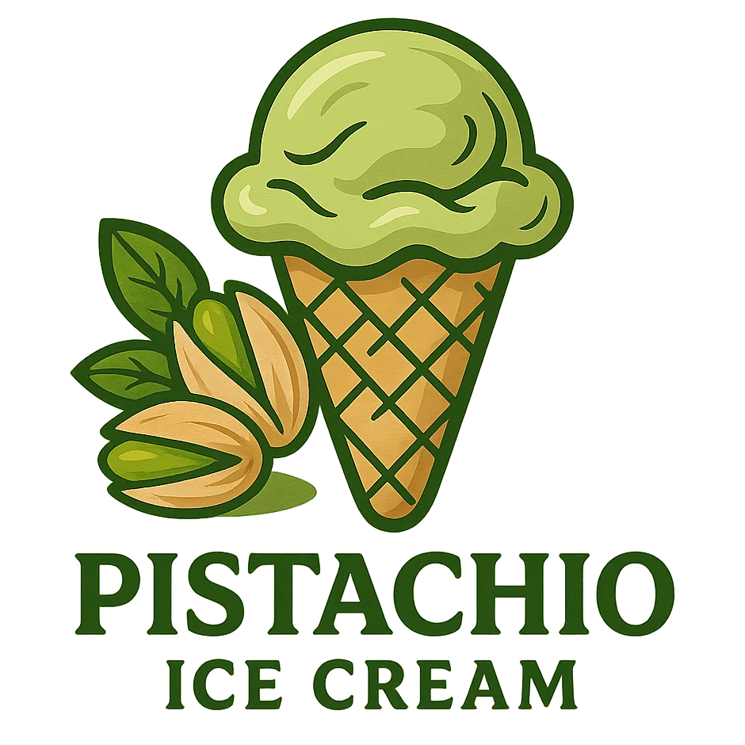

# Pistachio Ice Cream (Deluxe)

Processed on Lite Ice Cream, came out as soft-serve on the firmer side of things.
Freeze again for about an hour to get to scoopable.

> 

Rating: 😋😋😋😋

# INGREDIENTS

ℹ️ Brand names are in square brackets `[...]`.

**Wet**

  - _400ml_ [Soy milk 1.6% (sugar-free) \[Berief\]](/ice-creamery/info/ingredients/#soy-milk){target="_blank"}↗ • use any other preferred milk (~2% fat)
  - _100g_ [Cottage Cheese 4% \[REWE Bio\]](/ice-creamery/info/ingredients/#cottage-cheese){target="_blank"}↗
  - _30g_ Pistachio butter (100% nuts) [Limfood]
  - _20g_ [Almond butter (creamy) \[Seba Garden\]](/ice-creamery/info/ingredients/#almond-milk-butter){target="_blank"}↗ • *optional:* use more Pistachio butter instead, if you want to
  - _20g_ [Glycerin (E422, VG) \[hd-line\]](/ice-creamery/info/ingredients/#vegetable-glycerin-glycerol-vg-e422){target="_blank"}↗
  - _15g_ [Brandy or Vodka 40 vol%](/ice-creamery/info/ingredients/#alcohol-ethanol){target="_blank"}↗ • *alternative:* 12g (additional) VG for a sober recipe

**Dry**

  - _35g_ [SweEX (Erythritol + Xylitol 3:2)](/ice-creamery/info/ingredients/#sweex-erythritol-xylitol-blend){target="_blank"}↗ • *alternative:* 47g allulose or dextrose
  - _15g_ [Salty Stability \[Inulin / GMS / CMC / Guar / XG / Salt\]](/ice-creamery/S/Salty%20Stability/){target="_blank"}↗ • *not-as-good substitute:* 1.5g guar, 0.5g xanthan, and 0.5g salt
  - _15g_ [Whey + Casein protein (grass-fed) \[Vilgain\]](/ice-creamery/info/ingredients/#whey-protein){target="_blank"}↗ • with stevia
  - _15g_ [Skim milk powder 1:10 (SMP) \[Vita2You\]](/ice-creamery/info/ingredients/#skim-milk-powder-smp){target="_blank"}↗
  - _3g_ [Glycerol Monostearate (E471) \[Bulk\]](/ice-creamery/info/ingredients/#glycerol-monostearate-gms-e471){target="_blank"}↗ • approx. 1½ tsp; *alternative:* soy or sunflower lecithin
  - _2g_ Matcha green tea powder (organic) [Mandoi] • 1tsp = 2g; *optional:* for color

**Fill to MAX**

  - _15ml_ Cream 32% [REWE Beste Wahl]
  - _≈3 drops_ Flavor drops Vanilla (sucralose) [IronMaxx] • to taste

# DIRECTIONS

 1. Heat the soy milk to about 60°C.
 1. Whisk in the dry ingredients, after blending them together first.
 1. Dissolve the nut butter(s), then add the other ‘wet’ ingredients and blend to emulsify.
 1. Let blender run until thickeners are properly hydrated, up to 1-2 min. Or blend again after waiting that time.
 1. Add remaining ingredients (to the MAX line) and stir with a spoon.
 1. Put on the lid, freeze for 24h, then spin as usual. Flatten any humps before that.
 1. Process with RE-SPIN mode when not creamy enough after the first spin.

# NUTRITIONAL & OTHER INFO

- **Nutritional values per 100g/ml:** 100g; 130.7 kcal; fat 6.0g; carbs 13.7g; sugar 1.9g; protein 7.6g; salt 0.3g
- **Nutritional values per ½ Deluxe Tub:** 340g; 444.5 kcal; fat 20.5g; carbs 46.5g; sugar 6.6g; protein 25.7g; salt 0.9g
- **Nutritional values total:** 685g; 895.4 kcal; fat 41.3g; carbs 93.7g; sugar 13.2g; protein 51.7g; salt 1.8g
- **FPDF / [PAC](/ice-creamery/info/glossary/#potere-anti-congelante-pac){target="_blank"}↗ (target 20..30):** 30.59
- **Protein / Energy Ratio (ok=12%; hi=20%):** 23.12% • Low-Sugar • Hi-Protein
- **Milk Solids Non-Fat ([MSNF](/ice-creamery/info/glossary/#milk-solids-not-fat-msnf){target="_blank"}↗, 7-11%):** 60.6g • 8.8%
- **Net carbs:** 37.6g • *∝ 5 servings@137g:* 7.5g • *∝ 3 servings@228g:* 12.5g • *energy ratio (low <20%):* 16.8%
- **15g 'Salty Stability' is:** 11.0g Inulin • 1.8g Glycerol Monostearate (GMS / E471) • 0.9g Tylose powder (E466, Tylo, CMC) • 0.6g Guar gum (E412) • 0.5g Salt • 0.2g Xanthan gum (E415, XG).
