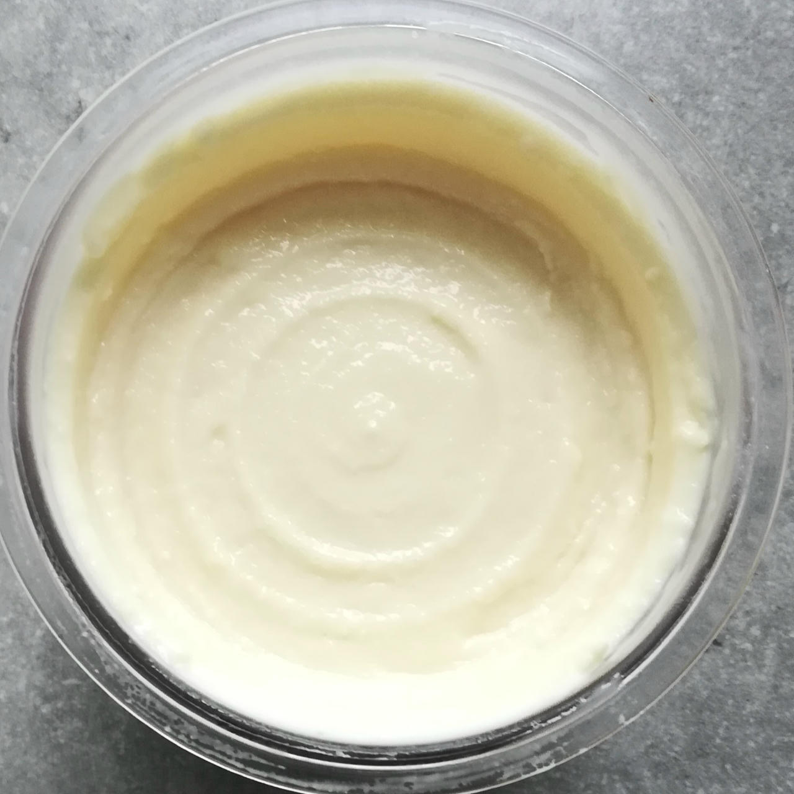

# Piña Colada (Deluxe)

> 🍍 *A tropical escape in every scoop.*

Creamy coconut meets juicy pineapple, with a splash of Jamaica rum for island warmth
— all blended with silky soy milk for a dairy-free indulgence.

> 🌿 **Vegan & Dairy-free** Recipe is using only coconut and soy.

Process on *Light Ice Cream*, then a scrape-down and a respin.  

> 
> 
> 
> 

Rating: 😋😋🍍🥥🥥 • Served with shaved chocolate and coco chips.

# INGREDIENTS

ℹ️ Brand names are in square brackets `[...]`.

**Prep**

  - _130ml_ Water (hot) • *alternative:* 200ml coconut milk 19.5%
  - _70g_ [Coconut Milk Powder 54% \[Green Essence\]](/ice-creamery/info/ingredients/#coconut-milk){target="_blank"}↗
  - _4g_ [Glycerol Monostearate (E471) \[Bulk\]](/ice-creamery/info/ingredients/#glycerol-monostearate-gms-e471){target="_blank"}↗ • *alternative:* lecithin

**Wet**

  - _225g_ Pineapple in juice [REWE] • Can = 227g
  - _150ml_ [Soy milk 1.6% (sugar-free) \[Berief\]](/ice-creamery/info/ingredients/#soy-milk){target="_blank"}↗
  - _40g_ [Jamaica Rum 43 vol%](/ice-creamery/info/ingredients/#alcohol-ethanol){target="_blank"}↗

**Dry**

  - _20g_ [SweEX (Erythritol + Xylitol 3:2)](/ice-creamery/info/ingredients/#sweex-erythritol-xylitol-blend){target="_blank"}↗ • *alternative:* 27g allulose or dextrose
  - _15g_ [Waxy Maize Starch (E1442) \[Ultratex\]](/ice-creamery/info/ingredients/#waxy-maize-starch-e1442){target="_blank"}↗ • dissolves easily; use 1-5%
  - _2g_ [Carboxymethyl Cellulose (CMC / E466) \[GoodBake\]](/ice-creamery/info/ingredients/#carboxymethyl-cellulose-cmc-e466){target="_blank"}↗ • *alternative:* guar gum (1:1)

**Fill to MAX**

  - _24ml_ [Soy milk 1.6% (sugar-free) \[Berief\]](/ice-creamery/info/ingredients/#soy-milk){target="_blank"}↗
  - _≈4 drops_ Flavor drops Vanilla (sucralose) [IronMaxx] • to taste

# DIRECTIONS

 1. Mix the coconut milk powder and the GMS in a medium-sized bowl.
 1. Add the hot water and whisk until clump-free.
 1. Add "wet" ingredients to empty Creami tub.
 1. Weigh and mix dry ingredients, easiest by adding to a jar with a secure lid and shaking vigorously.
 1. Pour into the tub and *QUICKLY* use an immersion blender on full speed to homogenize everything.
 1. Let blender run until thickeners are properly hydrated, up to 1-2 min. Or blend again after waiting that time.
 1. Add remaining ingredients (to the MAX line) and stir with a spoon.
 1. Put on the lid, freeze for 24h, then spin as usual. Flatten any humps before that.
 1. Process with RE-SPIN mode when not creamy enough after the first spin.

# NUTRITIONAL & OTHER INFO

- **Nutritional values per 100g/ml:** 100g; 130.1 kcal; fat 6.1g; carbs 15.0g; sugar 5.1g; protein 1.6g; salt 0.0g
- **Nutritional values per ½ Deluxe Tub:** 340g; 442.3 kcal; fat 20.7g; carbs 50.9g; sugar 17.3g; protein 5.5g; salt 0.2g
- **Nutritional values total:** 680g; 884.6 kcal; fat 41.3g; carbs 101.8g; sugar 34.6g; protein 11.0g; salt 0.3g
- **FPDF / [PAC](/ice-creamery/info/glossary/#potere-anti-congelante-pac){target="_blank"}↗ (target 20..30):** 31.48
- **Protein / Energy Ratio (ok=12%; hi=20%):** 4.98% • Low-Salt
- **Milk Solids Non-Fat ([MSNF](/ice-creamery/info/glossary/#milk-solids-not-fat-msnf){target="_blank"}↗, 7-11%):** 39.5g • 5.8%
- **Net carbs:** 81.8g • *∝ 5 servings@136g:* 16.4g • *∝ 3 servings@227g:* 27.3g • *energy ratio (low <20%):* 37%
