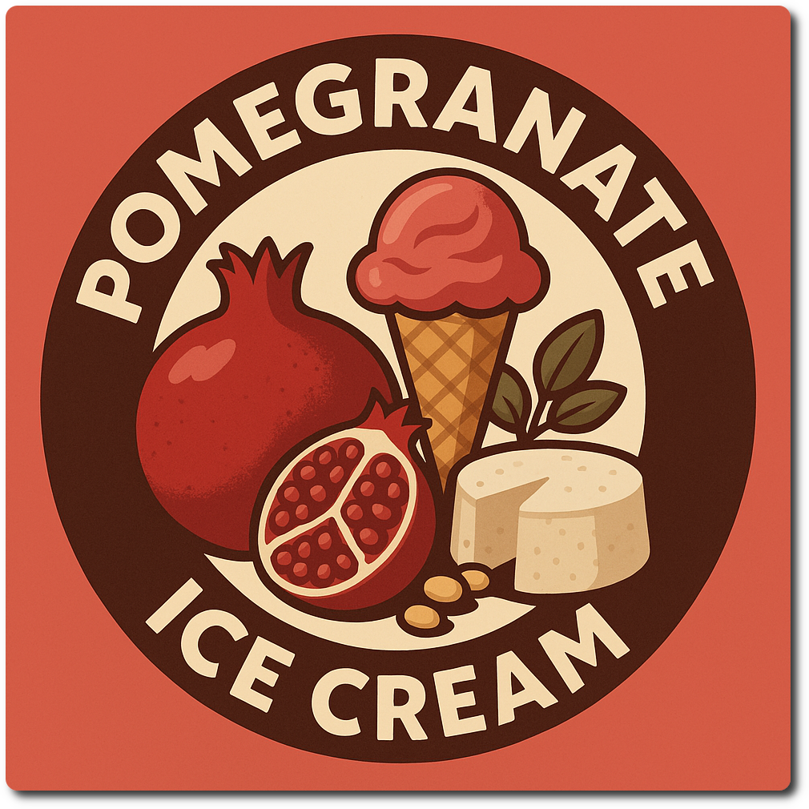
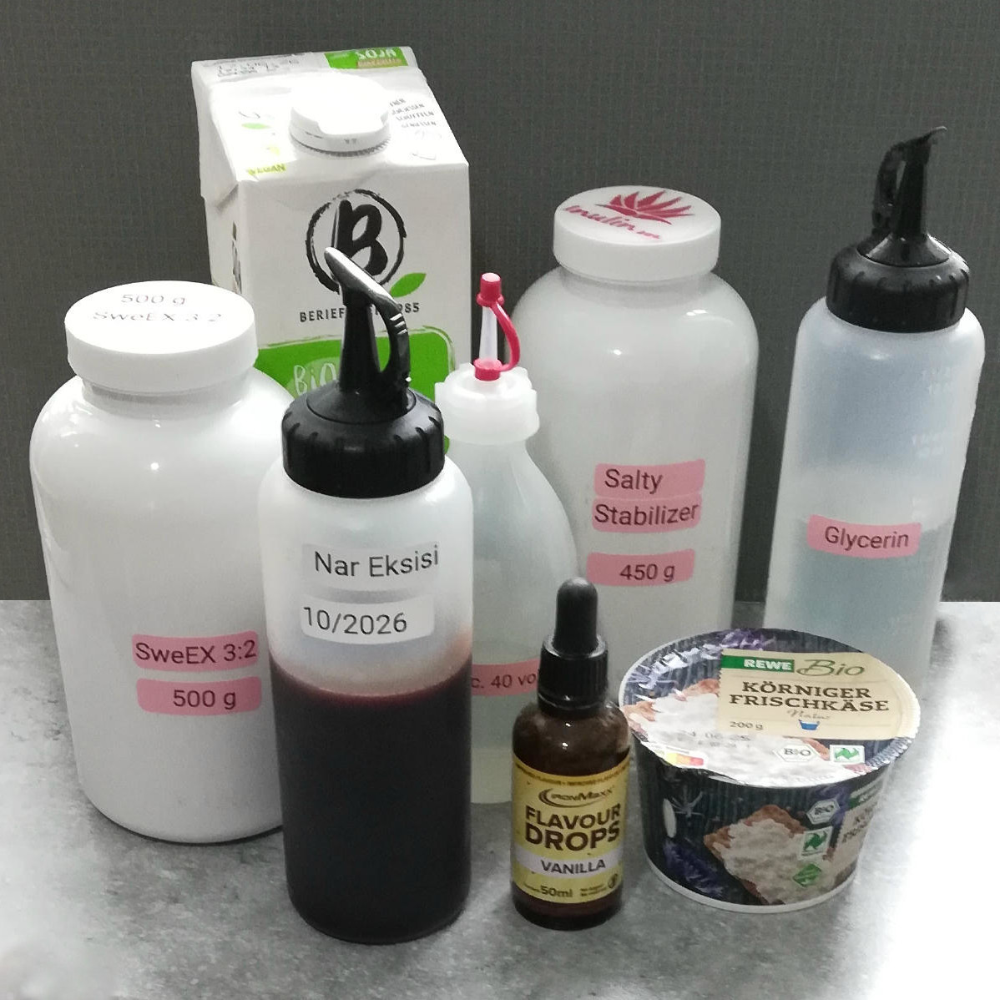
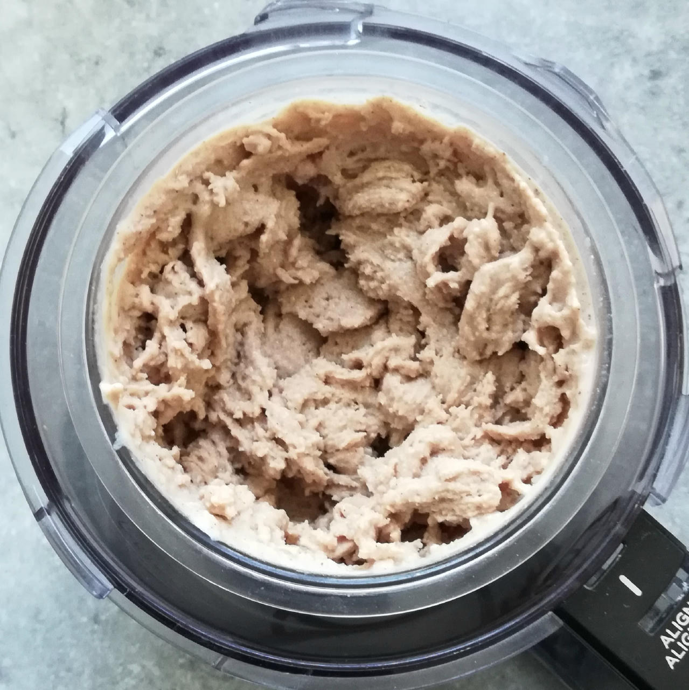
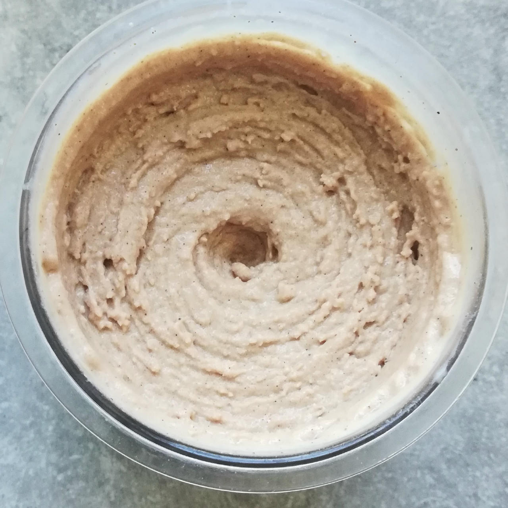
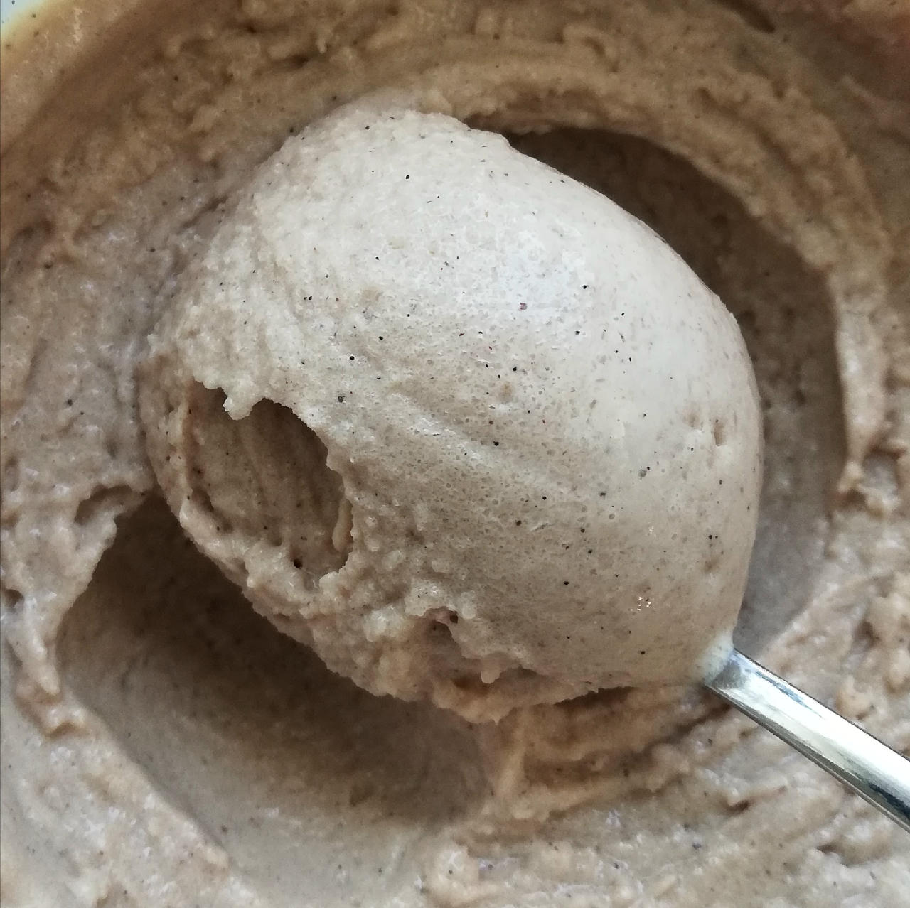

# Pomegranate Light (Deluxe)

Pomegranate ice cream based on pomegranate syrup (nar ekşisi), soy milk, and cottage cheese. Clocking in at 74 kcal / 100g and 48g net carbs.

> 

Process on *Sorbet*, [hold it shortly under running water](https://jhermann.github.io/ice-creamery/info/tips%2Btricks/#handling-of-icy-sides-bottom) *after* that
Then scrape down the sides, and process with mix-in.

> 
> 
> 

Rating: 😋😋😋🔴🔴

If you have access to it (North America), you can use 45g Allulose as sweetener,
instead of the sugar alcohols and for a few calories less.

# INGREDIENTS

ℹ️ Brand names are in square brackets `[...]`.

**Prep**

  - _100g_ [Cottage Cheese 4% \[REWE Bio\]](/ice-creamery/info/ingredients/#cottage-cheese){target="_blank"}↗
  - _100ml_ [Soy milk (sugar-free) \[Berief\]](/ice-creamery/info/ingredients/#soy-milk){target="_blank"}↗

**Wet**

  - _350ml_ [Soy milk (sugar-free) \[Berief\]](/ice-creamery/info/ingredients/#soy-milk){target="_blank"}↗
  - _50g_ Pomegranate syrup (nar ekşisi) [fersan] • 0.76 ml/g
  - _10g_ [Glycerin (E422, VG) \[hd-line\]](/ice-creamery/info/ingredients/#vegetable-glycerin-glycerol-vg-e422){target="_blank"}↗ • Sweetness = 60%; GI = 5; Density = 1.26 g/ml
  - _10g_ [Brandy or Vodka 40 vol%](/ice-creamery/info/ingredients/#alcohol-ethanol){target="_blank"}↗

**Dry**

  - _45g_ [SweEX (Erythritol + Xylitol 3:2)](/ice-creamery/info/ingredients/#sweex-erythritol-xylitol-blend){target="_blank"}↗ • POD ≈ 90%; GI < 7
  - _15g_ [Salty Stability \[Inulin / GMS / CMC / Guar / XG / Salt\]](/ice-creamery/S/Salty%20Stability/){target="_blank"}↗ • unsweetened “ICSv2”
  - _2g_ Vanilla Bean Powder [InterVanilla]

**Fill to MAX**

  - _38ml_ Water to MAX line
  - _≈2 drops_ Flavor drops Vanilla (sucralose) [IronMaxx] • to taste

# DIRECTIONS

 1. In an empty Creami tub, blend the cottage cheese with an equal amount of soy milk to a very creamy texture.
 1. Add the "wet" ingredients to it.
 1. Weigh and mix dry ingredients, easiest by adding to a jar with a secure lid and shaking vigorously.
 1. Pour into the tub and *QUICKLY* use an immersion blender on full speed to homogenize everything.
 1. Let blender run until thickeners are properly hydrated, up to 1-2 min. Or blend again after waiting that time.
 1. Add remaining ingredients (to the MAX line) and stir with a spoon.
 1. Put on the lid, freeze for 24h, then spin as usual. Flatten any humps before that.
 1. Process with RE-SPIN mode when not creamy enough after the first spin.

# NUTRITIONAL & OTHER INFO
- **Nutritional values per 100g/ml:** 100g; 74.3 kcal; fat 1.6g; carbs 15.2g; sugar 4.0g; protein 3.7g; salt 0.3g
- **Nutritional values per ½ Deluxe Tub:** 360g; 267.6 kcal; fat 5.9g; carbs 54.7g; sugar 14.4g; protein 13.4g; salt 0.9g
- **Nutritional values total:** 720g; 535.2 kcal; fat 11.8g; carbs 109.3g; sugar 28.8g; protein 26.7g; salt 1.9g
- **FPDF / [PAC](/ice-creamery/info/glossary/#potere-anti-congelante-pac){target="_blank"}↗ (target 20..30):** 30.75
- **Protein / Energy Ratio (ok=12%; hi=20%):** 19.99% • LOW-FAT • Low-Sugar
- **Milk Solids Non-Fat ([MSNF](/ice-creamery/info/glossary/#milk-solids-not-fat-msnf){target="_blank"}↗, 7-11%):** 34.0g • 4.7%
- **Net carbs:** 48.3g • *∝ 5 servings@144g:* 9.7g • *∝ 3 servings@240g:* 16.1g • *energy ratio (low <20%):* 36.1%
- **15g 'Salty Stability' is:** 11.0g Inulin • 1.8g Glycerol Monostearate (GMS / E471) • 0.9g Tylose powder (E466, Tylo, CMC) • 0.6g Guar gum (E412) • 0.5g Salt • 0.2g Xanthan gum (E415, XG).
