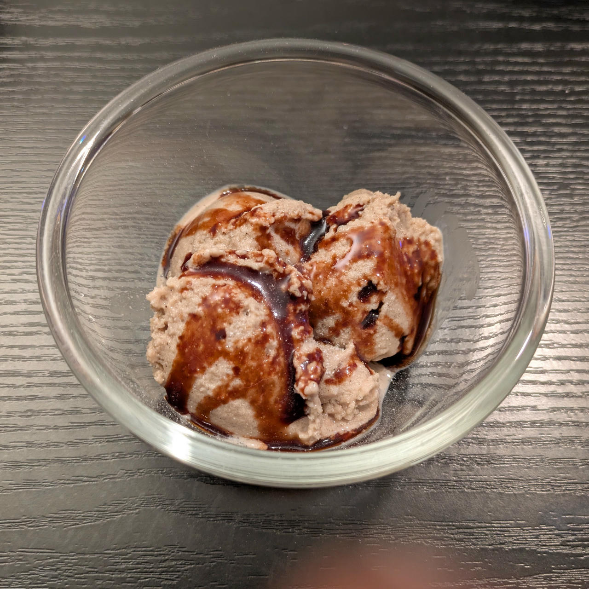

# Pomegranate Light (Deluxe)

Pomegranate ice cream based on pomegranate syrup (nar ekşisi), buttermilk, and cottage cheese. Clocking in at 74 kcal / 100g and 63g net carbs.

> 

Process on *Sorbet*, [hold it shortly under running water](https://jhermann.github.io/ice-creamery/info/tips%2Btricks/#handling-of-icy-sides-bottom) *after* that
Then scrape down the sides, and process with mix-in.

> 
> 
> 

> 

Rating: 😋😋😋🔴🔴

# INGREDIENTS

ℹ️ Brand names are in square brackets `[...]`.

**Wet**

  - _75g_ [Cottage Cheese 4% \[REWE Bio\]](/ice-creamery/info/ingredients/#cottage-cheese){target="_blank"}↗
  - _490ml_ Buttermilk 1% [REWE]
  - _50g_ Pomegranate syrup (nar ekşisi) [fersan] • 0.76 ml/g
  - _10g_ [Glycerin (E422, VG) \[hd-line\]](/ice-creamery/info/ingredients/#vegetable-glycerin-glycerol-vg-e422){target="_blank"}↗ • *alternative:* 35g lactose

**Dry**

  - _45g_ [SweEX (Erythritol + Xylitol 3:2)](/ice-creamery/info/ingredients/#sweex-erythritol-xylitol-blend){target="_blank"}↗ • *alternative:* 60g allulose or dextrose
  - _10g_ [Salty Stability \[Inulin / GMS / CMC / Guar / XG / Salt\]](/ice-creamery/S/Salty%20Stability/){target="_blank"}↗ • unsweetened “ICSv2”

**Fill to MAX**

  - _≈2 drops_ Flavor drops Vanilla (sucralose) [IronMaxx] • to taste

# DIRECTIONS

 1. In an empty Creami tub, blend the cottage cheese with an equal amount of soy milk to a very creamy texture.
 1. Add the "wet" ingredients to it.
 1. Weigh and mix dry ingredients, easiest by adding to a jar with a secure lid and shaking vigorously.
 1. Pour into the tub and *QUICKLY* use an immersion blender on full speed to homogenize everything.
 1. Let blender run until thickeners are properly hydrated, up to 1-2 min. Or blend again after waiting that time.
 1. Add remaining ingredients (to the MAX line) and stir with a spoon.
 1. Put on the lid, freeze for 24h, then spin as usual. Flatten any humps before that.
 1. Process with RE-SPIN mode when not creamy enough after the first spin.

# NUTRITIONAL & OTHER INFO

- **Nutritional values per 100g/ml:** 100g; 73.8 kcal; fat 0.9g; carbs 17.6g; sugar 7.0g; protein 4.0g; salt 0.3g
- **Nutritional values per ½ Deluxe Tub:** 340g; 250.9 kcal; fat 2.9g; carbs 60.0g; sugar 23.8g; protein 13.6g; salt 1.0g
- **Nutritional values total:** 680g; 501.8 kcal; fat 5.9g; carbs 119.9g; sugar 47.6g; protein 27.2g; salt 1.9g
- **FPDF / [PAC](/ice-creamery/info/glossary/#potere-anti-congelante-pac){target="_blank"}↗ (target 20..30):** 31.03
- **Protein / Energy Ratio (ok=12%; hi=20%):** 21.69% • LOW-FAT • Hi-Protein
- **Milk Solids Non-Fat ([MSNF](/ice-creamery/info/glossary/#milk-solids-not-fat-msnf){target="_blank"}↗, 7-11%):** 53.7g • 7.9%
- **Net carbs:** 62.6g • *∝ 5 servings@136g:* 12.5g • *∝ 3 servings@227g:* 20.9g • *energy ratio (low <20%):* 49.9%
- **Aug 23, 2025:** Reformulation with Buttermilk & Cottage Cheese (no curdling)
- **10g 'Salty Stability' is:** 7.3g Inulin • 1.2g Glycerol Monostearate (GMS / E471) • 0.6g Tylose powder (E466, Tylo, CMC) • 0.4g Guar gum (E412) • 0.33g Salt • 0.13g Xanthan gum (E415, XG).
