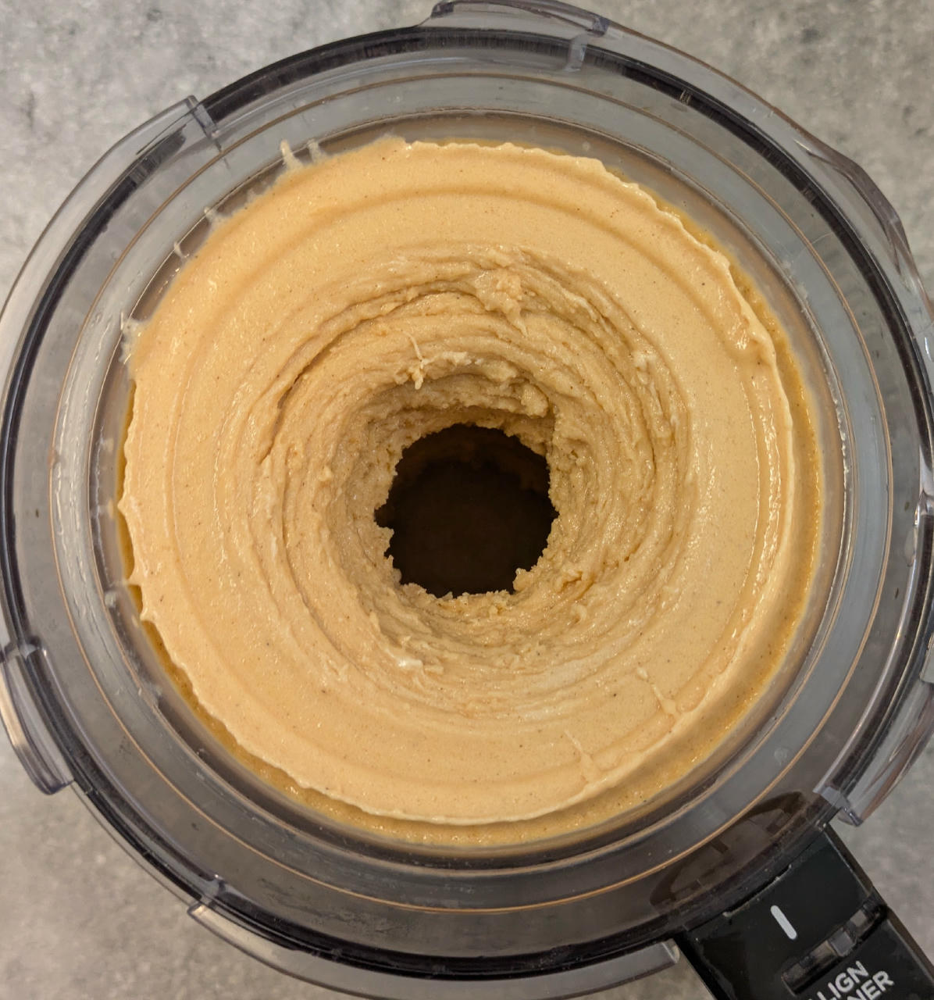
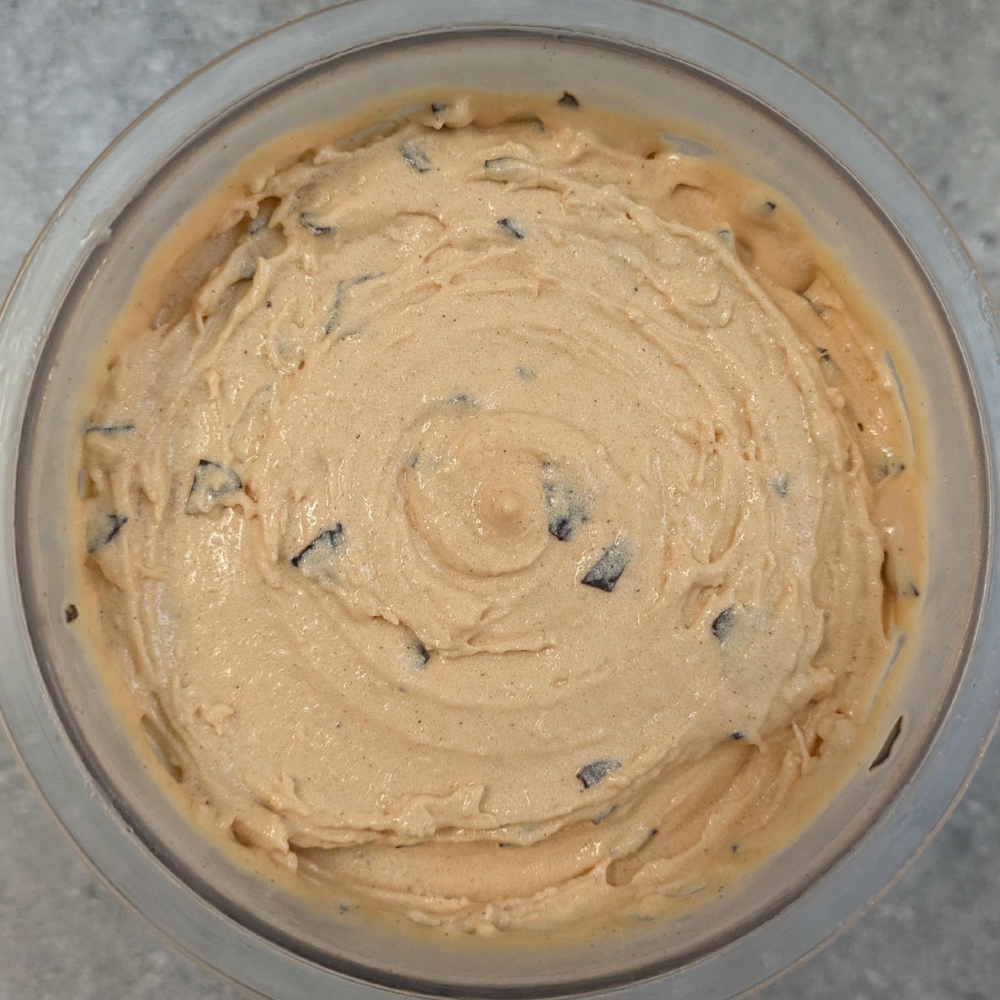
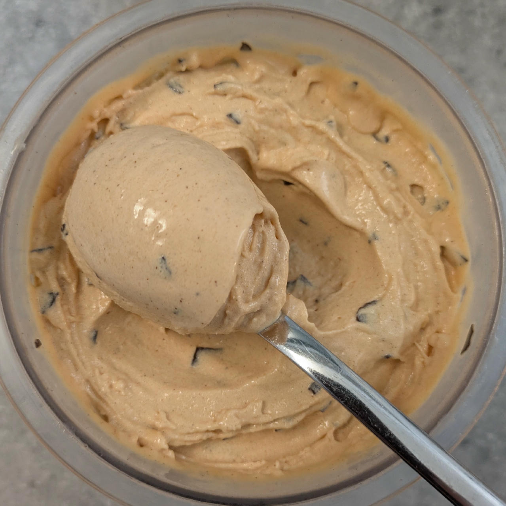
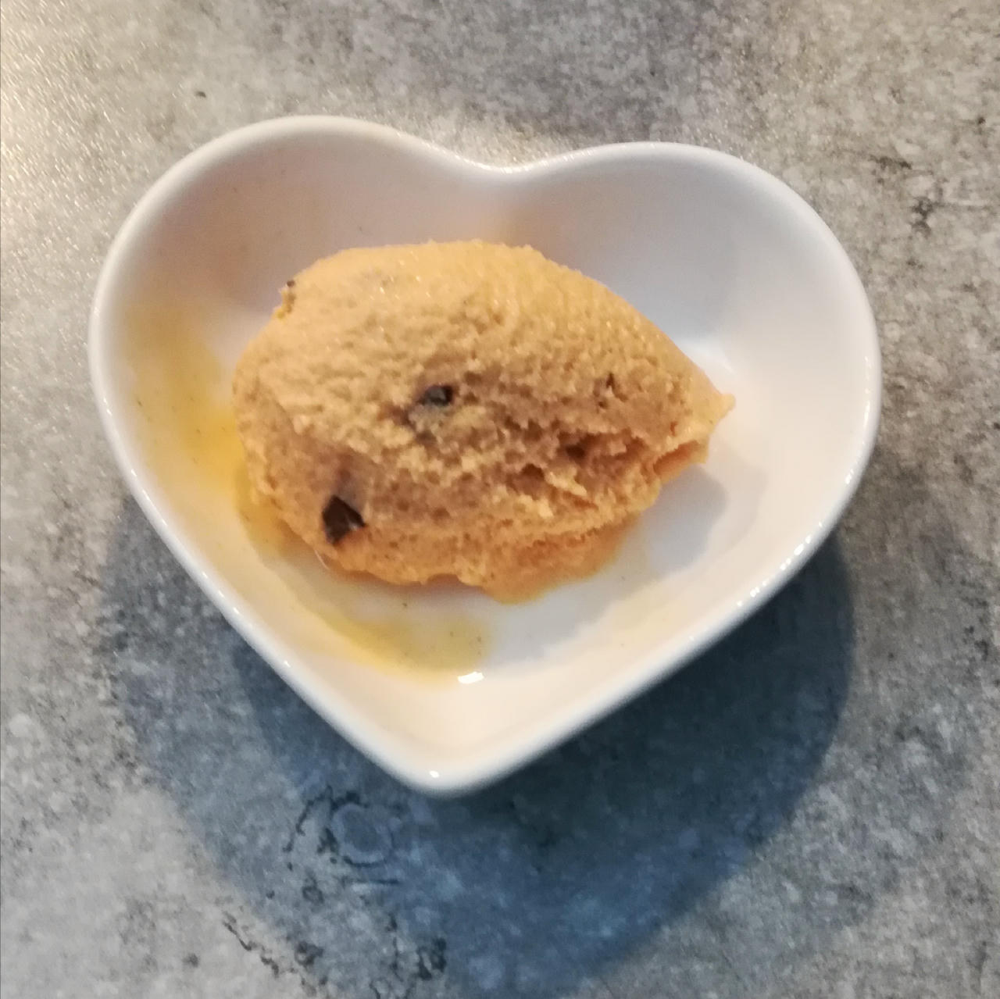

# Pumpkin Spice Gelato (Deluxe)

This pumpkin spice ice cream is a high-protein, dairy-light treat built for creamy texture and balanced nutrition.

Inspired by [this Polar Ice Creamery video](https://www.youtube.com/watch?v=liA8HlIivC4).

Spin on “Light Ice Cream”, scrape down, and respin or mix-in if needed.

> 
> 
> 
> 

Rating: 😋🎃🫚🥛🍫 (with dark chocolate flakes as a mix-in, soft and creamy)

# INGREDIENTS

ℹ️ Brand names are in square brackets `[...]`.

**Prep**

  - _180ml_ [Soy milk 1.6% (sugar-free) \[Berief\]](/ice-creamery/info/ingredients/#soy-milk){target="_blank"}↗ • use any other preferred milk (~2% fat)
  - _4g_ Pumpkin spice [Just Spices]
  - _3g_ Anatto Seed Powder [Naturix24] • *optional*, for color

**Wet**

  - _280ml_ [Soy milk 1.6% (sugar-free) \[Berief\]](/ice-creamery/info/ingredients/#soy-milk){target="_blank"}↗ • use any other preferred milk (~2% fat)
  - _15g_ [Glycerin (E422, VG) \[hd-line\]](/ice-creamery/info/ingredients/#vegetable-glycerin-glycerol-vg-e422){target="_blank"}↗
  - _8g_ [Brandy or Vodka 40 vol%](/ice-creamery/info/ingredients/#alcohol-ethanol){target="_blank"}↗ • *alternative:* 6g (additional) VG for a sober recipe

**Dry**

  - _40g_ [SweEX (Erythritol + Xylitol 3:2)](/ice-creamery/info/ingredients/#sweex-erythritol-xylitol-blend){target="_blank"}↗ • *alternative:* 53g allulose or dextrose
  - _15g_ [Inulin \[Vit4ever\]](/ice-creamery/info/ingredients/#inulin){target="_blank"}↗ • Sweetness = 8%; GI ~= 0
  - _15g_ [Skim milk powder 1:10 (SMP) \[Vita2You\]](/ice-creamery/info/ingredients/#skim-milk-powder-smp){target="_blank"}↗
  - _15g_ [Whey + Casein protein (grass-fed) \[Vilgain\]](/ice-creamery/info/ingredients/#whey-protein){target="_blank"}↗ • with stevia
  - _2g_ [Glycerol Monostearate (E471) \[Bulk\]](/ice-creamery/info/ingredients/#glycerol-monostearate-gms-e471){target="_blank"}↗ • *alternative:* lecithin
  - _1.5g_ [Guar gum (E412)](/ice-creamery/info/ingredients/#guar-gum-e412){target="_blank"}↗
  - _0.5g_ [Xanthan gum (E415, XG)](/ice-creamery/info/ingredients/#xanthan-gum-xg-e415){target="_blank"}↗ • 1tsp ≈ 2.8g
  - _1g_ Salt

**Fill to MAX**

  - _100ml_ Cream 32% [REWE Beste Wahl]
  - _≈5 drops_ Flavor drops Vanilla (sucralose) [IronMaxx] • to taste

**Mix-ins**

  - _20g_ [Dark chocolate shavings \[Ruf\]](/ice-creamery/info/ingredients/#chocolate-shavings){target="_blank"}↗ • not counted in the base macros [101kcal, 9.5g sugar]

# DIRECTIONS

 1. Heat part of the milk to about 60°C, add the spice, and let it infuse in the fridge for about an hour.
 1. Filter the spicy milk through a fine mesh into an empty Creami tub.
 1. Heat the rest of the milk to about 60°C.
 1. Whisk in the dry ingredients, after mixing them together first.
 1. Pour it into the tub to the spicy milk, add the other ‘wet’ ingredients, and blend to emulsify and homogenize.
 1. Add remaining ingredients (to the MAX line) and stir with a spoon.
 1. Put on the lid, freeze for 24h, then spin as usual. Flatten any humps before that.
 1. Process with RE-SPIN mode when not creamy enough after the first spin.
 1. Process with MIX-IN after adding mix-ins evenly. For that, add partial amounts into a hole going down to the bottom, and fold the ice cream over, building pockets of mix-ins.

# NUTRITIONAL & OTHER INFO

- **Nutritional values per 100g/ml:** 100g; 110.3 kcal; fat 6.0g; carbs 13.2g; sugar 2.2g; protein 5.0g; salt 0.3g
- **Nutritional values per ½ Deluxe Tub:** 340g; 375.1 kcal; fat 20.4g; carbs 44.9g; sugar 7.4g; protein 17.0g; salt 0.9g
- **Nutritional values total:** 680g; 750.1 kcal; fat 40.8g; carbs 89.8g; sugar 14.7g; protein 34.1g; salt 1.8g
- **FPDF / [PAC](/ice-creamery/info/glossary/#potere-anti-congelante-pac){target="_blank"}↗ (target 20..30):** 31.01
- **Protein / Energy Ratio (ok=12%; hi=20%):** 18.17% • Low-Sugar
- **Milk Solids Non-Fat ([MSNF](/ice-creamery/info/glossary/#milk-solids-not-fat-msnf){target="_blank"}↗, 7-11%):** 52.4g • 7.7%
- **Net carbs:** 28.9g • *∝ 5 servings@136g:* 5.8g • *∝ 3 servings@227g:* 9.6g • *energy ratio (low <20%):* 15.4%
