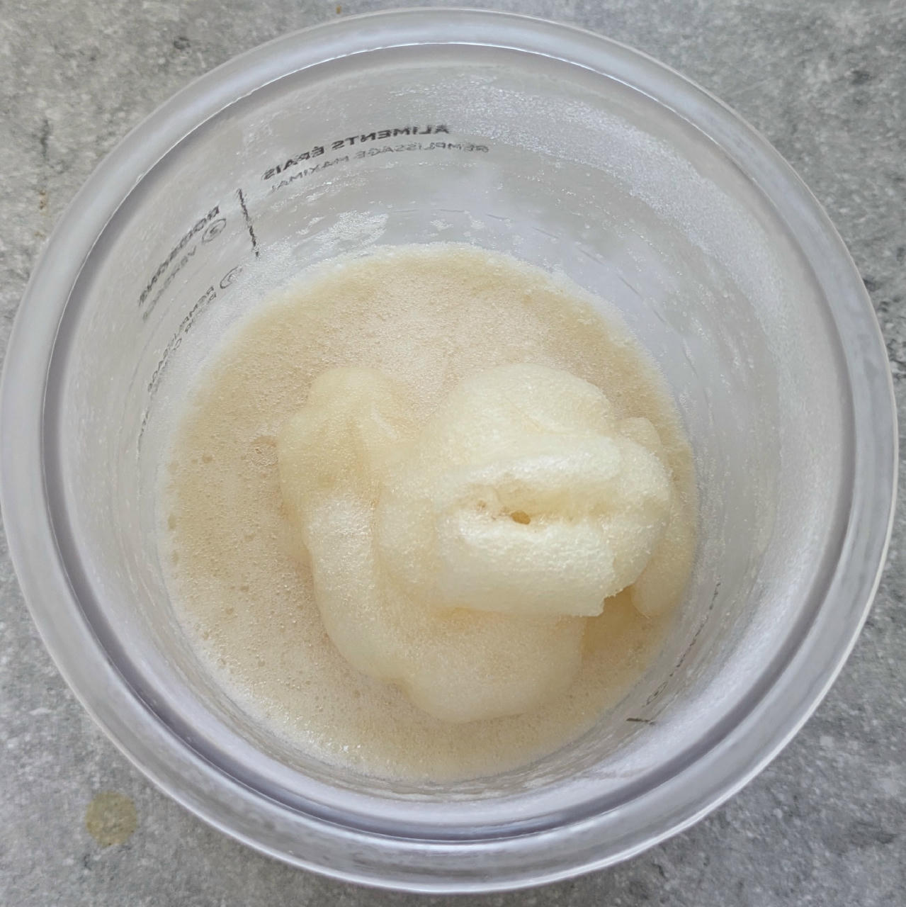
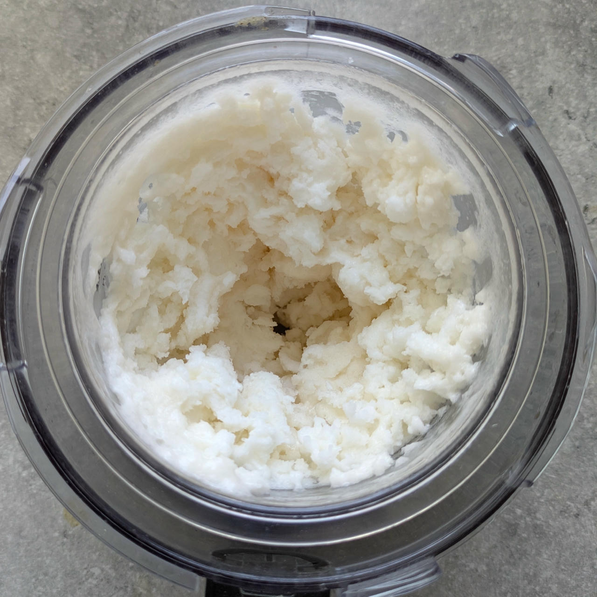
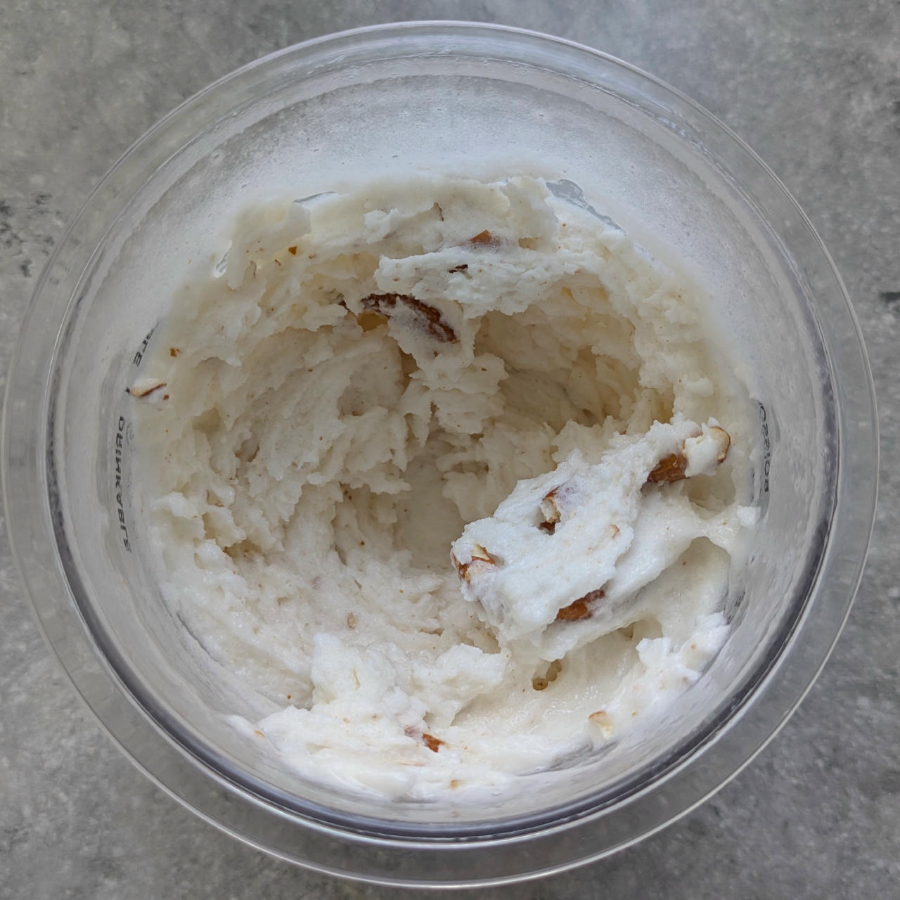
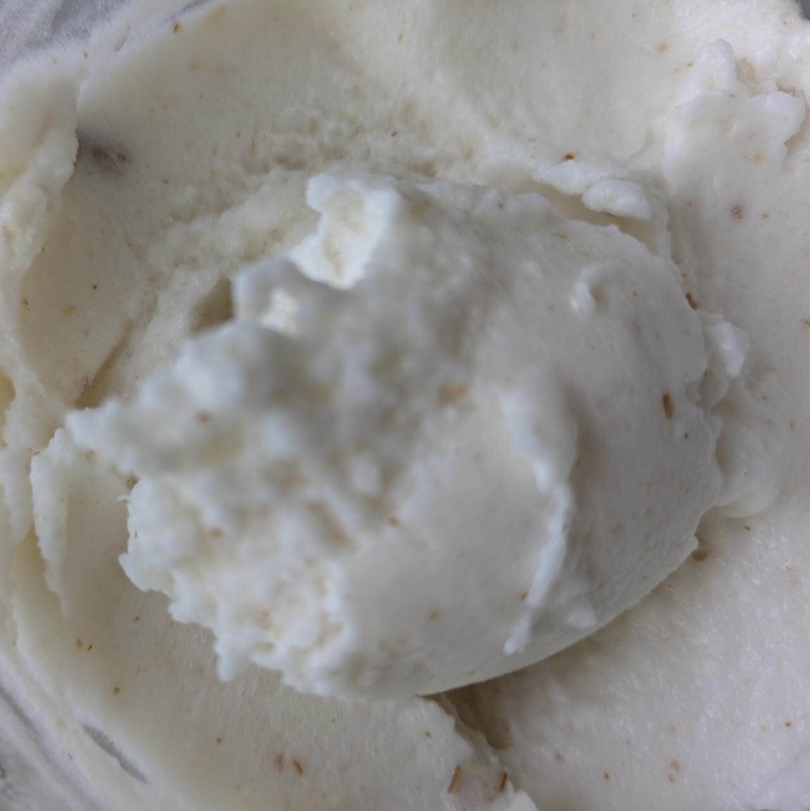
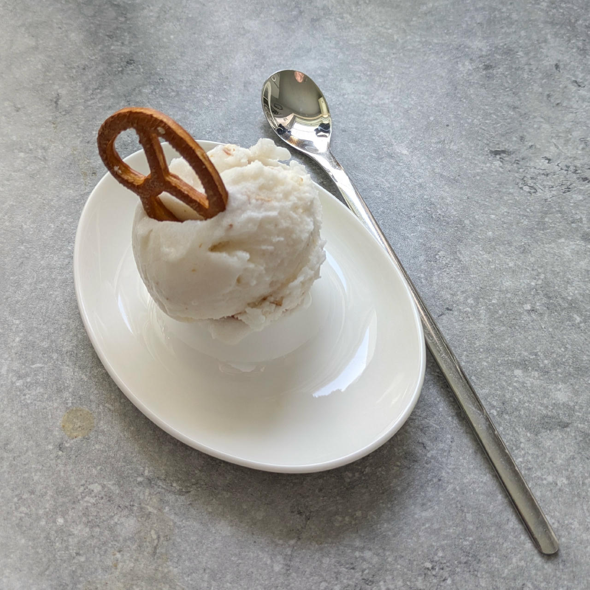

# Radler Zäpfle (Deluxe)

Wheat beer mixed 1:1 with lemonade (which is a common summer drink in southern Germany) as a base.

You can also try this with similar fruity beverages, like Berliner Weiße (wheat beer combined with fruit syrup) or Belgian Früli (strawberry beer; leave out the VG).

> 🌿 **Vegan & Dairy-free**

The beer comes in 0.33l bottles, it foams up when you mix in the additional ingredients. Therefor filling the container only half is recommended.

> 
> 

The base developed a sizable but very soft and crumbly hump. Spin on “Sorbet”, followed by a scrape-down and mix-in. Comes out very soft and needs 1-2h refreezing before serving.

> 
> 

> 
> 

Served with a decorative pretzel (same as the mix-in).

> 

Rating: 😋🍺🍺🍋🍋

# INGREDIENTS

ℹ️ Brand names are in square brackets `[...]`.

**Wet**

  - _330ml_ Rothaus Radler Zäpfle 2.4 vol% (0.33l)
  - _10g_ [Glycerin (E422, VG) \[hd-line\]](/ice-creamery/info/ingredients/#vegetable-glycerin-glycerol-vg-e422){target="_blank"}↗ • POD = 60%; GI = 5; Density = 1.26 g/ml
  - _10ml_ Lemon juice

**Dry**

  - _15g_ [Inulin \[Vit4ever\]](/ice-creamery/info/ingredients/#inulin){target="_blank"}↗ • Sweetness = 8%; GI ~= 0
  - _15g_ [Soy protein isolate (nature) \[Powerstar\]](/ice-creamery/info/ingredients/#soy-protein-isolate){target="_blank"}↗ • 1kg bag, unsweetened, unflavored
  - _1g_ Salt
  - _1g_ [Xanthan gum (E415, XG)](/ice-creamery/info/ingredients/#xanthan-gum-xg-e415){target="_blank"}↗ • 1tsp ≈ 2.8g

**Mix-ins**

  - _10g_ Salty Prezels [Huober/REWE] • 1 pretzel = 2g; add broken into 2-3 pieces as a mix-in [40kcal, 7.2g carbs]

**Optional**

  - _≈3 drops_ Flavor drops Peach / Maracuja (sucralose) [IronMaxx] • to taste

# DIRECTIONS

 1. Pour beer into empty Creami tub, add other wet ingredients.
 1. Weigh and mix dry ingredients in a small bowl, ideally on a jeweller’s scale.
 1. Vigorously whisk the dry stuff into the wet stuff.
 1. Optionally, add flavor drops, to taste.
 1. Let defoam in the fridge for about 2 hours, give it a final stir.
 1. Put on the lid, freeze for 24h, then spin as usual. Flatten any humps before that.
 1. Process with RE-SPIN mode when not creamy enough after the first spin.
 1. Process with MIX-IN after adding mix-ins evenly. For that, add partial amounts into a hole going down to the bottom, and fold the ice cream over, building pockets of mix-ins.

# NUTRITIONAL & OTHER INFO
- **Nutritional values per 100g/ml:** 100g; 64.2 kcal; fat 0.5g; carbs 11.3g; sugar 4.5g; protein 3.5g; salt 0.4g
- **Nutritional values per ½ Deluxe Tub:** 360g; 231.1 kcal; fat 1.7g; carbs 40.7g; sugar 16.2g; protein 12.8g; salt 1.3g
- **Nutritional values total:** 382g; 245.2 kcal; fat 1.8g; carbs 43.2g; sugar 17.2g; protein 13.6g; salt 1.4g
- **FPDF / [PAC](/ice-creamery/info/glossary/#potere-anti-congelante-pac){target="_blank"}↗ (target 20..30):** 30.07
- **Protein / Energy Ratio (ok=12%; hi=20%):** 22.12% • LOW-FAT • Low-Sugar • Hi-Protein
- **Milk Solids Non-Fat ([MSNF](/ice-creamery/info/glossary/#milk-solids-not-fat-msnf){target="_blank"}↗, 7-11%):** 14.0g • 3.7%
- **Net carbs:** 24.9g • *∝ 5 servings@76g:* 5g • *∝ 3 servings@127g:* 8.3g
- **Jul 5, 2025:** Added more solids
