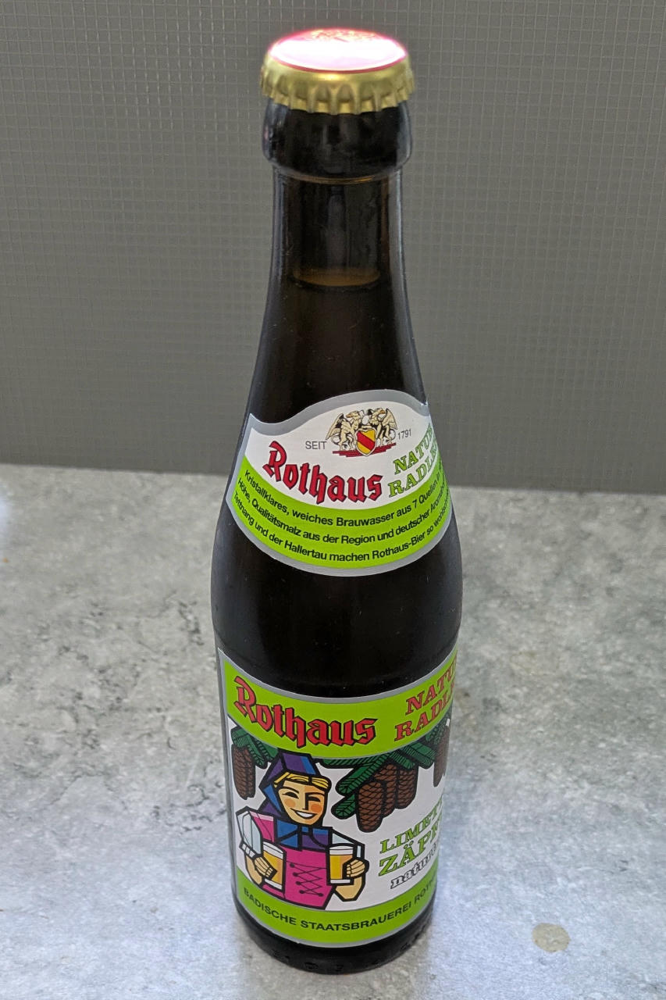

# Radler Zäpfle (Deluxe)

Wheat beer mixed 1:1 with lemonade (which is a common summer drink in southern Germany) as a base.

You can also try this with similar fruity beverages,
like Berliner Weiße (wheat beer combined with fruit syrup) or Belgian Früli (strawberry beer; leave out the VG).

> 🌿 **Vegan & Dairy-free**

Spin on “Sorbet”, scrape down, and re-mix.

> 
> 

Rating: 😋🍺🍋 (untested)

# INGREDIENTS

ℹ️ Brand names are in square brackets `[...]`.

**Wet**

  - _330ml_ Rothaus Radler Zäpfle 2.4 vol% (0.33l)
  - _10g_ [Glycerin (E422, VG) \[hd-line\]](/ice-creamery/info/ingredients/#vegetable-glycerin-glycerol-vg-e422){target="_blank"}↗ • POD = 60%; GI = 5; Density = 1.26 g/ml
  - _10ml_ Lemon juice

**Dry**

  - _10g_ [Inulin \[Vit4ever\]](/ice-creamery/info/ingredients/#inulin){target="_blank"}↗ • Sweetness = 8%; GI ~= 0
  - _0.70g_ [Xanthan gum (E415, XG)](/ice-creamery/info/ingredients/#xanthan-gum-xg-e415){target="_blank"}↗ • 1tsp ≈ 2.8g
  - _1.30g_ Salt

**Mix-ins**

  - _10g_ Salty Prezels [Huober/REWE] • 1 pretzel = 2g; add whole as a mix-in [40kcal, 7.2g carbs]

**Optional**

  - _≈3 drops_ Flavor drops Peach / Maracuja (sucralose) [IronMaxx] • to taste

# DIRECTIONS

 1. Pour beer into empty Creami tub, add other wet ingredients.
 1. Weigh and mix dry ingredients in a small bowl, ideally on a jeweller’s scale.
 1. Vigorously whisk the dry stuff into the wet stuff.
 1. Optionally, add flavor drops, to taste.
 1. Let defoam in the fridge for about 2 hours, give it a final stir.
 1. Put on the lid, freeze for 24h, then spin as usual. Flatten any humps before that.
 1. Process with RE-SPIN mode when not creamy enough after the first spin.
 1. Process with MIX-IN after adding mix-ins evenly. For that, add partial amounts into a hole going down to the bottom, and fold the ice cream over, building pockets of mix-ins.

# NUTRITIONAL & OTHER INFO
- **Nutritional values per 100g/ml:** 100g; 49.2 kcal; fat 0.5g; carbs 10.5g; sugar 4.6g; protein 0.0g; salt 0.4g
- **Nutritional values per ½ Deluxe Tub:** 360g; 177.0 kcal; fat 1.7g; carbs 37.8g; sugar 16.7g; protein 0.1g; salt 1.3g
- **Nutritional values total:** 362g; 177.9 kcal; fat 1.7g; carbs 38.0g; sugar 16.8g; protein 0.1g; salt 1.3g
- **FPDF / [PAC](/ice-creamery/info/glossary/#potere-anti-congelante-pac){target="_blank"}↗ (target 20..30):** 31.95
- **Protein / Energy Ratio (ok=12%; hi=20%):** 0.16% • LOW-FAT • Low-Sugar
- **Milk Solids Non-Fat ([MSNF](/ice-creamery/info/glossary/#milk-solids-not-fat-msnf){target="_blank"}↗, 7-11%):** 0.0g • 0.0%
- **Net carbs:** 24.1g • *∝ 5 servings@72g:* 4.8g • *∝ 3 servings@121g:* 8g
