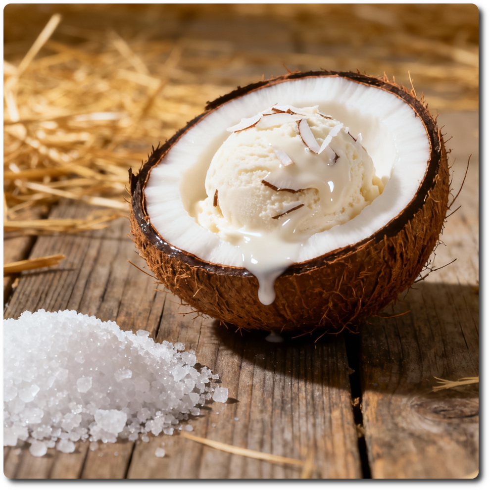
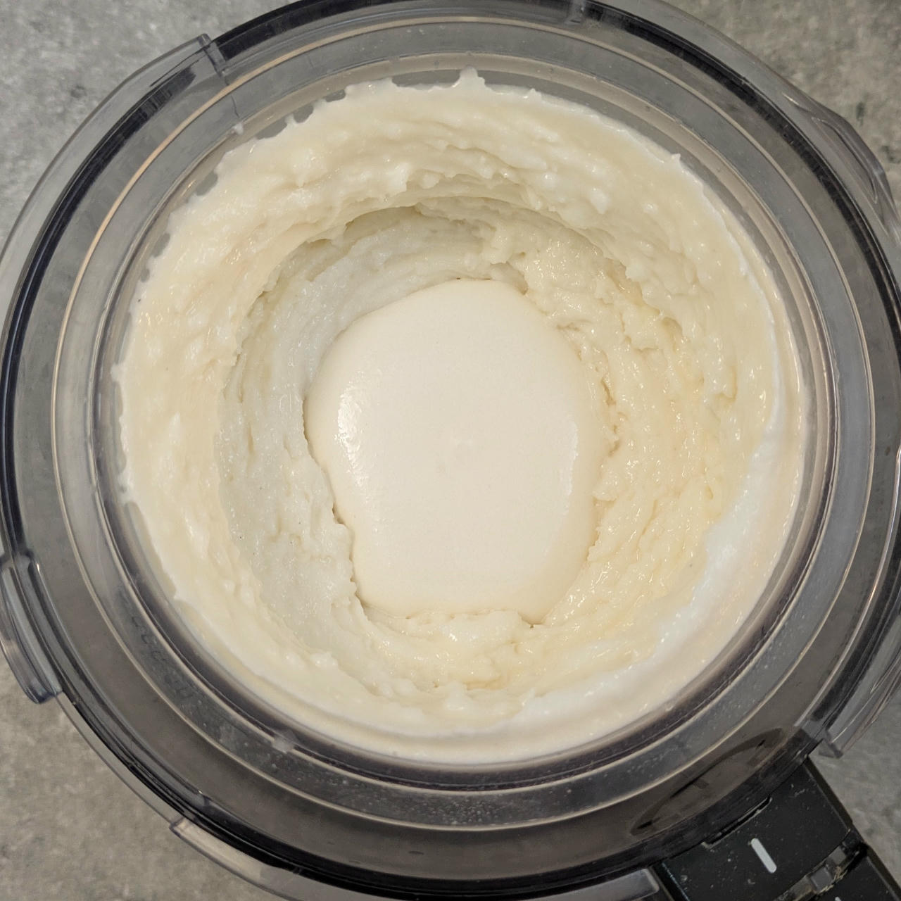

# S&S Coconut (Deluxe)

Adapts the [S&S Light (Deluxe)](/ice-creamery/S/S%26S%20Light%20%28Deluxe%29/) recipe by
replacing the dairy cream with reconstituted coconut cream.

Process on *Light Ice Cream*, scrape-down, and then a mix-in or respin as needed.

> 

Rating: 😋😋🥥🥥🍫  (very soft after one spin, manually added dark chocolate flakes)

# INGREDIENTS

ℹ️ Brand names are in square brackets `[...]`.

**Prep**

  - _140ml_ Water (~85°C) • *alternative:* 210ml coconut milk 18.5%
  - _70g_ [Coconut Milk Powder 54% \[Green Essence\]](/ice-creamery/info/ingredients/#coconut-milk){target="_blank"}↗
  - _1.80g_ [Glycerol Monostearate (E471) \[Bulk\]](/ice-creamery/info/ingredients/#glycerol-monostearate-gms-e471){target="_blank"}↗ • *alternative:* lecithin

**Wet**

  - _350ml_ [Soy milk 1.6% (sugar-free) \[Berief\]](/ice-creamery/info/ingredients/#soy-milk){target="_blank"}↗ • use any other preferred milk (~2% fat)
  - _17g_ [Glycerin (E422, VG) \[hd-line\]](/ice-creamery/info/ingredients/#vegetable-glycerin-glycerol-vg-e422){target="_blank"}↗ • POD = 60%; GI = 5; Density = 1.26 g/ml

**Dry**

  - _45g_ [SweEX (Erythritol + Xylitol 3:2)](/ice-creamery/info/ingredients/#sweex-erythritol-xylitol-blend){target="_blank"}↗ • *alternative:* 60g allulose or dextrose
  - _20g_ [Inulin \[Vit4ever\]](/ice-creamery/info/ingredients/#inulin){target="_blank"}↗ • Sweetness = 8%; GI ~= 0
  - _20g_ [Skim milk powder 1:10 (SMP) \[Vita2You\]](/ice-creamery/info/ingredients/#skim-milk-powder-smp){target="_blank"}↗
  - _20g_ [Whey + Casein protein (grass-fed) \[Vilgain\]](/ice-creamery/info/ingredients/#whey-protein){target="_blank"}↗ • with stevia
  - _1g_ Salt
  - _1g_ [Xanthan gum (E415, XG)](/ice-creamery/info/ingredients/#xanthan-gum-xg-e415){target="_blank"}↗ • 1tsp ≈ 2.8g

**Adjust sweetness**

  - _≈3 drops_ Flavor drops “Natural” (stevia) [Nick’s] • to taste • unflavored

# DIRECTIONS

 1. For the base, mix the coconut milk powder and the GMS in a medium-sized bowl.
 1. Add the hot water and whisk until clump-free.
 1. Add "wet" ingredients to empty Creami tub, including the prepared coconut milk.
 1. Weigh and mix dry ingredients, easiest by adding to a jar with a secure lid and shaking vigorously.
 1. Pour into the tub and *QUICKLY* use an immersion blender on full speed to homogenize everything.
 1. Let blender run until thickeners are properly hydrated, up to 1-2 min. Or blend again after waiting that time.
 1. Add remaining ingredients and stir with a spoon.
 1. For better results, let the base age in the fridge (covered, lid on), for a few hours or over night. This helps flavor development and gum hydration, especially with unheated bases.
 1. Freeze for 24h with lid on, then spin as usual. Flatten any humps before that.
 1. Process with RE-SPIN mode when not creamy enough after the first spin.

# NUTRITIONAL & OTHER INFO

- **Nutritional values per 100g/ml:** 100g; 127.1 kcal; fat 6.6g; carbs 18.2g; sugar 2.0g; protein 5.5g; salt 0.3g
- **Nutritional values per ½ Deluxe Tub:** 340g; 432.0 kcal; fat 22.4g; carbs 61.8g; sugar 6.8g; protein 18.8g; salt 0.9g
- **Nutritional values total:** 686g; 871.4 kcal; fat 45.2g; carbs 124.6g; sugar 13.7g; protein 37.9g; salt 1.7g
- **FPDF / [PAC](/ice-creamery/info/glossary/#potere-anti-congelante-pac){target="_blank"}↗ (target 20..30):** 30.21
- **Protein / Energy Ratio (ok=12%; hi=20%):** 17.41% • Low-Sugar
- **Milk Solids Non-Fat ([MSNF](/ice-creamery/info/glossary/#milk-solids-not-fat-msnf){target="_blank"}↗, 7-11%):** 83.4g • 12.2%
- **Net carbs:** 53.3g • *∝ 5 servings@137g:* 10.7g • *∝ 3 servings@229g:* 17.8g • *energy ratio (low <20%):* 24.5%
