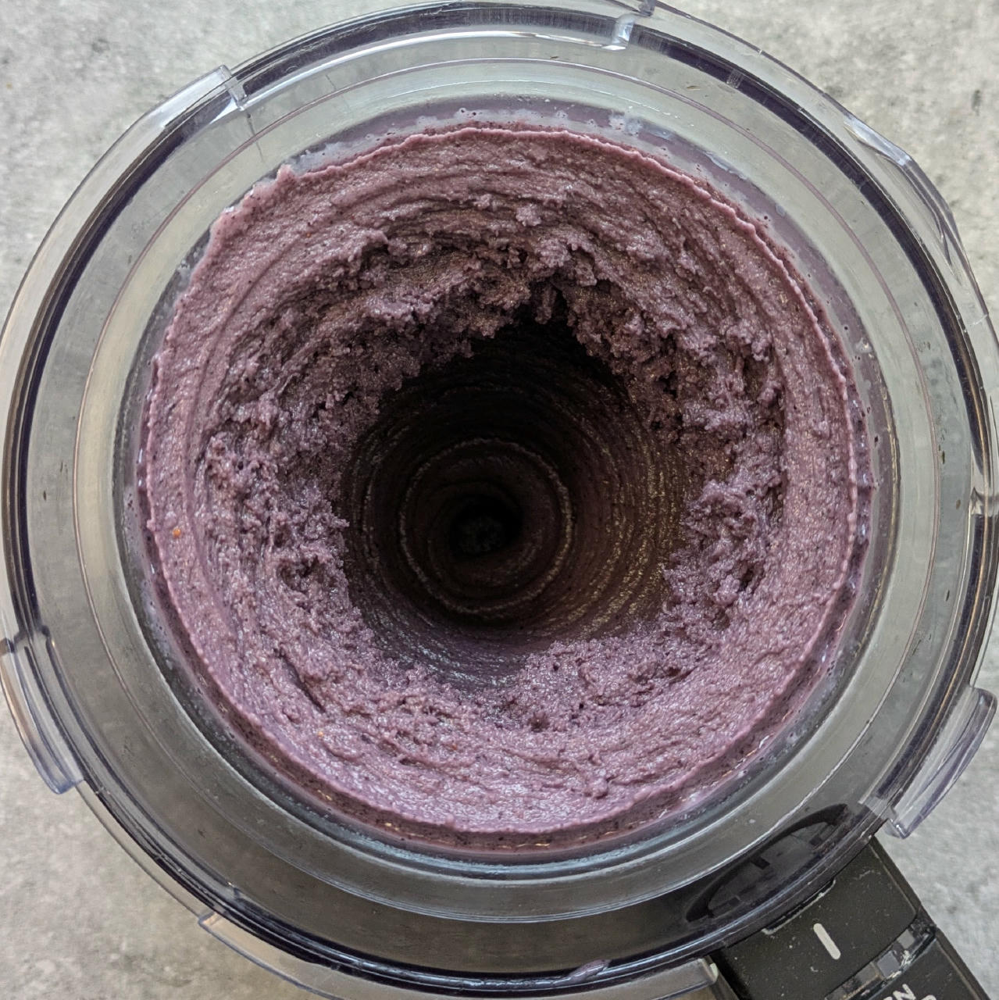
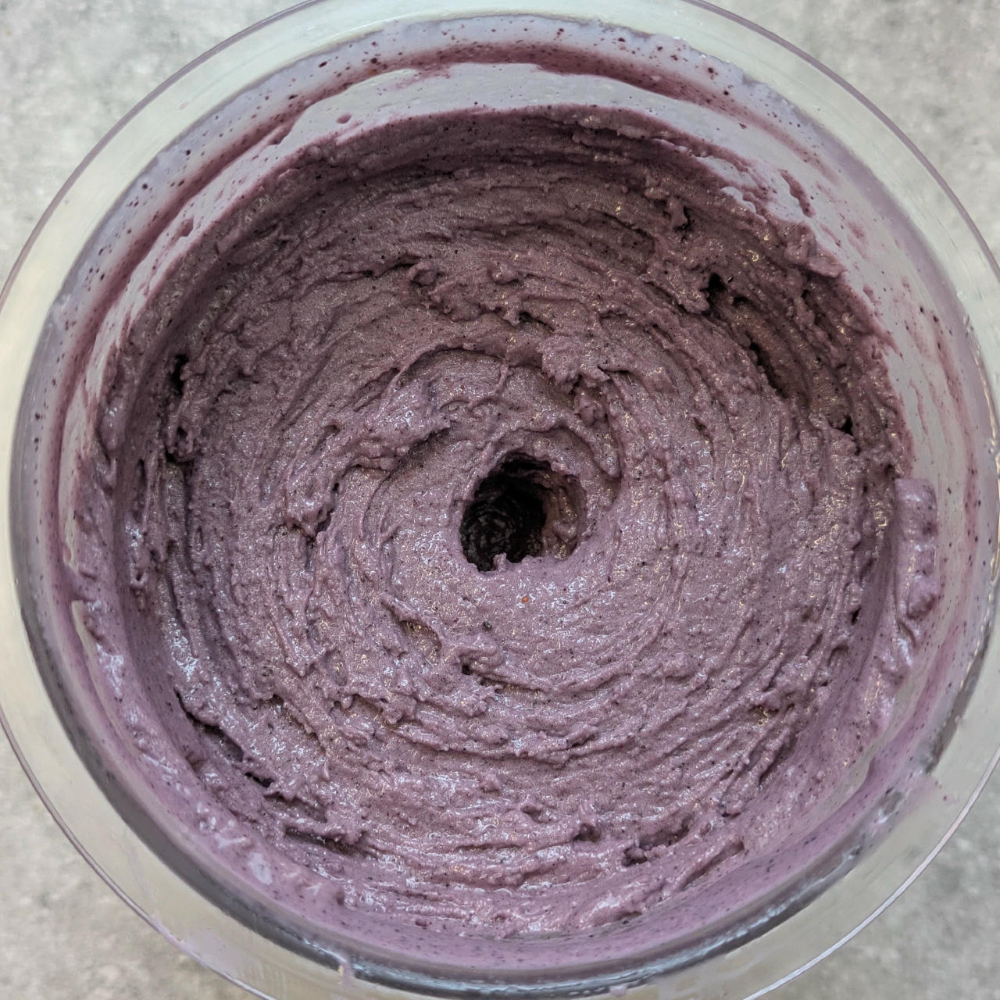
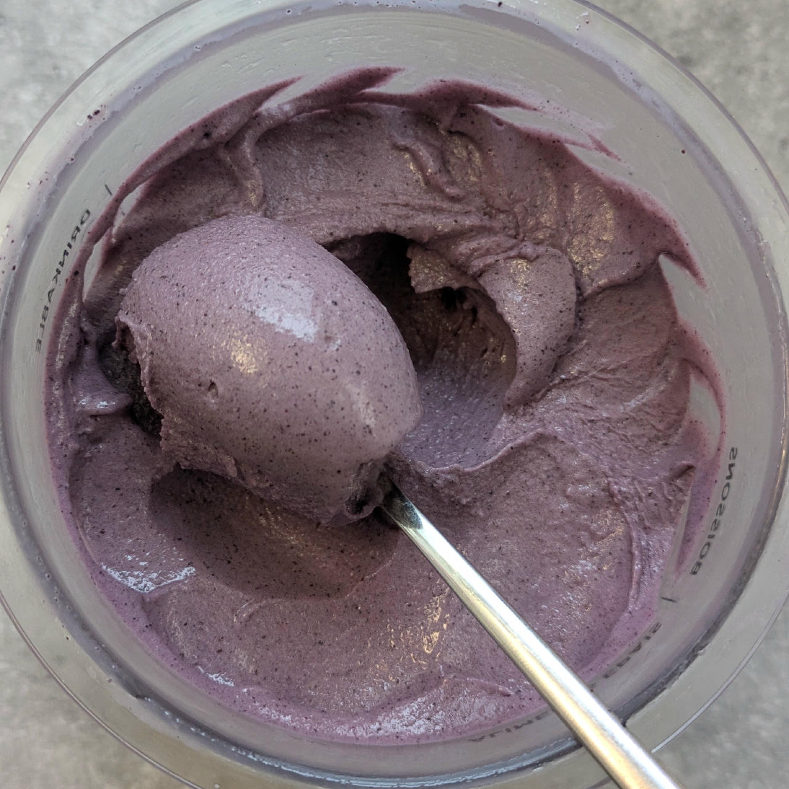

# S&S Light (Deluxe)

Adapted Salt & Straw's base, scaled to ~600g neutral base and targeted for less fat (8%) and sugar (2%) with 3.4% net carbs.

Use the 80–100g unclaimed tub space for a flavor component of your choice,
either blended into the base before freezing, or added as a mix-in later on.

The example recipe as found below is flavored with strawberries (fresh/frozen + freeze-dried for a flavor boost)
and the 1st test batch was done with blueberries (which was what I had at hand).

Process on *Light Ice Cream*, scrape-down, and then a mix-in or respin as needed.

> 
> 
> 

Rating: 😋😋🥛🫐🫐 (Creamy and ice-free, with blueberries)

# INGREDIENTS

ℹ️ Brand names are in square brackets `[...]`.

**Wet**

  - _375ml_ [Soy milk 1.6% (sugar-free) \[Berief\]](/ice-creamery/info/ingredients/#soy-milk){target="_blank"}↗ • use any other preferred milk (~2% fat)
  - _18g_ [Glycerin (E422, VG) \[hd-line\]](/ice-creamery/info/ingredients/#vegetable-glycerin-glycerol-vg-e422){target="_blank"}↗ • POD = 60%; GI = 5; Density = 1.26 g/ml

**Dry**

  - _45g_ [SweEX (Erythritol + Xylitol 3:2)](/ice-creamery/info/ingredients/#sweex-erythritol-xylitol-blend){target="_blank"}↗ • *alternative:* 60g allulose or dextrose
  - _25g_ [Inulin \[Vit4ever\]](/ice-creamery/info/ingredients/#inulin){target="_blank"}↗ • Sweetness = 8%; GI ~= 0
  - _10g_ [Skim milk powder 1:10 (SMP) \[Vita2You\]](/ice-creamery/info/ingredients/#skim-milk-powder-smp){target="_blank"}↗
  - _10g_ [Whey + Casein protein (grass-fed) \[Vilgain\]](/ice-creamery/info/ingredients/#whey-protein){target="_blank"}↗ • with stevia
  - _0.75g_ Salt
  - _0.75g_ [Xanthan gum (E415, XG)](/ice-creamery/info/ingredients/#xanthan-gum-xg-e415){target="_blank"}↗ • 1tsp ≈ 2.8g

**Flavor (treat as Wet/Dry as appropriate)**

  - _60g_ Strawberries
  - _20g_ Strawberry powder [Supergarden]
  - _2g_ Beet Root Powder (organic) [Mandoi] • optional, for color

**Fill to MAX**

  - _125g_ Cream 32% [REWE Beste Wahl]

# DIRECTIONS

 1. Add "wet" ingredients to empty Creami tub.
 1. Weigh and mix dry ingredients, easiest by adding to a jar with a secure lid and shaking vigorously.
 1. Pour into the tub and *QUICKLY* use an immersion blender on full speed to homogenize everything.
 1. Let blender run until thickeners are properly hydrated, up to 1-2 min. Or blend again after waiting that time.
 1. Add remaining ingredients (to the MAX line) and stir with a spoon.
 1. For better results, let the base age in the fridge (covered, lid on), for a few hours or over night. This helps flavor development and gum hydration, especially with unheated bases.
 1. Freeze for 24h with lid on, then spin as usual. Flatten any humps before that.
 1. Process with RE-SPIN mode when not creamy enough after the first spin.
 1. Process with MIX-IN after adding mix-ins evenly. For that, add partial amounts into a hole going down to the bottom, and fold the ice cream over, building pockets of mix-ins.

# NUTRITIONAL & OTHER INFO

- **Nutritional values per 100g/ml:** 100g; 120.7 kcal; fat 6.9g; carbs 16.7g; sugar 3.8g; protein 4.1g; salt 0.2g
- **Nutritional values per ½ Deluxe Tub:** 340g; 410.4 kcal; fat 23.4g; carbs 56.9g; sugar 12.8g; protein 13.9g; salt 0.7g
- **Nutritional values total:** 692g; 834.6 kcal; fat 47.6g; carbs 115.7g; sugar 26.1g; protein 28.2g; salt 1.4g
- **FPDF / [PAC](/ice-creamery/info/glossary/#potere-anti-congelante-pac){target="_blank"}↗ (target 20..30):** 31.82
- **Protein / Energy Ratio (ok=12%; hi=20%):** 13.52% • Low-Sugar
- **Milk Solids Non-Fat ([MSNF](/ice-creamery/info/glossary/#milk-solids-not-fat-msnf){target="_blank"}↗, 7-11%):** 41.3g • 6.0%
- **Net carbs:** 39.5g • *∝ 5 servings@138g:* 7.9g • *∝ 3 servings@231g:* 13.2g • *energy ratio (low <20%):* 18.9%
- **Net carbs (base only):** 24.4g
