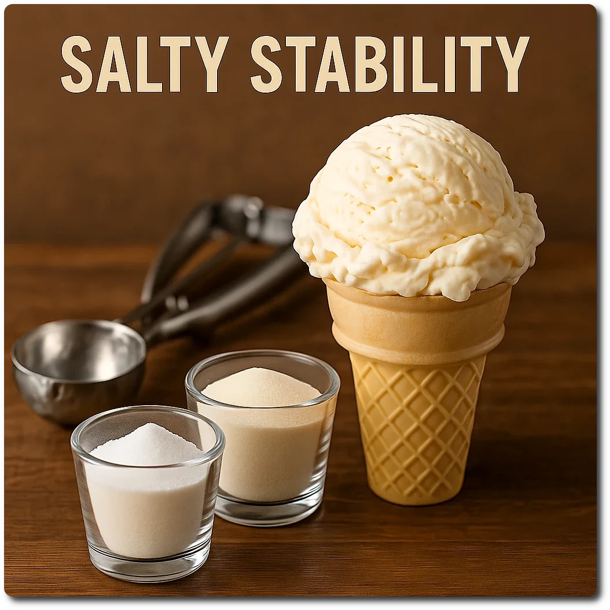

# Salty Stability

> *Unsweetened* pre-mixed stabilizer for Ninja Creami recipes.

It takes handling small amounts of ingredients and their ratio to each other
out of the process of mixing your final ice cream base,
making the overall process less finicky.

Use 15g of the mix for a Creami Deluxe tub (24oz, yields 10),
and 10g for the regular size (16oz, yields 15).

The salt is added for convenience with final recipes,
and for a FPDF boost. Inulin bulks up the mix to be compatible with normal kitchen scales.

# INGREDIENTS

ℹ️ Brand names are in square brackets `[...]`.

**Dry**

  - _125g_ [Inulin \[Vit4ever\]](/ice-creamery/info/ingredients/#inulin){target="_blank"}↗ • Sweetness = 8%; GI ~= 0
  - _12g_ [Carboxymethyl Cellulose (CMC / E466) \[GoodBake\]](/ice-creamery/info/ingredients/#carboxymethyl-cellulose-cmc-e466){target="_blank"}↗
  - _6g_ [Guar gum (E412)](/ice-creamery/info/ingredients/#guar-gum-e412){target="_blank"}↗
  - _5g_ Salt
  - _2g_ [Xanthan gum (E415, XG)](/ice-creamery/info/ingredients/#xanthan-gum-xg-e415){target="_blank"}↗ • 1tsp ≈ 2.8g

# DIRECTIONS

 1. Weigh and mix dry ingredients, easiest by adding to a jar with a secure lid and shaking vigorously.
 1. Store in an air-tight container with enough volume.

# NUTRITIONAL & OTHER INFO
- **Nutritional values per 100g/ml:** 100g; 234.5 kcal; fat 0.0g; carbs 91.2g; sugar 6.7g; protein 0.3g; salt 3.5g; fpdf 0.06g
- **Nutritional values per dose:** 15g; 35.2 kcal; fat 0.0g; carbs 13.7g; sugar 1.0g; protein 0.0g; salt 0.5g; fpdf 0.06g
- **Nutritional values total:** 150g; 351.7 kcal; fat 0.0g; carbs 136.9g; sugar 10.0g; protein 0.5g; salt 5.3g; fpdf 0.06g
- **FPDF:** 0.27
- **FPDF (w/o salt):** 0.06
- **Servings (Deluxe):** 10.00
- **Net carbs:** 25.6g • *∝ 10 servings@15g:* 2.6g
