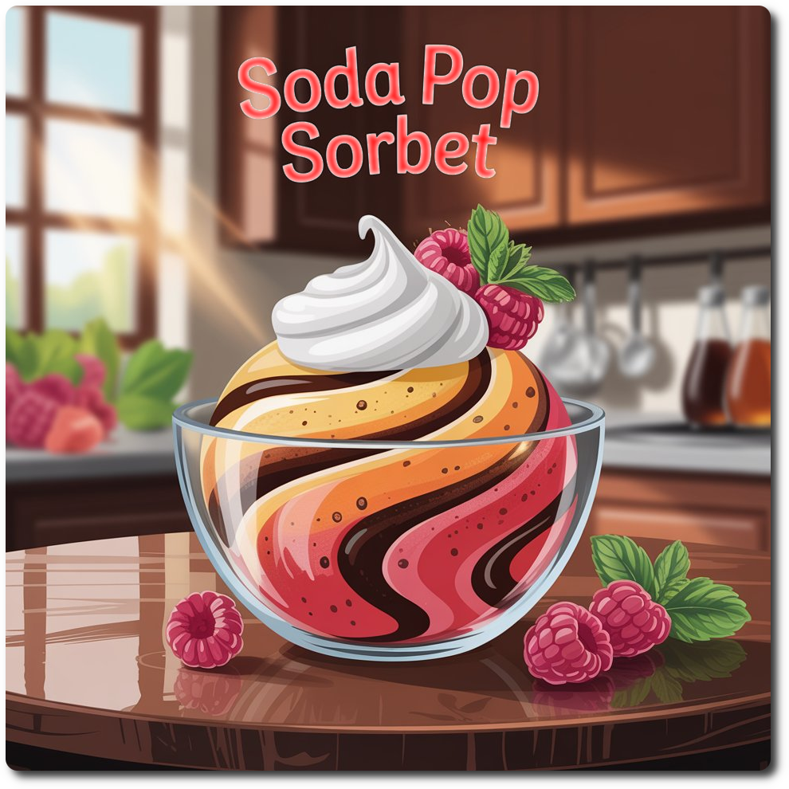
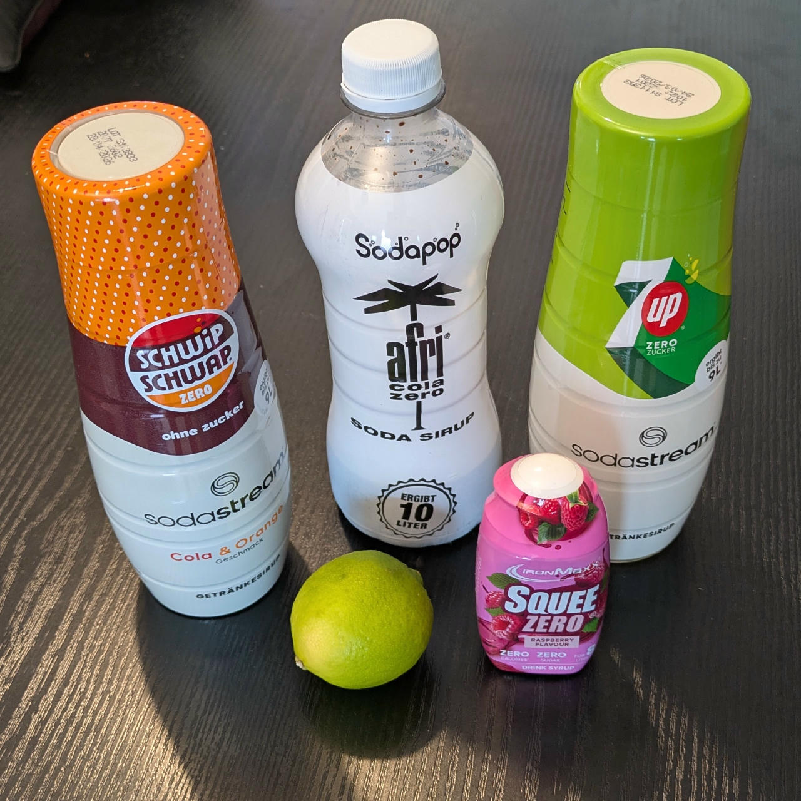
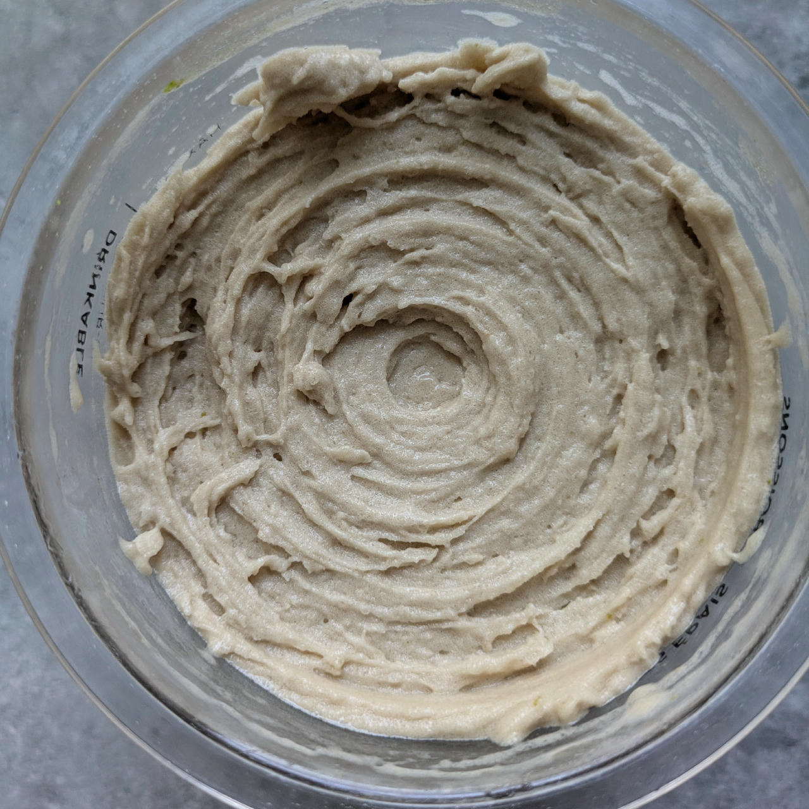
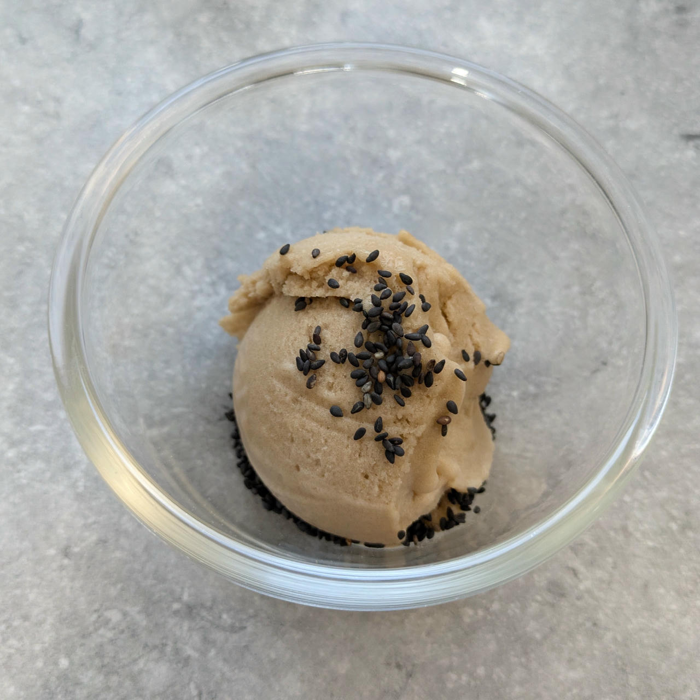

# Soda Pop Sorbet (Deluxe)

Soda sorbet from 0-cal syrup. Works with any 0-sugar soda syrup — increase the recommended dosage by 33%, because ice cream.

> 🌿 **Vegan & Dairy-free** Recipe is using only syrup + lemon juice and no dairy.
> ℹ️ This is keto, at 15 net carbs per tub, so 3-6 per serving.
  
> 
> 
> 
> *Processed on Sorbet, followed by a scrape-downand a mix-in run.*
> 
> Rating: 😋😋🥤🥤

> 
> 
> 
> *Served with black sesame seeds, and as a float with 1tsp of vanilla extract and sweetener in sparkling water.*

# INGREDIENTS

ℹ️ Brand names are in square brackets `[...]`.

**Wet**

  - _400ml_ Water (cold)
  - _45ml_ Soda syrup “afri cola zero” [Sodapop] • 500ml bottle (1:19, yields 10l)
  - _20g_ [Glycerin (E422, VG) \[hd-line\]](/ice-creamery/info/ingredients/#vegetable-glycerin-glycerol-vg-e422){target="_blank"}↗ • Sweetness = 60%; GI = 5; Density = 1.26 g/ml
  - _20ml_ Lime juice + zest (organic) [REWE Bio] • 1 lime = 60..65g
  - _15g_ [Brandy or Vodka 40 vol%](/ice-creamery/info/ingredients/#alcohol-ethanol){target="_blank"}↗

**Dry**

  - _15g_ [Soy protein isolate (nature) \[Powerstar\]](/ice-creamery/info/ingredients/#soy-protein-isolate){target="_blank"}↗ • 1kg bag, unsweetened, unflavored
  - _15g_ [Inulin \[Vit4ever\]](/ice-creamery/info/ingredients/#inulin){target="_blank"}↗ • Sweetness = 8%; GI ~= 0
  - _15g_ [Erythritol (E968)](/ice-creamery/info/ingredients/#erythritol-e968){target="_blank"}↗ • POD = 75%
  - _10g_ [Xylitol (E967)](/ice-creamery/info/ingredients/#xylitol-e967){target="_blank"}↗ • POD = 100%; GI = 7
  - _2g_ Salt
  - _1.5g_ [Tylose powder (E466 / CMC) \[GoodBake\]](/ice-creamery/info/ingredients/#cocoa-powder){target="_blank"}↗
  - _1g_ [Guar gum (E412)](/ice-creamery/info/ingredients/#guar-gum-e412){target="_blank"}↗
  - _0.5g_ [Xanthan gum (E415, XG)](/ice-creamery/info/ingredients/#xanthan-gum-xg-e415){target="_blank"}↗ • 1tsp ≈ 2.8g

**Fill to MAX**

  - _160ml_ Water to MAX line
  - _≈4 drops_ Flavor drops Peach / Maracuja (sucralose) [IronMaxx] • to taste

# DIRECTIONS

 1. Zest the lime first, before juicing it.
 1. Add "wet" ingredients to empty Creami tub.
 1. Weigh and mix dry ingredients, easiest by adding to a jar with a secure lid and shaking vigorously.
 1. Pour into the tub and *QUICKLY* use an immersion blender on full speed to homogenize everything.
 1. Let blender run until thickeners are properly hydrated, up to 1-2 min. Or blend again after waiting that time.
 1. Add remaining ingredients (to the MAX line) and stir with a spoon.
 1. Put on the lid, freeze for 24h, then spin as usual. Flatten any humps before that.
 1. Process with RE-SPIN mode when not creamy enough after the first spin.

# NUTRITIONAL & OTHER INFO
- **Nutritional values per 100g/ml:** 100g; 35.3 kcal; fat 0.0g; carbs 8.8g; sugar 0.2g; protein 1.9g; salt 0.3g
- **Nutritional values per ½ Deluxe Tub:** 360g; 127.1 kcal; fat 0.1g; carbs 31.8g; sugar 0.8g; protein 6.8g; salt 1.2g
- **Nutritional values total:** 720g; 254.1 kcal; fat 0.2g; carbs 63.5g; sugar 1.5g; protein 13.6g; salt 2.4g
- **FPDF / [PAC](/ice-creamery/info/glossary/#potere-anti-congelante-pac){target="_blank"}↗ (target 20..30):** 29.14
- **Protein / Energy Ratio (ok=12%; hi=20%):** 21.46% • LOW-CAL • LOW-FAT • Low-Sugar • Hi-Protein
- **Milk Solids Non-Fat ([MSNF](/ice-creamery/info/glossary/#milk-solids-not-fat-msnf){target="_blank"}↗, 7-11%):** 14.0g • 1.9%
- **Net carbs:** 15.2g • *∝ 5 servings@144g:* 3g • *∝ 3 servings@240g:* 5.1g
- **Jul 2, 2025:** Add lime zest, less solids, a bit more syrup
