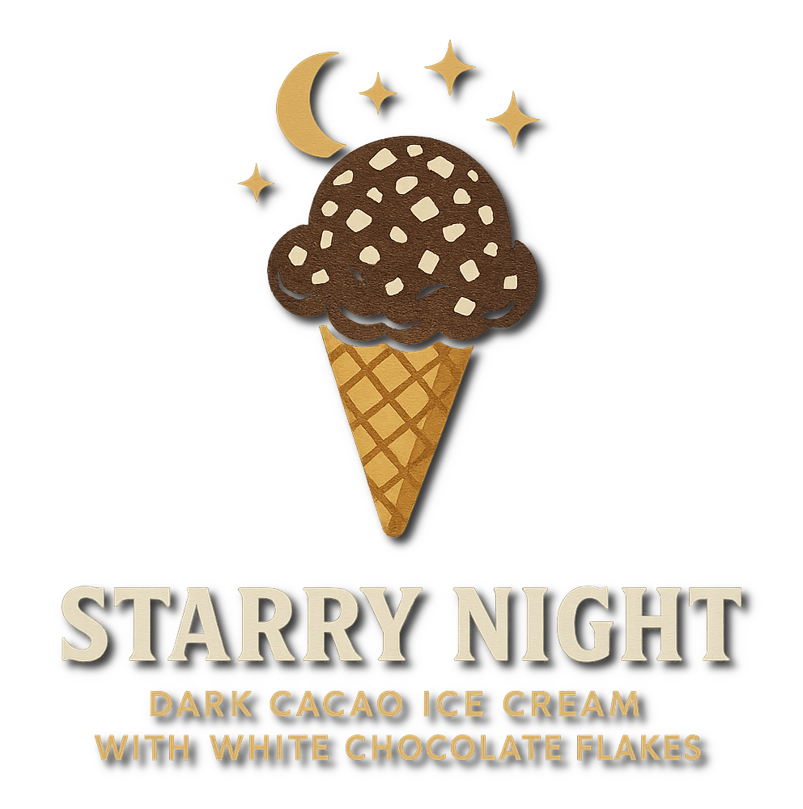

# Starry Night (Deluxe)

Dark cacao base with white chocolate flakes mixed in.

Spin on “Light Ice Cream”, scrape down, and run the mix-in cycle.
The white chocolate flakes are included in the macros.

> 
> 
> 

Rating: 😋✨🍫 (untested)

# INGREDIENTS

ℹ️ Brand names are in square brackets `[...]`.

**Wet**

  - _475ml_ [Soy milk 1.6% (sugar-free) \[Berief\]](/ice-creamery/info/ingredients/#soy-milk){target="_blank"}↗ • use any other preferred milk (~2% fat)
  - _20g_ Cointreau 40 vol% • 1 bottle = 70cl
  - _15g_ [Glycerin (E422, VG) \[hd-line\]](/ice-creamery/info/ingredients/#vegetable-glycerin-glycerol-vg-e422){target="_blank"}↗

**Dry**

  - _45g_ [SweEX (Erythritol + Xylitol 3:2)](/ice-creamery/info/ingredients/#sweex-erythritol-xylitol-blend){target="_blank"}↗ • *alternative:* 60g allulose or dextrose
  - _25g_ [Cocoa Noir Intense 11% \[Cacao Barry\]](/ice-creamery/info/ingredients/#cocoa-powder){target="_blank"}↗ • intense, tart cocoa flavour
  - _15g_ [Skim milk powder 1:10 (SMP) \[Vita2You\]](/ice-creamery/info/ingredients/#skim-milk-powder-smp){target="_blank"}↗
  - _10g_ [Whey + Casein protein (grass-fed) \[Vilgain\]](/ice-creamery/info/ingredients/#whey-protein){target="_blank"}↗ • with stevia
  - _10g_ [Salty Stability \[Inulin / GMS / CMC / Guar / XG / Salt\]](/ice-creamery/S/Salty%20Stability/){target="_blank"}↗ • *not-as-good substitute:* 1g guar, 0.3g xanthan, and 0.3g salt
  - _4g_ Instant Coffee [Mount Hagen] • 1.5g per 125ml
  - _1g_ Cinnamon (Ceylon) • *optional*, to taste; 1tsp = 3g

**Fill to MAX**

  - _25ml_ Cream 32% [REWE Beste Wahl]
  - _≈2 drops_ Flavor drops Vanilla (sucralose) [IronMaxx] • to taste

**Mix-ins**

  - _25g_ [White chocolate shavings \[Ruf\]](/ice-creamery/info/ingredients/#chocolate-shavings){target="_blank"}↗ • pre-frozen [140kcal, 14g sugar]
  - _10g_ Almond slivers [naturix24] • chopped [59kcal, 0.4g sugar]

# DIRECTIONS

 1. Weigh the chocolate and almonds and put them into the freezer, at least an hour before processing the base.
 1. Heat the milk to about 60°C (first steam rising).
 1. Whisk in the dry ingredients, after mixing them together first.
 1. Pour the cooled down mix into an empty tub, and blend to emulsify and homogenize.
 1. Add remaining ingredients and stir with a spoon.
 1. Put on the lid, freeze for 24h, then spin as usual. Flatten any humps before that.
 1. Process with RE-SPIN mode when not creamy enough after the first spin.
 1. Process with MIX-IN after adding mix-ins evenly. For that, add partial amounts into a hole going down to the bottom, and fold the ice cream over, building pockets of mix-ins.

# NUTRITIONAL & OTHER INFO

- **Nutritional values per 100g/ml:** 100g; 116.4 kcal; fat 4.9g; carbs 15.4g; sugar 4.3g; protein 5.5g; salt 0.3g
- **Nutritional values per ½ Deluxe Tub:** 340g; 395.8 kcal; fat 16.7g; carbs 52.4g; sugar 14.6g; protein 18.7g; salt 1.0g
- **Nutritional values total:** 680g; 791.7 kcal; fat 33.5g; carbs 104.9g; sugar 29.3g; protein 37.3g; salt 2.0g
- **FPDF / [PAC](/ice-creamery/info/glossary/#potere-anti-congelante-pac){target="_blank"}↗ (target 20..30):** 31.13
- **Protein / Energy Ratio (ok=12%; hi=20%):** 18.86% • Low-Sugar
- **Milk Solids Non-Fat ([MSNF](/ice-creamery/info/glossary/#milk-solids-not-fat-msnf){target="_blank"}↗, 7-11%):** 43.7g • 6.4%
- **Net carbs:** 45.0g • *∝ 5 servings@136g:* 9g • *∝ 3 servings@227g:* 15g • *energy ratio (low <20%):* 22.7%
- **10g 'Salty Stability' is:** 7.3g Inulin • 1.2g Glycerol Monostearate (GMS / E471) • 0.6g Tylose powder (E466, Tylo, CMC) • 0.4g Guar gum (E412) • 0.33g Salt • 0.13g Xanthan gum (E415, XG).
