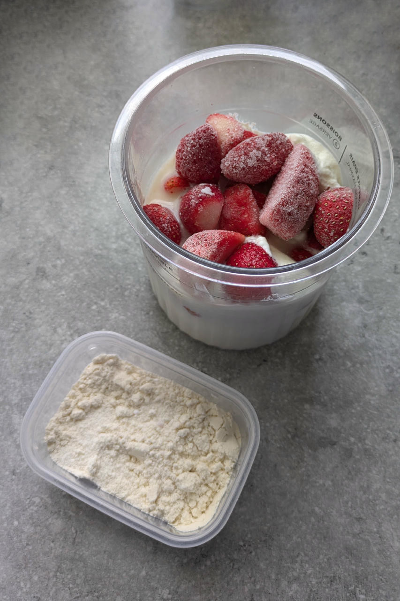
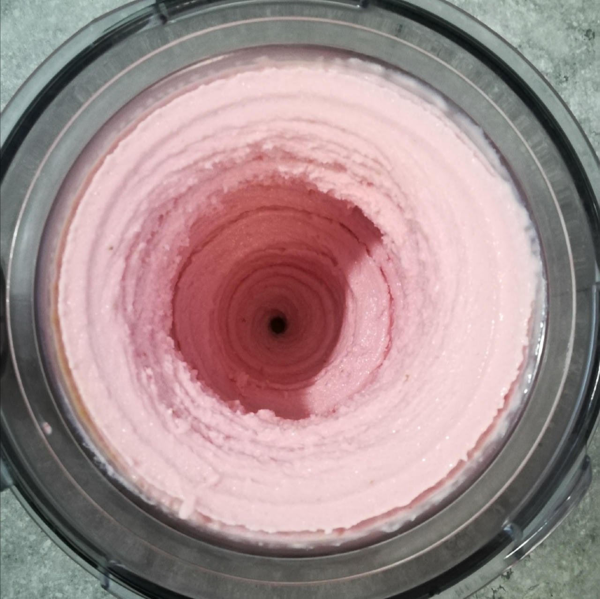

# Strawberry Cheesecake (Deluxe)

A great combination of various tart flavors,
and a variation of my German cheesecake base, which is made with ‘Quark’ or ‘Topfen’
– think of a cross between yogurt, cottage cheese and ricotta.

> 

Spun on Lite Ice Cream, followed by a scrape-down and a mix-in run.

> 
> 

Serve with graham crackers, shortbread, or plain cookies to stand in for the pie crust.

Rating: 😋😋😋🍓🍓

# INGREDIENTS

ℹ️ Brand names are in square brackets `[...]`.

**Wet**

  - _245g_ [Topfen / Quark 14.4% \[Berchtesgadener\]](/ice-creamery/info/ingredients/#quark-topfen){target="_blank"}↗ • 250g container
  - _200g_ Strawberries
  - _145g_ Greek Yogurt 9% [Lyttos]
  - _15g_ [Brandy or Vodka 40 vol%](/ice-creamery/info/ingredients/#alcohol-ethanol){target="_blank"}↗
  - _15g_ [Glycerin (E422, VG) \[hd-line\]](/ice-creamery/info/ingredients/#vegetable-glycerin-glycerol-vg-e422){target="_blank"}↗ • Sweetness = 60%; GI = 5; Density = 1.26 g/ml
  - _15ml_ Lemon juice

**Dry**

  - _30g_ [SweEX (Erythritol + Xylitol 3:2)](/ice-creamery/info/ingredients/#sweex-erythritol-xylitol-blend){target="_blank"}↗ • POD ≈ 90%; GI < 7
  - _20g_ [Whey + Casein protein (grass-fed) \[Vilgain\]](/ice-creamery/info/ingredients/#whey-protein){target="_blank"}↗ • with stevia
  - _10g_ [Salty Stability \[Inulin / GMS / CMC / Guar / XG / Salt\]](/ice-creamery/S/Salty%20Stability/){target="_blank"}↗ • unsweetened “ICSv2”
  - _1g_ Salt

**Fill to MAX**

  - _24ml_ Water, milk, cream, or yogurt to MAX line
  - _≈3 drops_ Flavor drops Vanilla (sucralose) [IronMaxx] • to taste
  - _≈10 drops_ Flavor drops Cookies&Cream (stevia) [Nick’s] • to taste

**Mix-ins**

  - _20g_ Sultanas (organic) [Biojoy] • add coarsely chopped as a mix-in [60kcal, 13g sugar]

**Topping Options**

  - _3-4 pieces_ Graham crackers
  - _3-4 pieces_ Wafers (cream-filled)
  - _15.60g_ Biscoff “Lotus” cookies [Aldi] • 1pc = 7.8g; add as a topping [76kcal, 5.9g sugar]
  - _18g_ Butter cookies [Kägi Toggenburger] • 1pc = 6g; add as a topping [84kcal, 3.8g sugar]

# DIRECTIONS

 1. Add "wet" ingredients to empty Creami tub.
 1. Weigh and mix dry ingredients, easiest by adding to a jar with a secure lid and shaking vigorously.
 1. Pour into the tub and *QUICKLY* use an immersion blender on full speed to homogenize everything.
 1. Let blender run until thickeners are properly hydrated, up to 1-2 min. Or blend again after waiting that time.
 1. Add remaining ingredients (to the MAX line) and stir with a spoon.
 1. Put on the lid, freeze for 24h, then spin as usual. Flatten any humps before that.
 1. Process with RE-SPIN mode when not creamy enough after the first spin.
 1. Process with MIX-IN after adding mix-ins evenly. For that, add partial amounts into a hole going down to the bottom, and fold the ice cream over, building pockets of mix-ins.

# NUTRITIONAL & OTHER INFO
- **Nutritional values per 100g/ml:** 100g; 125.9 kcal; fat 7.0g; carbs 11.3g; sugar 3.8g; protein 6.0g; salt 0.3g
- **Nutritional values per ½ Deluxe Tub:** 360g; 453.3 kcal; fat 25.4g; carbs 40.6g; sugar 13.8g; protein 21.4g; salt 0.9g
- **Nutritional values total:** 720g; 906.6 kcal; fat 50.7g; carbs 81.3g; sugar 27.7g; protein 42.9g; salt 1.8g
- **FPDF / [PAC](/ice-creamery/info/glossary/#potere-anti-congelante-pac){target="_blank"}↗ (target 20..30):** 30.71
- **Protein / Energy Ratio (ok=12%; hi=20%):** 18.93% • Low-Sugar
- **Milk Solids Non-Fat ([MSNF](/ice-creamery/info/glossary/#milk-solids-not-fat-msnf){target="_blank"}↗, 7-11%):** 45.7g • 6.4%
- **Net carbs:** 36.4g • *∝ 5 servings@144g:* 7.3g • *∝ 3 servings@240g:* 12.1g • *energy ratio (low <20%):* 16.1%
- **10g 'Salty Stability' is:** 7.3g Inulin • 1.2g Glycerol Monostearate (GMS / E471) • 0.6g Tylose powder (E466, Tylo, CMC) • 0.4g Guar gum (E412) • 0.33g Salt • 0.13g Xanthan gum (E415, XG).
