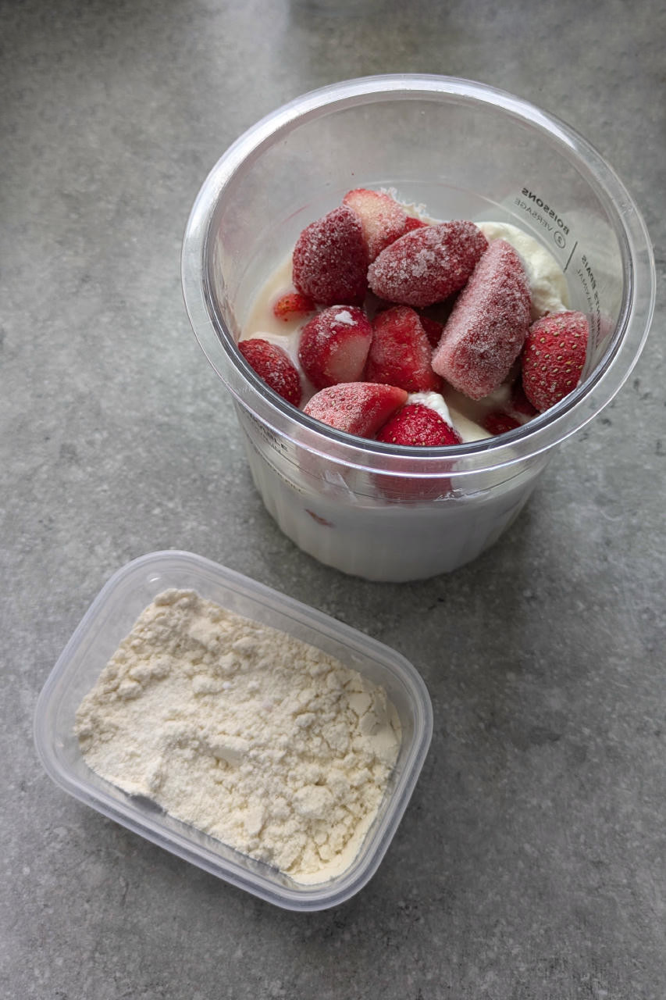
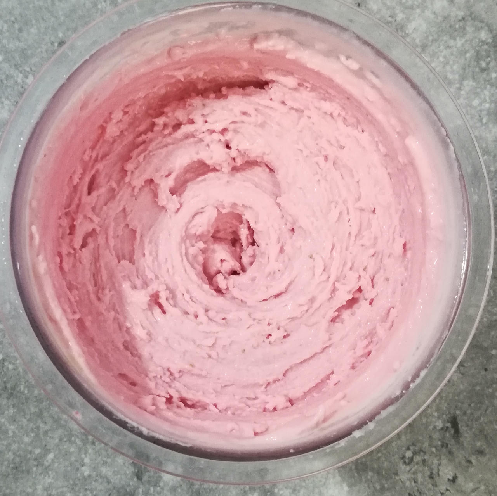
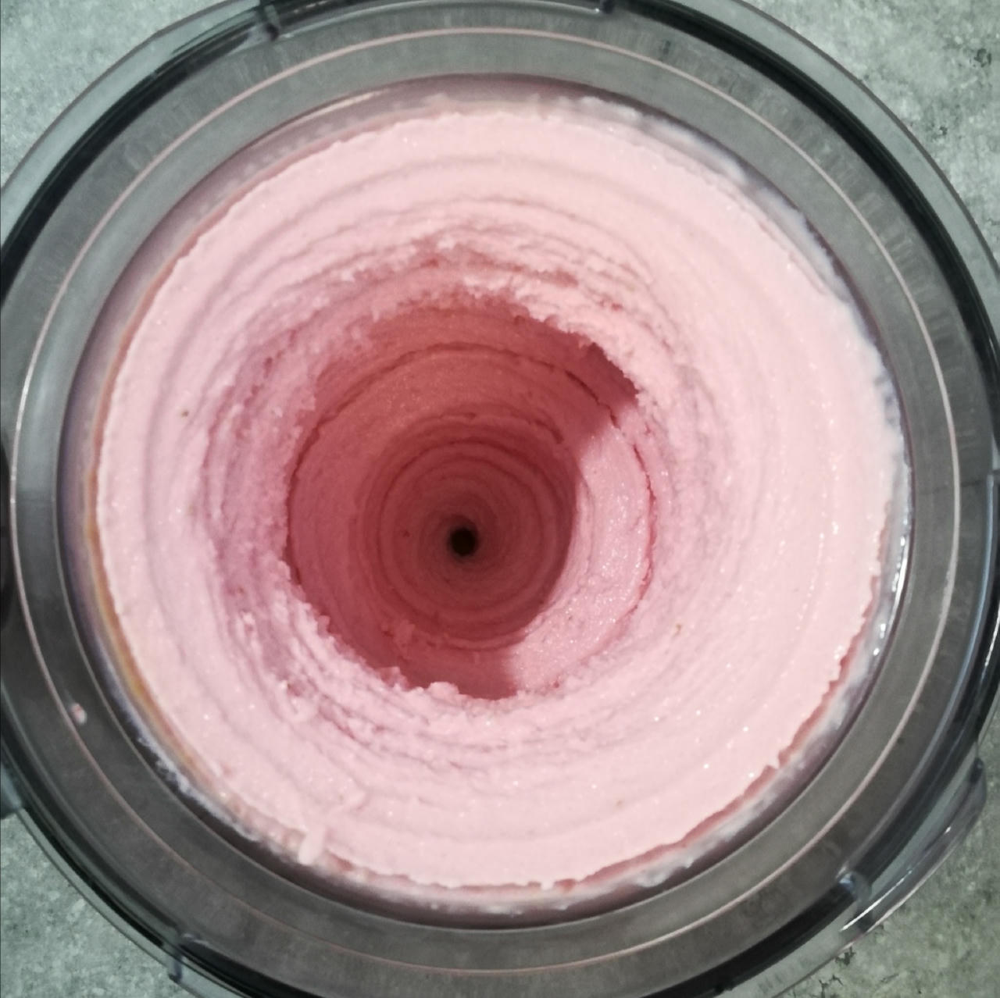
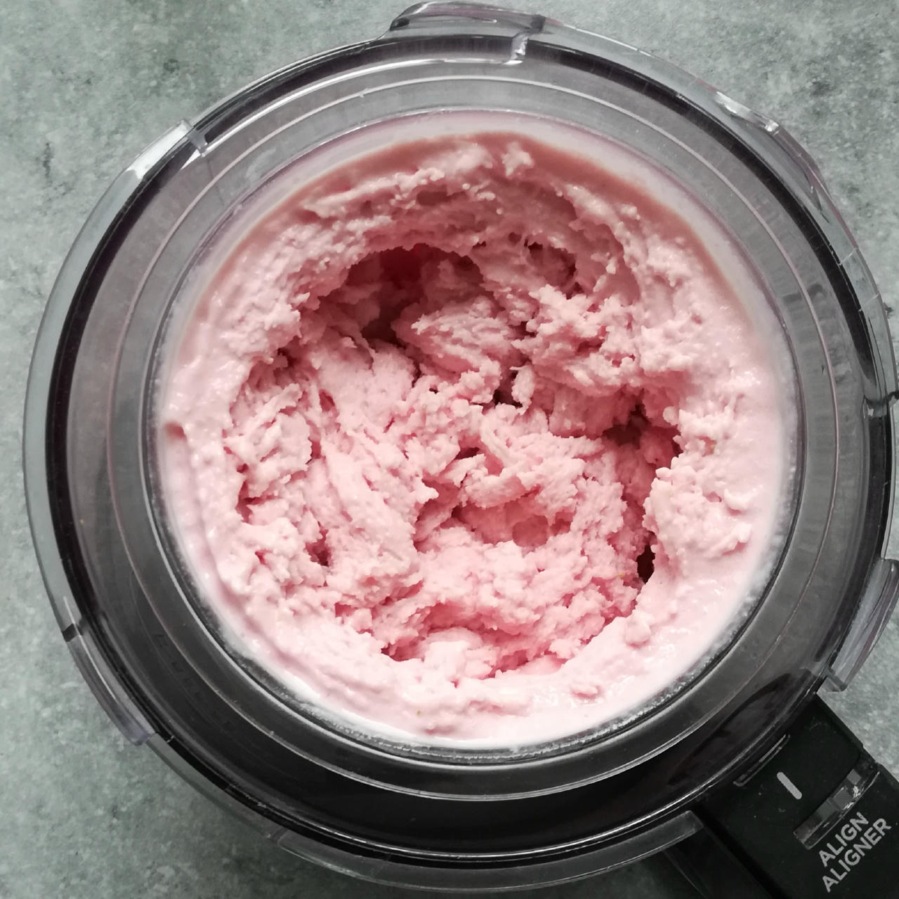
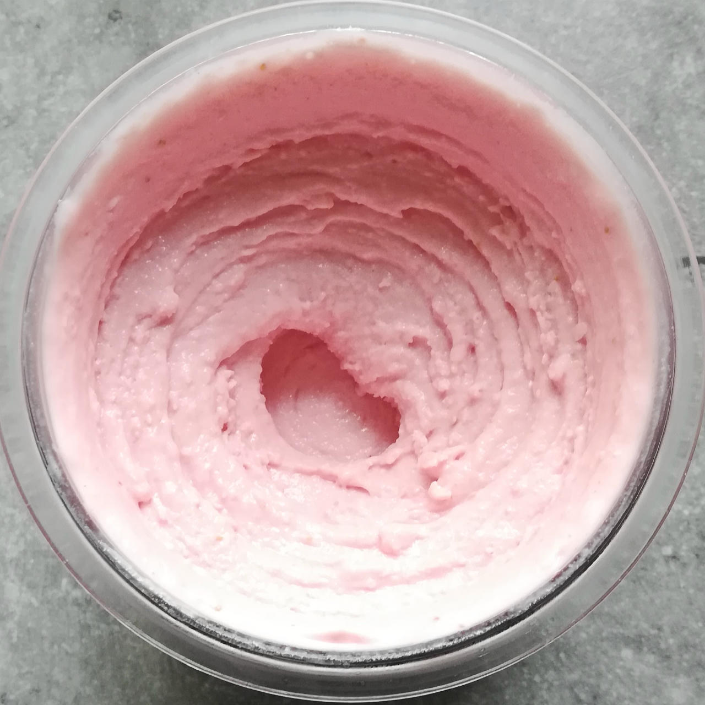
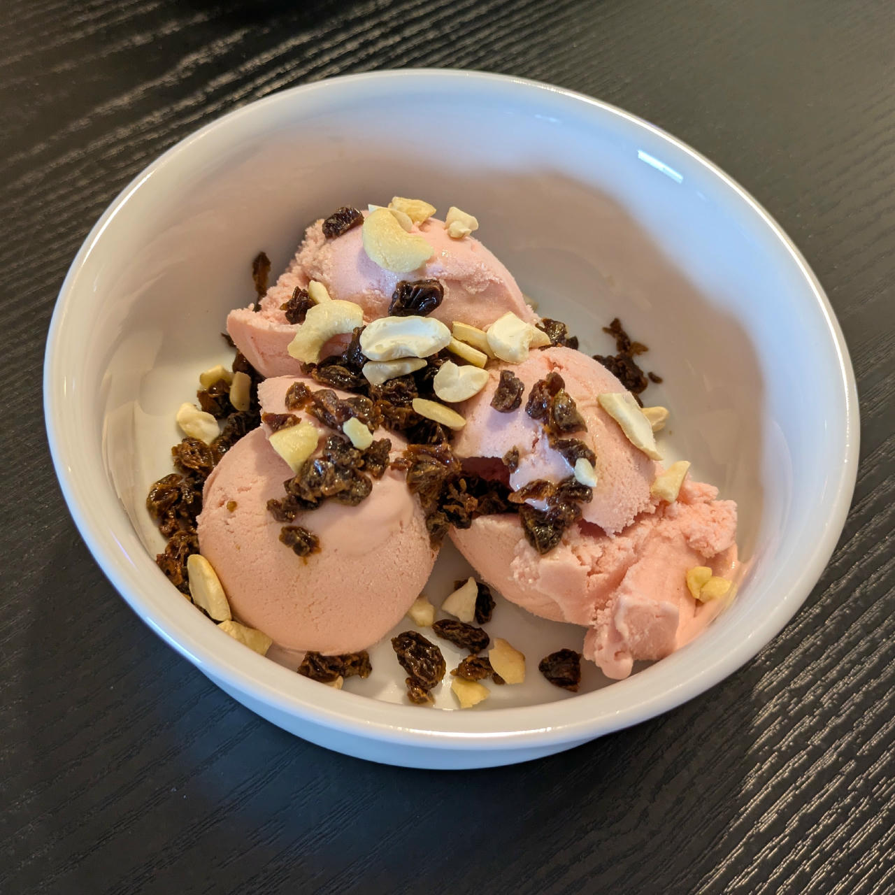
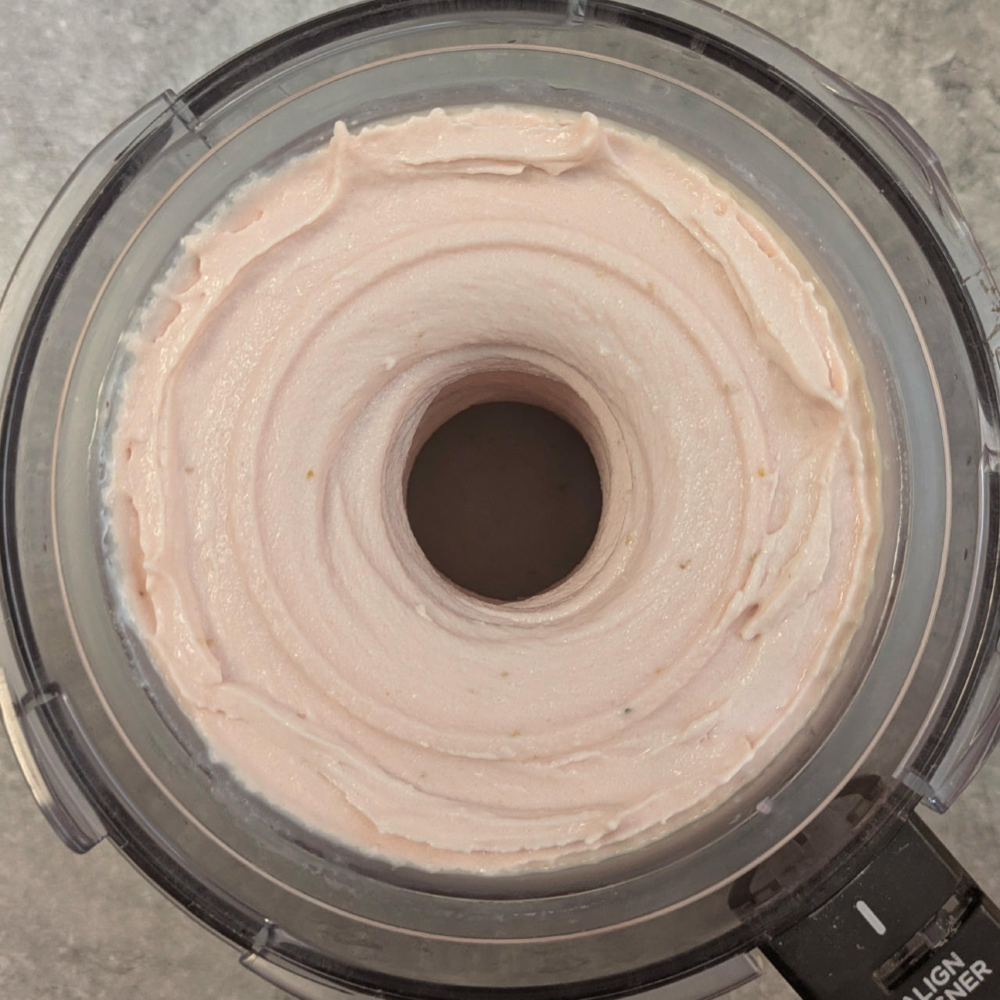
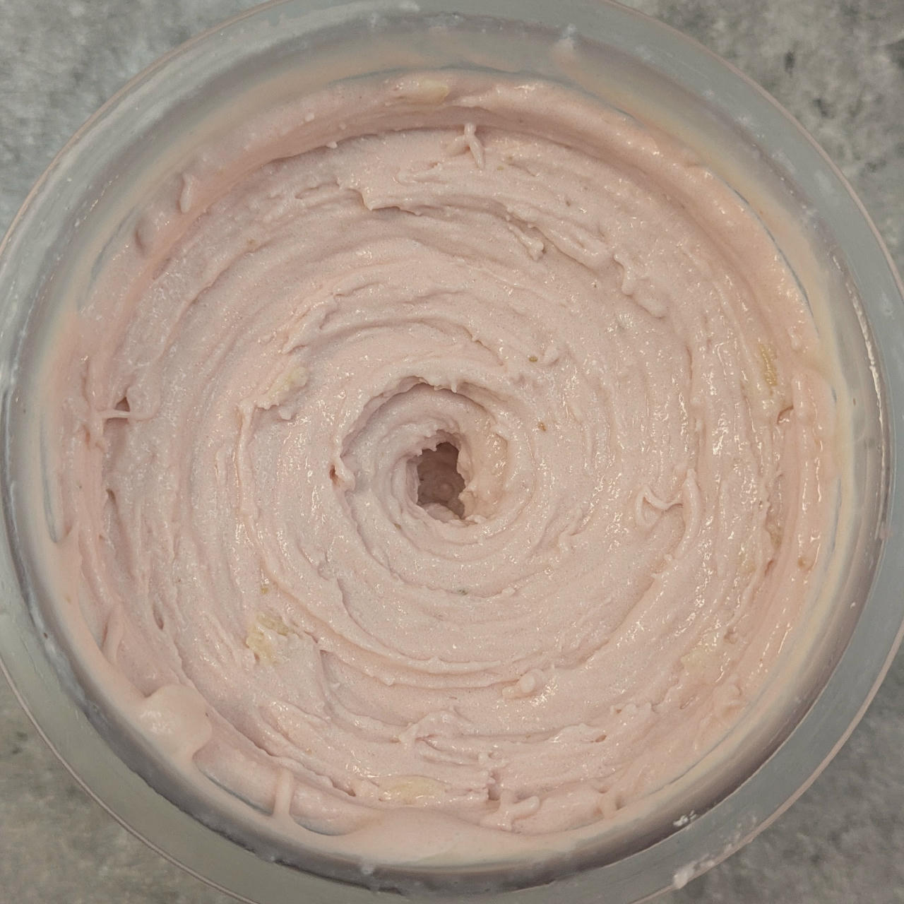
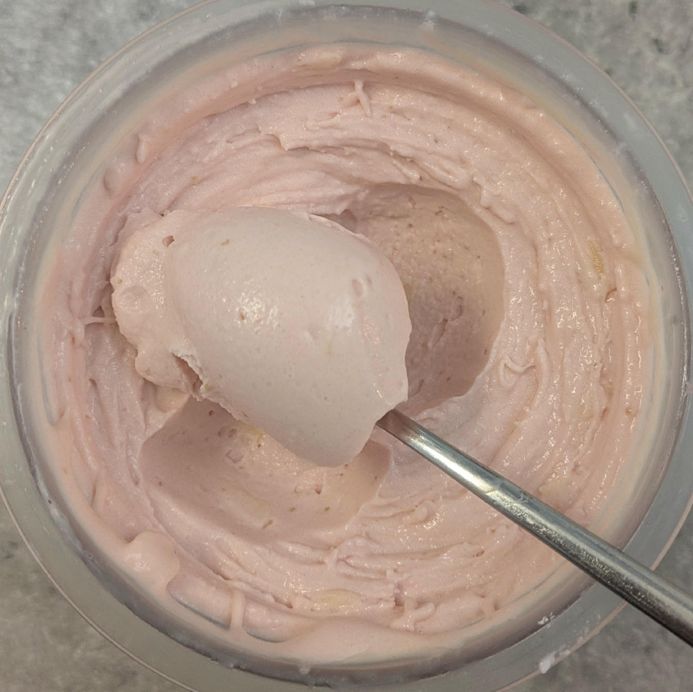

# Strawberry Cheesecake (Deluxe)

A great combination of various tart flavors,
and a variation of my German cheesecake base, which is made with ‘Quark’ or ‘Topfen’
– think of a cross between yogurt, cottage cheese and ricotta.

> 

Spun on Lite Ice Cream, followed by a scrape-down and a mix-in run.

> 
> 

Serve with graham crackers, shortbread, or plain cookies to stand in for the pie crust.

Rating: 😋😋🥛🍓🍓

> 
> 
> 
>
> *Made with whey / casein protein mix, processed on Sorbet + Respin. Served with chopped cashews and chopped rum-soaked sultanas.*

> 
> 
> 
>
> *2025-11-10: Processed on FroYo, scrape-down, and mix-in run with white chocolate shavings.*

# INGREDIENTS

ℹ️ Brand names are in square brackets `[...]`.

**Wet**

  - _245g_ [Topfen / Quark 14.4% \[Berchtesgadener\]](/ice-creamery/info/ingredients/#quark-topfen){target="_blank"}↗ (≈1 cup + 1 ¾ tsp) • 250g container; *US alternative:* low-fat cream cheese <a id="id-8def8e1" href="https://jhermann.github.io/ice-creamery/info/nutrition/#id-8def8e1">ℹ️</a>
  - _200g_ Strawberries (≈7 oz) <a id="id-93f3a24" href="https://jhermann.github.io/ice-creamery/info/nutrition/#id-93f3a24">ℹ️</a>
  - _125ml_ [Soy milk 1.6% (sugar-free) \[Berief\]](/ice-creamery/info/ingredients/#soy-milk){target="_blank"}↗ (≈4 fl oz + 1 ¼ tsp) • use any other preferred milk (~2% fat) <a id="id-2755284" href="https://jhermann.github.io/ice-creamery/info/nutrition/#id-2755284">ℹ️</a>
  - _15g_ [Brandy or Vodka 40 vol%](/ice-creamery/info/ingredients/#alcohol-ethanol){target="_blank"}↗ (≈1 tbsp) • *alternative:* 12g (additional) VG for a sober recipe <a id="id-63b8bf1" href="https://jhermann.github.io/ice-creamery/info/nutrition/#id-63b8bf1">ℹ️</a>
  - _15g_ [Glycerin (E422, VG) \[hd-line\]](/ice-creamery/info/ingredients/#vegetable-glycerin-glycerol-vg-e422){target="_blank"}↗ (≈1 tbsp) • Sweetness = 60%; GI = 5 <a id="id-8717e6d" href="https://jhermann.github.io/ice-creamery/info/nutrition/#id-8717e6d">ℹ️</a>
  - _15ml_ Lemon juice (≈1 tbsp) <a id="id-d264fa8" href="https://jhermann.github.io/ice-creamery/info/nutrition/#id-d264fa8">ℹ️</a>

**Dry**

  - _30g_ [SweEX (Erythritol + Xylitol 3:2)](/ice-creamery/info/ingredients/#sweex-erythritol-xylitol-blend){target="_blank"}↗ (≈2 tbsp) • *alternative:* 40g allulose or dextrose <a id="id-f44b101" href="https://jhermann.github.io/ice-creamery/info/nutrition/#id-f44b101">ℹ️</a>
  - _20g_ [Whey + Casein protein (grass-fed) \[Vilgain\]](/ice-creamery/info/ingredients/#whey-protein){target="_blank"}↗ (≈1 tbsp + 1 tsp) • with stevia <a id="id-b954be3" href="https://jhermann.github.io/ice-creamery/info/nutrition/#id-b954be3">ℹ️</a>
  - _10g_ [Salty Stability \[Inulin / GMS / CMC / Guar / XG / Salt\]](/ice-creamery/S/Salty%20Stability/){target="_blank"}↗ (≈2 tsp) • *not-as-good substitute:* 1g guar, 0.3g xanthan, and 0.3g salt <a id="id-3d1ecef" href="https://jhermann.github.io/ice-creamery/info/nutrition/#id-3d1ecef">ℹ️</a>
  - _2g_ Beet Root Powder (organic) [Mandoi] (≈½ tsp) • *optional*, for color <a id="id-72d8998" href="https://jhermann.github.io/ice-creamery/info/nutrition/#id-72d8998">ℹ️</a>
  - _1g_ Salt (≈¼ tsp)

**Fill to MAX**

  - _≈3 drops_ Flavor drops Vanilla (sucralose) [IronMaxx] • to taste
  - _≈3 drops_ Flavor drops Cookies&Cream (stevia) [Nick’s] • to taste

**Mix-ins**

  - _20g_ Sultanas (organic) [Biojoy] (≈1 tbsp + 1 tsp) • add coarsely chopped as a mix-in [60kcal, 13g sugar] <a id="id-7421325" href="https://jhermann.github.io/ice-creamery/info/nutrition/#id-7421325">ℹ️</a>
  - _20g_ [White chocolate shavings \[Ruf\]](/ice-creamery/info/ingredients/#chocolate-shavings){target="_blank"}↗ (≈1 tbsp + 1 tsp) • pre-freeze or fold in manually, if you want bigger pieces [112kcal, 11.2g sugar] <a id="id-5f5232d" href="https://jhermann.github.io/ice-creamery/info/nutrition/#id-5f5232d">ℹ️</a>

**Topping Options**

  - _3-4 pieces_ Graham crackers
  - _3-4 pieces_ Wafers (cream-filled)
  - _16g_ Biscoff “Lotus” cookies [Aldi] (≈1 tbsp + ¼ tsp) • 1pc = 7.8g; add as a topping [77kcal, 6.1g sugar] <a id="id-4529902" href="https://jhermann.github.io/ice-creamery/info/nutrition/#id-4529902">ℹ️</a>
  - _18g_ Butter cookies [Kägi Toggenburger] (≈1 tbsp + ¾ tsp) • 1pc = 6g; add as a topping [84kcal, 3.8g sugar]

# DIRECTIONS

 1. Add "wet" ingredients to empty Creami tub.
 1. Weigh and mix dry ingredients, easiest by adding to a jar with a secure lid and shaking vigorously.
 1. Pour into the tub and *QUICKLY* use an immersion blender on full speed to homogenize everything.
 1. Let blender run until thickeners are properly hydrated, up to 1-2 min. Or blend again after waiting that time.
 1. Add remaining ingredients (to the MAX line) and stir with a spoon.
 1. For better results, let the base age in the fridge (covered, lid on), for a few hours or over night. This helps flavor development and gum hydration, especially with unheated bases.
 1. Freeze for 24h with lid on, then spin as usual. Flatten any humps before that.
 1. Process with RE-SPIN mode when not creamy enough after the first spin.
 1. Process with MIX-IN after adding mix-ins evenly. For that, add partial amounts into a hole going down to the bottom, and fold the ice cream over, building pockets of mix-ins.

# NUTRITIONAL & OTHER INFO

| 🥗 Value | 100g | Serving | Total |
| :--- | ---: | ---: | ---: |
| ⚖️ Weight (g) | 100 | 340 | 678 |
| 🔥 Energy (kcal) | 116.1 | 394.7 | 787.2 |
| 🫒 Fat (g) | 5.8 | 19.8 | 39.4 |
| 🍞 Carbohydrates (g) | 11.5 | 39.3 | 78.3 |
| 🍬 Sugars (g) | 3.4 | 11.6 | 23.1 |
| 💪 Protein (g) | 6.2 | 21.2 | 42.3 |
| 🧂 Salt (g) | 0.3 | 0.9 | 1.8 |

- **FPDF / [PAC](/ice-creamery/info/glossary/#potere-anti-congelante-pac){target="_blank"}↗ (target 20..30):** 31.72
- **Protein / Energy Ratio (ok=12%; hi=20%):** 21.49% • Low-Sugar • Hi-Protein
- **Milk Solids Non-Fat ([MSNF](/ice-creamery/info/glossary/#milk-solids-not-fat-msnf){target="_blank"}↗, 7-11%):** 39.3g • 5.8%
- **Net carbs:** 33.4g • *∝ 5 servings@136g:* 6.7g • *∝ 3 servings@226g:* 11.1g • *energy ratio (low <20%):* 17%
- **10g 'Salty Stability' is:** 7.3g Inulin • 1.2g Glycerol Monostearate (GMS / E471) • 0.6g Tylose powder (E466, Tylo, CMC) • 0.4g Guar gum (E412) • 0.33g Salt • 0.13g Xanthan gum (E415, XG).
