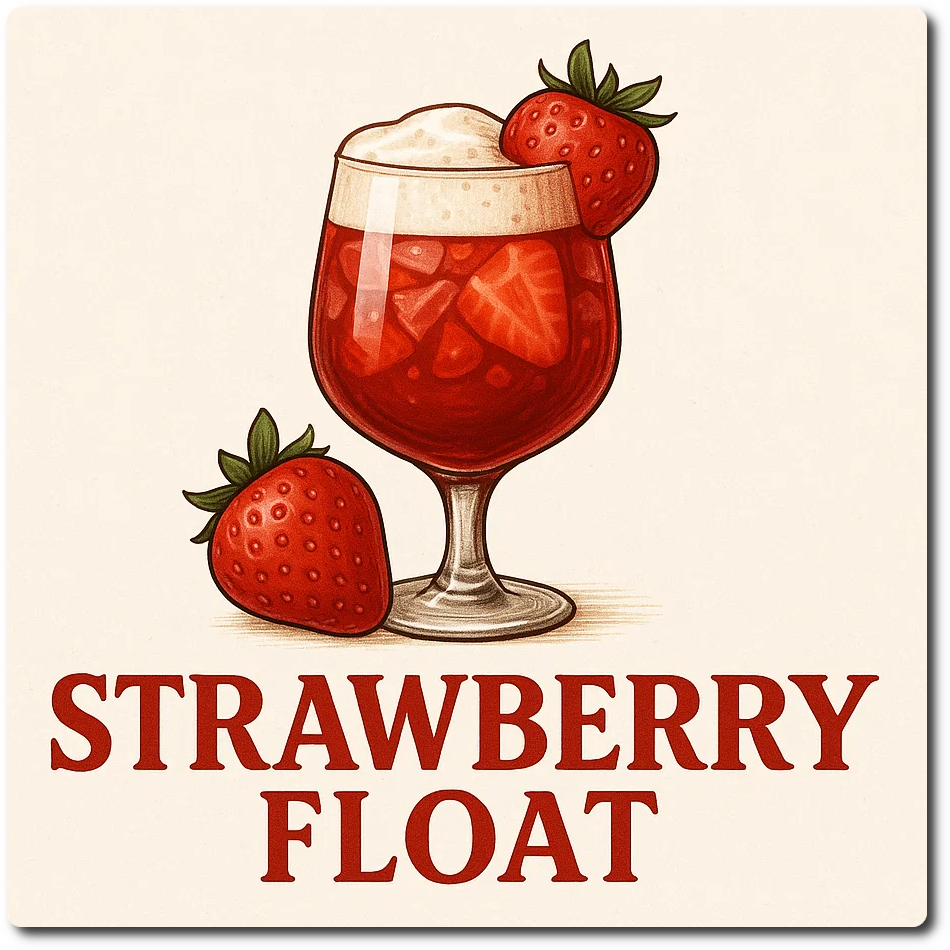
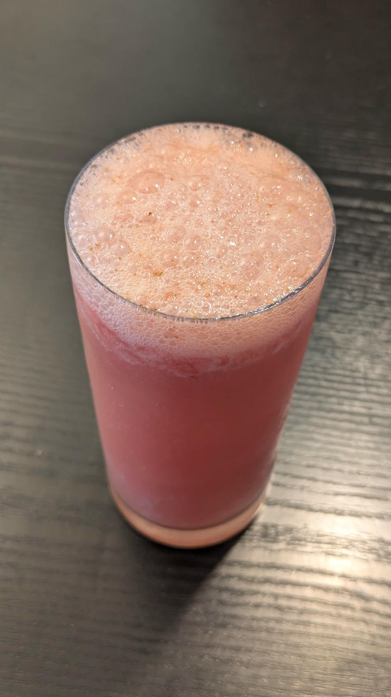

# Strawberry Float

Very refreshing long-drink for hot summer days 🌞, based on the
[Strawberry Sangria](https://jhermann.github.io/ice-creamery/S/Strawberry%20Sangria%20%28Deluxe%29/) recipe.

> 

Rating: 😋🥤🥤🍓🍓

# INGREDIENTS

ℹ️ Brand names are in square brackets `[...]`.

  - _100ml_ Strawberry Sangria sorbet • 2 scoops
  - _250ml_ Sparkling water (fridge cold)
  - _2 tablets_ Sweetener • equiv. to 2tsp sugar
  - _4ml_ Pomegranate syrup (nar ekşisi) [fersan] • 1 squeeze

# DIRECTIONS

 1. Put about ⅔ of the water, the sweetener and the syrup into a long-drink glass. Stir.
 1. Carefully put 2 scoops of the sorbet on top.
 1. Fill up with the rest of the water, expect some foaming.
 1. Enjoy!

# NUTRITIONAL & OTHER INFO
- **Nutritional values per 100g/ml:** 100ml; 19.2 kcal; fat 0.1g; carbs 2.3g; sugar 1.6g; protein 0.2g; salt 0.1g
- **Nutritional values per serving:** 354ml; 67.9 kcal; fat 0.4g; carbs 8.3g; sugar 5.8g; protein 0.8g; salt 0.2g
- **Properties:** LOW-CAL • LOW-FAT • Low-Sugar • Low-Salt
