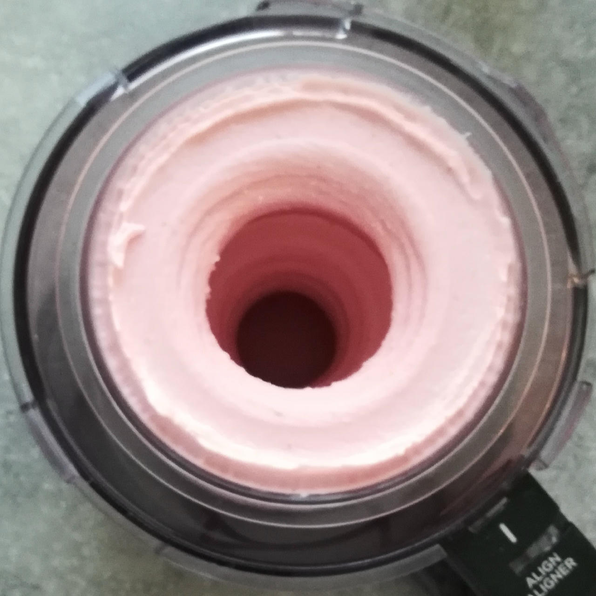
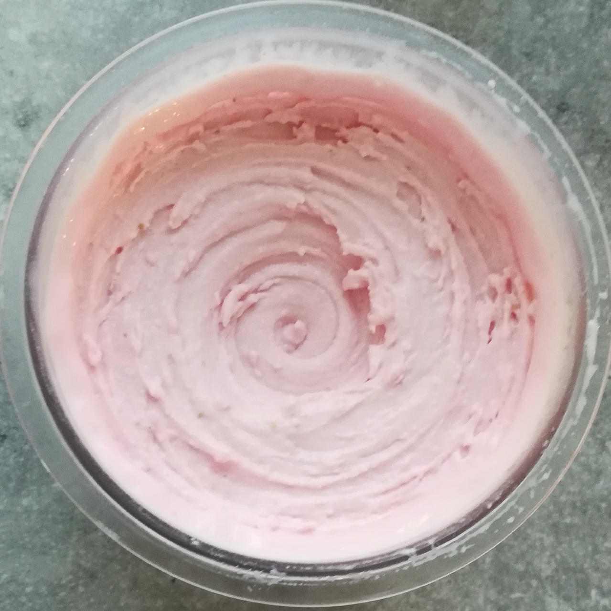
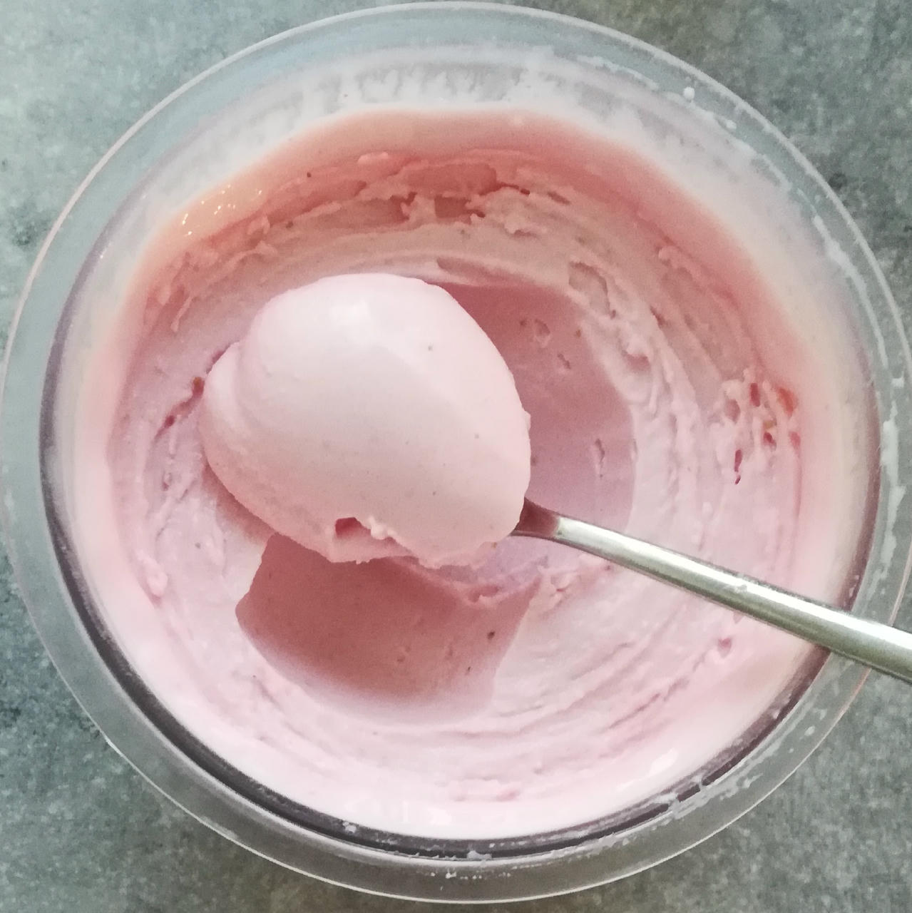
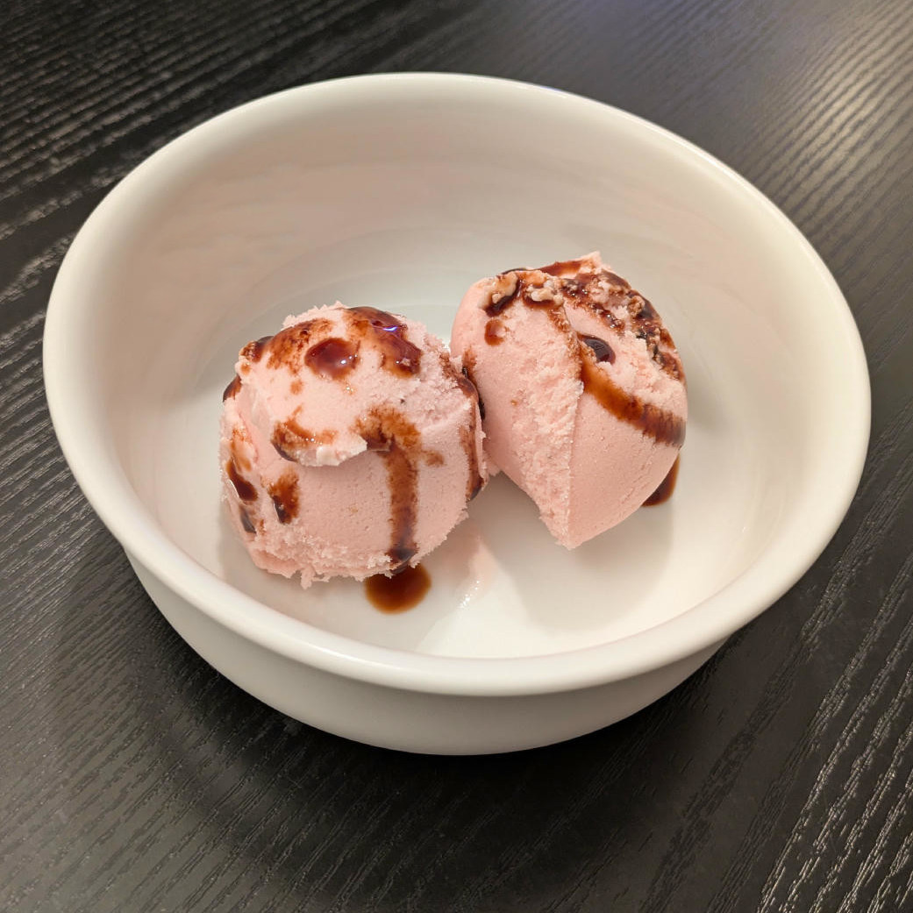

# Strawberry FroYo (Deluxe)

Frozen yogurt with fruit, cream cheese, and unflavored whey/casein protein.

You can replace the strawberries by other fruit, or fruit powder (see “Optional”). Adapt the amount of water or milk to fill up to MAX accordingly.

Processed on *FroYo*, with scrape-down and a mix-in.

> 
> 
> 

Rating: 😋🍦🍓🍓🍓 (sweet firm softness)

> 

# INGREDIENTS

ℹ️ Brand names are in square brackets `[...]`.

**Wet**

  - _350ml_ Yogurt mild 4% [REWE Bio] • 500g container
  - _25g_ [Cream Cheese 23% \[Exquisa\]](/ice-creamery/info/ingredients/#cream-cheese){target="_blank"}↗
  - _15g_ [Glycerin (E422, VG) \[hd-line\]](/ice-creamery/info/ingredients/#vegetable-glycerin-glycerol-vg-e422){target="_blank"}↗ • Sweetness = 60%; GI = 5; Density = 1.26 g/ml
  - _10g_ [Brandy or Vodka 40 vol%](/ice-creamery/info/ingredients/#alcohol-ethanol){target="_blank"}↗
  - _10ml_ Lemon juice
  - _175g_ Strawberries

**Dry**

  - _35g_ [SweEX (Erythritol + Xylitol 3:2)](/ice-creamery/info/ingredients/#sweex-erythritol-xylitol-blend){target="_blank"}↗ • POD ≈ 90%; GI < 7
  - _10g_ [Salty Stability \[Inulin / GMS / CMC / Guar / XG / Salt\]](/ice-creamery/S/Salty%20Stability/){target="_blank"}↗ • unsweetened “ICSv2”
  - _15g_ [Whey + Casein protein (grass-fed) \[Vilgain\]](/ice-creamery/info/ingredients/#whey-protein){target="_blank"}↗ • with stevia

**Fill to MAX**

  - _35ml_ Water, milk, or yogurt to MAX line
  - _≈3 drops_ Flavor drops Vanilla (sucralose) [IronMaxx] • to taste

**Topping Options**

  - _10ml_ Aceto balsamico di Modena [Due Vittorie] • add as a topping [32kcal, 7.8g sugar]
  - _15ml_ Pomegranate syrup (nar ekşisi) [fersan] • add as a topping [44kcal, 8g sugar]

**Optional / Choices**

  - _175g_ Strawberries • fresh or frozen [54kcal, 10g sugar]
  - _150g_ Blueberries • fresh or frozen [72kcal, 13g sugar]
  - _150g_ Mango • fresh or frozen [93kcal, 20g sugar]
  - _25g_ Ube Yam Root powder [Fil Choice] • like vanilla+pistachio; add more liquid at the end [96kcal, 2g sugar]
  - _25g_ Lingonberry powder [Bio Leis] • add more liquid at the end [88kcal, 18g sugar]
  - _25g_ Strawberry powder [Supergarden] • add more liquid at the end [72kcal, 13g sugar]

# DIRECTIONS

 1. Add "wet" ingredients to empty Creami tub.
 1. Weigh and mix dry ingredients, easiest by adding to a jar with a secure lid and shaking vigorously.
 1. Pour into the tub and *QUICKLY* use an immersion blender on full speed to homogenize everything.
 1. Let blender run until thickeners are properly hydrated, up to 1-2 min. Or blend again after waiting that time.
 1. Add remaining ingredients (to the MAX line) and stir with a spoon.
 1. Put on the lid, freeze for 24h, then spin as usual. Flatten any humps before that.
 1. Process with RE-SPIN mode when not creamy enough after the first spin.

# NUTRITIONAL & OTHER INFO

- **Nutritional values per 100g/ml:** 100g; 84.6 kcal; fat 3.0g; carbs 13.0g; sugar 4.4g; protein 4.3g; salt 0.2g
- **Nutritional values per ½ Deluxe Tub:** 340g; 287.7 kcal; fat 10.3g; carbs 44.1g; sugar 14.9g; protein 14.6g; salt 0.6g
- **Nutritional values total:** 680g; 575.5 kcal; fat 20.7g; carbs 88.3g; sugar 29.8g; protein 29.2g; salt 1.1g
- **FPDF / [PAC](/ice-creamery/info/glossary/#potere-anti-congelante-pac){target="_blank"}↗ (target 20..30):** 31.05
- **Protein / Energy Ratio (ok=12%; hi=20%):** 20.29% • Low-Sugar • Hi-Protein
- **Milk Solids Non-Fat ([MSNF](/ice-creamery/info/glossary/#milk-solids-not-fat-msnf){target="_blank"}↗, 7-11%):** 51.9g • 7.6%
- **Net carbs:** 45.9g • *∝ 5 servings@136g:* 9.2g • *∝ 3 servings@227g:* 15.3g • *energy ratio (low <20%):* 31.9%
- **10g 'Salty Stability' is:** 7.3g Inulin • 1.2g Glycerol Monostearate (GMS / E471) • 0.6g Tylose powder (E466, Tylo, CMC) • 0.4g Guar gum (E412) • 0.33g Salt • 0.13g Xanthan gum (E415, XG).
