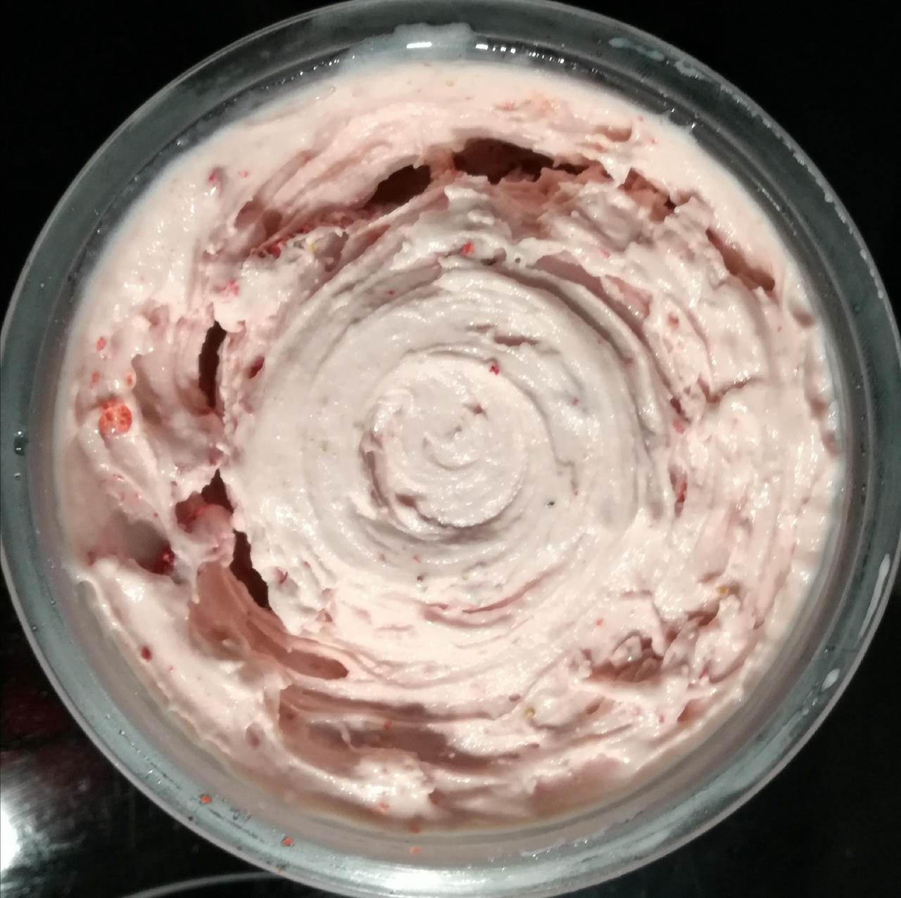

# Strawberry Ice Cream (Deluxe)

Process on Lite Ice Cream directly from the freezer, fill the hole with crumbled dried strawberry slices, and work them in via a mix-in run.

Intense flavor, very creamy, dense and free of ice crystals, with a nice crunch from the mix-in.

> 

Rating: 😋😋😋😋😋

# INGREDIENTS

ℹ️ Brand names are in square brackets `[...]`.

**Wet**

  - _300ml_ [Soy milk 1.6% (sugar-free) \[Berief\]](/ice-creamery/info/ingredients/#soy-milk){target="_blank"}↗
  - _225g_ Strawberries
  - _50g_ [Cream Cheese 23% \[Exquisa\]](/ice-creamery/info/ingredients/#cream-cheese){target="_blank"}↗
  - _20g_ [Glycerin (E422, VG) \[hd-line\]](/ice-creamery/info/ingredients/#vegetable-glycerin-glycerol-vg-e422){target="_blank"}↗ • POD = 60%; GI = 5; Density = 1.26 g/ml
  - _10g_ [Brandy or Vodka 40 vol%](/ice-creamery/info/ingredients/#alcohol-ethanol){target="_blank"}↗

**Dry**

  - _30g_ ICSv2 [Erythritol / Inulin / CMC / Guar / XG / Salt] • [http﹕//bit.ly/4frc4Vj](https://jhermann.github.io/ice-creamery/I/Ice%20Cream%20Stabilizer%20(ICS)/)
  - _25g_ [Xylitol (E967)](/ice-creamery/info/ingredients/#xylitol-e967){target="_blank"}↗ • POD = 100%; GI = 7
  - _25g_ [Soy protein isolate (nature) \[Powerstar\]](/ice-creamery/info/ingredients/#soy-protein-isolate){target="_blank"}↗ • 1kg bag, unsweetened, unflavored

**Fill to MAX**

  - _35ml_ Water to MAX line
  - _3–5 drops_ Flavor drops Vanilla (sucralose) [IronMaxx] • to taste

# DIRECTIONS

 1. Add "wet" ingredients to empty Creami tub.
 1. Weigh and mix dry ingredients, easiest by adding to a jar with a secure lid and shaking vigorously.
 1. Pour into the tub and *QUICKLY* use an immersion blender on full speed to homogenize everything.
 1. Let blender run until thickeners are properly hydrated, up to 1-2 min. Or blend again after waiting that time.
 1. Add remaining ingredients (to the MAX line) and stir with a spoon.
 1. Put on the lid, freeze for 24h, then spin as usual. Flatten any humps before that.
 1. Process with RE-SPIN mode when not creamy enough after the first spin.

# NUTRITIONAL & OTHER INFO
- **Nutritional values per 100g/ml:** 100g; 79.4 kcal; fat 2.4g; carbs 12.6g; sugar 2.1g; protein 5.0g; salt 0.2g
- **Nutritional values per ½ Deluxe Tub:** 360g; 285.7 kcal; fat 8.6g; carbs 45.5g; sugar 7.7g; protein 18.0g; salt 0.9g
- **Nutritional values total:** 720g; 571.4 kcal; fat 17.2g; carbs 91.0g; sugar 15.4g; protein 36.0g; salt 1.7g
- **FPDF / [PAC](/ice-creamery/info/glossary/#potere-anti-congelante-pac){target="_blank"}↗ (target 20..30):** 30.93
- **Protein / Energy Ratio (ok=12%; hi=20%):** 25.22% • LOW-FAT • Low-Sugar • Hi-Protein
- **Milk Solids Non-Fat ([MSNF](/ice-creamery/info/glossary/#milk-solids-not-fat-msnf){target="_blank"}↗, 7-11%):** 28.1g • 3.9%
- **Net carbs:** 28.7g • *∝ 5 servings@144g:* 5.7g • *∝ 3 servings@240g:* 9.6g
- **Nov 15, 2024:** Swap whey with SMP
- **Jun 21, 2025:** Switched to soy milk and protein
- **30g Ice Cream Stabilizer (ICSv2) is:** 13.8g Erythritol (E968) • 13.8g Inulin • 1.4g Tylose powder (E466, Tylo, CMC) • 0.48g Guar gum (E412) • 0.48g Salt • 0.14g Xanthan gum (E415, XG).
