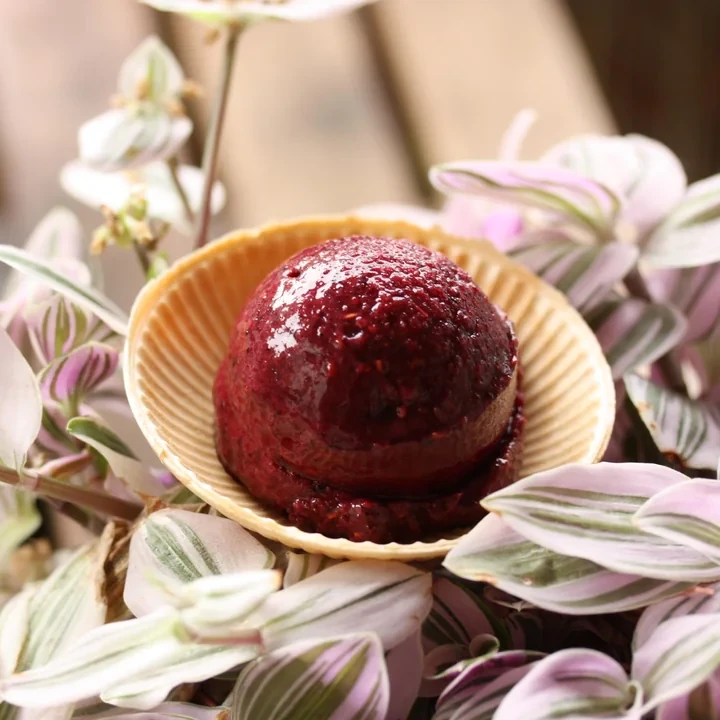
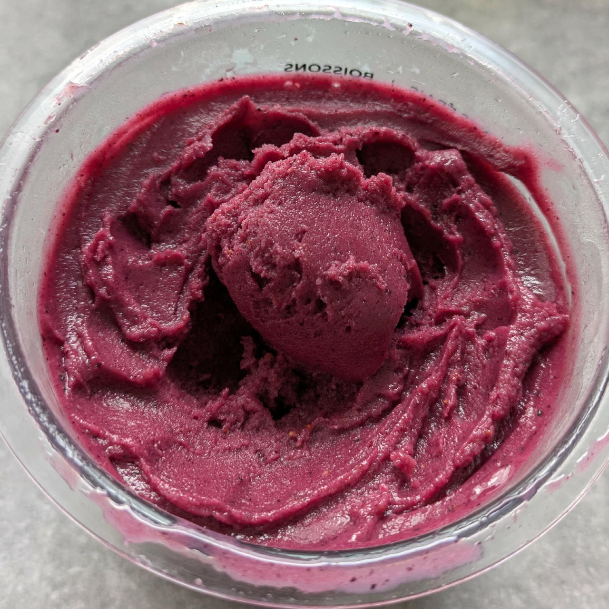
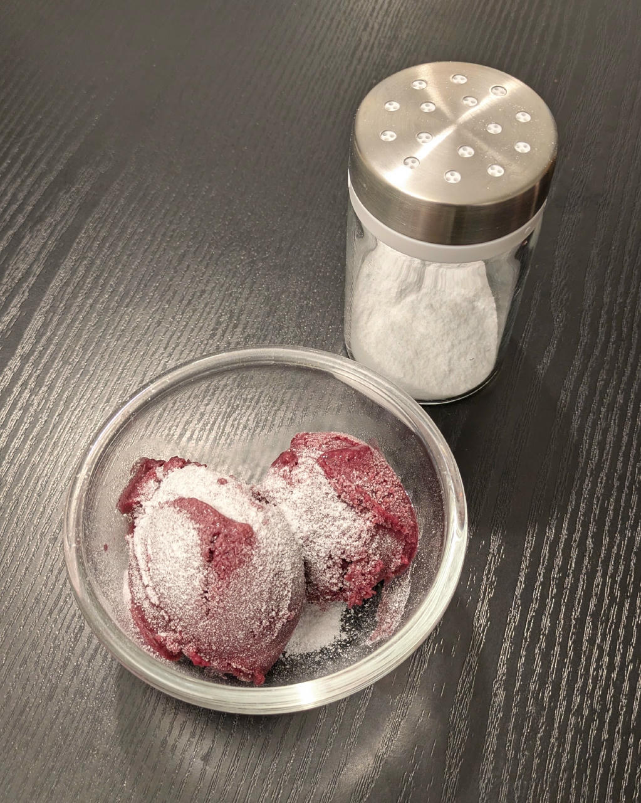
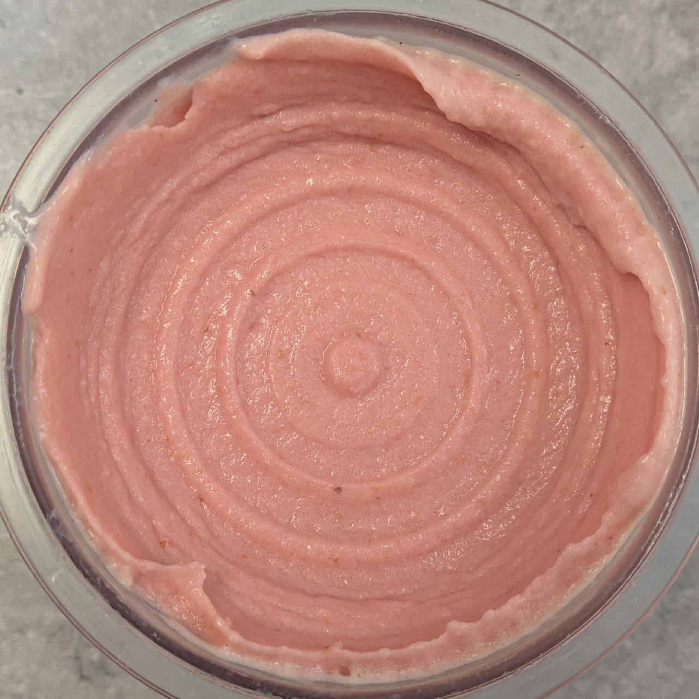
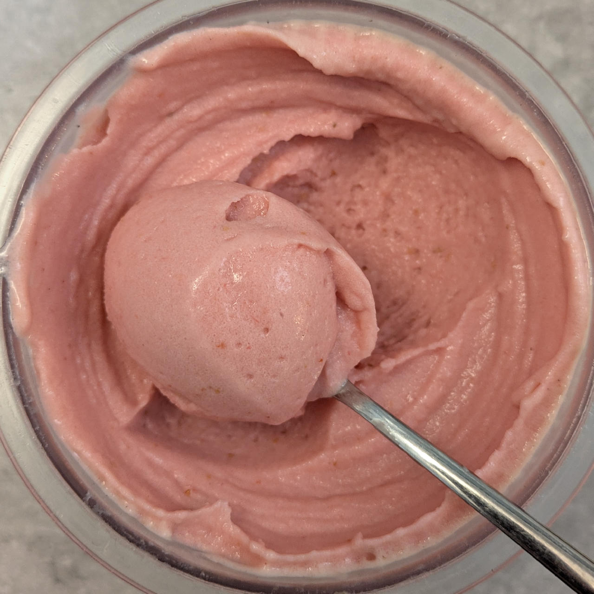

# Strawberry Sangria (Deluxe)

> 🌿 **Vegan & Dairy-free** Recipe is using only fruit and no dairy.

This creamy sorbet is inspired by Sangria, a refreshing, fruity, alcoholic punch originating from Spain and Portugal.

>💡**Using mulled wine** If you can get ahold of it, mulled wine from berries (Bär Gløgg) is a great alternative to the red wine.

Process on *Sorbet*, then a scrape-down and a mix-in run.
Comes out “soft scoopable”, refreeze for at least 1–2 hours.

> 
> 

Rating: 😋🍷🍓🍓🍓

> 
> 
> *Served a day later, with a drizzle of pomegranate syrup.*

> 
> 
> *Variation by [u/\_phillimore](https://www.reddit.com/user/_phillimore/): Pinot noir, blueberries, and raspberries.*

> 
> 
> 
> *Using a 1:1 mix of strawberries and blueberries, 15g inulin, 15g soy protein, 1g XG, and 1.5g CMC. Served with a dusting of powdered erythritol.*

> 
> 
> 
> 
> Dec 2025: Processed on Sorbet, held under tap water, scrape-down, respin.

# INGREDIENTS

ℹ️ Brand names are in square brackets `[...]`.

**Wet**

  - _400g_ Strawberries • Alternatives: blueberries, berry mix, ...
  - _200ml_ Red Wine 13 vol% (dry) • also works with rosé or white wine
  - _20ml_ Lime juice + zest (organic) [REWE Bio] • 1 lime = 60..65g
  - _10g_ [Glycerin (E422, VG) \[hd-line\]](/ice-creamery/info/ingredients/#vegetable-glycerin-glycerol-vg-e422){target="_blank"}↗ • Sweetness = 60%; GI = 5; Density = 1.26 g/ml

**Dry**

  - _20g_ [Inulin \[Vit4ever\]](/ice-creamery/info/ingredients/#inulin){target="_blank"}↗ • Sweetness = 8%; GI ~= 0
  - _1g_ Salt
  - _1g_ [Xanthan gum (E415, XG)](/ice-creamery/info/ingredients/#xanthan-gum-xg-e415){target="_blank"}↗

**Fill to MAX**

  - _28ml_ [Soy milk 1.6% (sugar-free) \[Berief\]](/ice-creamery/info/ingredients/#soy-milk){target="_blank"}↗ • fill to MAX line
  - _6–12 drops_ Flavor drops Strawberry (sucralose) [IronMaxx] • to taste

# DIRECTIONS

 1. Zest the lime first, before juicing it.
 1. Add "wet" ingredients to empty Creami tub.
 1. Weigh and mix dry ingredients, easiest by adding to a jar with a secure lid and shaking vigorously.
 1. Pour into the tub and *QUICKLY* use an immersion blender on full speed to homogenize everything.
 1. Let blender run until thickeners are properly hydrated, up to 1-2 min. Or blend again after waiting that time.
 1. Add remaining ingredients (to the MAX line) and stir with a spoon.
 1. For better results, let the base age in the fridge (covered, lid on), for a few hours or over night. This helps flavor development and gum hydration, especially with unheated bases.
 1. Freeze for 24h with lid on, then spin as usual. Flatten any humps before that.
 1. Process with RE-SPIN mode when not creamy enough after the first spin.

# NUTRITIONAL & OTHER INFO

- **Nutritional values per 100g/ml:** 100g; 57.7 kcal; fat 0.3g; carbs 8.3g; sugar 3.8g; protein 0.6g; salt 0.2g
- **Nutritional values per ½ Deluxe Tub:** 340g; 196.3 kcal; fat 1.0g; carbs 28.3g; sugar 13.1g; protein 2.1g; salt 0.5g
- **Nutritional values total:** 680g; 392.6 kcal; fat 2.1g; carbs 56.6g; sugar 26.1g; protein 4.2g; salt 1.1g
- **FPDF / [PAC](/ice-creamery/info/glossary/#potere-anti-congelante-pac){target="_blank"}↗ (target 20..30):** 33.50
- **Protein / Energy Ratio (ok=12%; hi=20%):** 4.26% • LOW-FAT • Low-Sugar
- **Milk Solids Non-Fat ([MSNF](/ice-creamery/info/glossary/#milk-solids-not-fat-msnf){target="_blank"}↗, 7-11%):** 1.1g • 0.2%
- **Net carbs:** 33.8g • *∝ 5 servings@136g:* 6.8g • *∝ 3 servings@227g:* 11.3g • *energy ratio (low <20%):* 34.4%
