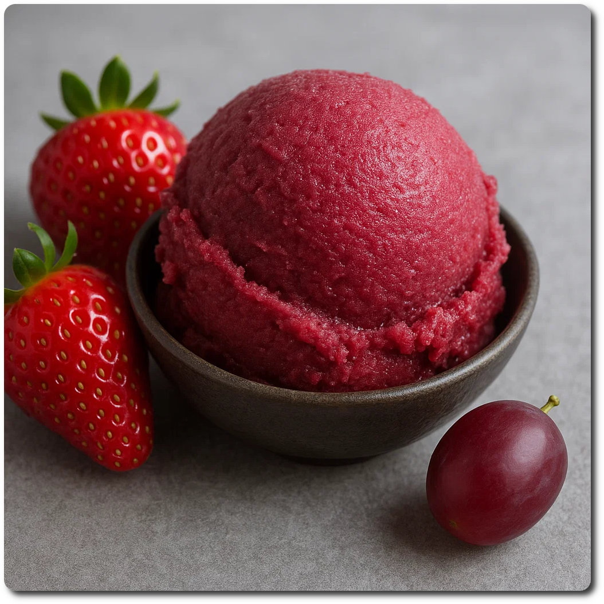

# Strawberry Sangria (Deluxe)

> 🌿 **Vegan & Dairy-free** Recipe is using only fruit and no dairy.

This creamy sorbet is inspired by Sangria, a refreshing, fruity, alcoholic punch originating from Spain and Portugal.

Process on *Sorbet*, then a scrape-down and a mix-in run.
Comes out “soft scoopable”, refreeze for at least 1–2 hours.

> 
> 

Rating: 😋🍷🍓🍓🍓

>  
> *Served a day later, with a drizzle of pomegranate syrup.*

💡 If you can get ahold of it, mulled wine from berries (Bär Gløgg) is a great alternative to the red wine.

# INGREDIENTS

ℹ️ Brand names are in square brackets `[...]`.

**Wet**

  - _400g_ Strawberries • Alternatives: blueberries, berry mix, ...
  - _200ml_ Red Wine 13 vol% (dry) • also works with rosé or white wine
  - _20ml_ Lime juice + zest (organic) [REWE Bio] • 1 lime = 60..65g
  - _10g_ [Glycerin (E422, VG) \[hd-line\]](/ice-creamery/info/ingredients/#vegetable-glycerin-glycerol-vg-e422){target="_blank"}↗ • Sweetness = 60%; GI = 5; Density = 1.26 g/ml

**Dry**

  - _20g_ [Inulin \[Vit4ever\]](/ice-creamery/info/ingredients/#inulin){target="_blank"}↗ • Sweetness = 8%; GI ~= 0
  - _1g_ Salt
  - _1g_ [Xanthan gum (E415, XG)](/ice-creamery/info/ingredients/#xanthan-gum-xg-e415){target="_blank"}↗

**Fill to MAX**

  - _68ml_ [Soy milk 1.6% (sugar-free) \[Berief\]](/ice-creamery/info/ingredients/#soy-milk){target="_blank"}↗ • fill to MAX line
  - _10 drops_ Flavor drops Strawberry (sucralose) [IronMaxx] • to taste

# DIRECTIONS

 1. Zest the lime first, before juicing it.
 1. Add "wet" ingredients to empty Creami tub.
 1. Weigh and mix dry ingredients, easiest by adding to a jar with a secure lid and shaking vigorously.
 1. Pour into the tub and *QUICKLY* use an immersion blender on full speed to homogenize everything.
 1. Let blender run until thickeners are properly hydrated, up to 1-2 min. Or blend again after waiting that time.
 1. Add remaining ingredients (to the MAX line) and stir with a spoon.
 1. Put on the lid, freeze for 24h, then spin as usual. Flatten any humps before that.
 1. Process with RE-SPIN mode when not creamy enough after the first spin.

# NUTRITIONAL & OTHER INFO
- **Nutritional values per 100g/ml:** 100g; 56.2 kcal; fat 0.4g; carbs 5.4g; sugar 3.6g; protein 0.7g; salt 0.2g
- **Nutritional values per ½ Deluxe Tub:** 360g; 202.3 kcal; fat 1.4g; carbs 19.6g; sugar 13.1g; protein 2.7g; salt 0.6g
- **Nutritional values total:** 720g; 404.6 kcal; fat 2.7g; carbs 39.2g; sugar 26.1g; protein 5.4g; salt 1.1g
- **FPDF / [PAC](/ice-creamery/info/glossary/#potere-anti-congelante-pac){target="_blank"}↗ (target 20..30):** 31.67
- **Protein / Energy Ratio (ok=12%; hi=20%):** 5.32% • LOW-FAT • Low-Sugar
- **Milk Solids Non-Fat ([MSNF](/ice-creamery/info/glossary/#milk-solids-not-fat-msnf){target="_blank"}↗, 7-11%):** 0.0g • 0.0%
