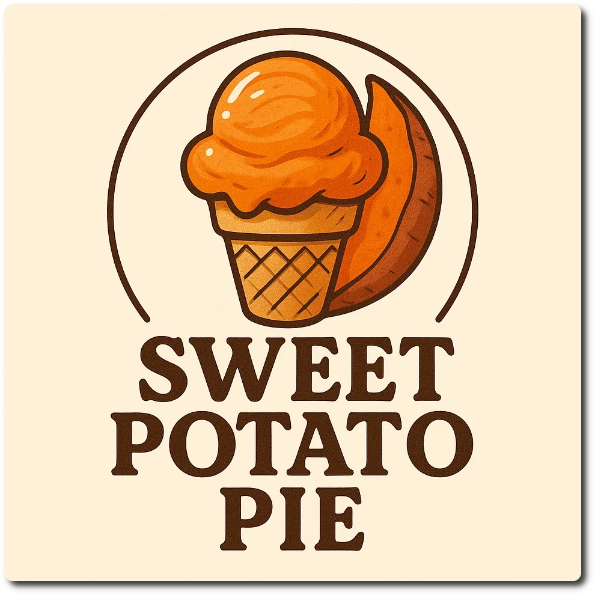

# Sweet Potato Pie (Deluxe)

> 🌿 **Vegan & Dairy-free** Recipe is using only soy milk and protein.

Process on *Lite Ice Cream*, [hold it shortly under running water](https://jhermann.github.io/ice-creamery/info/tips%2Btricks/#handling-of-icy-sides-bottom)
*after* that. Then a scrape-down and a respin.

> 

Rating: 😋 (untested)

> *Inspired by [/u/Chris-Shugart](https://www.reddit.com/user/Chris-Shugart/) on Reddit.*

# INGREDIENTS

ℹ️ Brand names are in square brackets `[...]`.

**Prep**

  - _150g_ Sweet potato (baked) • 1 potato ~130g

**Wet**

  - _300ml_ [Soy milk 1.6% (sugar-free) \[Berief\]](/ice-creamery/info/ingredients/#soy-milk){target="_blank"}↗
  - _20g_ [Glycerin (E422, VG) \[hd-line\]](/ice-creamery/info/ingredients/#vegetable-glycerin-glycerol-vg-e422){target="_blank"}↗ • POD = 60%; GI = 5; Density = 1.26 g/ml
  - _10g_ [Brandy or Vodka 40 vol%](/ice-creamery/info/ingredients/#alcohol-ethanol){target="_blank"}↗

**Dry**

  - _40g_ [Soy protein isolate (nature) \[Powerstar\]](/ice-creamery/info/ingredients/#soy-protein-isolate){target="_blank"}↗ • 1kg bag, unsweetened, unflavored
  - _30g_ [Xylitol](/ice-creamery/info/ingredients/#xylitol-e967){target="_blank"}↗ • POD = 100%; GI = 7
  - _15g_ [Inulin \[Vit4ever\]](/ice-creamery/info/ingredients/#inulin){target="_blank"}↗ • Sweetness = 8%; GI ~= 0
  - _3g_ [Vanilla Bean Powder \[InterVanilla\]](/ice-creamery/info/ingredients/#cocoa-powder){target="_blank"}↗
  - _1.5g_ Cinnamon (Ceylon) • to taste; 1tsp = 3g
  - _1.5g_ Salt
  - _1g_ Nutmeg • to taste; 1tsp ≈ 3g

**Fill to MAX**

  - _148ml_ [Soy milk 1.6% (sugar-free) \[Berief\]](/ice-creamery/info/ingredients/#soy-milk){target="_blank"}↗ • fill to MAX
  - _3–6 drops_ Flavor drops Cookies&Cream (stevia) [Nick’s] • to taste

# DIRECTIONS

 1. Bake the potato at 200°C for 50–60 min (in an air fryer).
 1. When cooled down, scoop out the flesh into an empty Creami tub.
 1. Then add all the other ‘wet’ ingredients.
 1. Weigh and mix dry ingredients, easiest by adding to a jar with a secure lid and shaking vigorously.
 1. Pour into the tub and *QUICKLY* use an immersion blender on full speed to homogenize everything.
 1. Add remaining ingredients (to the MAX line) and stir with a spoon.
 1. Put on the lid, freeze for 24h, then spin as usual. Flatten any humps before that.
 1. Process with RE-SPIN mode when not creamy enough after the first spin.

# NUTRITIONAL & OTHER INFO
- **Nutritional values per 100g/ml:** 100g; 88.6 kcal; fat 1.1g; carbs 12.1g; sugar 1.6g; protein 7.3g; salt 0.4g
- **Nutritional values per ½ Deluxe Tub:** 360g; 318.9 kcal; fat 3.9g; carbs 43.7g; sugar 5.7g; protein 26.2g; salt 1.5g
- **Nutritional values total:** 720g; 637.7 kcal; fat 7.7g; carbs 87.3g; sugar 11.3g; protein 52.4g; salt 2.9g
- **FPDF / [PAC](/ice-creamery/info/glossary/#potere-anti-congelante-pac){target="_blank"}↗ (target 20..30):** 27.39
- **Protein / Energy Ratio (ok=12%; hi=20%):** 32.84% • LOW-FAT • Low-Sugar • Hi-Protein
- **Milk Solids Non-Fat ([MSNF](/ice-creamery/info/glossary/#milk-solids-not-fat-msnf){target="_blank"}↗, 7-11%):** 37.2g • 5.2%
