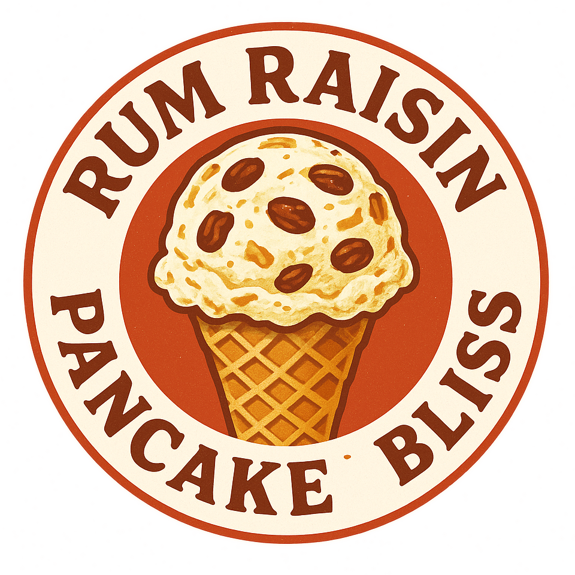

# Topfenpalatschinken (Deluxe)

This ice cream reimagines the classic Austrian “Topfenplataschinken” dessert in frozen form,
blending the creamy tang of quark and lime with some milk to create a rich yet airy base.

Raisins soaked in Jamaica rum provide sweetness and warmth, and serve as a mix-in
together with ribbons of pancake that provide a cake-like tenderness.

Spin on “Lite Ice Cream”, followed by a scrape-down and the mix-in run.

> 
> 
> 

Rating: 😋 (experimental)

# INGREDIENTS

ℹ️ Brand names are in square brackets `[...]`.

**Prep**

  - _125ml_ [Soy milk 1.6% (sugar-free) \[Berief\]](/ice-creamery/info/ingredients/#soy-milk){target="_blank"}↗
  - _75g_ Dinke flour 630 (organic) [REWE Bio] • or any cake flour
  - _60g_ Eggs • 1 medium egg 55–60g
  - _1 pinch_ Salt
  - _15ml_ Avocado oil (extra virgin) [Hunter & Gather] • to fry the pancakes

**Wet**

  - _245g_ [Topfen / Quark 14.4% \[Berchtesgadener\]](/ice-creamery/info/ingredients/#quark-topfen){target="_blank"}↗ • 250g container
  - _100ml_ [Soy milk 1.6% (sugar-free) \[Berief\]](/ice-creamery/info/ingredients/#soy-milk){target="_blank"}↗
  - _20ml_ Lime juice + zest (organic) [REWE Bio] • 1 lime = 60..65g
  - _10g_ [Glycerin (E422, VG) \[hd-line\]](/ice-creamery/info/ingredients/#vegetable-glycerin-glycerol-vg-e422){target="_blank"}↗ • Sweetness = 60%; GI = 5; Density = 1.26 g/ml

**Dry**

  - _35g_ [SweEX (Erythritol + Xylitol 3:2)](/ice-creamery/info/ingredients/#sweex-erythritol-xylitol-blend){target="_blank"}↗ • POD ≈ 85%; GI < 7
  - _5g_ [Salty Stability \[Inulin / GMS / CMC / Guar / XG / Salt\]](/ice-creamery/S/Salty%20Stability/){target="_blank"}↗ • unsweetened “ICSv2”
  - _2g_ Vanilla Bean Powder [InterVanilla]
  - _1g_ Salt

**Mix-ins**

  - _15g_ Sultanas, coarsely chopped (organic) [Biojoy] • soaked overnight [45kcal, 10g sugar]
  - _15g_ [Jamaica Rum 43 vol%](/ice-creamery/info/ingredients/#alcohol-ethanol){target="_blank"}↗ • soaked up by the raisins
  - _160g_ Pancake stripes • as prepared

# DIRECTIONS

 1. Bake the pancakes from the ‘prep’ ingredients in a pan, with a little oil or butter.
 1. Let them cool down, cut into ribbons, store in the fridge as a mix-in.
 1. Chop the raisins, put into a container with lid, cover them with rum, and chill until the next day.
 1. Zest the lime first, *before* juicing it.
 1. Add "wet" ingredients to empty Creami tub.
 1. Weigh and mix dry ingredients, easiest by adding to a jar with a secure lid and shaking vigorously.
 1. Pour into the tub and *QUICKLY* use an immersion blender on full speed to homogenize everything.
 1. Let blender run until thickeners are properly hydrated, up to 1-2 min. Or blend again after waiting that time.
 1. Put on the lid, freeze for 24h, then spin as usual. Flatten any humps before that.
 1. Process with RE-SPIN mode when not creamy enough after the first spin.
 1. *As a mix-in*, use the soaked raisins (without any remaining fluid) and the pancake stripes.
 1. Process with MIX-IN after adding mix-ins evenly. For that, add partial amounts into a hole going down to the bottom, and fold the ice cream over, building pockets of mix-ins.

# NUTRITIONAL & OTHER INFO

- **Nutritional values per 100g/ml:** 100g; 161.9 kcal; fat 8.4g; carbs 17.2g; sugar 2.8g; protein 6.2g; salt 0.2g
- **Nutritional values per ½ Deluxe Tub:** 340g; 550.6 kcal; fat 28.4g; carbs 58.5g; sugar 9.6g; protein 21.0g; salt 0.8g
- **Nutritional values total:** 723g; 1170.9 kcal; fat 60.4g; carbs 124.4g; sugar 20.5g; protein 44.6g; salt 1.7g
- **FPDF / [PAC](/ice-creamery/info/glossary/#potere-anti-congelante-pac){target="_blank"}↗ (target 20..30):** 32.01
- **Protein / Energy Ratio (ok=12%; hi=20%):** 15.24% • Low-Sugar
- **Milk Solids Non-Fat ([MSNF](/ice-creamery/info/glossary/#milk-solids-not-fat-msnf){target="_blank"}↗, 7-11%):** 16.2g • 2.2%
- **Net carbs:** 80.7g • *∝ 5 servings@145g:* 16.1g • *∝ 3 servings@241g:* 26.9g • *energy ratio (low <20%):* 27.6%
- **5g 'Salty Stability' is:** 3.7g Inulin • 0.6g Glycerol Monostearate (GMS / E471) • 0.3g Tylose powder (E466, Tylo, CMC) • 0.2g Guar gum (E412) • 0.17g Salt • 0.07g Xanthan gum (E415, XG).
