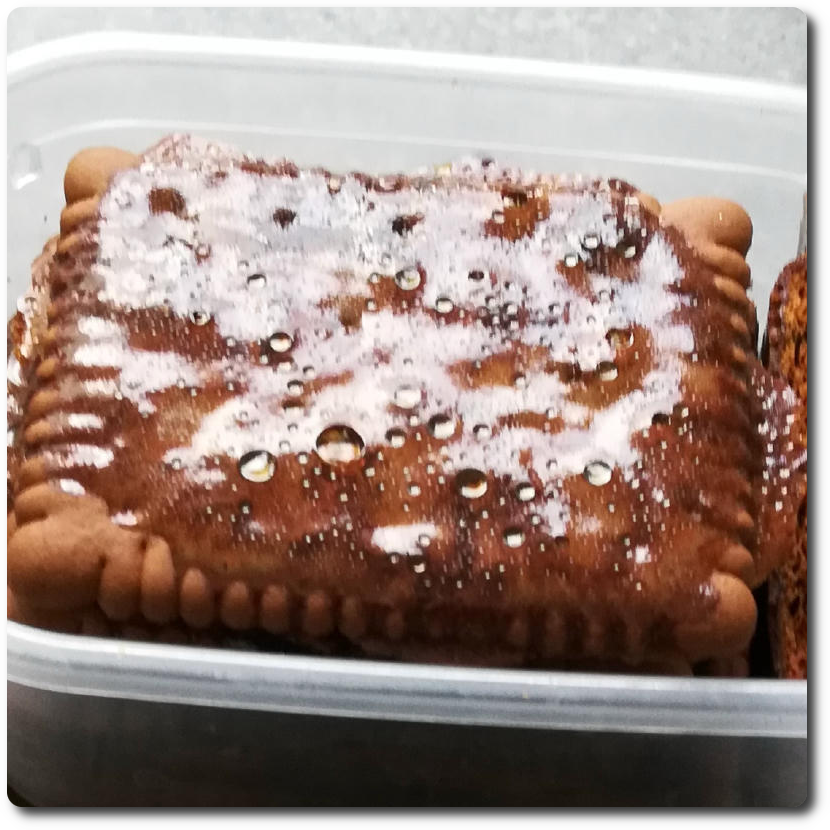
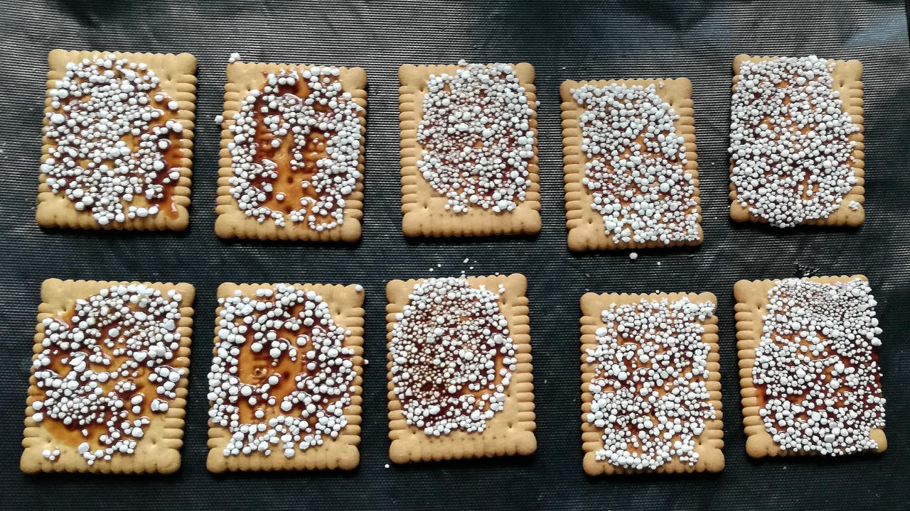
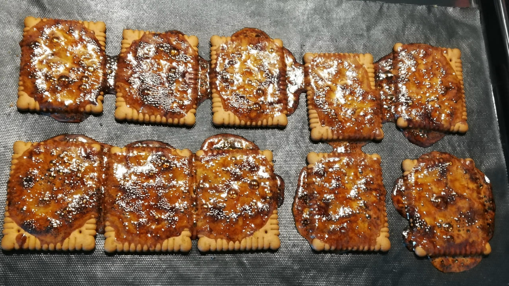
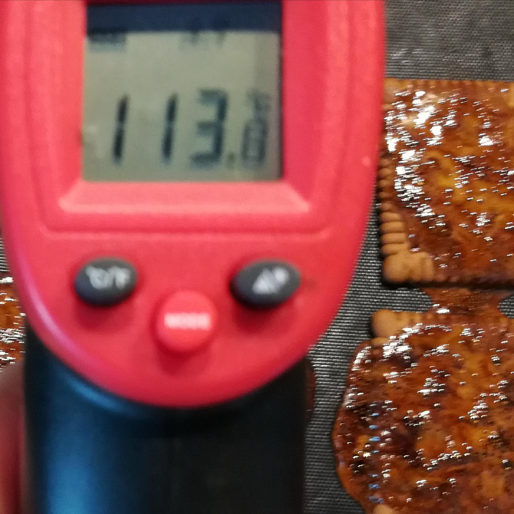

## Candied Buttercookies (Mix-in or Topping)

Candied buttercookies or graham crackers, glazed with molasses and isomalt.

Isomalt, a sugar alcohol derived from beet sugar, provides a crisp texture and mild sweetness
while maintaining a glossy finish that resists moisture. Its low glycemic index keeps the
sugar added to the cookies in check.

> ⚠️ Molten isomalt is dangerous and can *severely burn* you, so be vigilant. 

> 
> 
> 

*Ingredients*

  - _50g_ Buttercookies [Leibniz/Bahlsen] • 1 cookie = 5g
  - _25g_ [Isomalt (E953) \[GoodBake\]](/ice-creamery/info/ingredients/#isomalt-e953){target="_blank"}↗ • 5 heaped tsp
  - _15g_ Molasses [Grafschafter Goldsaft]

*Directions*

 1. Preheat your oven to 170°C (340°F).
 2. Drizzle a dollop of molasses on every 2nd cookie, and use the other one in each pair to equally spread it over one side of each cookie.
 3. Pour the isomalt into a small flat container (ideally only a bit larger than the cookies), and coat each cookie with isomalt, using the molasses as the glue.
 4. Put the cookies on a baking sheet covered with parchment paper, or onto a silicone / BBQ mat.
 5. Bake at 170°C for 11–15 minutes, until all crystals are molten.
 6. Let the cookies cool down and harden, check the temperature for below 40°C with an infrared thermometer.
 7. Store in an air-tight container.

*Nutritional & Other Info*

- **Nutritional values per 100g/ml:** 100g; 358.2 kcal; fat 6.8g; carbs 78.9g; sugar 22.7g; protein 5.1g; salt 0.8g
- **Nutritional values per serving:** 15g; 53.7 kcal; fat 1.0g; carbs 11.8g; sugar 3.4g; protein 0.8g; salt 0.1g
- **Nutritional values total:** 90g; 322.4 kcal; fat 6.1g; carbs 71.0g; sugar 20.4g; protein 4.5g; salt 0.8g
