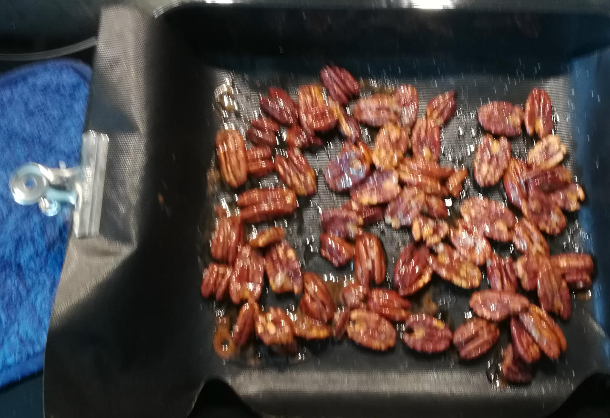
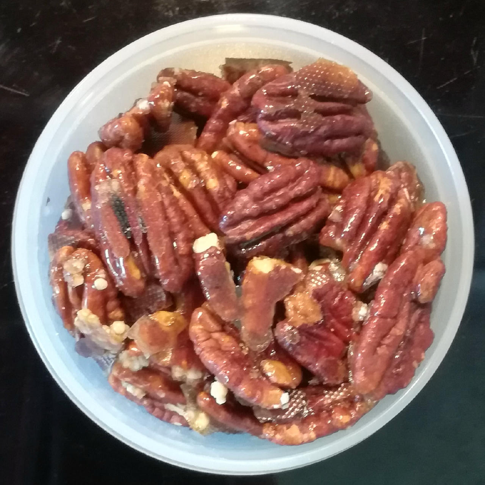

## Candied Nuts
-

Candied nuts made with isomalt offer a lower-calorie, tooth-friendly alternative
to traditional sugar-coated varieties.

Isomalt, a sugar alcohol derived from beet sugar, provides a crisp texture and mild sweetness
while maintaining a glossy finish that resists moisture. Its low glycemic index makes these treats
suitable for low-carb diets.

*Ingredients*

  - _100g_ Pecan nuts (organic) [Biojoy] • 10 halves = 15g
  - _30g_ [Isomalt (E953) \[GoodBake\]](/ice-creamery/info/ingredients/#isomalt-e953){target="_blank"}↗ • 6 heaped tsp
  - _5g_ Molasses [Grafschafter Goldsaft]
  - _0.70g_ Salt • 18 quick shakes (with my shaker)

> 
> 
> 

*Directions*

> ⚠️ Molten isomalt is dangerous and can *severely burn* you, so be vigilant.

 1. Preheat your oven to 170°C (340°F).
 1. *Optionally* break the nuts into smaller but uniformly sized pieces.
 1. Rinse the nuts shortly under running water, and drain the excess.
 1. Put them into a medium-sized bowl, drizzle the molasses over the nuts, and mix with a spoon to coat all pieces equally well.
 1. Sprinkle the isomalt crystals and salt over the nuts, and mix again for uniformly covering everything.
 1. Put the nuts in a single layer on a baking sheet covered with parchment paper, or onto a silicone / BBQ mat.
 1. Bake at 170°C for 13–17 minutes, until all crystals are molten.
 1. Let the nuts cool down and harden, check the temperature for below 40°C with an infrared thermometer.
 1. Store in an air-tight container, in the freezer.

*Nutritional & Other Info*

- **Nutritional values per 100g/ml:** 100g; 594.8 kcal; fat 53.1g; carbs 27.4g; sugar 5.4g; protein 6.9g; salt 0.5g
- **Nutritional values per serving:** 15g; 89.2 kcal; fat 8.0g; carbs 4.1g; sugar 0.8g; protein 1.0g; salt 0.1g
- **Nutritional values total:** 136g; 807.1 kcal; fat 72.0g; carbs 37.2g; sugar 7.3g; protein 9.3g; salt 0.7g
