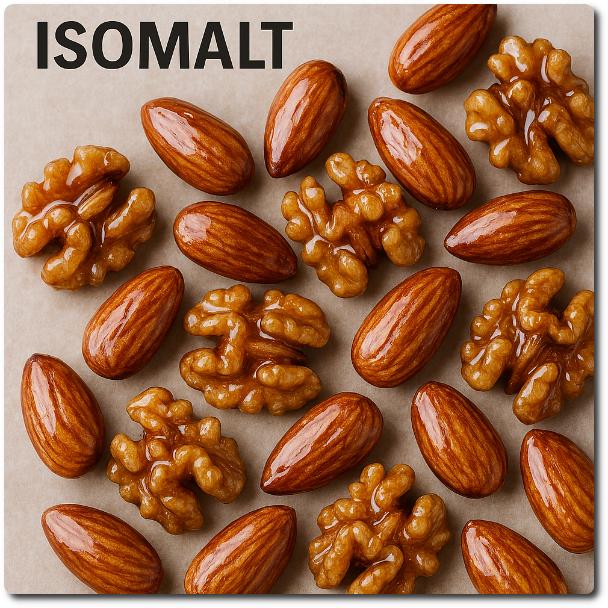
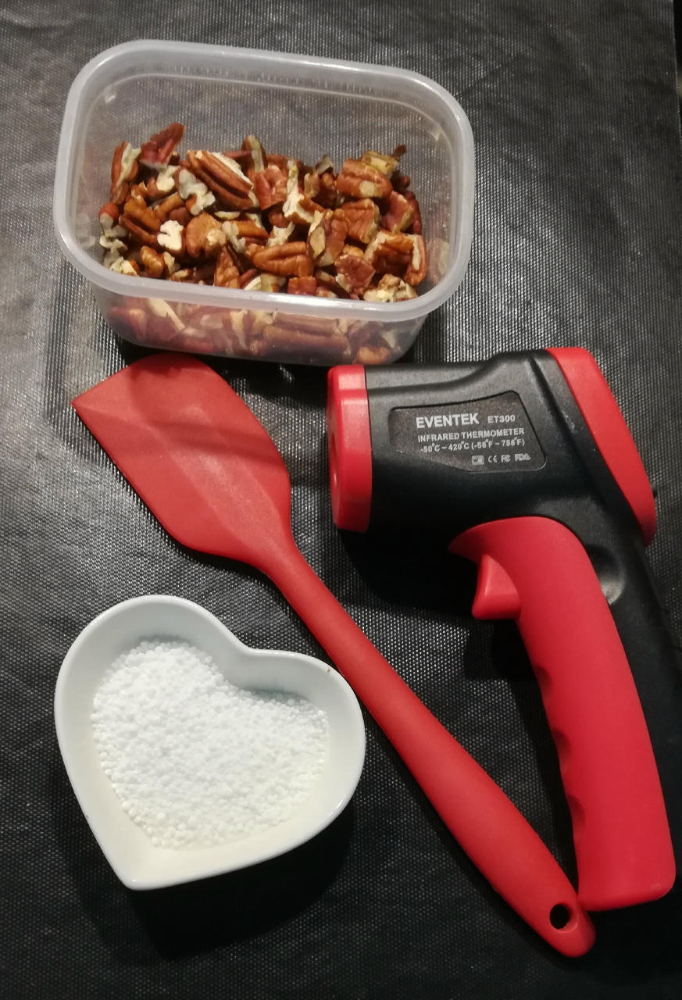
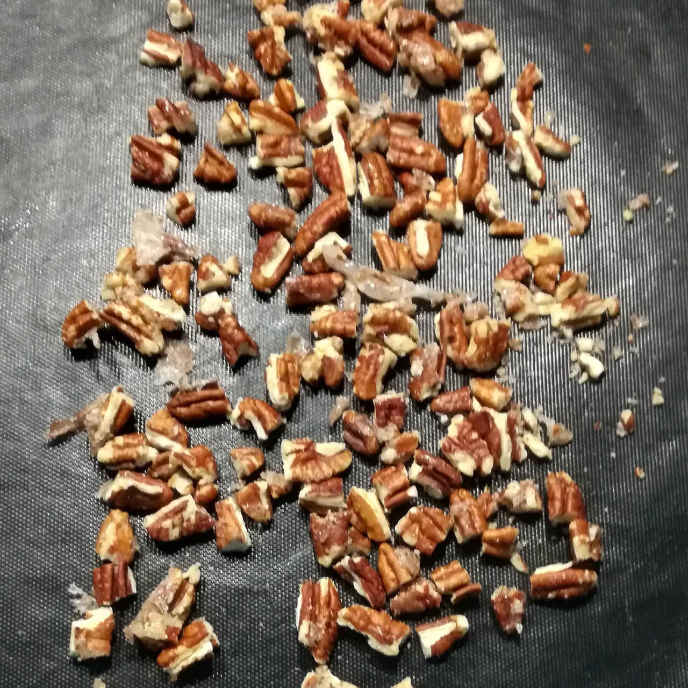

## Candied Nuts

Candied nuts made with isomalt offer a lower-calorie, tooth-friendly alternative
to traditional sugar-coated varieties.

Isomalt, a sugar alcohol derived from beet sugar, provides a crisp texture and mild sweetness
while maintaining a glossy finish that resists moisture. Its low glycemic index makes these treats
suitable for low-carb diets.

*Ingredients*

  - _50g_ Pecan nuts (organic) [Biojoy] • 10 halves = 15g
  - _15g_ [Isomalt (E953) \[GoodBake\]](/ice-creamery/info/ingredients/#isomalt-e953){target="_blank"}↗ • 3 heaped tsp
  - _0.35g_ Salt • 10 quick shakes (with my shaker)

> 
> 

*Directions*

 1. To prepare the nuts, break them into halves or into smaller but uniformly sized pieces.
 1. Heat the isomalt in a skillet on medium heat, until it melts at 150–160°C.
 1. Take off the heat and let cool for a minute.
 1. Mix in the nuts, stir until every piece is fully covered.
 1. To cool down and harden, put the nuts in a single layer on a baking sheet covered with parchement paper, or onto a silicone mat.
 1. Store in an air-tight container, in the freezer.

*Nutritional & Other Info*

- **Nutritional values per 100g/ml:** 100g; 605.8 kcal; fat 55.1g; carbs 25.8g; sugar 3.1g; protein 7.0g; salt 0.5g
- **Nutritional values per serving:** 22g; 133.3 kcal; fat 12.1g; carbs 5.7g; sugar 0.7g; protein 1.5g; salt 0.1g
- **Nutritional values total:** 65g; 395.9 kcal; fat 36.0g; carbs 16.9g; sugar 2.0g; protein 4.6g; salt 0.4g
