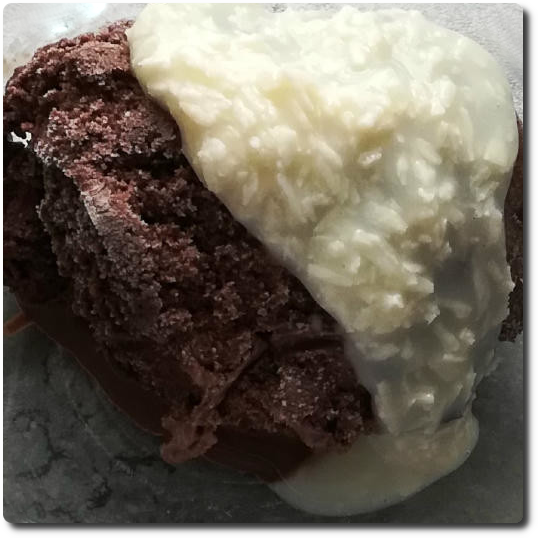

## Cocover

*/koʊˈkʌvɚ/* – Topping to cover your scoops in coconut flavor.

Combine the dry ingredients in a small bowl, and blend into the wet ones.
Let the flakes hydrate for a few hours in the fridge.

*Nutritional values total:* 151g; 224.1 kcal; fat 11.2g; carbs 14.0g; sugar 7.4g; protein 4.8g; salt 0.1g

**Wet**

  - _95ml_ [Soy milk 1.6% (sugar-free) \[Berief\]](/ice-creamery/info/ingredients/#soy-milk){target="_blank"}↗
  - _40ml_ [Batida de Côco 16 vol% \[Mangaroca\]](/ice-creamery/info/ingredients/#alcohol-ethanol){target="_blank"}↗ • 1 bottle = 700ml

**Dry**

  - _15g_ Coconut flakes (desiccated) [Biojoy]
  - _0.75g_ [Guar gum (E412)](/ice-creamery/info/ingredients/#guar-gum-e412){target="_blank"}↗
