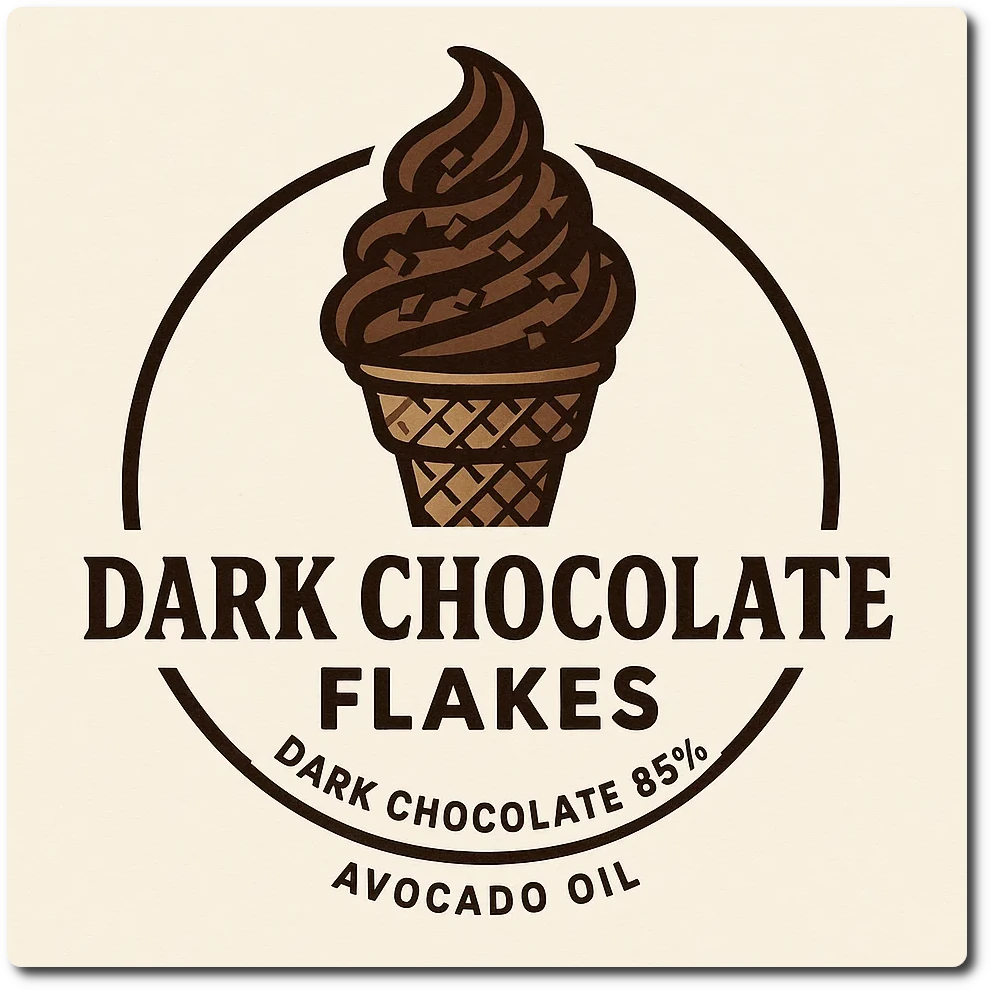

## Dark Chocolate Flakes (Mix-in)

*Ingredients*

  - _25g_ Dark chocolate 85% [Moser-Roth/Aldi]
  - _2.5ml_ Avocado oil (extra virgin) [Hunter & Gather] • ½ tsp

*Directions*

 1. Weigh ingredients into a small bowl.
 1. About a minute before the machine cycle ends, melt the chocolate in the microwave for 15s, stir it, melt for another 15s, and stir.
 1. Take out the container, scrape-down the sides, compress & flatten the surface with the back of a spoon.
 1. Drizzle the ganache on top of the ice cream and spin using Mix-in.

*Nutritional & Other Info*

- **Nutritional values per 100g/ml:** 100g; 623.5 kcal; fat 53.7g; carbs 18.2g; sugar 12.7g; protein 10.0g; salt 0.2g
- **Nutritional values per serving:** 28g; 171.5 kcal; fat 14.8g; carbs 5.0g; sugar 3.5g; protein 2.8g; salt 0.1g
- **Rating:** 😋 (untested)
