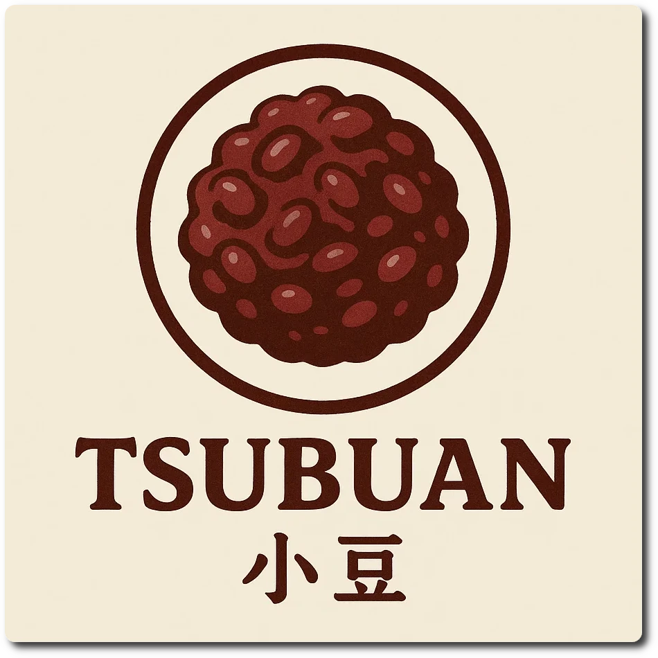

## Tsubu-An (Mix-In)

*Tsubu-An* is the chunky version of *anko* (red bean paste), made from Japanese *azuki* beans (小豆) and cooked with sugar.
The final result is basically a bean jam, or sweet chutney.

The anko is used as a mix-in in your favorite vanilla base, see the directions further below for details.

**INGREDIENTS**

  - _150ml_ Water (cold)
  - _60g_ Azuki Beans (小豆 organic red beans) [Rapunzel]
  - _20g_ [Erythritol (E968)](/ice-creamery/info/ingredients/#erythritol-e968){target="_blank"}↗ • POD = 75%
  - _20g_ [Trehalose \[SaporePuro\]](/ice-creamery/info/ingredients/#trehalose-e965){target="_blank"}↗ • POD = 45%; GI = 38
  - _1g_ Salt

**DIRECTIONS**

 1. The same day you prepare your vanilla base, rinse and then soak the beans in water, over night in the fridge.
 1. The next morning, drain the beans and put them on the stove, in a small saucepan with fresh water.
 1. Add sweetener and salt, and bring to a boil.
 2. Let the beans simmer for ~45min, stirring occasionally, until they’re tender.
 3. Crush a part of the beans to get a thick consistency.
 4. Put the anko into a container with lid, and let it cool down in the fridge.
 5. Later, process your vanilla Creami, and use ½ to ⅔ of the anko as a mix-in.
 6. Manually fold in the rest of the beans as a swirl.
 7. Enjoy!

**NUTRITIONAL & OTHER INFO**

- **Nutritional values per 100g/ml:** 100g; 103.4 kcal; fat 0.3g; carbs 25.0g; sugar 7.8g; protein 5.5g; salt 0.4g
- **Nutritional values total:** 251g; 259.5 kcal; fat 0.7g; carbs 62.7g; sugar 19.7g; protein 13.9g; salt 1.0g
- **FPDF / [PAC](/ice-creamery/info/glossary/#potere-anti-congelante-pac){target="_blank"}↗ (target 20..30):** 34.99
- **Net carbs:** 42.7g • *∝ 5 servings@50g:* 8.5g • *∝ 3 servings@84g:* 14.2g • *energy ratio (low <20%):* 65.8%
