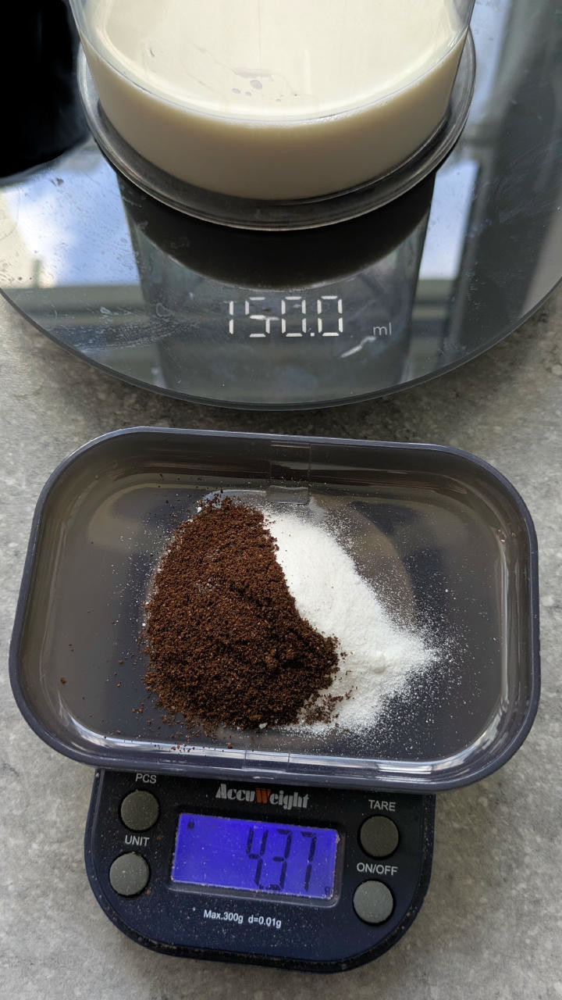

## Vanilla Sauce (Topping)

Foamy vanilla sauce with soy milk.

> 
> 
> 

*Ingredients*

  - _150ml_ [Soy milk 1.6% (sugar-free) \[Berief\]](/ice-creamery/info/ingredients/#soy-milk){target="_blank"}↗

  - _10g_ [Erythritol (E968)](/ice-creamery/info/ingredients/#erythritol-e968){target="_blank"}↗ • up to 15g (3 tsp)
  - _3g_ [Salty Stability \[Inulin / GMS / CMC / Guar / XG / Salt\]](/ice-creamery/S/Salty%20Stability/){target="_blank"}↗ • unsweetened “ICSv2”
  - _1g_ Vanilla Bean Powder [InterVanilla]

*Directions*

 1. Pour soy milk into mixing cup.
 1. Weigh dry ingredients on a jeweller’s scale.
 1. Drop them into the milk and be on top of it *immediately* with an immersion blender on full.
 1. Blend until everything is dissolved and smooth, wait ~3 minutes, and mix it to a foamy consistency.

*Nutritional & Other Info*

- **Nutritional values per 100g/ml:** 100g; 35.6 kcal; fat 1.5g; carbs 8.6g; sugar 0.2g; protein 2.7g; salt 0.1g
- **Nutritional values total:** 164g; 58.3 kcal; fat 2.5g; carbs 14.1g; sugar 0.3g; protein 4.5g; salt 0.2g
- **FPDF / [PAC](/ice-creamery/info/glossary/#potere-anti-congelante-pac){target="_blank"}↗ (target 20..30):** 17.99
- **Net carbs:** 1.9g
- **3g 'Salty Stability' is:** 2.2g Inulin • 0.36g Glycerol Monostearate (GMS / E471) • 0.18g Tylose powder (E466, Tylo, CMC) • 0.12g Guar gum (E412) • 0.1g Salt • 0.04g Xanthan gum (E415, XG).
