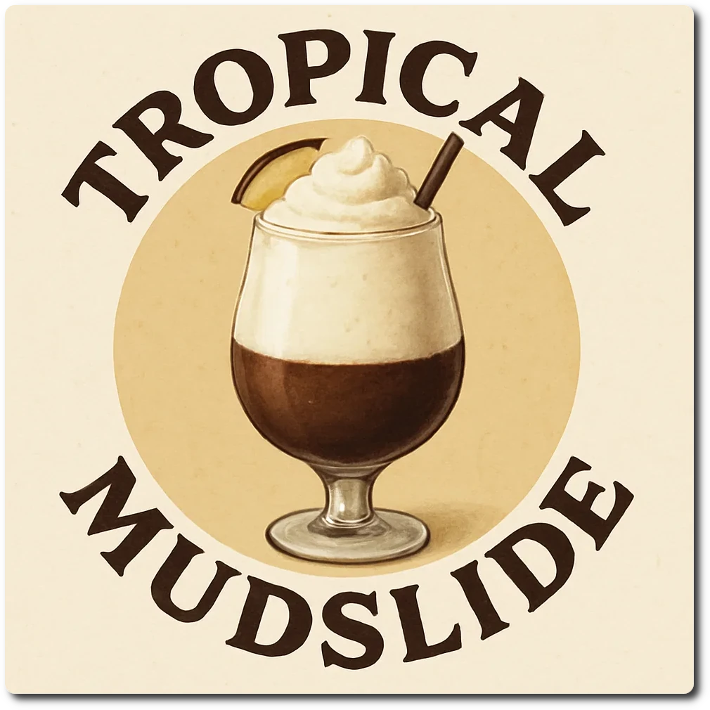

# Tropical Mudslide (Deluxe)

A boozy combination of layered chocolate and coconut ice cream.

The recipe is rather complicated and prepared in 3 phases, and then combined to 2 flavors forming 2 layers.
And no, given this delicate balance you can not swap out ingredients, unless you *very* well know what you’re doing.

Spin on “Sorbet”, scrape down, and mix-in. Do not overprocess, to keep discernible layers.

> 

Rating: 😋🥥🍫 (untested)

# INGREDIENTS

ℹ️ Brand names are in square brackets `[...]`.

**Prep**

  - _100ml_ Water (boiling)
  - _20g_ [Cocoa Powder Organic 11% \[Sevenhills\]](/ice-creamery/info/ingredients/#cocoa-powder){target="_blank"}↗
  - _20g_ Dark chocolate 70% (mild) [Lindt]
  - _50ml_ Almond Liqueur 21.5 vol% [Casella Amaretto] • 1 bottle = 700ml  
  - _100ml_ [Soy milk 1.6% (sugar-free) \[Berief\]](/ice-creamery/info/ingredients/#soy-milk){target="_blank"}↗
  - _20g_ Coconut flakes (desiccated) [Biojoy]
  - _50ml_ Batida de Côco 16 vol% [Mangaroca] • 1 bottle = 700ml

**Wet**

  - _225ml_ [Soy milk 1.6% (sugar-free) \[Berief\]](/ice-creamery/info/ingredients/#soy-milk){target="_blank"}↗
  - _50g_ [Cottage Cheese 4% \[REWE Bio\]](/ice-creamery/info/ingredients/#cottage-cheese){target="_blank"}↗
  - _25g_ [Jamaica Rum 43 vol%](/ice-creamery/info/ingredients/#alcohol-ethanol){target="_blank"}↗

**Dry**

  - _5g_ [Xylitol (E967)](/ice-creamery/info/ingredients/#xylitol-e967){target="_blank"}↗ • POD = 100%; GI = 7
  - _20g_ [Whey + Casein protein (grass-fed) \[Vilgain\]](/ice-creamery/info/ingredients/#whey-protein){target="_blank"}↗ • with stevia
  - _20g_ ICSv2 [Erythritol / Inulin / CMC / Guar / XG / Salt] • [http﹕//bit.ly/4frc4Vj](https://jhermann.github.io/ice-creamery/I/Ice%20Cream%20Stabilizer%20(ICS)/)
  - _3g_ Vanilla Bean Powder [InterVanilla]

**Fill to MAX**

  - _≈7 drops_ Flavor drops Vanilla (sucralose) [IronMaxx] • to taste, add ≈7 drops to each half separately

# DIRECTIONS

 1. Bloom the cocoa with the boiling water in a small bowl, melt the chocolate into the hot paste, add the amaretto.
 1. Similarly, microwave the soy milk to 90°C in another bowl, and then soak the coconut flakes for ½-1 hour in it. When cooled down, add the batida.
 1. Add "wet" ingredients to empty Creami tub.
 1. Weigh and mix dry ingredients, easiest by adding to a jar with a secure lid and shaking vigorously.
 1. Pour into the tub and *QUICKLY* use an immersion blender on full speed to homogenize everything.
 1. Let blender run until thickeners are properly hydrated, up to 1-2 min. Or blend again after waiting that time.
 1. Pour half of the base into the ‘white’ bowl (174g), stir to combine, add flavor drops to taste, stir again, put into the fridge.
 1. Pour the chocolate mix into the remaining half, blend, add flavor drops to taste, freeze for 4 hours (set a timer).
 1. After the wait time, check that the surface is sufficiently frozen, gently pour the ‘white’ mix into the tub.
 1. Put on the lid, freeze for 24h, then spin as usual. Flatten any humps before that.

# NUTRITIONAL & OTHER INFO
- **Nutritional values per 100g/ml:** 100g; 124.1 kcal; fat 4.6g; carbs 9.3g; sugar 3.8g; protein 5.9g; salt 0.2g
- **Nutritional values per ½ Deluxe Tub:** 360g; 446.8 kcal; fat 16.7g; carbs 33.5g; sugar 13.7g; protein 21.1g; salt 0.5g
- **Nutritional values total:** 708g; 878.7 kcal; fat 32.8g; carbs 65.8g; sugar 27.0g; protein 41.5g; salt 1.1g
- **FPDF / [PAC](/ice-creamery/info/glossary/#potere-anti-congelante-pac){target="_blank"}↗ (target 20..30):** 31.61
- **Protein / Energy Ratio (ok=12%; hi=20%):** 18.91% • Low-Sugar
- **Milk Solids Non-Fat ([MSNF](/ice-creamery/info/glossary/#milk-solids-not-fat-msnf){target="_blank"}↗, 7-11%):** 26.1g • 3.7%
- **Net carbs:** 42.7g • *∝ 5 servings@142g:* 8.5g • *∝ 3 servings@236g:* 14.2g
- **20g Ice Cream Stabilizer (ICSv2) is:** 9.2g Erythritol (E968) • 9.2g Inulin • 0.92g Tylose powder (E466, Tylo, CMC) • 0.32g Guar gum (E412) • 0.32g Salt • 0.09g Xanthan gum (E415, XG).
