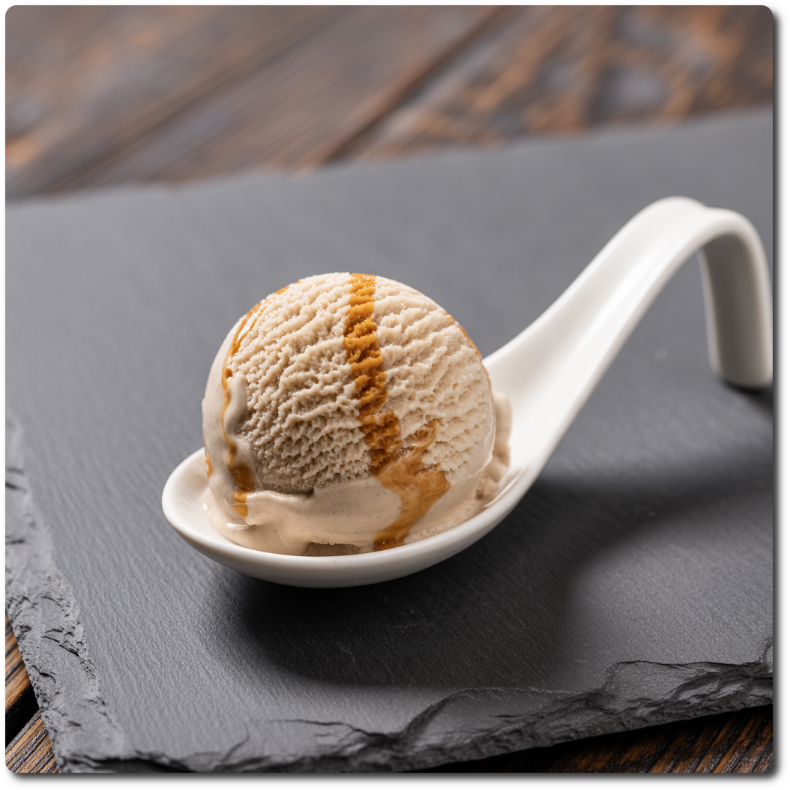

# Umamiso (Deluxe)

An ‘exotic’ ice cream made from miso, hon mirin, coconut milk, and soy protein.

> 🌿 **Vegan & Dairy-free** Recipe is using only soy, rice, and coconut.

Process on *Sorbet*, [hold it shortly under running water](https://jhermann.github.io/ice-creamery/info/tips%2Btricks/#handling-of-icy-sides-bottom)
*after* that.
Then a scrape-down and a respin or re-mix.

> 

Rating: 😋 (experimental)

# INGREDIENTS

ℹ️ Brand names are in square brackets `[...]`.

**Prep**

  - _65g_ [Tofu (plain) \[REWE Bio\]](/ice-creamery/info/ingredients/#tofu){target="_blank"}↗ • Package of 2x200g
  - _50g_ Hon mirin 14 vol% [Fiico]
  - _40g_ Miso “Genmai” (organic, vegan) [Fairment] • 200g jar
  - _20g_ [Glycerin (E422, VG) \[hd-line\]](/ice-creamery/info/ingredients/#vegetable-glycerin-glycerol-vg-e422){target="_blank"}↗ • POD = 60%; GI = 5; Density = 1.26 g/ml
  - _10ml_ Sesame oil (roasted) [Diamond]

**Wet**

  - _300ml_ Water (cold)
  - _100ml_ [Coconut milk 22% \[REWE Bio\]](/ice-creamery/info/ingredients/#coconut-milk){target="_blank"}↗

**Dry**

  - _20g_ [Soy protein isolate (nature) \[Powerstar\]](/ice-creamery/info/ingredients/#soy-protein-isolate){target="_blank"}↗ • 1kg bag, unsweetened, unflavored
  - _20g_ [Erythritol (E968)](/ice-creamery/info/ingredients/#erythritol-e968){target="_blank"}↗ • POD = 75%
  - _2g_ [Glycerol Monostearate (E471) \[Bulk\]](/ice-creamery/info/ingredients/#glycerol-monostearate-gms-e471){target="_blank"}↗
  - _1.5g_ [Tylose powder (E466 / CMC) \[GoodBake\]](/ice-creamery/info/ingredients/#cocoa-powder){target="_blank"}↗
  - _0.5g_ [Xanthan gum (E415, XG)](/ice-creamery/info/ingredients/#xanthan-gum-xg-e415){target="_blank"}↗ • 1tsp ≈ 2.8g

**Fill to MAX**

  - _91ml_ Water to MAX line

# DIRECTIONS

 1. In an empty Creami tub, blend the tofu with the other ‘prep’ ingredients to a smooth paste. Add a splash of soy milk, if needed, to combine things.
 1. Add "wet" ingredients to the puree.
 1. Weigh and mix dry ingredients, easiest by adding to a jar with a secure lid and shaking vigorously.
 1. Pour into the tub and *QUICKLY* use an immersion blender on full speed to homogenize everything.
 1. Let blender run until thickeners are properly hydrated, up to 1-2 min. Or blend again after waiting that time.
 1. Add remaining ingredients (to the MAX line) and stir with a spoon.
 1. Put on the lid, freeze for 24h, then spin as usual. Flatten any humps before that.
 1. Process with RE-SPIN mode when not creamy enough after the first spin.

# NUTRITIONAL & OTHER INFO
- **Nutritional values per 100g/ml:** 100g; 108.7 kcal; fat 5.4g; carbs 10.9g; sugar 4.0g; protein 4.6g; salt 0.8g
- **Nutritional values per ½ Deluxe Tub:** 360g; 391.3 kcal; fat 19.6g; carbs 39.2g; sugar 14.3g; protein 16.5g; salt 2.8g
- **Nutritional values total:** 720g; 782.7 kcal; fat 39.2g; carbs 78.4g; sugar 28.6g; protein 33.1g; salt 5.5g
- **FPDF / [PAC](/ice-creamery/info/glossary/#potere-anti-congelante-pac){target="_blank"}↗ (target 20..30):** 29.42
- **Protein / Energy Ratio (ok=12%; hi=20%):** 16.90% • Low-Sugar
- **Milk Solids Non-Fat ([MSNF](/ice-creamery/info/glossary/#milk-solids-not-fat-msnf){target="_blank"}↗, 7-11%):** 28.7g • 4.0%
- **Net carbs:** 48.4g • *∝ 5 servings@144g:* 9.7g • *∝ 3 servings@240g:* 16.1g
