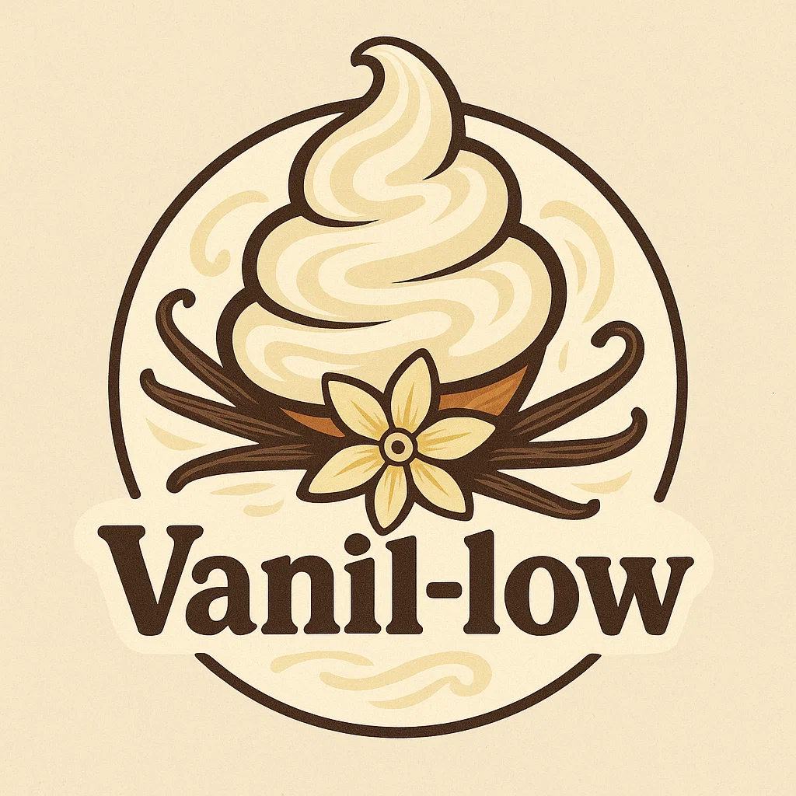
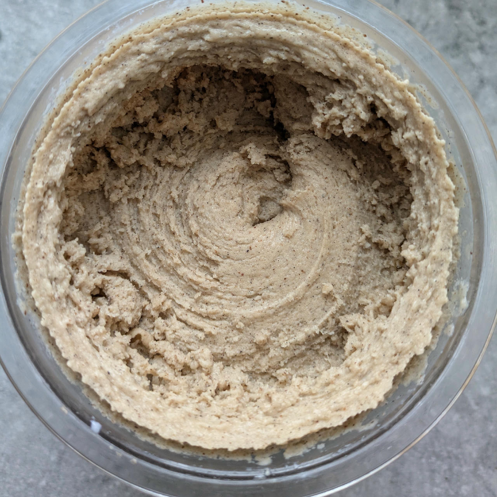
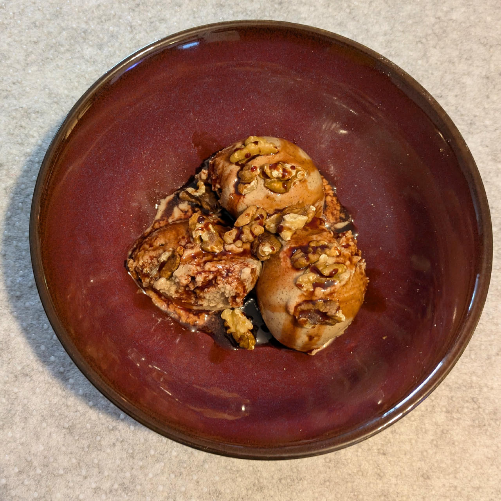
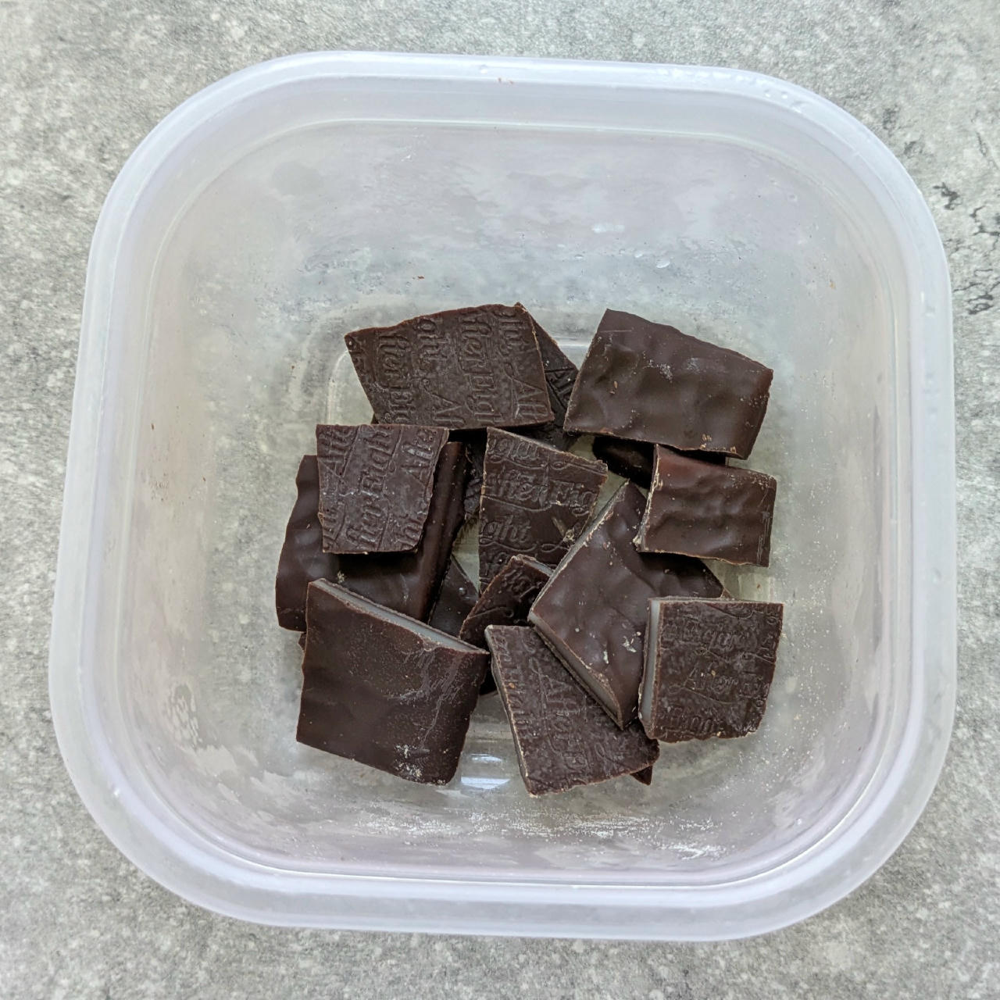
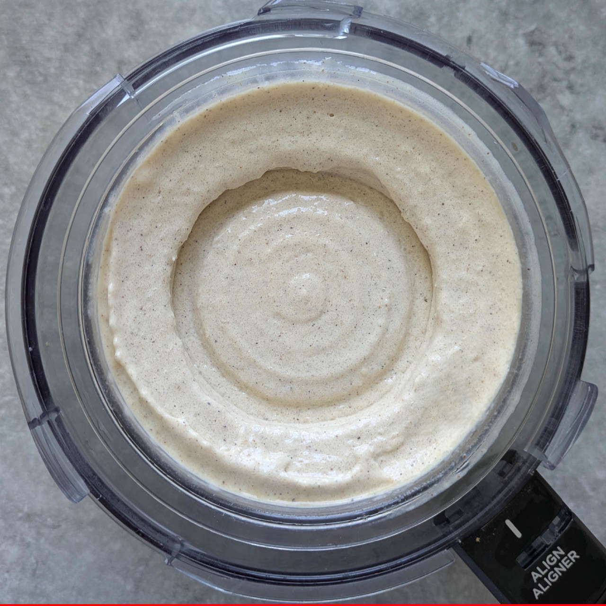
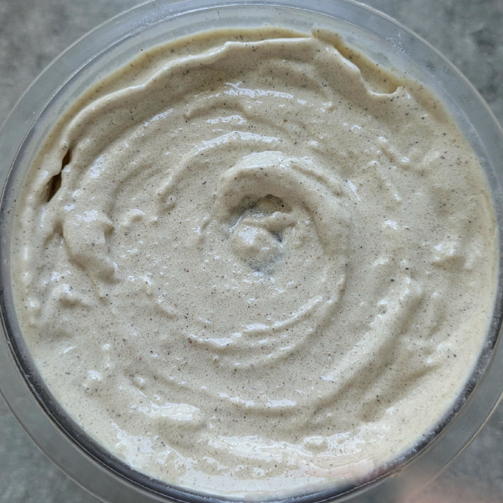
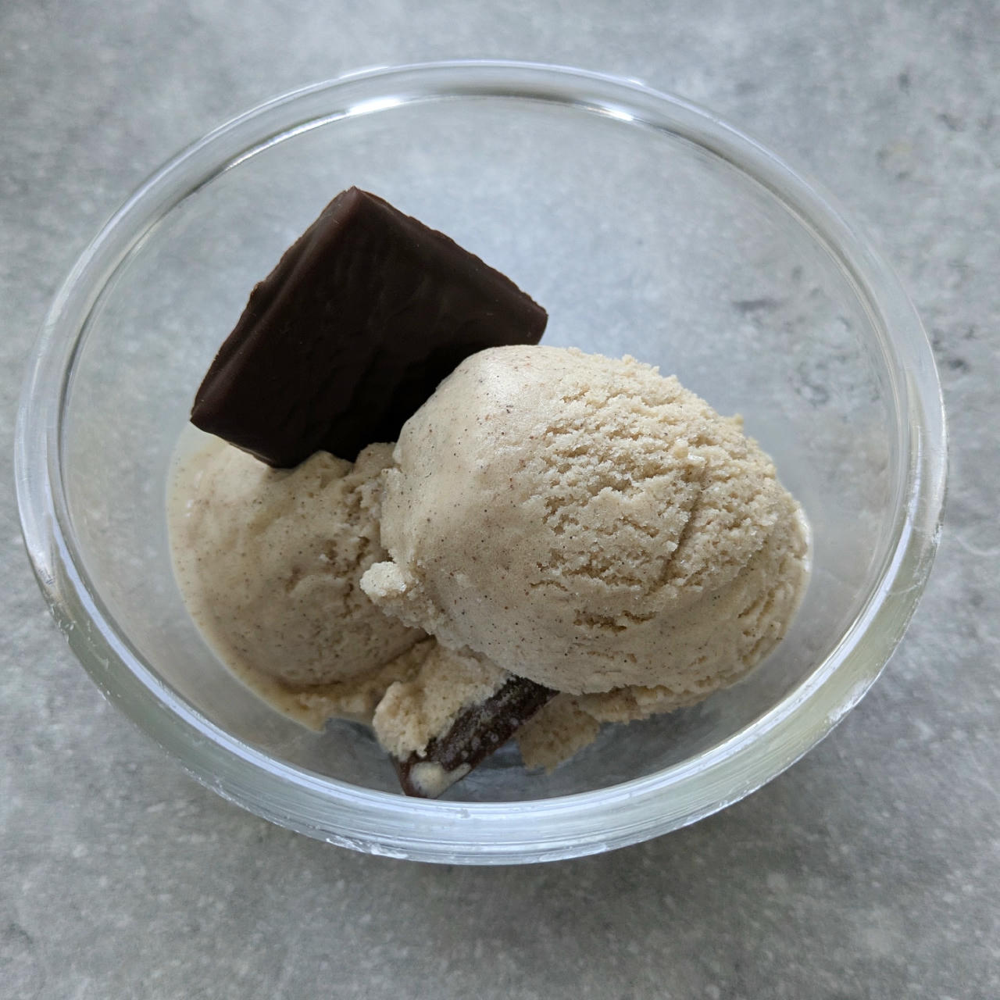

# Vanil-Low (Deluxe)

Vanilla ice cream based on soy milk and cottage cheese or greek yogurt, with a very low net carbs to total energy ratio.

Process on *Frozen Yogurt*, [hold it shortly under running water](https://jhermann.github.io/ice-creamery/info/tips%2Btricks/#handling-of-icy-sides-bottom) *after* that.

Then scrape down the sides, process again on Ice Cream.

> 

Served with crumbled walnuts and a pomegranate syrup drizzle.

> 

Rating: 😋😋😋😋😋

> 
> 
> 
> 
>
> *2025-08-11: With frozen mint chocolate wafers as a mix-in.*

Use fruit / yam root powder instead of the vanilla for a different taste and color.
Combine strawberry powder with strawberry flavor drops instead of the vanilla ones.
See *Optional / Choices* below for details.

If you have access to it (North America), you can use 45g Allulose as sweetener, instead of the sugar alcohols.

# INGREDIENTS

ℹ️ Brand names are in square brackets `[...]`.

**Wet**

  - _400ml_ [Soy milk 1.6% (sugar-free) \[Berief\]](/ice-creamery/info/ingredients/#soy-milk){target="_blank"}↗
  - _100g_ [Cottage Cheese 4% \[REWE Bio\]](/ice-creamery/info/ingredients/#cottage-cheese){target="_blank"}↗ • *alternative:* 150g greek yogurt 9% for +64kcal
  - _15g_ [Glycerin (E422, VG) \[hd-line\]](/ice-creamery/info/ingredients/#vegetable-glycerin-glycerol-vg-e422){target="_blank"}↗ • Sweetness = 60%; GI = 5; Density = 1.26 g/ml
  - _10g_ [Brandy or Vodka 40 vol%](/ice-creamery/info/ingredients/#alcohol-ethanol){target="_blank"}↗

**Dry**

  - _45g_ [SweEX (Erythritol + Xylitol 3:2)](/ice-creamery/info/ingredients/#sweex-erythritol-xylitol-blend){target="_blank"}↗ • POD ≈ 85%; GI < 7
  - _15g_ [Salty Stability \[Inulin / GMS / CMC / Guar / XG / Salt\]](/ice-creamery/S/Salty%20Stability/){target="_blank"}↗ • unsweetened “ICSv2”
  - _5g_ Vanilla Bean Powder [InterVanilla]
  - _10g_ [Whey protein Vanilla \[MaxiNutrition\]](/ice-creamery/info/ingredients/#whey-protein){target="_blank"}↗

**Fill to MAX**

  - _80ml_ [Soy milk 1.6% (sugar-free) \[Berief\]](/ice-creamery/info/ingredients/#soy-milk){target="_blank"}↗
  - _≈8 drops_ Flavor drops Vanilla (sucralose) [IronMaxx] • to taste

**Mix-ins**

  - _30g_ Mint chocolate [After Eight] • 1pc ≈ 7.5g; freeze for more integrity [128kcal, 20g sugar]

**Optional / Choices**

  - _25g_ Ube Yam Root powder [Fil Choice] • like vanilla+pistachio [96kcal, 2g sugar]
  - _25g_ Lingonberry powder [Bio Leis] • replacing the ground vanilla [88kcal, 18g sugar]
  - _25g_ Strawberry powder [Supergarden] • replacing the ground vanilla [72kcal, 13g sugar]

# DIRECTIONS

 1. Add "wet" ingredients to empty Creami tub.
 1. Weigh and mix dry ingredients, easiest by adding to a jar with a secure lid and shaking vigorously.
 1. Pour into the tub and *QUICKLY* use an immersion blender on full speed to homogenize everything.
 1. Let blender run until thickeners are properly hydrated, up to 1-2 min. Or blend again after waiting that time.
 1. Add remaining ingredients (to the MAX line) and stir with a spoon.
 1. Put on the lid, freeze for 24h, then spin as usual. Flatten any humps before that.
 1. Process with RE-SPIN mode when not creamy enough after the first spin.
 1. Process with MIX-IN after adding mix-ins evenly. For that, add partial amounts into a hole going down to the bottom, and fold the ice cream over, building pockets of mix-ins.

# NUTRITIONAL & OTHER INFO

- **Nutritional values per 100g/ml:** 100g; 68.5 kcal; fat 1.9g; carbs 11.7g; sugar 0.5g; protein 5.1g; salt 0.2g
- **Nutritional values per ½ Deluxe Tub:** 340g; 233.0 kcal; fat 6.4g; carbs 39.9g; sugar 1.5g; protein 17.5g; salt 0.8g
- **Nutritional values total:** 680g; 466.0 kcal; fat 12.8g; carbs 79.7g; sugar 3.1g; protein 34.9g; salt 1.7g
- **FPDF / [PAC](/ice-creamery/info/glossary/#potere-anti-congelante-pac){target="_blank"}↗ (target 20..30):** 31.24
- **Protein / Energy Ratio (ok=12%; hi=20%):** 29.99% • LOW-FAT • Low-Sugar • Hi-Protein
- **Milk Solids Non-Fat ([MSNF](/ice-creamery/info/glossary/#milk-solids-not-fat-msnf){target="_blank"}↗, 7-11%):** 44.1g • 6.5%
- **Net carbs:** 16.1g • *∝ 5 servings@136g:* 3.2g • *∝ 3 servings@227g:* 5.4g • *energy ratio (low <20%):* 13.8%
- **Jun 4, 2025:** Added almond butter.
- **Jul 14, 2025:** Using soy milk and unsweetened “ICSv2”
- **15g 'Salty Stability' is:** 11.0g Inulin • 1.8g Glycerol Monostearate (GMS / E471) • 0.9g Tylose powder (E466, Tylo, CMC) • 0.6g Guar gum (E412) • 0.5g Salt • 0.2g Xanthan gum (E415, XG).
