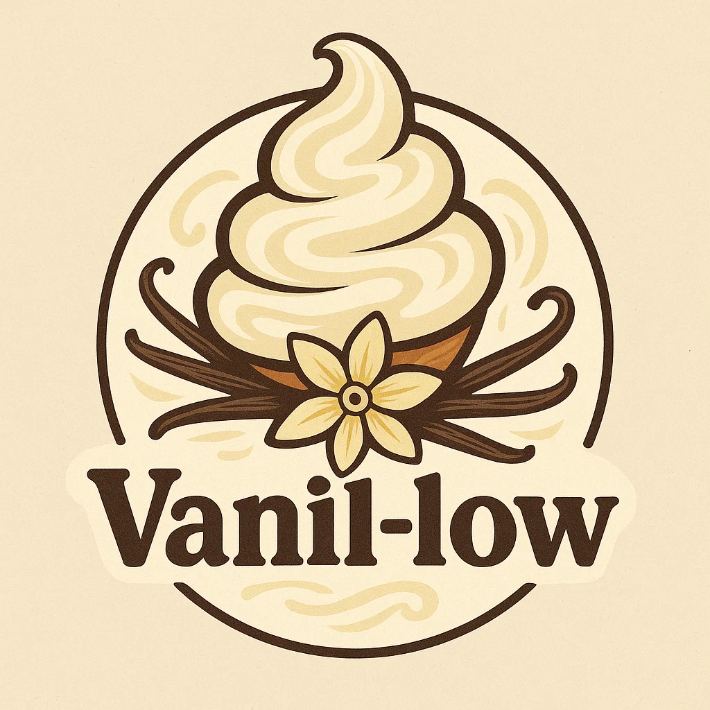
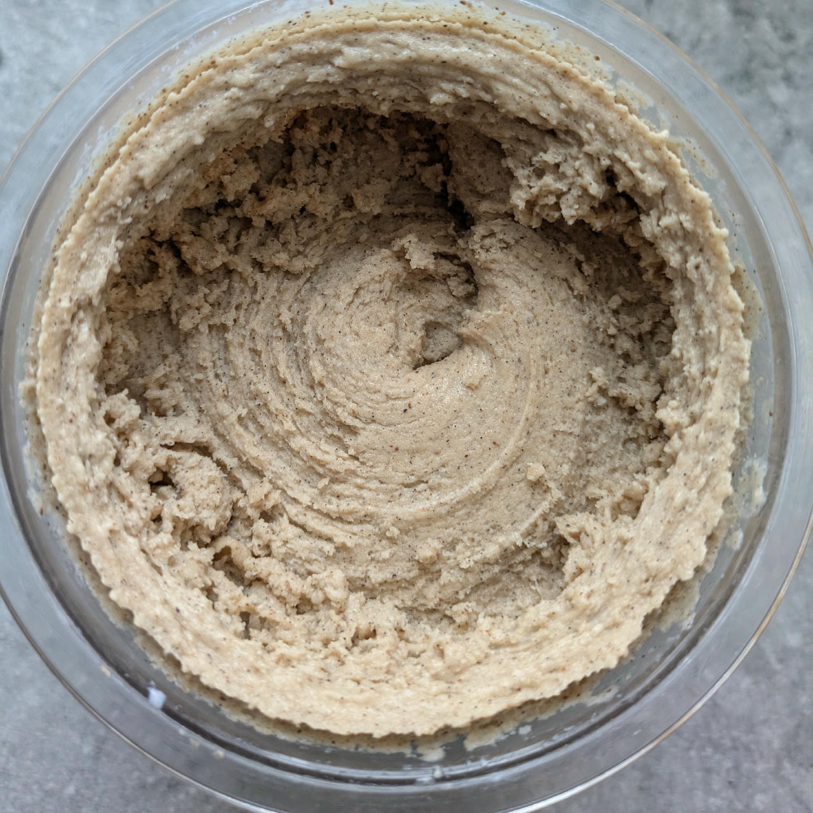
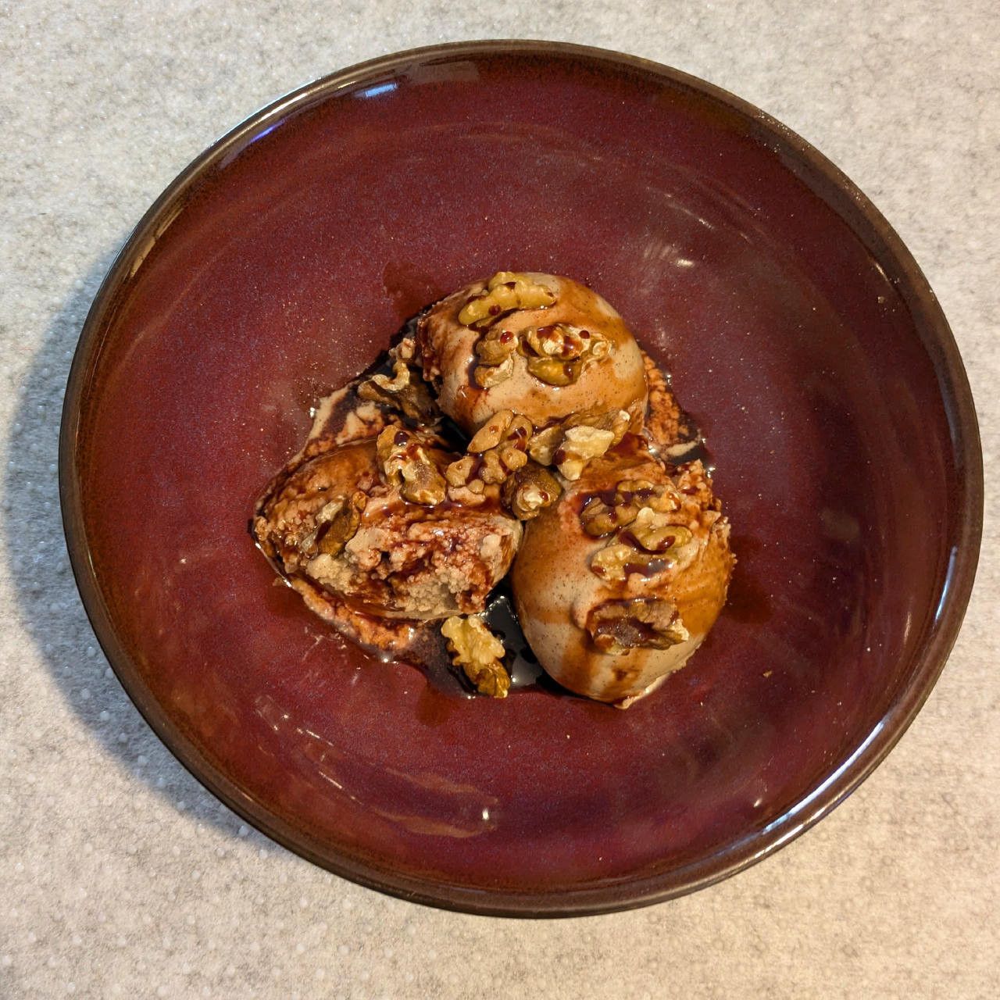
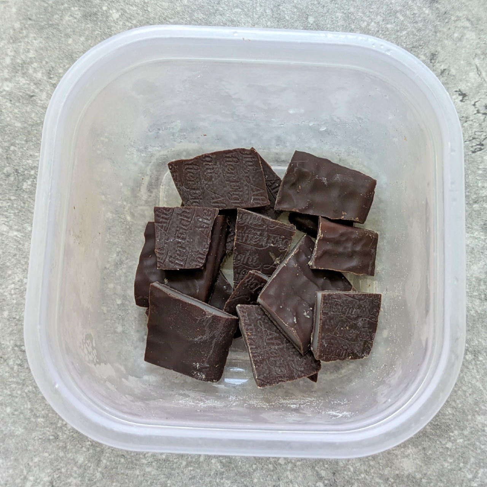
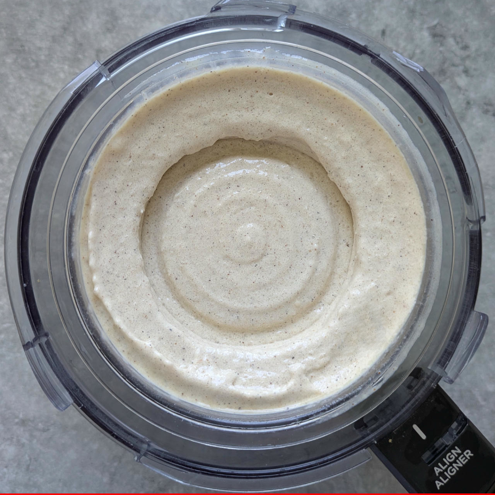
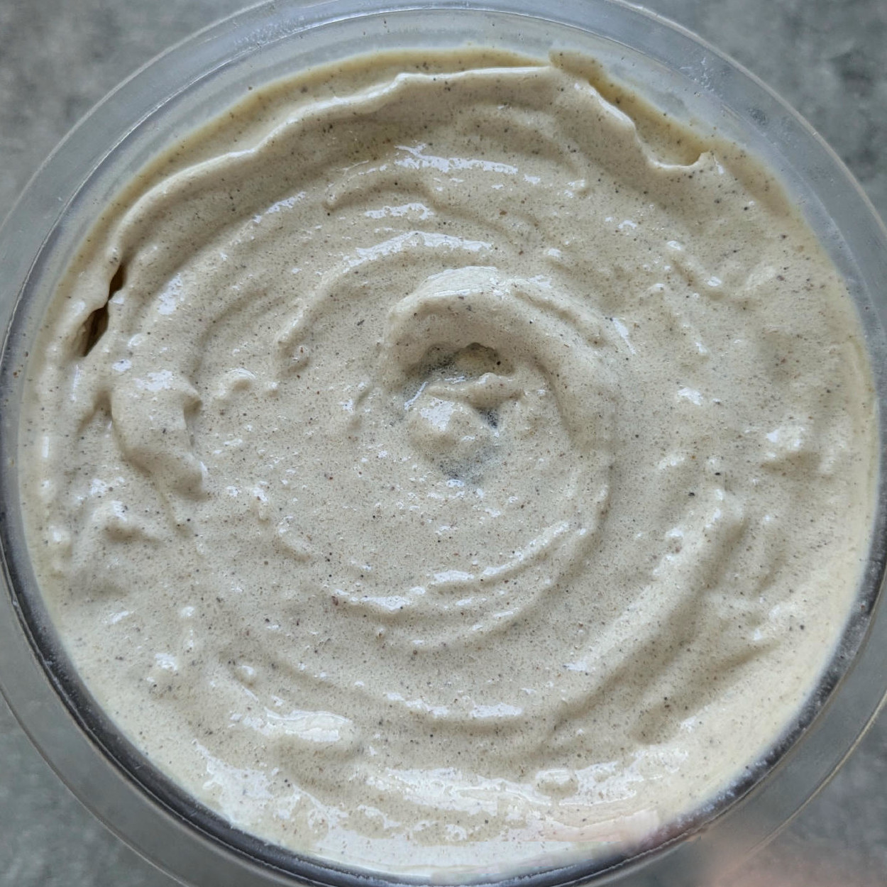
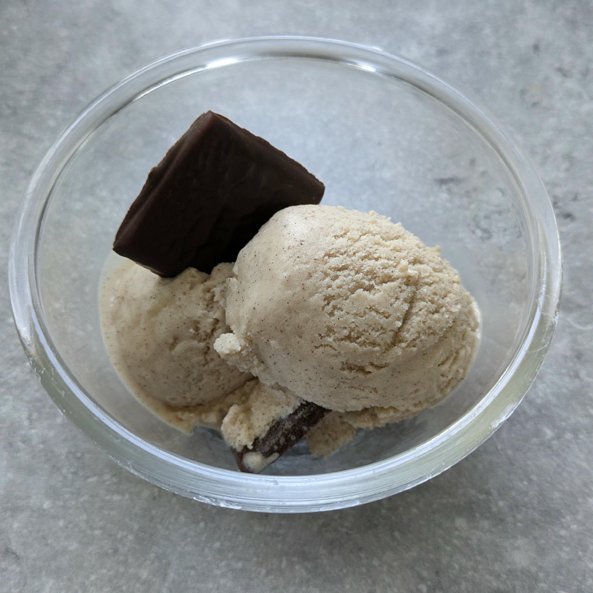

# Vanil-Low (Deluxe)

Vanilla ice cream based on soy milk and cottage cheese or greek yogurt, with a very low net carbs to total energy ratio.

Process on *Frozen Yogurt*, [hold it shortly under running water](https://jhermann.github.io/ice-creamery/info/tips%2Btricks/#handling-of-icy-sides-bottom) *after* that.

Then scrape down the sides, process again on Ice Cream.

> 

Served with crumbled walnuts and a pomegranate syrup drizzle.

> 

Rating: 😋😋😋😋😋

> 
> 
> 
> 
>
> *2025-08-11: With frozen mint chocolate wafers as a mix-in.*

Use fruit / yam root powder instead of the vanilla for a different taste and color.
Combine strawberry powder with strawberry flavor drops instead of the vanilla ones.
See *Optional / Choices* below for details.

If you have access to it (North America), you can use 45g Allulose as sweetener, instead of the sugar alcohols.

!!! tip inline end "‘Berry’ Variation"

    Add these flavor & color components:

    - 2 tsp Raspberry Emulsion [LorAnn]
    - 1½ tsp blueberry or blackberry powder
    - 1½ tsp beet root powder

# INGREDIENTS

ℹ️ Brand names are in square brackets `[...]`.

**Wet**

  - _400ml_ [Soy milk 1.6% (sugar-free) \[Berief\]](/ice-creamery/info/ingredients/#soy-milk){target="_blank"}↗ (≈1 cup + 5 fl oz + 1 tbsp) • *alternative*: any other preferred milk (~2% fat) <a id="id-2755284" href="https://jhermann.github.io/ice-creamery/info/nutrition/#id-2755284">ℹ️</a>
  - _100g_ [Cottage Cheese 4% \[REWE Bio\]](/ice-creamery/info/ingredients/#cottage-cheese){target="_blank"}↗ (≈3 oz + 1 tbsp) • *alternative:* 30g cream cheese and 70ml milk <a id="id-c6c5c25" href="https://jhermann.github.io/ice-creamery/info/nutrition/#id-c6c5c25">ℹ️</a>
  - _15g_ [Glycerin (E422, VG) \[hd-line\]](/ice-creamery/info/ingredients/#vegetable-glycerin-glycerol-vg-e422){target="_blank"}↗ (≈1 tbsp) • Sweetness = 60%; GI = 5; Density = 1.26 g/ml <a id="id-8717e6d" href="https://jhermann.github.io/ice-creamery/info/nutrition/#id-8717e6d">ℹ️</a>
  - _10g_ [Brandy or Vodka 40 vol%](/ice-creamery/info/ingredients/#alcohol-ethanol){target="_blank"}↗ (≈2 tsp) • *alternative:* 8g (additional) VG for a sober recipe <a id="id-63b8bf1" href="https://jhermann.github.io/ice-creamery/info/nutrition/#id-63b8bf1">ℹ️</a>

**Dry**

  - _45g_ [SweEX (Erythritol + Xylitol 3:2)](/ice-creamery/info/ingredients/#sweex-erythritol-xylitol-blend){target="_blank"}↗ (≈3 tbsp) • *alternative:* 60g allulose or dextrose <a id="id-f44b101" href="https://jhermann.github.io/ice-creamery/info/nutrition/#id-f44b101">ℹ️</a>
  - _15g_ [Salty Stability \[Inulin / GMS / CMC / Guar / XG / Salt\]](/ice-creamery/S/Salty%20Stability/){target="_blank"}↗ (≈1 tbsp) • *not-as-good substitute:* 1.5g guar, 0.5g xanthan, and 0.5g salt <a id="id-3d1ecef" href="https://jhermann.github.io/ice-creamery/info/nutrition/#id-3d1ecef">ℹ️</a>
  - _5g_ Vanilla Bean Powder [InterVanilla] (≈1 tsp) <a id="id-538e9f6" href="https://jhermann.github.io/ice-creamery/info/nutrition/#id-538e9f6">ℹ️</a>
  - _10g_ [Whey protein Vanilla \[MaxiNutrition\]](/ice-creamery/info/ingredients/#whey-protein){target="_blank"}↗ (≈2 tsp) <a id="id-165651e" href="https://jhermann.github.io/ice-creamery/info/nutrition/#id-165651e">ℹ️</a>

**Fill to MAX**

  - _80ml_ [Soy milk 1.6% (sugar-free) \[Berief\]](/ice-creamery/info/ingredients/#soy-milk){target="_blank"}↗ (≈2 fl oz + 1 tbsp + 1 ¼ tsp) • *alternative*: any other preferred milk (~2% fat) <a id="id-2755284" href="https://jhermann.github.io/ice-creamery/info/nutrition/#id-2755284">ℹ️</a>
  - _≈8 drops_ Flavor drops Vanilla (sucralose) [IronMaxx] • to taste

**Mix-ins**

  - _30g_ Mint chocolate thins [After Eight] (≈2 tbsp) • 1pc ≈ 7.5g; freeze for more integrity, and chop them when frozen [128kcal, 20g sugar] <a id="id- " href="https://jhermann.github.io/ice-creamery/info/nutrition/#id- ">ℹ️</a>

**Optional / Choices**

  - _25g_ Ube Yam Root powder [Fil Choice] (≈1 tbsp + 2 tsp) • like vanilla+pistachio [96kcal, 2g sugar] <a id="id-e732a6e" href="https://jhermann.github.io/ice-creamery/info/nutrition/#id-e732a6e">ℹ️</a>
  - _25g_ Lingonberry powder [Bio Leis] (≈1 tbsp + 2 tsp) • replacing the ground vanilla [88kcal, 18g sugar] <a id="id-2011e73" href="https://jhermann.github.io/ice-creamery/info/nutrition/#id-2011e73">ℹ️</a>
  - _25g_ Strawberry powder [Supergarden] (≈1 tbsp + 2 tsp) • replacing the ground vanilla [72kcal, 13g sugar] <a id="id-e1bc6d8" href="https://jhermann.github.io/ice-creamery/info/nutrition/#id-e1bc6d8">ℹ️</a>

# DIRECTIONS

 1. Add "wet" ingredients to empty Creami tub.
 1. Weigh and mix dry ingredients, easiest by adding to a jar with a secure lid and shaking vigorously.
 1. Pour into the tub and *QUICKLY* use an immersion blender on full speed to homogenize everything.
 1. Let blender run until thickeners are properly hydrated, up to 1-2 min. Or blend again after waiting that time.
 1. Add remaining ingredients (to the MAX line) and stir with a spoon.
 1. For better results, let the base age in the fridge (covered, lid on), for a few hours or over night. This helps flavor development and gum hydration, especially with unheated bases.
 1. Freeze for 24h with lid on, then spin as usual. Flatten any humps before that.
 1. Process with RE-SPIN mode when not creamy enough after the first spin.
 1. Process with MIX-IN after adding mix-ins evenly. For that, add partial amounts into a hole going down to the bottom, and fold the ice cream over, building pockets of mix-ins.

# NUTRITIONAL & OTHER INFO

| 🥗 Value | 100g | Serving | Total |
| :--- | ---: | ---: | ---: |
| ⚖️ Weight (g) | 100 | 340 | 680 |
| 🔥 Energy (kcal) | 68.5 | 233.0 | 466.0 |
| 🫒 Fat (g) | 1.9 | 6.4 | 12.8 |
| 🍞 Carbohydrates (g) | 11.7 | 39.9 | 79.7 |
| 🍬 Sugars (g) | 0.5 | 1.5 | 3.1 |
| 💪 Protein (g) | 5.1 | 17.5 | 34.9 |
| 🧂 Salt (g) | 0.2 | 0.8 | 1.7 |

- **FPDF / [PAC](/ice-creamery/info/glossary/#potere-anti-congelante-pac){target="_blank"}↗ (target 20..30):** 31.24
- **Protein / Energy Ratio (ok=12%; hi=20%):** 29.99% • LOW-FAT • Low-Sugar • Hi-Protein
- **Milk Solids Non-Fat ([MSNF](/ice-creamery/info/glossary/#milk-solids-not-fat-msnf){target="_blank"}↗, 7-11%):** 44.1g • 6.5%
- **Net carbs:** 16.1g • *∝ 5 servings@136g:* 3.2g • *∝ 3 servings@227g:* 5.4g • *energy ratio (low <20%):* 13.8%
- **Jun 4, 2025:** Added almond butter.
- **Jul 14, 2025:** Using soy milk and unsweetened “ICSv2”
- **15g 'Salty Stability' is:** 11.0g Inulin • 1.8g Glycerol Monostearate (GMS / E471) • 0.9g Tylose powder (E466, Tylo, CMC) • 0.6g Guar gum (E412) • 0.5g Salt • 0.2g Xanthan gum (E415, XG).
