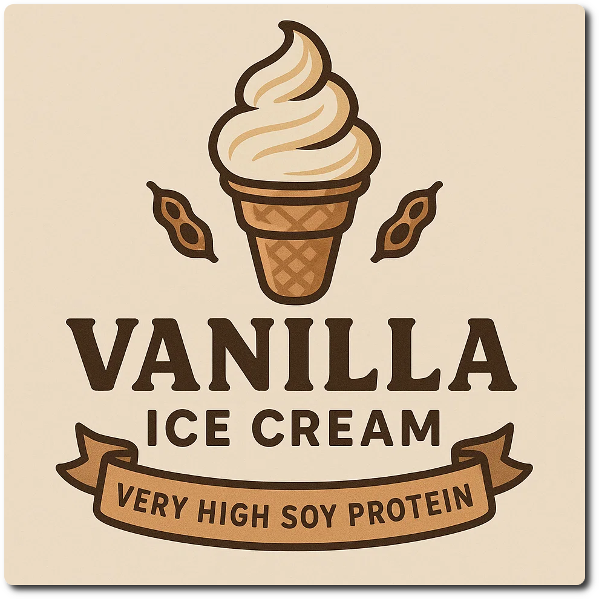

# Vanilla Protein (Deluxe)

This is my usual base, but pure vanilla, no cream or cottage cheese, and double the protein powder.
Low fat & sugar, and high protein.

> 🌿 **Vegan & Dairy-free** Recipe is using only soy milk + protein.

Process on Lite Ice Cream.

> 

Rating: 😋😋😋😋 (needs more testing)

# INGREDIENTS

ℹ️ Brand names are in square brackets `[...]`.

**Wet**

  - _500ml_ [Soy milk 1.6% (sugar-free) \[Berief\]](/ice-creamery/info/ingredients/#soy-milk){target="_blank"}↗
  - _20g_ [Glycerin (E422, VG) \[hd-line\]](/ice-creamery/info/ingredients/#vegetable-glycerin-glycerol-vg-e422){target="_blank"}↗ • Sweetness = 60%; GI = 5; Density = 1.26 g/ml
  - _10g_ [Brandy or Vodka 40 vol%](/ice-creamery/info/ingredients/#alcohol-ethanol){target="_blank"}↗

**Dry**

  - _60g_ [Soy protein isolate (nature) \[Powerstar\]](/ice-creamery/info/ingredients/#soy-protein-isolate){target="_blank"}↗ • 1kg bag, unsweetened, unflavored
  - _40g_ [SweEX (Erythritol + Xylitol 3:2)](/ice-creamery/info/ingredients/#sweex-erythritol-xylitol-blend){target="_blank"}↗ • POD ≈ 90%; GI < 7
  - _15g_ [Salty Stability \[Inulin / GMS / CMC / Guar / XG / Salt\]](/ice-creamery/S/Salty%20Stability/){target="_blank"}↗ • unsweetened “ICSv2”
  - _4g_ Vanilla Bean Powder [InterVanilla]

**Fill to MAX**

  - _71ml_ [Soy milk 1.6% (sugar-free) \[Berief\]](/ice-creamery/info/ingredients/#soy-milk){target="_blank"}↗
  - _≈5 drops_ Flavor drops Vanilla (sucralose) [IronMaxx] • to taste

**Mix-ins**

  - _15g_ Cherries, Sour (dried, pitted) [Biojoy] • add chopped as a mix-in [44kcal, 9g sugar]
  - _15g_ Strawberry slices freeze-dried [EWL] • add crumbled as a mix-in [45kcal, 7g sugar]

**Topping Options**

  - _10ml_ Aceto balsamico di Modena [Due Vittorie] • add as a topping [32kcal, 7.8g sugar]

# DIRECTIONS

 1. Add "wet" ingredients to empty Creami tub.
 1. Weigh and mix dry ingredients, easiest by adding to a jar with a secure lid and shaking vigorously.
 1. Pour into the tub and *QUICKLY* use an immersion blender on full speed to homogenize everything.
 1. Let blender run until thickeners are properly hydrated, up to 1-2 min. Or blend again after waiting that time.
 1. Add remaining ingredients (to the MAX line) and stir with a spoon.
 1. Put on the lid, freeze for 24h, then spin as usual. Flatten any humps before that.
 1. Process with RE-SPIN mode when not creamy enough after the first spin.
 1. Process with MIX-IN after adding mix-ins evenly. For that, add partial amounts into a hole going down to the bottom, and fold the ice cream over, building pockets of mix-ins.

# NUTRITIONAL & OTHER INFO
- **Nutritional values per 100g/ml:** 100g; 83.1 kcal; fat 1.4g; carbs 11.0g; sugar 0.2g; protein 9.9g; salt 0.3g
- **Nutritional values per ½ Deluxe Tub:** 360g; 299.0 kcal; fat 5.1g; carbs 39.7g; sugar 0.7g; protein 35.5g; salt 1.2g
- **Nutritional values total:** 720g; 598.0 kcal; fat 10.3g; carbs 79.3g; sugar 1.4g; protein 71.1g; salt 2.5g
- **FPDF / [PAC](/ice-creamery/info/glossary/#potere-anti-congelante-pac){target="_blank"}↗ (target 20..30):** 30.76
- **Protein / Energy Ratio (ok=12%; hi=20%):** 47.53% • LOW-FAT • Low-Sugar • Hi-Protein
- **Milk Solids Non-Fat ([MSNF](/ice-creamery/info/glossary/#milk-solids-not-fat-msnf){target="_blank"}↗, 7-11%):** 78.6g • 10.9%
- **Net carbs:** 18.3g • *∝ 5 servings@144g:* 3.7g • *∝ 3 servings@240g:* 6.1g • *energy ratio (low <20%):* 12.2%
- **15g 'Salty Stability' is:** 11.0g Inulin • 1.8g Glycerol Monostearate (GMS / E471) • 0.9g Tylose powder (E466, Tylo, CMC) • 0.6g Guar gum (E412) • 0.5g Salt • 0.2g Xanthan gum (E415, XG).
