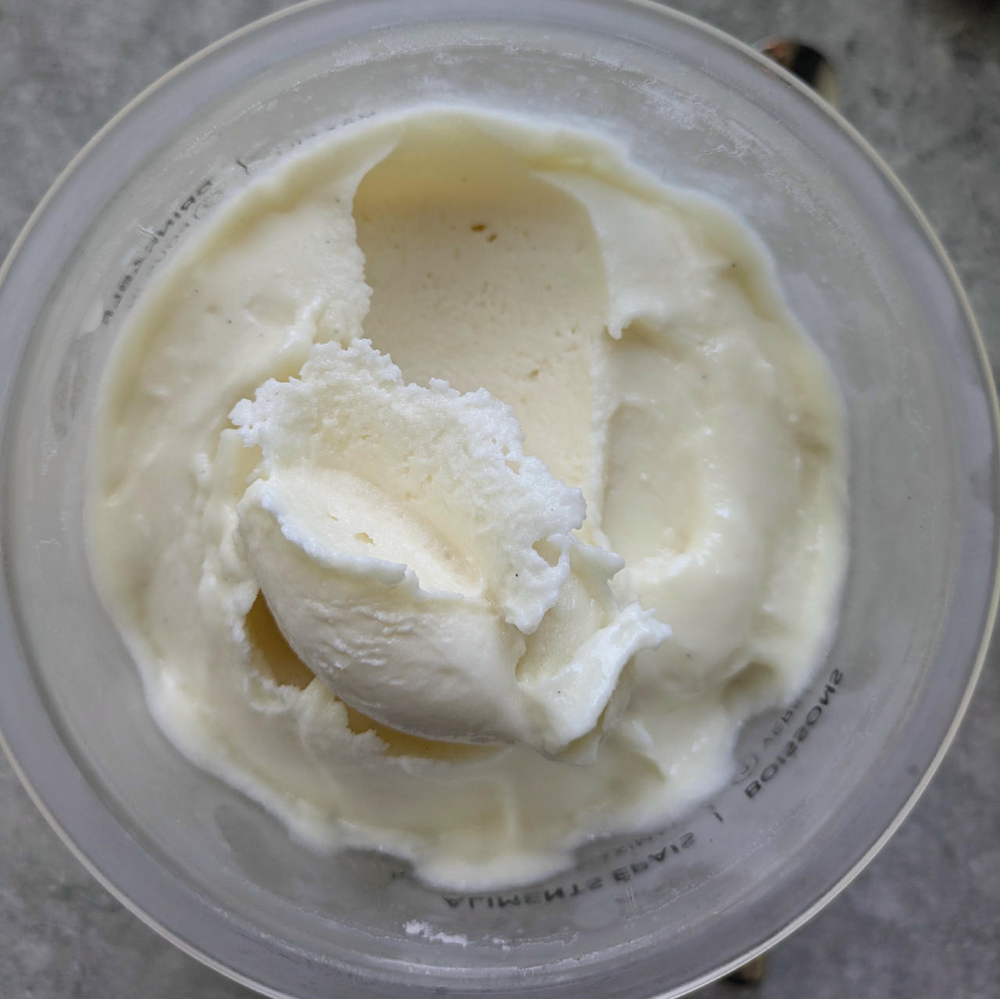

# Vanilla Protein (Deluxe)

This is my usual base, but pure vanilla, no cream or cottage cheese, and double the protein powder.
Low fat & sugar, and high protein.

Process on Lite Ice Cream.

> 

Rating: 😋😋😋😋 (needs more testing)

# INGREDIENTS

ℹ️ Brand names are in square brackets `[...]`.

**Wet**

  - _400ml_ [Skim Milk 1.5% \[Weihenstephan\]](/ice-creamery/info/ingredients/#skim-milk){target="_blank"}↗
  - _15g_ [Glycerin (E422, VG) \[hd-line\]](/ice-creamery/info/ingredients/#vegetable-glycerin-glycerol-vg-e422){target="_blank"}↗ • POD = 60%; GI = 5; Density = 1.26 g/ml
  - _10g_ [Brandy “Williams Birne” 40 vol%](/ice-creamery/info/ingredients/#alcohol-ethanol){target="_blank"}↗
  - _5 drops_ Flavor drops Vanilla [IronMaxx] • with sucralose

**Dry**

  - _60g_ [Whey protein Vanilla \[MaxiNutrition\]](/ice-creamery/info/ingredients/#whey-protein){target="_blank"}↗
  - _30g_ ICSv2 [Erythritol / CMC / Tara / XG / Inulin] • [http﹕//bit.ly/4frc4Vj](https://jhermann.github.io/ice-creamery/I/Ice%20Cream%20Stabilizer%20(ICS)/)
  - _30g_ [Xylitol](/ice-creamery/info/ingredients/#xylitol-e967){target="_blank"}↗ • POD = 100%; GI = 7

**Fill to MAX**

  - _175ml_ Water to MAX line

# DIRECTIONS

 1. Add "wet" ingredients to empty Creami tub.
 1. Weigh and mix dry ingredients, easiest by adding to a jar with a secure lid and shaking vigorously.
 1. Pour into the tub and *QUICKLY* use an immersion blender on full speed to homogenize everything.
 1. Let blender run until thickeners are properly hydrated, up to 1-2 min. Or blend again after waiting that time.
 1. Add remaining ingredients (to the MAX line) and stir with a spoon.
 1. Put on the lid, freeze for 24h, then spin as usual. Flatten any humps before that.
 1. Process with RE-SPIN mode when not creamy enough after the first spin.

# NUTRITIONAL & OTHER INFO
- **Nutritional values per 100g/ml:** 100g; 85.4 kcal; fat 1.3g; carbs 11.7g; sugar 3.3g; protein 8.4g; salt 0.2g
- **Nutritional values per ½ Deluxe Tub:** 360g; 307.4 kcal; fat 4.7g; carbs 42.3g; sugar 11.9g; protein 30.4g; salt 0.6g
- **Nutritional values total:** 720g; 614.8 kcal; fat 9.5g; carbs 84.6g; sugar 23.9g; protein 60.8g; salt 1.3g
- **FPDF / [PAC](/ice-creamery/info/glossary/#potere-anti-congelante-pac){target="_blank"}↗ (target 20..30):** 30.71
- **Protein / Energy Ratio (ok=12%; hi=20%):** 39.58% • LOW-FAT • Low-Sugar • Hi-Protein
- **Milk Solids Non-Fat ([MSNF](/ice-creamery/info/glossary/#milk-solids-not-fat-msnf){target="_blank"}↗, 7-11%):** 90.2g • 12.5%
- **30g Ice Cream Stabilizer (ICSv2) is:** 14.3g erythritol, 1.43g Tylose powder (CMC, E466), 
0.5g tara gum (E417), 0.15g xanthan (E415),
14.3g inulin, 0.5g salt.
