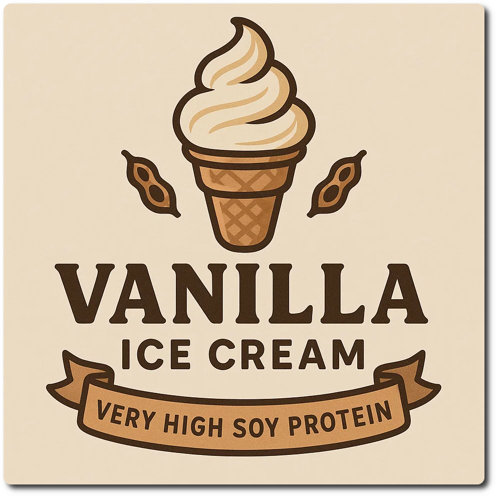
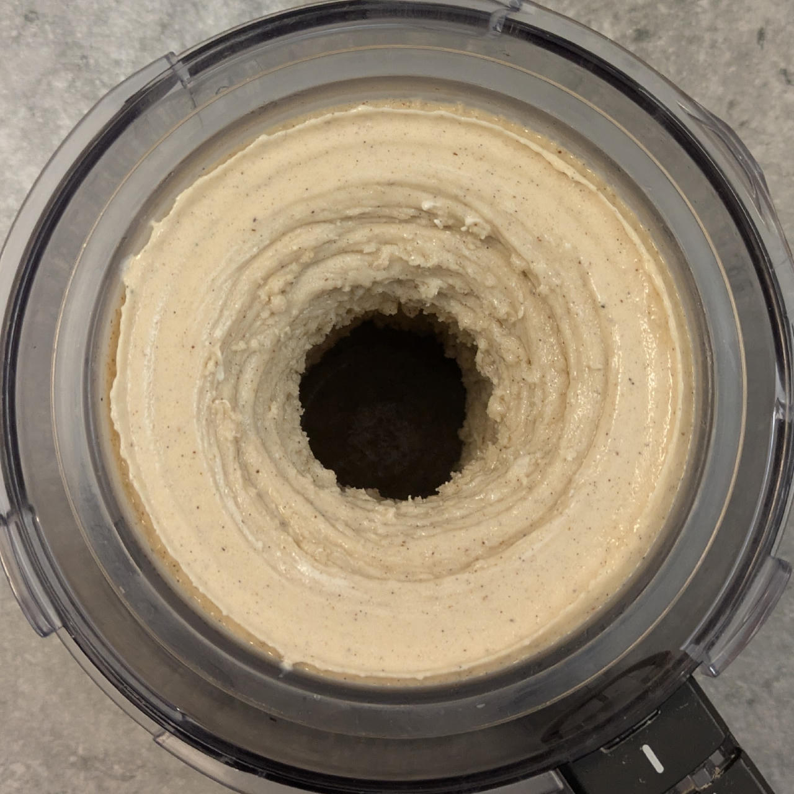
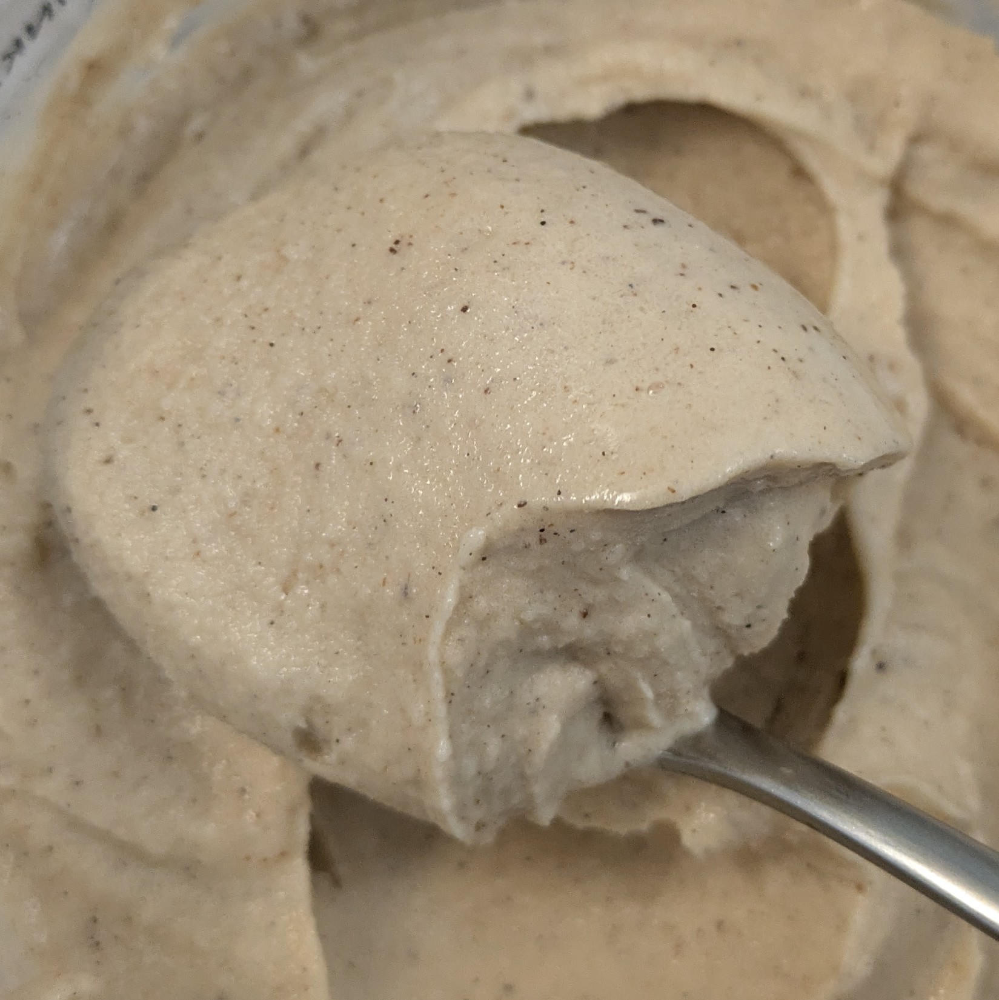

# Vanilla Protein (Deluxe)

This is mostly milk, double the usual protein powder, and vanilla flavor.
Low fat & sugar, and high protein.
You can of course also use dairy milk (~2% fat) and whey protein.

> 🌿 **Vegan & Dairy-free** Recipe is using only soy milk + protein.

Process on Lite Ice Cream, and a 2nd spin is likely not needed.

> 
> 
> 

Rating: 😋🐮😋🐮😋 (thick and creamy)

# INGREDIENTS

ℹ️ Brand names are in square brackets `[...]`.

**Wet**

  - _525ml_ [Soy milk 1.6% (sugar-free) \[Berief\]](/ice-creamery/info/ingredients/#soy-milk){target="_blank"}↗ (≈2 cups + 1 fl oz + 1 tbsp) • *alternative*: any other preferred milk (~2% fat) <a id="id-2755284" href="https://jhermann.github.io/ice-creamery/info/nutrition/#id-2755284">ℹ️</a>
  - _15g_ [Glycerin (E422, VG) \[hd-line\]](/ice-creamery/info/ingredients/#vegetable-glycerin-glycerol-vg-e422){target="_blank"}↗ (≈1 tbsp) • Sweetness = 60%; GI = 5; Density = 1.26 g/ml <a id="id-8717e6d" href="https://jhermann.github.io/ice-creamery/info/nutrition/#id-8717e6d">ℹ️</a>
  - _10g_ [Brandy or Vodka 40 vol%](/ice-creamery/info/ingredients/#alcohol-ethanol){target="_blank"}↗ (≈2 tsp) • *alternative:* 8g (additional) VG for a sober recipe <a id="id-63b8bf1" href="https://jhermann.github.io/ice-creamery/info/nutrition/#id-63b8bf1">ℹ️</a>

**Dry**

  - _60g_ [Soy protein isolate (nature) \[Powerstar\]](/ice-creamery/info/ingredients/#soy-protein-isolate){target="_blank"}↗ (≈4 tbsp) • 1kg bag, unsweetened, unflavored <a id="id-f08216c" href="https://jhermann.github.io/ice-creamery/info/nutrition/#id-f08216c">ℹ️</a>
  - _45g_ [SweEX (Erythritol + Xylitol 3:2)](/ice-creamery/info/ingredients/#sweex-erythritol-xylitol-blend){target="_blank"}↗ (≈3 tbsp) • POD ≈ 85%; GI < 7 <a id="id-f44b101" href="https://jhermann.github.io/ice-creamery/info/nutrition/#id-f44b101">ℹ️</a>
  - _10g_ [Inulin \[Vit4ever\]](/ice-creamery/info/ingredients/#inulin){target="_blank"}↗ (≈2 tsp) • Sweetness = 8%; GI ~= 0 <a id="id-d8bc1db" href="https://jhermann.github.io/ice-creamery/info/nutrition/#id-d8bc1db">ℹ️</a>
  - _10g_ [Salty Stability \[Inulin / GMS / CMC / Guar / XG / Salt\]](/ice-creamery/S/Salty%20Stability/){target="_blank"}↗ (≈2 tsp) • *not-as-good substitute:* 1g guar, 0.3g xanthan, and 0.3g salt <a id="id-3d1ecef" href="https://jhermann.github.io/ice-creamery/info/nutrition/#id-3d1ecef">ℹ️</a>
  - _4g_ Vanilla Bean Powder [InterVanilla] (≈¾ tsp) • or 7g extract or paste <a id="id-538e9f6" href="https://jhermann.github.io/ice-creamery/info/nutrition/#id-538e9f6">ℹ️</a>

**Fill to MAX**

  - _≈5 drops_ Flavor drops Vanilla (sucralose) [IronMaxx] • to taste

**Mix-ins**

  - _15g_ Cherries, Sour (dried, pitted) [Biojoy] (≈1 tbsp) • add chopped as a mix-in [44kcal, 9g sugar] <a id="id-3462e8b" href="https://jhermann.github.io/ice-creamery/info/nutrition/#id-3462e8b">ℹ️</a>
  - _15g_ Strawberry slices freeze-dried [EWL] (≈1 tbsp) • add crumbled as a mix-in [45kcal, 7g sugar] <a id="id-25f7a44" href="https://jhermann.github.io/ice-creamery/info/nutrition/#id-25f7a44">ℹ️</a>

# DIRECTIONS

 1. Add "wet" ingredients to empty Creami tub.
 1. Weigh and mix dry ingredients, easiest by adding to a jar with a secure lid and shaking vigorously.
 1. Pour into the tub and *QUICKLY* use an immersion blender on full speed to homogenize everything.
 1. Let blender run until thickeners are properly hydrated, up to 1-2 min. Or blend again after waiting that time.
 1. Add remaining ingredients (to the MAX line) and stir with a spoon.
 1. For better results, let the base age in the fridge (covered, lid on), for a few hours or over night. This helps flavor development and gum hydration, especially with unheated bases.
 1. Freeze for 24h with lid on, then spin as usual. Flatten any humps before that.
 1. Process with RE-SPIN mode when not creamy enough after the first spin.
 1. Process with MIX-IN after adding mix-ins evenly. For that, add partial amounts into a hole going down to the bottom, and fold the ice cream over, building pockets of mix-ins.

# NUTRITIONAL & OTHER INFO

| 🥗 Value | 100g | Serving | Total |
| :--- | ---: | ---: | ---: |
| ⚖️ Weight (g) | 100 | 340 | 679 |
| 🔥 Energy (kcal) | 85.0 | 289.1 | 577.3 |
| 🫒 Fat (g) | 1.4 | 4.7 | 9.4 |
| 🍞 Carbohydrates (g) | 12.4 | 42.2 | 84.2 |
| 🍬 Sugars (g) | 0.3 | 1.0 | 1.9 |
| 💪 Protein (g) | 10.3 | 34.9 | 69.7 |
| 🧂 Salt (g) | 0.3 | 1.1 | 2.3 |

- **FPDF / [PAC](/ice-creamery/info/glossary/#potere-anti-congelante-pac){target="_blank"}↗ (target 20..30):** 31.70
- **Protein / Energy Ratio (ok=12%; hi=20%):** 48.27% • LOW-FAT • Low-Sugar • Hi-Protein
- **Milk Solids Non-Fat ([MSNF](/ice-creamery/info/glossary/#milk-solids-not-fat-msnf){target="_blank"}↗, 7-11%):** 76.8g • 11.3%
- **Net carbs:** 15.5g • *∝ 5 servings@136g:* 3.1g • *∝ 3 servings@226g:* 5.2g • *energy ratio (low <20%):* 10.7%
- **10g 'Salty Stability' is:** 7.3g Inulin • 1.2g Glycerol Monostearate (GMS / E471) • 0.6g Tylose powder (E466, Tylo, CMC) • 0.4g Guar gum (E412) • 0.33g Salt • 0.13g Xanthan gum (E415, XG).
